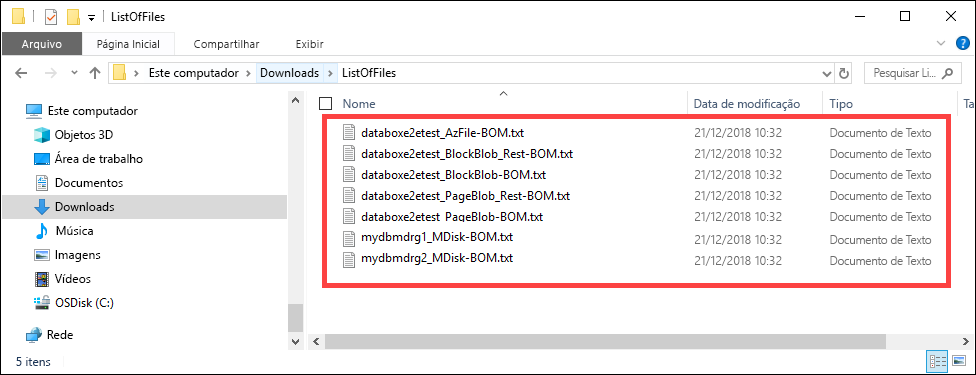

# <a name="use-the-local-web-ui-to-administer-your-data-box-and-data-box-heavy"></a>Usar a interface do usuário da web local para administrar o Data Box e a caixa de dados pesados

Este artigo descreve algumas das tarefas de configuração e gerenciamento que podem ser executadas nos dispositivos Data Box e pesada de caixa de dados. Você pode gerenciar os dispositivos de caixa de dados e dados de caixa pesada por meio da interface do usuário do portal do Azure e a IU da web local para o dispositivo. Este artigo concentra-se nas tarefas que você pode executar usando a interface do usuário da Web local.

Web local da interface do usuário para o Data Box e pesada de caixa de dados é usada para a configuração inicial do dispositivo. Você também pode usar a interface do usuário da web local para desligar ou reiniciar o dispositivo, execute testes de diagnóstico, atualização de software, exibir logs de cópia e gerar um pacote de log para o Microsoft Support. Em um dispositivo pesada de caixa de dados com dois nós independentes, você pode acessar duas interfaces do usuário web local separada correspondente a cada nó do dispositivo.

Este artigo inclui os seguintes tutoriais:

- Gerar um pacote de suporte
- Desligar ou reiniciar seu dispositivo
- Baixar arquivos de manifesto ou BOM
- Exibir a capacidade disponível no dispositivo
- Ignorar a validação de soma de verificação

## <a name="generate-support-package"></a>Gerar pacote de suporte

Se você enfrentar problemas no dispositivo, crie um pacote de suporte com os logs do sistema. O Suporte da Microsoft usará esse pacote para solucionar o problema. Para gerar um pacote de suporte, execute as seguintes etapas:

1. Na interface do usuário da Web local, acesse **Contatar Suporte** e clique em **Criar pacote de suporte**.

    

2. Um pacote de suporte será coletado. Essa operação leva alguns minutos.

    

3. Após a conclusão da criação do pacote de suporte, clique em **Baixar Pacote de Suporte**. 

    

4. Procure e escolha o local de download. Abra a pasta para exibir o conteúdo.

    


## <a name="shut-down-or-restart-your-device"></a>Desligar ou reiniciar seu dispositivo

Você pode desligar ou reiniciar seu dispositivo usando o interface do usuário da web local. Nós recomendamos que antes de reiniciar, você coloque os compartilhamentos offline no host e, em seguida, no dispositivo. Isso minimiza a possibilidade de dados corrompidos. Verifique se a cópia de dados não está em andamento quando você desligar o dispositivo.

Para desligar seu dispositivo, execute as seguintes etapas.

1. Na interface do usuário da Web local, acesse **Desligar ou reiniciar**.
2. Clique em **Desligar**.

    

3. Quando a confirmação for solicitada, clique em **OK** para continuar.

    

Depois que o dispositivo for desligado, use o botão de energia no painel frontal para ligar o dispositivo.

Para reiniciar o Data Box, execute as seguintes etapas.

1. Na interface do usuário da Web local, acesse **Desligar ou reiniciar**.
2. Clique em **Reiniciar**.

    

3. Quando a confirmação for solicitada, clique em **OK** para continuar.

   O dispositivo será desligado e, em seguida, reiniciado.

## <a name="download-bom-or-manifest-files"></a>Baixar arquivos de manifesto ou BOM

A fatura de materiais (BOM) ou os arquivos de manifesto contém a lista dos arquivos que são copiados para a caixa de dados ou a caixa de dados pesados. Esses arquivos são gerados quando você prepara o dispositivo para o envio.

Antes de começar, certifique-se de que o dispositivo foi concluída **preparar para o envio** etapa. Siga estas etapas para baixar a BOM ou os arquivos de manifesto:

1. Vá para a IU da web local para seu dispositivo. Você verá que o dispositivo foi concluída a preparação para o envio. Quando a preparação do dispositivo for concluída, o status do dispositivo será exibido como **Pronto para envio**.

    

2. Clique em **Baixar lista de arquivos** para baixar a lista de arquivos copiados em seu Data Box.

    

3. No Explorador de Arquivos, você verá que a lista de arquivos separada é gerada dependendo do protocolo usado para se conectar ao dispositivo e do tipo de Armazenamento do Azure usado.

    

   A tabela a seguir mapeia os nomes de arquivo para o tipo de Armazenamento do Azure e o protocolo de conexão usado.

    |Nome do arquivo  |Tipo de Armazenamento do Azure  |Protocolo de conexão usado |
    |---------|---------|---------|
    |databoxe2etest_BlockBlob.txt     |Blobs de bloco         |SMB/NFS         |
    |databoxe2etest_PageBlob.txt     |Blobs de página         |SMB/NFS         |
    |databoxe2etest_AzFile-BOM.txt    |Arquivos do Azure         |SMB/NFS         |
    |databoxe2etest_PageBlock_Rest-BOM.txt     |Blobs de página         |REST        |
    |databoxe2etest_BlockBlock_Rest-BOM.txt    |Blobs de bloco         |REST         |
    |mydbmdrg1_MDisk-BOM.txt    |Disco Gerenciado         |SMB/NFS         |
    |mydbmdrg2_MDisk-BOM.txt     |Disco Gerenciado         |SMB/NFS         |

Você usa esta lista para verificar os arquivos carregados na conta de Armazenamento do Azure depois que o Data Box retorna para o datacenter do Azure. Abaixo é mostrado um exemplo de arquivo de manifesto.

> [!NOTE]
> Em uma pesada de caixa de dados, dois conjuntos de lista de arquivos (BOM) são presentes correspondente para os dois nós no dispositivo.

```xml
<file size="52689" crc64="0x95a62e3f2095181e">\databox\media\data-box-deploy-copy-data\prepare-to-ship2.png</file>
<file size="22117" crc64="0x9b160c2c43ab6869">\databox\media\data-box-deploy-copy-data\connect-shares-file-explorer2.png</file>
<file size="57159" crc64="0x1caa82004e0053a4">\databox\media\data-box-deploy-copy-data\verify-used-space-dashboard.png</file>
<file size="24777" crc64="0x3e0db0cd1ad438e0">\databox\media\data-box-deploy-copy-data\prepare-to-ship5.png</file>
<file size="162006" crc64="0x9ceacb612ecb59d6">\databox\media\data-box-cable-options\cabling-dhcp-data-only.png</file>
<file size="155066" crc64="0x051a08d36980f5bc">\databox\media\data-box-cable-options\cabling-2-port-setup.png</file>
<file size="150399" crc64="0x66c5894ff328c0b1">\databox\media\data-box-cable-options\cabling-with-switch-static-ip.png</file>
<file size="158082" crc64="0xbd4b4c5103a783ea">\databox\media\data-box-cable-options\cabling-mgmt-only.png</file>
<file size="148456" crc64="0xa461ad24c8e4344a">\databox\media\data-box-cable-options\cabling-with-static-ip.png</file>
<file size="40417" crc64="0x637f59dd10d032b3">\databox\media\data-box-portal-admin\delete-order1.png</file>
<file size="33704" crc64="0x388546569ea9a29f">\databox\media\data-box-portal-admin\clone-order1.png</file>
<file size="5757" crc64="0x9979df75ee9be91e">\databox\media\data-box-safety\japan.png</file>
<file size="998" crc64="0xc10c5a1863c5f88f">\databox\media\data-box-safety\overload_tip_hazard_icon.png</file>
<file size="5870" crc64="0x4aec2377bb16136d">\databox\media\data-box-safety\south-korea.png</file>
<file size="16572" crc64="0x05b13500a1385a87">\databox\media\data-box-safety\taiwan.png</file>
<file size="999" crc64="0x3f3f1c5c596a4920">\databox\media\data-box-safety\warning_icon.png</file>
<file size="1054" crc64="0x24911140d7487311">\databox\media\data-box-safety\read_safety_and_health_information_icon.png</file>
<file size="1258" crc64="0xc00a2d5480f4fcec">\databox\media\data-box-safety\heavy_weight_hazard_icon.png</file>
<file size="1672" crc64="0x4ae5cfa67c0e895a">\databox\media\data-box-safety\no_user_serviceable_parts_icon.png</file>
<file size="3577" crc64="0x99e3d9df341b62eb">\databox\media\data-box-safety\battery_disposal_icon.png</file>
<file size="993" crc64="0x5a1a78a399840a17">\databox\media\data-box-safety\tip_hazard_icon.png</file>
<file size="1028" crc64="0xffe332400278f013">\databox\media\data-box-safety\electrical_shock_hazard_icon.png</file>
<file size="58699" crc64="0x2c411d5202c78a95">\databox\media\data-box-deploy-ordered\data-box-ordered.png</file>
<file size="46816" crc64="0x31e48aa9ca76bd05">\databox\media\data-box-deploy-ordered\search-azure-data-box1.png</file>
<file size="24160" crc64="0x978fc0c6e0c4c16d">\databox\media\data-box-deploy-ordered\select-data-box-option1.png</file>
<file size="115954" crc64="0x0b42449312086227">\databox\media\data-box-disk-deploy-copy-data\data-box-disk-validation-tool-output.png</file>
<file size="6093" crc64="0xadb61d0d7c6d4deb">\databox\data-box-cable-options.md</file>
<file size="6499" crc64="0x080add29add367d9">\databox\data-box-deploy-copy-data-via-nfs.md</file>
<file size="11089" crc64="0xc3ce6b13a4fe3001">\databox\data-box-deploy-copy-data-via-rest.md</file>
<file size="9126" crc64="0x820856b5a54321ad">\databox\data-box-overview.md</file>
<file size="10963" crc64="0x5e9a14f9f4784fd8">\databox\data-box-safety.md</file>
<file size="5941" crc64="0x8631d62fbc038760">\databox\data-box-security.md</file>
<file size="12536" crc64="0x8c8ff93e73d665ec">\databox\data-box-system-requirements-rest.md</file>
<file size="3220" crc64="0x7257a263c434839a">\databox\data-box-system-requirements.md</file>
<file size="2823" crc64="0x63db1ada6fcdc672">\databox\index.yml</file>
<file size="4364" crc64="0x62b5710f58f00b8b">\databox\data-box-local-web-ui-admin.md</file>
<file size="3603" crc64="0x7e34c25d5606693f">\databox\TOC.yml</file>
```

Esse arquivo contém a lista de todos os arquivos que foram copiados na caixa de dados ou dados caixa pesada. Nesse arquivo, o valor *crc64* se relaciona à soma de verificação gerada para o arquivo correspondente.

## <a name="view-available-capacity-of-the-device"></a>Exibir a capacidade disponível no dispositivo

Use o painel do dispositivo para exibir a capacidade disponível e é usada do dispositivo.

1. Na interface do usuário da Web local, acesse **Exibir o painel**.
2. Em **Conectar e copiar**, o espaço livre e usado no dispositivo é mostrado.

    

## <a name="skip-checksum-validation"></a>Ignorar a validação de soma de verificação

As somas de verificação são geradas para os seus dados por padrão quando você se prepara para o envio. Em alguns casos raros, dependendo do tipo de dados (tamanhos de arquivo pequeno), o desempenho pode ser lento. Nesses casos, você pode ignorar a soma de verificação.

É altamente recomendado que você não desabilite a soma de verificação, a menos que o desempenho seja gravemente afetado.

1. No canto superior direito da web local da interface do usuário do seu dispositivo, acesse **configurações**.

    

2. **Desabilitar** a validação de soma de verificação
3. Clique em **Aplicar**.

## <a name="next-steps"></a>Próximas etapas

- Saiba como [gerenciar o Data Box e pesada de caixa de dados por meio do portal do Azure](data-box-portal-admin.md).

