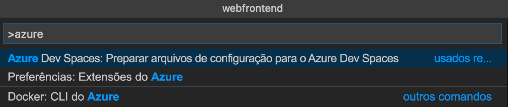
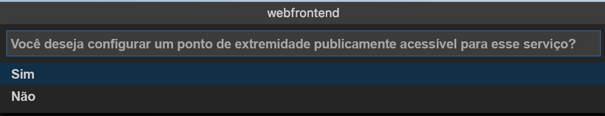
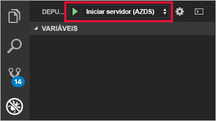
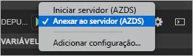

# <a name="quickstart-develop-with-nodejs-on-kubernetes-using-azure-dev-spaces"></a>Início Rápido: Desenvolver com Node.js no Kubernetes usando o Azure Dev Spaces

Neste guia, você aprenderá a:

- Configure o Azure Dev Spaces com um cluster Kubernetes gerenciado no Azure.
- Desenvolva o código em contêineres de maneira iterativa usando o Visual Studio Code.
- Depure o código no seu espaço de desenvolvimento do Visual Studio Code.

## <a name="prerequisites"></a>Pré-requisitos

- Uma assinatura do Azure. Caso não tenha uma assinatura do Azure, é possível criar uma [conta gratuita](https://azure.microsoft.com/free).
- [O Visual Studio Code instalado](https://code.visualstudio.com/download).
- A extensão [Azure Dev Spaces](https://marketplace.visualstudio.com/items?itemName=azuredevspaces.azds) para o Visual Studio Code instalada.
- A [CLI do Azure](/cli/azure/install-azure-cli?view=azure-cli-latest) instalada.

## <a name="create-an-azure-kubernetes-service-cluster"></a>Criar um cluster do Serviço de Kubernetes do Azure

Você precisa criar um cluster do AKS em uma [região com suporte][supported-regions]. Os comandos a seguir criam um grupo de recursos chamado *MyResourceGroup* e um cluster do AKS chamado *MyAKS*.

```cmd
az group create --name MyResourceGroup --location eastus
az aks create -g MyResourceGroup -n MyAKS --location eastus --node-vm-size Standard_DS2_v2 --node-count 1 --disable-rbac --generate-ssh-keys
```

## <a name="enable-azure-dev-spaces-on-your-aks-cluster"></a>Habilitar o Azure Dev Spaces no cluster do AKS

Use o comando `use-dev-spaces` para habilitar o Dev Spaces no cluster do AKS e siga os prompts. O comando abaixo habilita o Dev Spaces no cluster *MyAKS*, no grupo *MyResourceGroup* e cria um espaço de desenvolvimento *padrão*.

```cmd
$ az aks use-dev-spaces -g MyResourceGroup -n MyAKS

'An Azure Dev Spaces Controller' will be created that targets resource 'MyAKS' in resource group 'MyResourceGroup'. Continue? (y/N): y

Creating and selecting Azure Dev Spaces Controller 'MyAKS' in resource group 'MyResourceGroup' that targets resource 'MyAKS' in resource group 'MyResourceGroup'...2m 24s

Select a dev space or Kubernetes namespace to use as a dev space.
 [1] default
Type a number or a new name: 1

Kubernetes namespace 'default' will be configured as a dev space. This will enable Azure Dev Spaces instrumentation for new workloads in the namespace. Continue? (Y/n): Y

Configuring and selecting dev space 'default'...3s

Managed Kubernetes cluster 'MyAKS' in resource group 'MyResourceGroup' is ready for development in dev space 'default'. Type `azds prep` to prepare a source directory for use with Azure Dev Spaces and `azds up` to run.
```

## <a name="get-sample-application-code"></a>Obter o código do aplicativo de exemplo

Neste artigo, você usa o [Aplicativo de exemplo do Azure Dev Spaces](https://github.com/Azure/dev-spaces) para demonstrar o uso do Azure Dev Spaces.

Clone o aplicativo do GitHub.

```cmd
git clone https://github.com/Azure/dev-spaces
```

## <a name="prepare-the-sample-application-in-visual-studio-code"></a>Preparar o aplicativo de exemplo no Visual Studio Code

Abra o Visual Studio Code, clique em *Arquivo*, *Abrir...* e, em seguida, navegue até o diretório *dev-spaces/samples/nodejs/getting-started/webfrontend* e clique em *Abrir*.

Agora você tem o projeto *webfrontend* aberto no Visual Studio Code. Para executar o aplicativo em seu espaço de desenvolvimento, gere os ativos de gráfico do Helm e do Docker usando a extensão Azure Dev Spaces na paleta de comando.

Para abrir a paleta de comandos no Visual Studio Code, clique em *Exibir* e, em seguida, *Paleta de Comandos*. Comece digitando `Azure Dev Spaces` e clique em `Azure Dev Spaces: Prepare configuration files for Azure Dev Spaces`.



Quando o Visual Studio Code solicitar também que você configure o ponto de extremidade público, escolha `Yes` para habilitar um ponto de extremidade público.



Esse comando prepara o projeto para ser executado no Azure Dev Spaces por meio da geração de um Dockerfile e um gráfico do Helm. Ele também gera um diretório *.vscode* com a configuração de depuração na raiz do seu projeto.

## <a name="build-and-run-code-in-kubernetes-from-visual-studio-code"></a>Compilar e executar o código no Kubernetes por meio do Visual Studio Code

Clique no ícone *Depurar* à esquerda e clique em *Iniciar Servidor (AZDS)* na parte superior.



Este comando compila e executa o serviço no Azure Dev Spaces. A janela *Terminal*, na parte inferior, mostra a saída do build e as URLs do seu serviço em execução no Azure Dev Spaces. O *Console de Depuração* mostra a saída de log.

> [!Note]
> Se você não vir comandos do Azure Dev Spaces na *Paleta de Comandos*, verifique se instalou a [extensão do Visual Studio Code para o Azure Dev Spaces](https://marketplace.visualstudio.com/items?itemName=azuredevspaces.azds). Também verifique se você abriu o diretório *dev-spaces/samples/nodejs/getting-started/webfrontend* no Visual Studio Code.

Você poderá ver o serviço em execução abrindo a URL pública.

Clique em *Depurar* e, em seguida, *Parar Depuração* para parar o depurador.

## <a name="update-code"></a>Atualizar código

Para implantar uma versão atualizada do serviço, atualize qualquer arquivo no projeto e execute *Iniciar Servidor* novamente. Por exemplo: 

1. Se o aplicativo ainda estiver em execução, clique em *Depurar* e, em seguida, em *Parar Depuração* para interrompê-lo.
1. Atualize a [linha 13 em `server.js`](https://github.com/Azure/dev-spaces/blob/master/samples/nodejs/getting-started/webfrontend/server.js#L13) para:
    
    ```javascript
        res.send('Hello from webfrontend in Azure');
    ```

1. Salve suas alterações.
1. Execute *Iniciar Servidor* novamente.
1. Navegue até o serviço em execução e observe as alterações que você fez.
1. Clique em *Depurar* e, em seguida, em *Parar Depuração* para interromper o aplicativo.

## <a name="setting-and-using-breakpoints-for-debugging"></a>Definir e usar pontos de interrupção para depuração

Inicie o serviço usando *Iniciar Servidor (AZDS)*.

Navegue de volta para a exibição *Explorer* clicando em *Exibir* e, em seguida, *Explorer*. Abra `server.js` e clique em algum lugar da linha 13 para colocar o cursor nela. Para definir um ponto de interrupção, pressione *F9* ou clique em *Depurar* e, em seguida, *Ativar/Desativar Pontos de Interrupção*.

Abra o serviço em um navegador e observe que nenhuma mensagem foi exibida. Retorne ao Visual Studio Code e observe que a linha 13 está realçada. O ponto de interrupção definido colocou o serviço em pausa na linha 13. Para retomar o serviço, pressione *F5* ou clique em *Depurar* e, em seguida, *Continuar*. Volte para o navegador e observe que agora a mensagem foi exibida.

Durante a execução de seu serviço no Kubernetes com o depurador anexado, você tem acesso completo às informações de depuração como a pilha de chamadas, as variáveis locais e as informações de exceção.

Remova o ponto de interrupção colocando o cursor na linha 13 em `server.js` e pressionando *F9*.

Clique em *Depurar* e, em seguida, *Parar Depuração* para parar o depurador.

## <a name="update-code-from-visual-studio-code"></a>Atualizar o código no Visual Studio Code

Altere o modo de depuração para *Anexar a um Servidor (AZDS)* e inicie o serviço:



Este comando compila e executa o serviço no Azure Dev Spaces. E também inicia um processo [nodemon](https://nodemon.io) no contêiner do seu serviço e anexa o VS Code a ele. O processo *nodemon* permite reinícios automáticos quando são feitas alterações no código-fonte, possibilitando o desenvolvimento de loop interno mais rápido, semelhante ao desenvolvimento em seu computador local.

Depois que o serviço é iniciado, navegue até ele usando o navegador e interaja com ele.

Enquanto o serviço estiver em execução, retorne ao VS Code e atualize a linha 13 em `server.js`. Por exemplo: 
```javascript
    res.send('Hello from webfrontend in Azure while debugging!');
```

Salve o arquivo e retorne ao serviço em um navegador. Interaja com o serviço e observe que a mensagem de atualização é exibida.

Durante a execução do *nodemon*, o processo do Node é reiniciado automaticamente assim que as alterações de código são detectadas. Esse processo de reinicialização automática é semelhante à experiência de edição e reinício do serviço em seu computador local, fornecendo uma experiência de desenvolvimento de loop interno.

## <a name="clean-up-your-azure-resources"></a>Limpar os recursos do Azure

```cmd
az group delete --name MyResourceGroup --yes --no-wait
```

## <a name="next-steps"></a>Próximas etapas

Saiba como o Azure Dev Spaces ajuda você a desenvolver aplicativos mais complexos em vários contêineres e como você pode simplificar o desenvolvimento colaborativo trabalhando com versões diferentes ou branches do seu código em diferentes espaços.

> [!div class="nextstepaction"]
> [Trabalhando com vários contêineres e desenvolvimento em equipe](multi-service-nodejs.md)


[supported-regions]: about.md#supported-regions-and-configurations