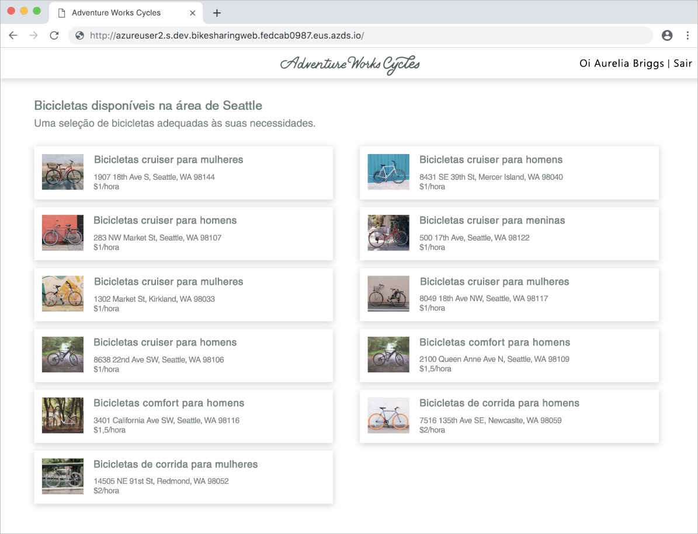
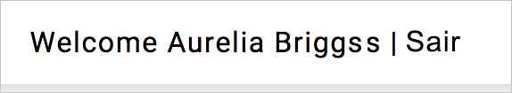

# <a name="quickstart-team-development-on-kubernetes-using-azure-dev-spaces"></a>Início Rápido: Desenvolvimento em equipe no Kubernetes usando o Azure Dev Spaces

Neste guia, você aprenderá a:

- Configurar o Azure Dev Spaces em um cluster Kubernetes gerenciado no Azure.
- Implantar um aplicativo grande com vários microsserviços em um espaço de desenvolvimento.
- Testar um único microsserviço em um espaço de desenvolvimento isolado dentro do contexto do aplicativo completo.


## <a name="prerequisites"></a>Pré-requisitos

- Uma assinatura do Azure. Caso não tenha uma assinatura do Azure, é possível criar uma [conta gratuita](https://azure.microsoft.com/free).
- A [CLI do Azure](/cli/azure/install-azure-cli?view=azure-cli-latest) instalada.
- [Helm 2.13 ou superior instalado](https://github.com/helm/helm/blob/master/docs/install.md).

## <a name="create-an-azure-kubernetes-service-cluster"></a>Criar um cluster do Serviço de Kubernetes do Azure

Você deve criar um cluster do AKS em uma [região com suporte][supported-regions]. Os comandos a seguir criam um grupo de recursos chamado *MyResourceGroup* e um cluster do AKS chamado *MyAKS*.

```cmd
az group create --name MyResourceGroup --location eastus
az aks create -g MyResourceGroup -n MyAKS --location eastus --node-vm-size Standard_DS2_v2 --node-count 1 --disable-rbac --generate-ssh-keys
```

O cluster *MyAKS* também é criado com um nó, usando o tamanho *Standard_DS2_v2* e com o RBAC desabilitado.

## <a name="enable-azure-dev-spaces-on-your-aks-cluster"></a>Habilitar o Azure Dev Spaces no cluster do AKS

Use o comando `use-dev-spaces` para habilitar o Dev Spaces no cluster do AKS e siga os prompts. O comando abaixo habilita o Dev Spaces no cluster *MyAKS*, no grupo *MyResourceGroup* e cria um espaço de desenvolvimento chamado *dev*.

```cmd
az aks use-dev-spaces -g MyResourceGroup -n MyAKS --space dev --yes
```

## <a name="get-sample-application-code"></a>Obter o código do aplicativo de exemplo

Neste artigo, você usa o [Aplicativo de exemplo de Compartilhamento de Bicicletas do Azure Dev Spaces](https://github.com/Azure/dev-spaces/tree/master/samples/BikeSharingApp) para demonstrar o uso do Azure Dev Spaces.

Clone o aplicativo do GitHub e navegue para seu diretório:

```cmd
git clone https://github.com/Azure/dev-spaces
cd dev-spaces/samples/BikeSharingApp/
```

## <a name="retrieve-the-hostsuffix-for-dev"></a>Recuperar o HostSuffix para *dev*

Use o comando `azds show-context` para mostrar o HostSuffix para *dev*.

```cmd
$ azds show-context

Name                ResourceGroup     DevSpace  HostSuffix
------------------  ----------------  --------  -----------------------
MyAKS               MyResourceGroup   dev       fedcab0987.eus.azds.io
```

## <a name="update-the-helm-chart-with-your-hostsuffix"></a>Atualizar o gráfico do Helm com seu HostSuffix

Abra [charts/values.yaml](https://github.com/Azure/dev-spaces/blob/master/samples/BikeSharingApp/charts/values.yaml) e substitua todas as instâncias de `<REPLACE_ME_WITH_HOST_SUFFIX>` pelo valor de HostSuffix recuperado anteriormente. Salve suas alterações e feche o arquivo.

## <a name="run-the-sample-application-in-kubernetes"></a>Executar o aplicativo de exemplo no Kubernetes

Os comandos para execução do aplicativo de exemplo no Kubernetes fazem parte de um processo existente e não dependem das ferramentas do Azure Dev Spaces. Nesse caso, a ferramenta usada para executar este aplicativo de exemplo é o Helm, mas é possível usar outras ferramentas para executar todo o seu aplicativo em um namespace dentro de um cluster. Os comandos de Helm estão direcionados ao espaço de desenvolvimento chamado *dev* criado anteriormente, mas esse espaço de desenvolvimento também é um namespace do Kubernetes. Como resultado, os espaços de desenvolvimento podem ser direcionados por outras ferramentas da mesma forma como acontece com outros namespaces.

Você pode usar o Azure Dev Spaces para desenvolvimento em equipe depois que um aplicativo for executado em um cluster, independentemente das ferramentas usadas para implantá-lo.

Use os comandos `helm init` e `helm install` para configurar e instalar o aplicativo de exemplo em seu cluster.

```cmd
cd charts/
helm init --wait
helm install -n bikesharing . --dep-up --namespace dev --atomic 
```
> [!Note]
> **Se você estiver usando um cluster habilitado por RBAC**, configure [uma conta de serviço para Tiller](https://helm.sh/docs/using_helm/#role-based-access-control). Caso contrário, o comando `helm` falhará.

O comando `helm install` pode levar vários minutos para ser concluído. A saída do comando mostra o status de todos os serviços que ele implantou no cluster após a conclusão:

```cmd
$ cd charts/
$ helm init --wait
...
Happy Helming!

$ helm install -n bikesharing . --dep-up --namespace dev --atomic

Hang tight while we grab the latest from your chart repositories...
...
NAME               READY  UP-TO-DATE  AVAILABLE  AGE
bikes              1/1    1           1          4m32s
bikesharingweb     1/1    1           1          4m32s
billing            1/1    1           1          4m32s
gateway            1/1    1           1          4m32s
reservation        1/1    1           1          4m32s
reservationengine  1/1    1           1          4m32s
users              1/1    1           1          4m32s
```

Após a instalação do exemplo de aplicativo em seu cluster, e como você tem o Dev Spaces habilitado no seu cluster, use o comando `azds list-uris` para exibir as URLs do aplicativo de exemplo no *dev* selecionado no momento.

```cmd
$ azds list-uris
Uri                                                 Status
--------------------------------------------------  ---------
http://dev.bikesharingweb.fedcab0987.eus.azds.io/  Available
http://dev.gateway.fedcab0987.eus.azds.io/         Available
```

Navegue até o serviço *bikesharingweb* abrindo a URL pública com o comando `azds list-uris`. No exemplo acima, a URL pública para o serviço *bikesharingweb* é `http://dev.bikesharingweb.fedcab0987.eus.azds.io/`. Selecione *Yara Lima (cliente)* como o usuário. Verifique se você consegue ver o texto *Olá Yara Lima | Sair* na parte superior.



## <a name="create-child-dev-spaces"></a>Criar espaços de desenvolvimento filhos

Use o comando `azds space select` para criar dois espaços filhos em *dev*:

```cmd
azds space select -n dev/azureuser1 -y
azds space select -n dev/azureuser2 -y
```

Os comandos acima criam dois espaços filhos sob *dev* denominados *azureuser1* e *azureuser2*. Esses dois espaços filhos representam espaços distintos de desenvolvimento para os desenvolvedores *azureuser1* e *azureuser2* usarem para fazer alterações no aplicativo de exemplo.

Use o comando `azds space list` para listar todos os espaços de desenvolvimento e confirme se *dev/azureuser2* está selecionado.

```cmd
$ azds space list
Name            Selected
--------------  --------
default         False
dev             False
dev/azureuser1  False
dev/azureuser2  True
```

Use o `azds list-uris` para exibir as URLs do aplicativo de exemplo no espaço selecionado no momento, que é *dev/azureuser2*.

```cmd
$ azds list-uris
Uri                                                             Status
--------------------------------------------------              ---------
http://azureuser2.s.dev.bikesharingweb.fedcab0987.eus.azds.io/  Available
http://azureuser2.s.dev.gateway.fedcab0987.eus.azds.io/         Available
```

Confirme se as URLs exibidas pelo comando `azds list-uris` têm o prefixo *azureuser2.s.dev*. Esse prefixo confirma que o espaço atual selecionado é *azureuser2*, que é um filho de *dev*.

Navegue até o serviço *bikesharingweb* do espaço de desenvolvimento *dev/azureuser2* abrindo a URL pública com o comando `azds list-uris`. No exemplo acima, a URL pública para o serviço *bikesharingweb* é `http://azureuser2.s.dev.bikesharingweb.fedcab0987.eus.azds.io/`. Selecione *Yara Lima (cliente)* como o usuário. Verifique se você consegue ver o texto *Olá Yara Lima | Sair* na parte superior.

## <a name="update-code"></a>Atualizar código

Abra *BikeSharingWeb/components/Header.js* com um editor de texto e altere o texto no [elemento span pelo className `userSignOut`](https://github.com/Azure/dev-spaces/blob/master/samples/BikeSharingApp/BikeSharingWeb/components/Header.js#L16).

```html
<span className="userSignOut">
    <Link href="/devsignin"><span tabIndex="0">Welcome {props.userName} | Sign out</span></Link>
</span>
```

Salve suas alterações e feche o arquivo.

## <a name="build-and-run-the-updated-bikesharingweb-service-in-the-devazureuser2-dev-space"></a>Compilar e executar o serviço bikesharingweb atualizado no espaço de desenvolvimento *dev/azureuser2*

Navegue até o diretório *BikeSharingWeb/* e execute o comando `azds up`.

```cmd
$ cd ../BikeSharingWeb/
$ azds up

Using dev space 'dev/azureuser2' with target 'MyAKS'
Synchronizing files...2s
...
Service 'bikesharingweb' port 'http' is available at http://azureuser2.s.dev.bikesharingweb.fedcab0987.eus.azds.io/
Service 'bikesharingweb' port 80 (http) is available at http://localhost:54256
...
```

Este comando compila e executa o serviço *bikesharingweb* no espaço de desenvolvimento *dev/azureuser2*. Esse serviço é executado, além do serviço *bikesharingweb* em execução no *dev*, e só é usado para solicitações com o prefixo de URL *azureuser2.s*. Para saber mais sobre como encaminhar trabalhos entre espaços de desenvolvimento pai e filhos, confira [Como o Azure Dev Spaces funciona e é configurado](how-dev-spaces-works.md).

Navegue até o serviço *bikesharingweb* do espaço de desenvolvimento *dev/azureuser2* abrindo a URL pública na saída do comando `azds up`. Selecione *Yara Lima (cliente)* como o usuário. Verifique se você consegue ver o texto atualizado no canto superior direito. Talvez seja necessário atualizar a página ou limpar o cache do navegador se você não vir imediatamente essa alteração.



## <a name="verify-other-dev-spaces-are-unchanged"></a>Verificar se outros espaços de desenvolvimento permaneceram inalterados

Se o comando `azds up` ainda estiver em execução, pressione *Ctrl+c*.

```cmd
$ azds list-uris --all
Uri                                                             Status
--------------------------------------------------              ---------
http://azureuser1.s.dev.bikesharingweb.fedcab0987.eus.azds.io/  Available
http://azureuser1.s.dev.gateway.fedcab0987.eus.azds.io/         Available
http://azureuser2.s.dev.bikesharingweb.fedcab0987.eus.azds.io/  Available
http://azureuser2.s.dev.gateway.fedcab0987.eus.azds.io/         Available
http://dev.bikesharingweb.fedcab0987.eus.azds.io/               Available
http://dev.gateway.fedcab0987.eus.azds.io/                      Available
```

Navegue até a versão *dev* do *bikesharingweb* em seu navegador, escolha *Yara Lima (cliente)* como usuário e verifique se você consegue ver o texto original no canto superior direito. Repita estas etapas com a URL *dev/azureuser1*. Observe que as alterações são aplicadas apenas à versão *dev/azureuser2* do *bikesharingweb*. Esse isolamento das alterações no *dev/azureuser2* permite que *azureuser2* faça alterações sem afetar *azureuser1*.

Para que essas alterações sejam aplicadas em *dev* e em *dev/azureuser1*, siga o fluxo de trabalho existente ou pipeline de CI/CD da sua equipe. Por exemplo, este fluxo de trabalho pode envolver confirmar sua alteração ao seu sistema de controle de versão e implantar a atualização usando um pipeline de CI/CD ou ferramentas como o Helm.

## <a name="clean-up-your-azure-resources"></a>Limpar os recursos do Azure

```cmd
az group delete --name MyResourceGroup --yes --no-wait
```

## <a name="next-steps"></a>Próximas etapas

Saiba como o Azure Dev Spaces ajuda você a desenvolver aplicativos mais complexos em vários contêineres e como você pode simplificar o desenvolvimento colaborativo trabalhando com versões diferentes ou ramificações do seu código em diferentes espaços.

> [!div class="nextstepaction"]
> [Trabalhando com vários contêineres e desenvolvimento em equipe](multi-service-nodejs.md)


[supported-regions]: about.md#supported-regions-and-configurations
