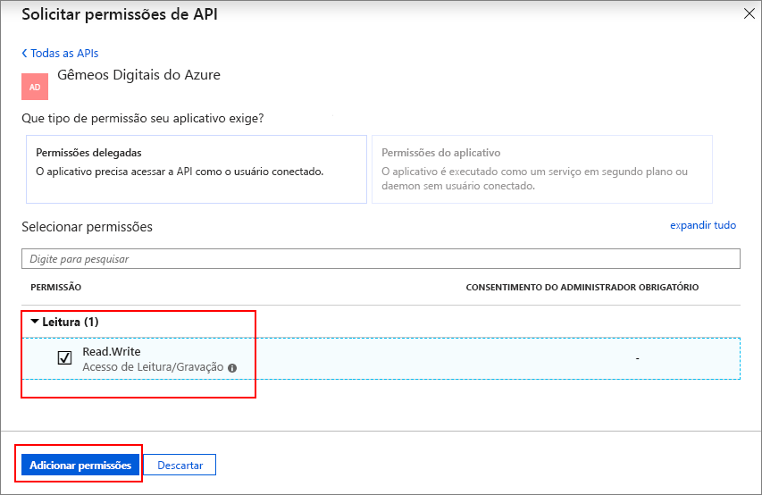

# <a name="azure-digital-twins-swagger-reference-documentation"></a>Documentação de referência do Swagger de Gêmeos Digitais do Azure

Cada instância de Gêmeos Digitais do Azure provisionada inclui sua própria documentação de referência do Swagger gerada automaticamente.

[Swagger](https://swagger.io/) ou [OpenAPI](https://www.openapis.org/), une informações de API complexas em um recurso de referência interativo e agnóstico de idioma. O Swagger fornece material de referência crítico sobre quais cargas úteis, métodos HTTP e pontos de extremidade específicos do JSON devem ser usados para executar operações em uma API.

## <a name="swagger-summary"></a>Resumo do Swagger

O Swagger fornece um resumo interativo da sua API, que inclui:

* API e informações do modelo de objeto.
* Endpoints da API REST que especificam os payloads, cabeçalhos, parâmetros, caminhos de contexto e métodos HTTP necessários para solicitações.
* Teste das funcionalidades de API.
* Exemplo de informações de resposta usadas para validar e confirmar respostas HTTP.
* Informações de código de erro.

O Swagger é uma ferramenta conveniente para auxiliar no desenvolvimento e teste de chamadas feitas às APIs de Gerenciamento de Gêmeos Digitais do Azure.

[!INCLUDE [Digital Twins Swagger](../../includes/digital-twins-swagger.md)]

## <a name="reference-material"></a>Material de referência

O material de referência do Swagger gerado automaticamente fornece uma visão geral rápida de conceitos importantes, pontos de extremidade de API de Gerenciamento disponíveis e uma descrição de cada modelo de objeto para auxiliar o desenvolvimento e teste.

Um resumo descreve a API.

[](media/how-to-use-swagger/swagger_management_top.PNG#lightbox)

Os modelos de objeto da API de Gerenciamento também são listados.

[](media/how-to-use-swagger/swagger_management_models.PNG#lightbox)

Você pode selecionar cada modelo de objeto listados para um resumo detalhado dos atributos de chave.

[](media/how-to-use-swagger/swagger_management_model.PNG#lightbox)

Os modelos de objeto Swagger gerados são convenientes para ver todos os [objetos e APIs](./concepts-objectmodel-spatialgraph.md) dos Gêmeos Digitais do Azure. Os desenvolvedores podem usar esse recurso ao criarem soluções nos Gêmeos Digitais do Azure.

## <a name="endpoint-summary"></a>Resumo de ponto de extremidade

O Swagger também fornece uma visão geral completa de todos os pontos de extremidade que compõem as APIs de Gerenciamento.

Cada terminal listado também inclui as informações de solicitação necessárias, como:

* Parâmetros obrigatórios.
* Tipos de dados de parâmetro necessários.
* Método HTTP para acessar o recurso.

[](media/how-to-use-swagger/swagger_management_endpoints.PNG#lightbox)

Para ver uma visão geral mais detalhada, selecione cada recurso.

## <a name="use-swagger-to-test-endpoints"></a>Use Swagger para testar endpoints

Uma das funcionalidades poderosas que o Swagger oferece é a capacidade de testar um endpoint da API diretamente através da interface do usuário da documentação.

Depois de selecionar um endpoint específico, você verá **Try it out**.

[](media/how-to-use-swagger/swagger_management_try.PNG#lightbox)

Expanda essa seção para exibir os campos de entrada para cada parâmetro obrigatório e opcional. Insira os valores corretos e selecione **Executar**.

[](media/how-to-use-swagger/swagger_management_tried.PNG#lightbox)

Depois de executar o teste, você pode validar os dados de resposta.

## <a name="swagger-response-data"></a>Dados de resposta do Swagger

Cada ponto de extremidade listado também inclui dados de corpo de resposta para validar seu desenvolvimento e testes. Esses exemplos incluem os códigos de status e o JSON que você deseja ver para solicitações HTTP bem-sucedidas.

[](media/how-to-use-swagger/swagger_management_response.PNG#lightbox)

Os exemplos também incluem os códigos de erro para ajudar a depurar ou melhorar os testes com falha.

## <a name="swagger-oauth-20-authorization"></a>Autorização OAuth 2.0 do Swagger

Para saber mais sobre solicitações de teste interativas protegidas pelo OAuth 2.0, consulte a [documentação oficial](https://swagger.io/docs/specification/authentication/oauth2/).

> [!NOTE]
> A entidade de usuário que criou o recurso de gêmeos Digital do Azure terá uma atribuição de função de administrador de espaço e será capaz de criar atribuições de função adicionais para outros usuários.

1. Siga as etapas em [este guia de início rápido](https://docs.microsoft.com/azure/active-directory/develop/quickstart-v1-integrate-apps-with-azure-ad) para criar um aplicativo do Azure AD do tipo ***aplicativo Web / API***. Ou você pode reutilizar um registro de aplicativo existente.

2. Adicione a seguinte url de resposta para o registro do aplicativo:

    ```plaintext
    https://YOUR_SWAGGER_URL/ui/oauth2-redirect-html
    ```
    | NOME  | Substitua por | Exemplo |
    |---------|---------|---------|
    | YOUR_SWAGGER_URL | A URL da documentação API REST de gerenciamento encontrada no portal do  | `https://yourDigitalTwinsName.yourLocation.azuresmartspaces.net/management/swagger` |

3. Conceder permissões para seu aplicativo acessar os gêmeos Digital do Azure. Em **Permissões necessárias**, digite `Azure Digital Twins` e selecione **Permissões Delegadas**. Em seguida, selecione **conceder permissões**.

    

4. Configure o manifesto de aplicativo para permitir fluxo implícito do OAuth 2.0. Clique em **Manifesto** para abrir o manifesto do aplicativo para seu aplicativo. Definir *oauth2AllowImplicitFlow* para `true`.

    

5. Copie a ID do aplicativo do Azure AD.

Depois de concluir o registro do Active Directory do Azure:

6. Clique o **autorizar** botão na página do swagger.

    [](media/how-to-use-swagger/swagger-select-authorize-btn.png#lightbox)

7. Cole a ID do aplicativo para o **client_id** campo.

    [](media/how-to-use-swagger/swagger-auth-form.png#lightbox)

8. Em seguida, você será redirecionado para o sucesso seguir modal.

    [](media/how-to-use-swagger/swagger_auth_redirect.PNG#lightbox)

## <a name="next-steps"></a>Próximas etapas

- Para ler mais sobre os modelos de objetos dos Gêmeos Digitais do Azure e o gráfico de inteligência espacial, leia [Entender os modelos de objetos do Azure Digital Twins](./concepts-objectmodel-spatialgraph.md).

- Para saber como se autenticar com sua API de gerenciamento, leia [Autenticar com APIs](./security-authenticating-apis.md).