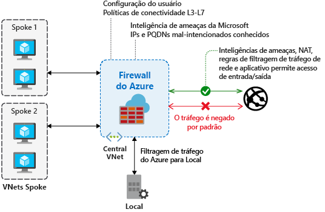

# O que é o Firewall do Azure?

Firewall do Azure é um serviço de segurança de rede gerenciado e baseado em nuvem que protege seus recursos de Rede Virtual do Azure. É um firewall como serviço totalmente com estado com alta disponibilidade interna e escalabilidade de nuvem irrestrita.

É possível criar, impor e registrar centralmente políticas de conectividade de rede e de aplicativo em assinaturas e redes virtuais. O Firewall do Azure usa um endereço IP público estático para seus recursos de rede virtual, permitindo que firewalls externos identifiquem o tráfego originário de sua rede virtual.  O serviço é totalmente integrado ao Azure Monitor para registro em log e análise.

O Firewall do Azure oferece os seguintes recursos:

## Alta disponibilidade interna

A alta disponibilidade é interna, portanto, nenhum balanceador de carga adicional é necessário e nenhuma configuração é necessária.

## Zonas de Disponibilidades

O Firewall do Azure pode ser configurado durante a implantação para abranger várias Zonas de Disponibilidade para aumentar a disponibilidade. Com Zonas de Disponibilidade, a sua disponibilidade aumenta para um tempo de atividade de 99,99%. Para saber mais, confira o [Contrato de Nível de Serviço (SLA)](https://azure.microsoft.com/support/legal/sla/azure-firewall/v1_0/) do Firewall do Azure. O SLA de tempo de atividade de 99,99% é oferecido quando duas ou mais Zonas de Disponibilidade estão selecionadas.

Você também pode associar o Firewall do Azure a uma zona específica apenas por motivos de proximidade, usando o SLA de 99,95% padrão de serviço.

Não há custo adicional para um firewall implantado em uma Zona de Disponibilidade. No entanto, há custos adicionais para transferências de dados de entrada e saída associados com as Zonas de Disponibilidade. Para saber mais, confira [Detalhes de preços de largura de banda](https://azure.microsoft.com/pricing/details/bandwidth/).

As Zonas de Disponibilidade do Firewall do Azure estão disponíveis nas regiões que dão suporte a Zonas de Disponibilidade. Para saber mais, confira [O que são Zonas de Disponibilidade no Azure?](../availability-zones/az-overview.md#services-support-by-region)

> [!NOTE]
> As Zonas de Disponibilidade só podem ser configuradas durante a implantação. Você não pode configurar um firewall existente para incluir Zonas de Disponibilidade.

Para obter informações sobre Zonas de Disponibilidade, confira [O que são as Zonas de Disponibilidade no Azure?](../availability-zones/az-overview.md)

## Escalabilidade de nuvem sem restrições

O Firewall do Azure pode escalar verticalmente o quanto você precisar a fim de acomodar fluxos de tráfego de rede cambiáveis, para que você não precise de orçamento para o tráfego de pico.

## Regras de filtragem de FQDN de aplicativo

Você pode limitar o tráfego HTTP/S de saída ou o tráfego SQL do Azure (versão prévia) para uma lista especificada de FQDNs (nomes de domínio totalmente qualificados), incluindo caracteres curinga. Esse recurso não exige a terminação SSL.

## Regras de filtragem de tráfego de rede

Você pode criar centralmente regras de filtragem de rede para *permitir* ou *negar* por endereço IP de origem e destino, porta e protocolo. O Firewall do Azure é totalmente com estado, para que possa distinguir pacotes legítimos de diferentes tipos de conexões. As regras são impostas e registradas em várias assinaturas e redes virtuais.

## Marcas de FQDN

As marcas de FQDN facilitam permitir o tráfego de rede do serviço do Azure conhecido através do firewall. Por exemplo, digamos que você deseja permitir o tráfego de rede do Windows Update por meio de seu firewall. Você cria uma regra de aplicativo e inclui a marca do Windows Update. Agora o tráfego de rede do Windows Update pode fluir através do firewall.

## Marcas de serviço

Uma marca de serviço representa um grupo de prefixos de endereço IP para ajudar a minimizar a complexidade da criação de regra de segurança. Você não pode criar sua própria marca de serviço ou especificar quais endereços IP estão incluídos em uma marca. A Microsoft gerencia os prefixos de endereço englobados pela marca de serviço e atualiza automaticamente a marca de serviço em caso de alteração de endereços.

## Inteligência contra ameaças

A filtragem contra ameaças baseada em inteligência pode ser habilitada para o seu firewall de forma a alertar e rejeitar o tráfego de/para endereços IP e domínios mal-intencionados. Os endereços IP e os domínios são originados do feed de inteligência de ameaças da Microsoft.

## Suporte a SNAT de saída

Todos os endereços IP de tráfego de rede virtual de saída são convertidos no IP público do Firewall do Azure (conversão de endereço de rede de origem). Você pode identificar e permitir o tráfego proveniente de sua rede virtual para destinos de Internet remotos. O Firewall do Azure não usa SNAT quando o IP de destino é um intervalo IP privado de acordo com o [IANA RFC 1918](https://tools.ietf.org/html/rfc1918). Se sua organização usa um intervalo de endereços IP públicos para redes privadas, o Firewall do Azure usará SNAT para o tráfego de um dos endereços IP privados do firewall em AzureFirewallSubnet.

## Suporte a DNAT de entrada

O tráfego de rede de entrada para seu endereço IP público do firewall é movido (conversão de endereços de rede de destino) e filtrado para os endereços IP privados em suas redes virtuais.

## Vários endereços IP públicos

> [!IMPORTANT]
> O Firewall do Azure com vários endereços IP públicos está disponível por meio do portal do Azure, do Azure PowerShell, da CLI do Azure, do REST e de modelos.

Você pode associar vários endereços IP públicos (até 100) com o seu firewall.

Isso permite os seguintes cenários:

- **DNAT**: várias instâncias de porta padrão podem ser traduzidas em seus servidores de back-end. Por exemplo, se você tem dois endereços IP públicos, pode traduzir a porta TCP 3389 (RDP) para os dois endereços IP.
- **SNAT**: as portas adicionais estão disponíveis para conexões SNAT de saída, reduzindo a possibilidade de esgotamento da porta SNAT. Neste momento, o Firewall do Azure seleciona aleatoriamente o endereço IP público do código-fonte a ser usado para uma conexão. Se você tiver qualquer filtragem downstream em sua rede, precisará permitir todos os endereços IP públicos associados com seu firewall.

## Registro em log do Azure Monitor

Todos os eventos são integrados ao Azure Monitor, permitindo que você arquive logs em uma conta de armazenamento, transmita eventos ao Hub de Eventos ou envie-os aos logs do Azure Monitor.

## Problemas conhecidos

O Firewall do Azure tem os seguintes problemas conhecidos:

|Problema  |DESCRIÇÃO  |Redução  |
|---------|---------|---------|
As regras de filtragem de rede para protocolos não TCP/UDP (por exemplo, ICMP) não funcionam para o tráfego vinculado à Internet|As regras de filtragem de rede para protocolos não TCP/UDP não funcionam com o SNAT para seu endereço IP público. Protocolos não TCP/UDP têm suporte entre VNets e sub-redes spoke.|O Firewall do Azure usa o Standard Load Balancer [que não dá suporte a SNAT para protocolos IP](https://docs.microsoft.com/azure/load-balancer/load-balancer-standard-overview#limitations). Estamos explorando as opções para dar suporte a esse cenário em uma versão futura.|
|Suporte do PowerShell e da CLI ausente para ICMP|O Azure PowerShell e a CLI do Azure não dão suporte ao ICMP como um protocolo válido nas regras de rede.|Ainda é possível usar o ICMP como protocolo por meio do portal e da API REST. Estamos trabalhando para adicionar o ICMP no PowerShell e na CLI em breve.|
|As marcas de FQDN requerem que um protocolo:porta seja definido|As regras de aplicativo com marcas de FQDN exigem a definição de um protocolo:porta.|Você pode usar **HTTPS** como o valor de porta:protocolo. Estamos trabalhando para tornar esse campo opcional quando marcas de FQDN são usadas.|
|Não há suporte para a movimentação de um firewall para um grupo de recursos ou uma assinatura diferente|Não há suporte para a movimentação de um firewall para um grupo de recursos ou uma assinatura diferente.|O suporte a essa funcionalidade está em nosso roteiro. Para mover um firewall para um grupo de recursos ou uma assinatura diferente, você precisa excluir a instância atual e recriá-la no novo grupo de recursos ou na nova assinatura.|
|Intervalo de portas em regras de rede e de aplicativo|As portas são limitadas a 64 mil, uma vez que as portas altas estão reservadas para gerenciamento e investigações de integridade. |Estamos trabalhando para afrouxar essa limitação.|
|Alertas de inteligência de ameaças podem ser mascarados|As regras de rede com destino 80/443 para filtragem de saída mascaram os alertas de inteligência de ameaças quando configuradas para o modo somente alerta.|Crie a filtragem de saída para 80/443 usando regras de aplicativo. Ou, alterar o modo de inteligência contra ameaças para **Alertar e negar**.|
|O Firewall do Azure usa apenas DNS do Azure para resolução de nome|O Firewall do Azure resolve FQDNs usando apenas o DNS do Azure. Não há suporte para um servidor DNS personalizado. Não há nenhum impacto à resolução de DNS em outras sub-redes.|Estamos trabalhando para afrouxar essa limitação.|
|O SNAT/DNAT de Firewall do Azure não funciona para destinos de IP privados|O suporte de Firewall SNAT/DNAT do Azure é limitado à saída/entrada da Internet. No momento, o SNAT/DNAT não funciona para destinos de IP privados. Por exemplo, spoke para spoke.|Esta é uma limitação atual.|
|Não é possível remover a primeira configuração de IP público|Cada endereço IP público do Firewall do Azure é atribuído a uma *configuração de IP*.  A primeira configuração de IP é atribuída durante a implantação do firewall e geralmente também contém uma referência à sub-rede do firewall (a menos que configurado de maneira explicitamente diferente por meio de uma implantação de modelo). Não é possível excluir essa configuração de IP, pois ele desalocaria o firewall. Você ainda poderá alterar ou remover o endereço IP público associado a essa configuração de IP se o firewall tiver pelo menos um outro endereço IP público disponível para uso.|Esse comportamento é intencional.|
|As Zonas de disponibilidade só podem ser configuradas durante a implantação.|As Zonas de disponibilidade só podem ser configuradas durante a implantação. Você não pode configurar Zonas de Disponibilidade após a implantação de um firewall.|Esse comportamento é intencional.|
|SNAT em conexões de entrada|Além de DNAT, as conexões via o endereço IP público do firewall (entrada) estão no modo SNAT para um dos IPs privados do firewall. Esse requisito hoje (e também para NVAs ativa/ativa) garante o roteamento simétrico.|Para preservar a fonte original para HTTP/S, use os cabeçalhos [XFF](https://en.wikipedia.org/wiki/X-Forwarded-For). Por exemplo, usar um serviço, como [Porta da frente do Azure](../frontdoor/front-door-http-headers-protocol.md#front-door-service-to-backend) na frente do firewall. Você também pode adicionar o WAF como parte Porta da frente do Azure e encadear ao firewall.
|Suporte para filtragem de FQDN do SQL apenas no modo de proxy (porta 1433)|Para o Banco de Dados SQL do Azure, o SQL Data Warehouse do Azure e a Instância Gerenciada do SQL do Azure:  Durante a versão prévia, a filtragem de FQDN do SQL tem suporte apenas no modo de proxy (a porta 1433).  Para IaaS do SQL do Azure:  Se estiver usando portas não padrão, você poderá especificar as portas nas regras do aplicativo.|Para o SQL no modo de redirecionamento, que é o padrão ao se conectar de dentro do Azure, você pode filtrar o acesso usando a tag de serviço do SQL como parte das regras de rede do Firewall do Azure.

## Próximas etapas

- [Tutorial: Implantar e configurar o Firewall do Azure usando o portal do Azure](tutorial-firewall-deploy-portal.md)
- [Implantar Firewall do Azure usando um modelo](deploy-template.md)
- [Criar um ambiente de teste do Firewall do Azure](scripts/sample-create-firewall-test.md)
