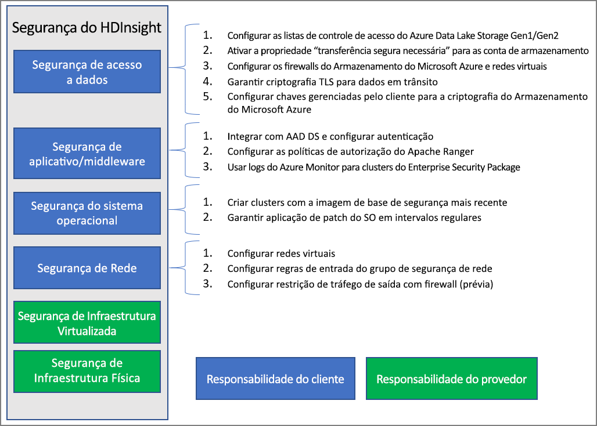

# Visão geral da segurança empresarial no Azure HDInsight

O Azure HDInsight oferece vários métodos para atender às suas necessidades de segurança empresarial. A maioria dessas soluções não está ativada por padrão. Essa flexibilidade permite que você escolha os recursos de segurança que são mais importantes para você e ajuda a evitar o pagamento de recursos indesejados. Isso também significa que é sua responsabilidade verificar se as soluções corretas estão habilitadas para sua instalação e seu ambiente.

Este artigo analisa as soluções de segurança dividindo-as nas linhas de quatro pilares de segurança tradicionais: segurança de perímetro, autenticação, autorização e criptografia.

Este artigo também apresenta o **ESP (Enterprise Security Package) do Azure HDInsight**, que fornece autenticação baseada no Active Directory, suporte multiusuário e controle de acesso baseado em função para clusters HDInsight.

## Pilares da segurança empresarial

Uma maneira de analisar a segurança empresarial divide as soluções de segurança em quatro grupos principais com base no tipo de controle. Esses grupos também são chamados de pilares de segurança e são os seguintes: segurança de perímetro, autenticação, autorização e criptografia.

### Segurança de perímetro

A segurança de perímetro no HDInsight é obtida por meio de [redes virtuais](../hdinsight-plan-virtual-network-deployment.md). Um admin corporativo pode criar um cluster dentro de uma VNET (rede virtual) e usar NSGs (grupos de segurança de rede) para restringir o acesso à rede virtual. Somente os endereços IP permitidos nas regras NSG de entrada poderão se comunicar com o cluster HDInsight. Essa configuração fornece segurança de perímetro.

Todos os clusters implantados em uma VNET também terão um ponto de extremidade privado que é resolvido para um IP privado dentro da VNET para acesso HTTP privado aos gateways do cluster.

### Authentication

O [Enterprise Security Package](apache-domain-joined-architecture.md) do HDInsight fornece autenticação baseada no Active Directory, suporte multiusuário e controle de acesso baseado em função. A integração do Active Directory é obtida pelo uso do [Azure Active Directory Domain Services](../../active-directory-domain-services/overview.md). Com essas funcionalidades, você poderá criar um cluster HDInsight que ingressado em um domínio gerenciado do Active Directory. Em seguida, você poderá configurar uma lista de funcionários da empresa que podem se autenticar e entrar no cluster.

Com essa configuração, funcionários da empresa podem entrar nos nós de cluster, usando as credenciais de domínio. Além disso, podem usar suas credenciais de domínio para autenticação com outros pontos de extremidade aprovados como Apache Ambari Views, ODBC, JDBC, PowerShell e API REST para interagir com o cluster. 

### Autorização

Uma melhor prática que a maioria das empresas segue é garantir que nem todos os funcionários tenham acesso a todos os recursos da empresa. Da mesma forma, o administrador pode definir políticas de controle de acesso baseadas em função para os recursos do cluster. Isso só está disponível nos clusters ESP.

O administrador do Hadoop pode configurar o RBAC (controle de acesso baseado em função) para proteger o Apache [Hive](apache-domain-joined-run-hive.md), o [HBase](apache-domain-joined-run-hbase.md) e o [Kafka](apache-domain-joined-run-kafka.md) usando esses plug-ins no Apache Ranger. A configuração de políticas de RBAC permite que você associe permissões a uma função na organização. Essa camada de abstração facilita garantir que as pessoas tenham apenas as permissões necessárias para realizar suas responsabilidades de trabalho. O Ranger também permite auditar o acesso a dados de funcionários e as alterações feitas nas políticas de controle de acesso.

Por exemplo, o administrador pode configurar o [Apache Ranger](https://ranger.apache.org/) para definir políticas de controle de acesso para o Hive. Essa funcionalidade garante a filtragem em nível de linha e de coluna (mascaramento de dados) e filtra os dados confidenciais contra usuários não autorizados.

### Auditoria

A auditoria de todo acesso aos recursos do cluster e aos dados é necessária para rastrear o acesso não autorizado ou não intencional dos recursos. É tão importante quanto proteger os recursos de cluster HDInsight de usuários não autorizados e proteger os dados.

O administrador pode exibir e relatar todo o acesso aos recursos e dados de cluster do HDInsight. O administrador também pode exibir e relatar todas as alterações nas políticas de controle de acesso criadas nos pontos de extremidade com suporte pelo Apache Ranger. 

Para acessar os logs de auditoria do Apache Ranger e do Ambari, bem como os logs de acesso ao SSH, [habilite o Azure Monitor](../hdinsight-hadoop-oms-log-analytics-tutorial.md) e veja os registros de auditoria relacionados.

### Criptografia

A proteção de dados é importante para atender aos requisitos de segurança e conformidade da organização. Além de restringir o acesso a dados de funcionários não autorizados, você deve criptografá-lo.

Ambos os armazenamentos de dados para clusters HDInsight, Armazenamento de Blobs do Azure e Azure Data Lake Storage Gen1/Gen2, dão suporte à [criptografia de dados](../../storage/common/storage-service-encryption.md) transparente do lado do servidor em repouso. Os clusters seguros do HDInsight funcionarão perfeitamente com esse recurso de criptografia de dados do lado do servidor em repouso.

## Modelo de responsabilidade compartilhada

A imagem a seguir resume as principais áreas de segurança do sistema e as soluções de segurança que estão disponíveis para você em cada uma delas. Ela também realça quais áreas de segurança são responsabilidade sua como cliente e quais áreas são responsabilidade do HDInsight como o provedor de serviços.

A tabela a seguir fornece links para recursos para cada tipo de solução de segurança.

| Área de segurança | Soluções disponíveis | Parte responsável |
|---|---|---|
| Segurança de acesso a dados | Configurar as [ACLs (listas de controle de acesso)](../../storage/blobs/data-lake-storage-access-control.md) para o Azure Data Lake Storage Gen1 e Gen2  | Cliente |
|  | Habilitar a propriedade ["Transferência segura obrigatória"](../../storage/common/storage-require-secure-transfer.md) nas contas de armazenamento. | Cliente |
|  | Configurar redes virtuais e [firewalls do Armazenamento do Azure](../../storage/common/storage-network-security.md) | Cliente |
|  | Verificar se a [criptografia TLS](../../storage/common/storage-security-tls.md) está habilitada para os dados em trânsito. | Cliente |
|  | Configurar as [chaves gerenciadas pelo cliente](../../storage/common/storage-encryption-keys-portal.md) para a criptografia do Armazenamento do Azure | Cliente |
| Segurança de aplicativo e middleware | Fazer a integração ao AAD-DS e [configurar a autenticação](apache-domain-joined-configure-using-azure-adds.md) | Cliente |
|  | Configurar políticas de [Autorização do Apache Ranger](apache-domain-joined-run-hive.md) | Cliente |
|  | Usar os [logs do Azure Monitor](../hdinsight-hadoop-oms-log-analytics-tutorial.md) | Cliente |
| Segurança do sistema operacional | Criar clusters com a imagem base segura mais recente | Cliente |
|  | Garantir a [aplicação de patch do sistema operacional](../hdinsight-os-patching.md) em intervalos regulares | Cliente |
| Segurança de rede | Configurar uma [rede virtual](../hdinsight-plan-virtual-network-deployment.md) |
|  | Configurar as [regras NSG (grupo de segurança de rede) de entrada](../hdinsight-plan-virtual-network-deployment.md#networktraffic) | Cliente |
|  | Configurar a [Restrição de tráfego de saída](../hdinsight-restrict-outbound-traffic.md) com o firewall (versão prévia) | Cliente |
| Infraestrutura virtualizada | N/D | HDInsight (provedor de nuvem) |
| Segurança de infraestrutura física | N/D | HDInsight (provedor de nuvem) |

## Próximas etapas

* [Planejar clusters do HDInsight com ESP](apache-domain-joined-architecture.md)
* [Configurar clusters do HDInsight com ESP](apache-domain-joined-configure.md)
* [Gerenciar clusters do HDInsight com ESP](apache-domain-joined-manage.md)
