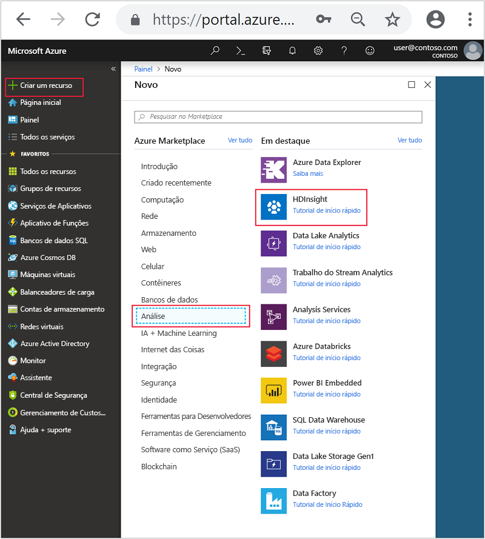
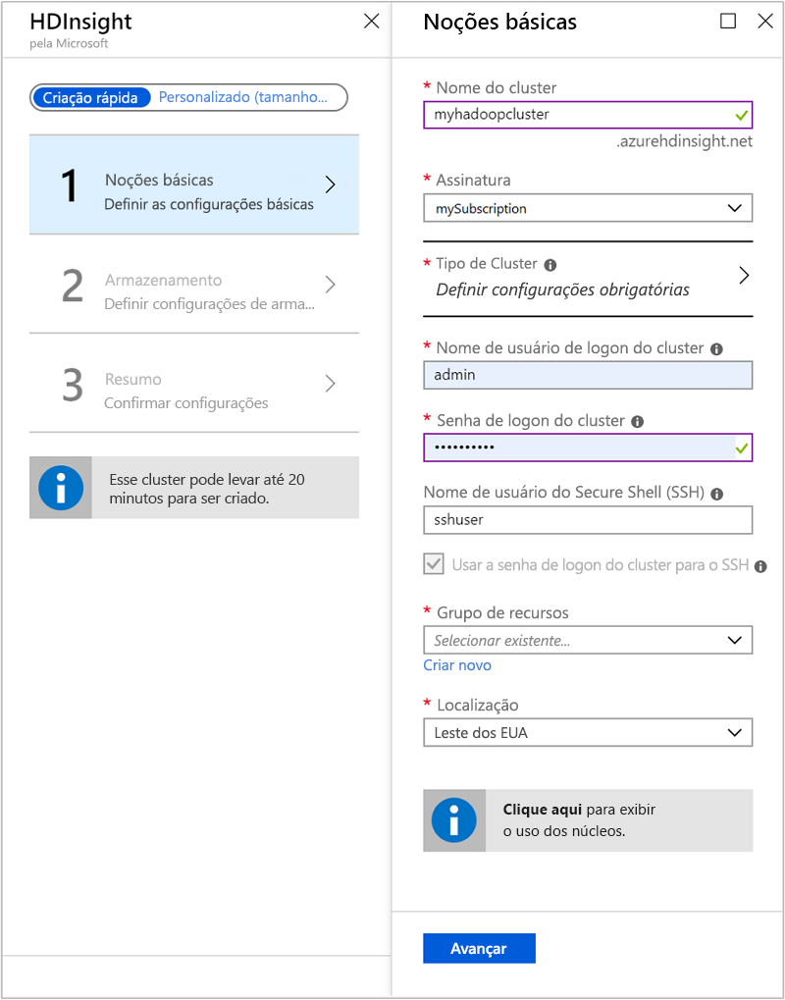
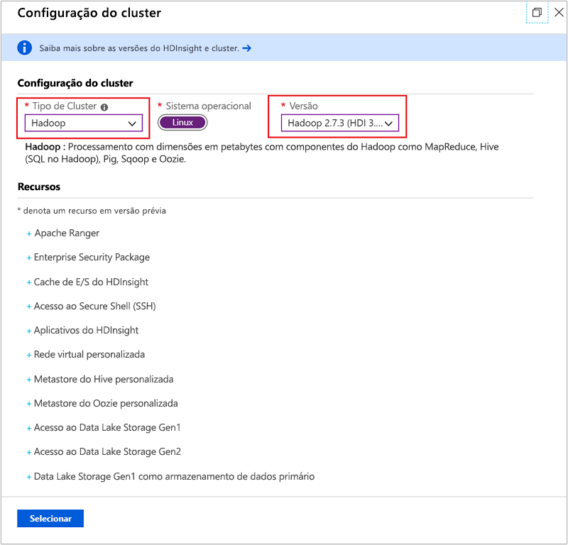
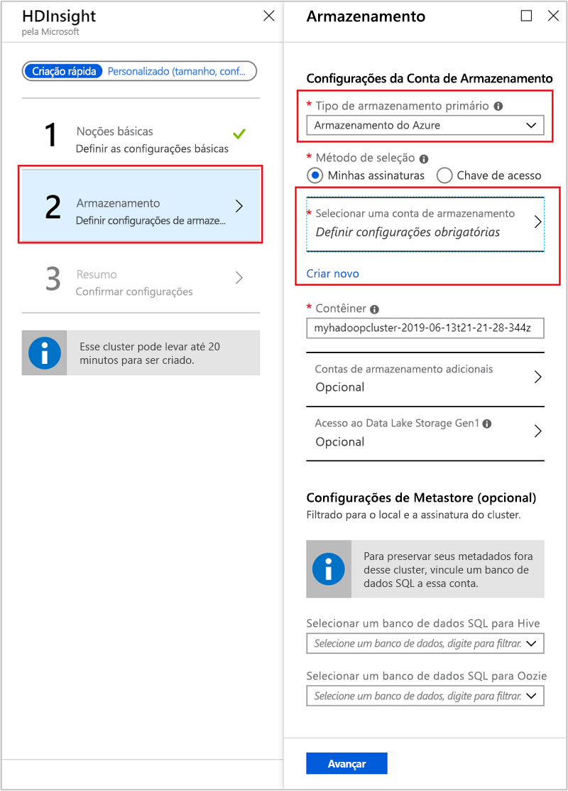
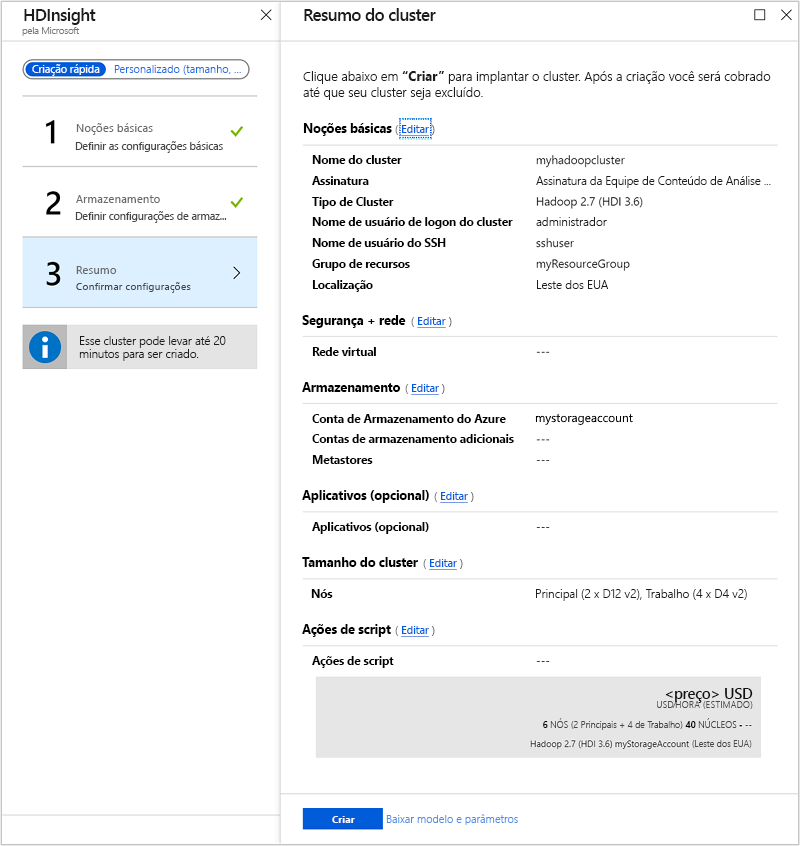
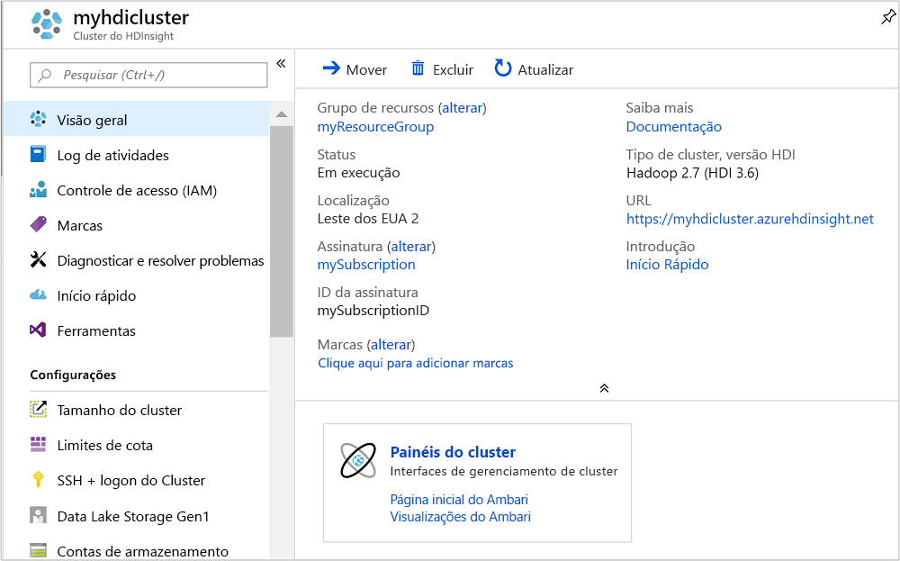

# <a name="quickstart-create-apache-hadoop-cluster-in-azure-hdinsight-using-azure-portal"></a>Início Rápido: Criar cluster do Apache Hadoop no Azure HDInsight usando o portal do Azure

Neste artigo, você aprenderá a criar clusters do [Apache Hadoop](https://hadoop.apache.org/) no HDInsight usando o portal do Azure e, depois, executar trabalhos do Apache Hive no HDInsight. A maioria dos trabalhos de Hadoop consiste em trabalhos em lotes. Criar um cluster, executar alguns trabalhos e excluir o cluster. Neste artigo, você deve executar as três tarefas.

Neste início rápido, você usa o Portal do Azure para criar um cluster Hadoop do HDInsight. Também é possível criar um cluster usando o [modelo do Azure Resource Manager](apache-hadoop-linux-tutorial-get-started.md).

Atualmente, o HDInsight vem com [sete tipos diferentes de cluster](./apache-hadoop-introduction.md#cluster-types-in-hdinsight). Cada tipo de cluster dá suporte a um conjunto diferente de componentes. Todos os tipos de cluster dão suporte ao Hive. Para obter uma lista de componentes com suporte no HDInsight, confira [What's new in the Apache Hadoop cluster versions provided by HDInsight?](../hdinsight-component-versioning.md) (Novidades nas versões de cluster Apache Hadoop fornecidas pelo HDInsight?)  

Se você não tiver uma assinatura do Azure, [crie uma conta gratuita](https://azure.microsoft.com/free/) antes de começar.

## <a name="create-an-apache-hadoop-cluster"></a>Criar um cluster do Apache Hadoop

Nesta seção, você criará um cluster Hadoop no HDInsight usando o portal do Azure.

1. Entre no [Portal do Azure](https://portal.azure.com).

1. No portal do Azure, navegue até **Criar um recurso** > **Análise** > **HDInsight**.

    

1. Em **HDInsight** > **Criação Rápida** > **Básico**, insira ou selecione os seguintes valores:

    |Propriedade  |DESCRIÇÃO  |
    |---------|---------|
    |Nome do cluster   | Insira um nome para o cluster Hadoop. Como todos os clusters no HDInsight compartilham o mesmo namespace DNS esse nome precisa ser exclusivo. O nome pode ter até 59 caracteres incluindo letras, números e hifens. O primeiro e último caracteres do nome não podem ser hifens. |
    |Subscription    |  Selecione sua assinatura do Azure. |
    |Tipo de cluster     | Ignorar isso por enquanto. Forneça essa entrada na próxima etapa deste procedimento.|
    |Nome de usuário e senha de logon do cluster    | O nome padrão de logon é **admin**. A senha deve ter no mínimo 10 caracteres e deve conter pelo menos um dígito, uma letra maiúscula, uma minúscula e um caractere não alfanumérico (exceto os caracteres ' " ` \). **Não forneça** senhas comuns, como "Pass@word1".|
    |Nome de usuário do Secure Shell (SSH) | O nome de usuário padrão é **sshuser**.  Você pode fornecer outro nome para o nome de usuário de SSH. |
    |Usar senha de logon do cluster para SSH| Marque essa caixa de seleção para usar a mesma senha para o usuário SSH que aquela fornecida para o usuário de logon do cluster.|
    |Resource group     | Crie um grupo de recursos ou selecione um grupo de recursos existente.  Um grupo de recursos é um contêiner de componentes do Azure.  Nesse caso, o grupo de recursos contém o cluster HDInsight e a conta de Armazenamento do Azure dependente. |
    |Location    | Selecione um local do Azure no qual você deseja criar o cluster.  Escolha um local mais próximo a você para obter melhor desempenho. |

    

1. Selecione **Tipo de cluster** para abrir a página de **Configuração de cluster** e defina os seguintes valores:

    |Propriedade  |DESCRIÇÃO  |
    |---------|---------|
    |Tipo de cluster     | Selecione **Hadoop** |
    |Versão     | Selecione **Hadoop 2.7.3 (HDI 3.6)**|

    

    Selecione **Selecionar** e **Avançar** para ir até as configurações de armazenamento.

1. Na guia **Armazenamento**, forneça os seguintes valores:

    |Propriedade  |DESCRIÇÃO  |
    |---------|---------|
    |Tipo de armazenamento primário    | Neste artigo, selecione Armazenamento do Azure para usar o Azure Storage Blob como a conta de armazenamento padrão. Também é possível usar o Azure Data Lake Storage como o armazenamento padrão. |
    |Método de seleção     |  Neste artigo, selecione **Minhas assinaturas** para usar uma conta de armazenamento de sua assinatura do Azure. Para usar a conta de armazenamento de outras assinaturas, selecione **Chave de acesso** e, em seguida, forneça a chave de acesso dessa conta. |
    |Selecione uma conta de armazenamento   | Selecione **Selecionar uma conta de armazenamento** para selecionar uma conta de armazenamento existente ou selecione **Conta nova**. Se você criar uma conta, o nome deverá ter entre 3 e 24 caracteres e poderá incluir apenas números e letras minúsculas.|

    Aceite todos os outros valores padrão e selecione **Avançar** para ir até a página de resumo.

    

1. Na guia **Resumo**, verifique os valores que você selecionou nas etapas anteriores.

    

1. Selecione **Criar**. Demora cerca de 20 minutos para criar um cluster.

1. Após a criação do cluster, você verá a página de visão geral do cluster no Portal do Azure.

        

    Cada cluster tem uma dependência na [conta de Armazenamento do Azure](../hdinsight-hadoop-use-blob-storage.md) ou [conta do Azure Data Lake](../hdinsight-hadoop-use-data-lake-store.md). Ela é conhecida como a conta de armazenamento padrão. O cluster HDInsight e sua conta de armazenamento padrão devem estar colocados na mesma região do Azure. A exclusão dos clusters não exclui a conta de armazenamento.

    > [!NOTE]  
    > Para obter outros métodos de criação de cluster e compreender as propriedades usadas neste início rápido, confira [Criar clusters do HDInsight](../hdinsight-hadoop-provision-linux-clusters.md).

## <a name="run-apache-hive-queries"></a>Executar consultas do Apache Hive

[Apache Hive](hdinsight-use-hive.md) é o componente mais popular usado no HDInsight. Há várias maneiras de executar trabalhos do Hive no HDInsight. Neste início rápido, você usará o modo de exibição do Ambari Hive no portal. Para obter outros métodos para enviar trabalhos do Hive, confira [Usar o Hive no HDInsight](hdinsight-use-hive.md).

1. Para abrir o Ambari, na captura de tela anterior, selecione **Painel do Cluster**.  Você também pode navegar até `https://ClusterName.azurehdinsight.net`, em que `ClusterName` é o cluster que você criou na seção anterior.

    

2. Insira o nome de usuário e a senha do Hadoop que você especificou durante a criação do cluster. O nome de usuário padrão é **admin**.

3. Abra a **Exibição do Hive** , conforme mostrado na seguinte captura de tela:

    

4. Na guia **CONSULTA**, cole as seguintes instruções HiveQL na planilha:

    ```sql
    SHOW TABLES;
    ```

    

5. Selecione **Executar**. Uma guia **RESULTADOS** aparece abaixo da guia **CONSULTA** e exibe informações sobre o trabalho. 

    Após a conclusão da consulta, a guia **CONSULTA** exibirá os resultados da operação. Você deverá ver uma tabela chamada **hivesampletable**. Essa tabela do Hive de exemplo é fornecida com todos os clusters HDInsight.

    

6. Repita as etapas 4 e 5 para executar a seguinte consulta:

    ```sql
    SELECT * FROM hivesampletable;
    ```

7. Você também pode salvar os resultados da consulta. Selecione o botão de menu à direita e especifique se deseja baixar os resultados como um arquivo CSV ou armazená-los na conta de armazenamento associada ao cluster.

    

Depois de concluir um trabalho do Hive, você pode [exportar os resultados para o banco de dados SQL do Azure ou do SQL Server](apache-hadoop-use-sqoop-mac-linux.md). Também pode [visualizar os resultados usando o Excel](apache-hadoop-connect-excel-power-query.md). Para obter mais informações sobre como usar o Hive no HDInsight, confira [Use Apache Hive and HiveQL with Apache Hadoop in HDInsight to analyze a sample Apache log4j file](hdinsight-use-hive.md) (Usar o Apache Hive e o HiveQL com o Apache Hadoop no HDInsight para analisar um arquivo log4j do Apache de exemplo).

## <a name="clean-up-resources"></a>Limpar recursos

Após concluir o início rápido, poderá ser conveniente excluir o cluster. Com o HDInsight, seus dados são armazenados no Armazenamento do Azure, assim você poderá excluir, com segurança, um cluster quando ele não estiver em uso. Você também é cobrado por um cluster HDInsight, mesmo quando ele não está em uso. Como os encargos para o cluster são muitas vezes maiores do que os encargos para armazenamento, faz sentido, do ponto de vista econômico, excluir os clusters quando não estiverem em uso.

> [!NOTE]  
> Se você for prosseguir *imediatamente* para o próximo artigo a fim de saber como executar operações de ETL usando Hadoop no HDInsight, convém manter o cluster em execução. Isso porque, no tutorial, você precisará criar um cluster Hadoop novamente. No entanto, se você não for conferir o próximo artigo imediatamente, exclua o cluster agora.

### <a name="to-delete-the-cluster-andor-the-default-storage-account"></a>Para excluir o cluster e/ou a conta de armazenamento padrão

1. Volte para a guia do navegador onde você tem o portal do Azure. Você deve estar na página de visão geral do cluster. Se você quiser apenas excluir o cluster, mas manter a conta de armazenamento padrão, selecione **Excluir**.

    

2. Se você quiser excluir o cluster, bem como a conta de armazenamento padrão, selecione o nome do grupo de recursos (realçado na captura de tela anterior) para abrir a página do grupo de recursos.

3. Selecione **Excluir grupo de recursos** para excluir o grupo de recursos, que contém o cluster e a conta de armazenamento padrão. Observe que a exclusão do grupo de recursos exclui a conta de armazenamento. Para manter a conta de armazenamento, exclua apenas o cluster.

## <a name="next-steps"></a>Próximas etapas

Neste início rápido, você aprendeu a criar um cluster HDInsight baseado em Linux usando um modelo do Resource Manager e a executar consultas básicas do Hive. No próximo artigo, saiba como executar uma operação de ETL (extração, transformação e carregamento) usando o Hadoop no HDInsight.

> [!div class="nextstepaction"]
>[Extrair, transformar e carregar dados usando a Consulta Interativa no HDInsight](../interactive-query/interactive-query-tutorial-analyze-flight-data.md)
