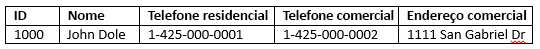
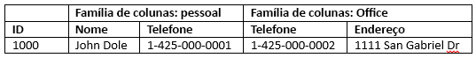

# <a name="quickstart-query-apache-hbase-in-azure-hdinsight-with-hbase-shell"></a>Início Rápido: Consulta Apache HBase no Azure HDInsight com o Shell do HBase

Neste início rápido, você aprenderá a usar o Shell do Apache HBase para criar uma tabela do HBase, inserir dados e, em seguida, consultar a tabela.

Se você não tiver uma assinatura do Azure, crie uma [conta gratuita](https://azure.microsoft.com/free/?WT.mc_id=A261C142F) antes de começar.

## <a name="prerequisites"></a>Pré-requisitos

* Um cluster do Apache HBase. Confira [Criar cluster](../hadoop/apache-hadoop-linux-tutorial-get-started.md#create-cluster) para criar um cluster HDInsight.  Escolha o tipo de cluster **HBase**.

* Um cliente SSH. Para saber mais, confira [Conectar-se ao HDInsight (Apache Hadoop) usando SSH](../hdinsight-hadoop-linux-use-ssh-unix.md).

## <a name="create-a-table-and-manipulate-data"></a>Criar uma tabela e manipular dados

Para a maioria das pessoas, os dados aparecem no formato de tabela:



No HBase (uma implementação do [Cloud BigTable](https://cloud.google.com/bigtable/)), os mesmos dados se parecem com:



Você pode usar o SSH para se conectar aos clusters do HBase e, em seguida, usar o Shell do Apache HBase para criar tabelas do HBase, inserir dados e consultar dados.

1. Use o comando `ssh` para se conectar ao cluster HBase. Edite o comando abaixo substituindo `CLUSTERNAME` pelo nome do cluster e, em seguida, digite o comando:

    ```cmd
    ssh sshuser@CLUSTERNAME-ssh.azurehdinsight.net
    ```

2. Use o comando `hbase shell` para iniciar o shell interativo do HBase. Digite o seguinte comando em sua conexão de SSH:

    ```bash
    hbase shell
    ```

3. Use o comando `create` para criar uma tabela do HBase com famílias de duas colunas. Digite o seguinte comando:

    ```hbase
    create 'Contacts', 'Personal', 'Office'
    ```

4. Use o comando `list` para listar todas as tabelas no HBase. Digite o seguinte comando:

    ```hbase
    list
    ```

5. Use o comando `put` para inserir valores em uma coluna e linha especificadas em uma determinada tabela. Digite o seguinte comando:

    ```hbase
    put 'Contacts', '1000', 'Personal:Name', 'John Dole'
    put 'Contacts', '1000', 'Personal:Phone', '1-425-000-0001'
    put 'Contacts', '1000', 'Office:Phone', '1-425-000-0002'
    put 'Contacts', '1000', 'Office:Address', '1111 San Gabriel Dr.'
    ```

6. Use o comando `scan` para verificar e retornar os dados da tabela `Contacts`. Digite o seguinte comando:

    ```hbase
    scan 'Contacts'
    ```

7. Use o comando `get` para buscar o conteúdo de uma linha. Digite o seguinte comando:

    ```hbase
    get 'Contacts', '1000'
    ```

    Você vê resultados semelhantes usando o comando `scan` porque há apenas uma linha de comando.

8. Use o comando `delete` para excluir um valor de célula na tabela. Digite o seguinte comando:

    ```hbase
    delete 'Contacts', '1000', 'Office:Address'
    ```

9. Use o comando `disable` para desabilitar a tabela. Digite o seguinte comando:

    ```hbase
    disable 'Contacts'
    ```

10. Use o comando `drop` para remover uma tabela do HBase. Digite o seguinte comando:

    ```hbase
    drop 'Contacts'
    ```

11. Use o comando `exit` para interromper o shell interativo do HBase. Digite o seguinte comando:

    ```hbase
    exit
    ```

Para saber mais sobre o esquema da tabela HBase, confira [Introdução ao projeto de esquema do Apache HBase](http://0b4af6cdc2f0c5998459-c0245c5c937c5dedcca3f1764ecc9b2f.r43.cf2.rackcdn.com/9353-login1210_khurana.pdf). Para obter mais comandos HBase, confira [Guia de referência do Apache HBase](https://hbase.apache.org/book.html#quickstart).

## <a name="clean-up-resources"></a>Limpar recursos

Após concluir o início rápido, poderá ser conveniente excluir o cluster. Com o HDInsight, seus dados são armazenados no Armazenamento do Azure, assim você poderá excluir, com segurança, um cluster quando ele não estiver em uso. Você também é cobrado por um cluster HDInsight, mesmo quando ele não está em uso. Como os encargos para o cluster são muitas vezes maiores do que os encargos para armazenamento, faz sentido, do ponto de vista econômico, excluir os clusters quando não estiverem em uso.

Para excluir um cluster, confira [Delete an HDInsight cluster using your browser, PowerShell, or the Azure CLI](../hdinsight-delete-cluster.md) (Excluir um cluster HDInsight usando o navegador, o PowerShell ou a CLI do Azure).

## <a name="next-steps"></a>Próximas etapas

Neste início rápido, você aprendeu como usar o Shell do Apache HBase para criar uma tabela do HBase, inserir dados e, em seguida, consultar a tabela. Para saber mais sobre os dados armazenados no HBase, o próximo artigo mostrará como executar consultas com o Apache Spark.

> [!div class="nextstepaction"]
> [Usar o Apache Spark para ler e gravar dados do Apache HBase](../hdinsight-using-spark-query-hbase.md)