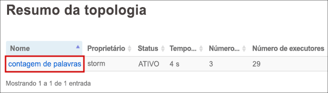
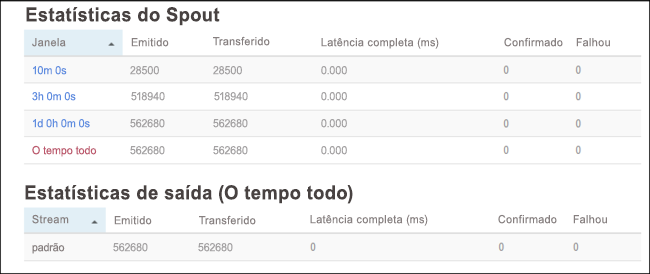

# <a name="quickstart-create-and-monitor-an-apache-storm-topology-in-azure-hdinsight"></a>Início Rápido: Criar e monitorar uma topologia do Apache Storm no Azure HDInsight

O Apache Storm é um sistema de computação escalável, tolerante a falhas, distribuído e em tempo real para o processamento de fluxos de dados. Com o Storm no Azure HDInsight, você pode criar um cluster Storm baseado em nuvem que execute análise de big data em tempo real.

Neste início rápido, você usará um exemplo do projeto [storm-starter](https://github.com/apache/storm/tree/v2.0.0/examples/storm-starter) do Apache para criar e monitorar uma topologia do Apache Storm em um cluster existente do Apache Storm.

## <a name="prerequisites"></a>Pré-requisitos

* Um cluster do Apache Storm no HDInsight. Confira [Criar clusters Apache Hadoop usando o portal do Azure](../hdinsight-hadoop-create-linux-clusters-portal.md) e selecione **Storm** como **Tipo de cluster**.

* Um cliente SSH. Para saber mais, confira [Conectar-se ao HDInsight (Apache Hadoop) usando SSH](../hdinsight-hadoop-linux-use-ssh-unix.md).

## <a name="create-the-topology"></a>Criar a topologia

1. Conectar-se ao seu cluster Storm. Edite o comando abaixo substituindo `CLUSTERNAME` pelo nome do cluster Storm e, em seguida, insira o comando:

    ```cmd
    ssh sshuser@CLUSTERNAME-ssh.azurehdinsight.net
    ```

2. O exemplo **WordCount** está incluído no seu cluster do HDInsight em `/usr/hdp/current/storm-client/contrib/storm-starter/`. Essa topologia gera sentenças aleatórias e conta quantas vezes a palavra ocorre. Use o comando a seguir para iniciar a topologia **wordcount** no cluster:

    ```bash
    storm jar /usr/hdp/current/storm-client/contrib/storm-starter/storm-starter-topologies-*.jar org.apache.storm.starter.WordCountTopology wordcount
    ```

## <a name="monitor-the-topology"></a>Monitorar a topologia

O Storm fornece uma interface Web para trabalhar com as topologias em funcionamento, e é incluída em seu cluster HDInsight.

Use as etapas a seguir para monitorar a topologia usando a interface do usuário do Storm:

1. Para exibir a interface do usuário do Storm, abra um navegador da Web para `https://CLUSTERNAME.azurehdinsight.net/stormui`. Substitua `CLUSTERNAME` pelo nome do cluster.

2. Em **Resumo da Topologia**, selecione a entrada **wordcount** na coluna **Nome**. São exibidas informações sobre a topologia.

    

    A página nova fornece as seguintes informações:

    |Propriedade | DESCRIÇÃO |
    |---|---|
    |Estatísticas de topologia|Informações básicas sobre o desempenho da topologia, organizadas em janelas de tempo. A seleção de uma janela de tempo específica altera a janela de tempo das informações exibidas em outras seções da página.|
    |Spouts|Informações básicas sobre spouts, incluindo o último erro retornado por cada spout.|
    |Bolts|Informações básicas sobre bolts.|
    |Configuração de topologia|Informações detalhadas sobre a configuração da topologia.|
    |Ativar|Retoma o processamento de uma topologia desativada.|
    |Desativar|Pausa uma topologia em execução.|
    |Rebalanceamento|Ajusta o paralelismo da topologia. Você deve reequilibrar topologias em execução depois de alterar o número de nós no cluster. A redistribuição ajusta o paralelismo para compensar o aumento/diminuição do número de nós no cluster. Para saber mais, consulte [Noções básicas sobre o paralelismo de uma topologia do Apache Storm](https://storm.apache.org/documentation/Understanding-the-parallelism-of-a-Storm-topology.html).|
    |Encerrar|Termina uma topologia do Storm após o tempo limite especificado.|

3. Nessa página, selecione uma entrada da seção **Spouts** ou **Bolts**. São exibidas informações sobre o componente selecionado.

    

    A página nova exibe as seguintes informações:

    |Propriedade | DESCRIÇÃO |
    |---|---|
    |Estatísticas de spout/bolt|Informações básicas sobre o desempenho do componente, organizadas em janelas de tempo. A seleção de uma janela de tempo específica altera a janela de tempo das informações exibidas em outras seções da página.|
    |Estatísticas de entrada (somente bolt)|Informações sobre componentes que geram dados consumidos pelo bolt.|
    |Estatísticas de saída|Informações sobre dados emitidos por este bolt.|
    |Executores|Informações sobre instâncias deste componente.|
    |Errors|Erros produzidos por este componente.|

4. Ao exibir os detalhes de um spout ou bolt, selecione uma entrada da coluna **Porta** na seção **Executores** para exibir detalhes de uma instância específica do componente.

        2015-01-27 14:18:02 b.s.d.task [INFO] Emitting: split default ["with"]
        2015-01-27 14:18:02 b.s.d.task [INFO] Emitting: split default ["nature"]
        2015-01-27 14:18:02 b.s.d.executor [INFO] Processing received message source: split:21, stream: default, id: {}, [snow]
        2015-01-27 14:18:02 b.s.d.task [INFO] Emitting: count default [snow, 747293]
        2015-01-27 14:18:02 b.s.d.executor [INFO] Processing received message source: split:21, stream: default, id: {}, [white]
        2015-01-27 14:18:02 b.s.d.task [INFO] Emitting: count default [white, 747293]
        2015-01-27 14:18:02 b.s.d.executor [INFO] Processing received message source: split:21, stream: default, id: {}, [seven]
        2015-01-27 14:18:02 b.s.d.task [INFO] Emitting: count default [seven, 1493957]

    Neste exemplo, a palavra **sete** ocorreu 1493957 vezes. Essa contagem é a quantidade de vezes que a palavra foi encontrada desde que a topologia foi iniciada.

## <a name="stop-the-topology"></a>Parar a topologia

Volte para a página **Resumo da topologia** para a topologia de contagem de palavras e, em seguida, selecione o botão **Eliminar** da seção **Ações de topologia**. Quando solicitado, insira 10 para os segundos a aguardar antes da interrupção da topologia. Após o período de tempo limite, a topologia não será mais exibida quando você visitar a seção **Interface do usuário do Storm** do painel.

## <a name="clean-up-resources"></a>Limpar recursos

Após concluir o início rápido, poderá ser conveniente excluir o cluster. Com o HDInsight, seus dados são armazenados no Armazenamento do Azure, assim você poderá excluir, com segurança, um cluster quando ele não estiver em uso. Você também é cobrado por um cluster HDInsight, mesmo quando ele não está em uso. Como os encargos para o cluster são muitas vezes maiores do que os encargos para armazenamento, faz sentido, do ponto de vista econômico, excluir os clusters quando não estiverem em uso.

Para excluir um cluster, confira [Delete an HDInsight cluster using your browser, PowerShell, or the Azure CLI](../hdinsight-delete-cluster.md) (Excluir um cluster HDInsight usando o navegador, o PowerShell ou a CLI do Azure).

## <a name="next-steps"></a>Próximas etapas

Neste início rápido, você usará um exemplo do projeto [storm-starter](https://github.com/apache/storm/tree/v2.0.0/examples/storm-starter) do Apache para criar e monitorar uma topologia do Apache Storm em um cluster existente do Apache Storm. Avance para o próximo artigo e conheça as noções básicas de gerenciamento e monitoramento de topologias do Apache Storm.

> [!div class="nextstepaction"]
>[Implantar e gerenciar topologias do Apache Storm no Azure HDInsight](./apache-storm-deploy-monitor-topology-linux.md)