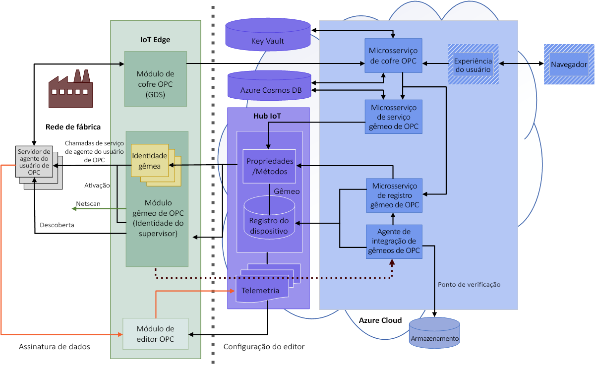

# Arquitetura do OPC Vault

Este artigo fornece uma visão geral sobre o **microsserviço do Cofre OPC** e o **módulo de IoT Edge do Cofre OPC**.

## Visão geral

Os aplicativos OPC UA usam Certificados de Instância de Aplicativo para fornecer segurança de nível de aplicativo. Uma conexão segura é estabelecida usando a Criptografia Assimétrica, para a qual os certificados do aplicativo oferecem o par de chaves públicas e privadas. Os certificados podem ser autoassinados ou assinados por uma AC (Autoridade de Certificação).

Um aplicativo OPC UA tem uma lista de certificados confiáveis que representam os aplicativos nos quais ele confia. Esses certificados podem ser autoassinados, assinados por uma AC ou podem ser Root-CA ou Sub-CA. Se um certificado confiável fizer parte de uma cadeia de certificados maior, o aplicativo confiará em todos os certificados que se encadeiam ao certificado na lista de confiança, desde que a cadeia de certificados completa possa ser validada.

A principal diferença entre confiar em certificados autoassinados e confiar em um Certificado de Autoridade de Certificação é o esforço de instalação necessário para implantar e manter a confiança e o esforço adicional para hospedar uma AC específica da empresa. 

Para distribuir confiança para certificados autoassinados para n Servidores com um aplicativo cliente único, todos os n Certificados de Aplicativo para Servidores precisam ser instalados na lista de confiança do Aplicativo Cliente e o Certificado do Aplicativo Cliente deve ser instalado em todas as listas de confiança do Aplicativo para Servidores. Esse esforço administrativo sobrecarrega bastante e aumenta ainda mais quando os tempos de vida de certificados precisam ser considerados e os certificados são renovados.

O uso de uma AC específica da empresa pode simplificar bastante o gerenciamento de confiança com vários Servidores e Clientes. Nesse caso, o administrador gera um certificado de Instância de Aplicativo assinado pela AC uma vez para cada Cliente e Servidor usado. Além disso, o Certificado de Autoridade de Certificação é instalado em cada Lista de confiança de aplicativos, em todos os servidores e clientes. Com essa abordagem, apenas os certificados expirados precisam ser renovados e substituídos para os aplicativos afetados.

O Serviço de Gerenciamento de Certificado do OPC UA do Azure IoT Industrial é nossa solução para gerenciar uma AC específica da empresa para aplicativos do OPC UA baseada no microsserviço do Cofre OPC.

O Cofre OPC oferece um microsserviço para hospedar uma AC específica da empresa em uma nuvem segura, apoiada pelos serviços protegidos do Azure AD com o Azure Key Vault com Módulos de Segurança de Hardware, Cosmos DB e, opcionalmente, também o Hub IoT como repositório de aplicativos.

O microsserviço do Cofre OPC foi criado para dar suporte ao fluxo de trabalho baseado em função, em que a OT pessoal solicita certificados de aplicativo assinados e os administradores de segurança e aprovadores com direitos de assinatura no Azure Key Vault aprovam ou rejeitam essas solicitações.

Para compatibilidade com soluções OT baseadas em OPC UA GDS, os serviços incluem suporte para um módulo de borda apoiado pelo microsserviço do Cofre OPC, que implementa a interface de *Gerenciamento de Certificado e Servidor de Descoberta Global do OPC UA* para distribuir certificados e listas de confiança de acordo com a Parte 12 da especificação. No entanto, com base em nosso conhecimento, essa interface do servidor GDS ainda não é amplamente usada e ainda tem funcionalidade limitada (função Leitor). [Sob demanda, melhoraremos a experiência na solicitação do cliente (*)](#yet-unsupported-features).

## Arquitetura

A arquitetura é baseada no microsserviço do Cofre OPC com um módulo do IoT Edge do Cofre OPC para a rede de fábrica e um UX de exemplo da Web para controlar o fluxo de trabalho:

## Microsserviço do Cofre OPC

O microsserviço do Cofre OPC é composto pelas seguintes interfaces para implementar o fluxo de trabalho para distribuir e gerenciar uma AC específica da empresa para Aplicativos OPC UA:

### Aplicativo 
- Um "Aplicativo OPC UA" pode ser um servidor ou um cliente ou ambos. O Cofre OPC funciona, nesse caso, como uma autoridade de registro de aplicativo. 
- Ao lado das operações básicas para registrar, atualizar e cancelar o registro de aplicativos, também há interfaces para localizar e consultar aplicativos com expressões de pesquisa. 
- As solicitações de certificado precisam referenciar um aplicativo válido para processar uma solicitação e emitir um certificado assinado com todas as extensões específicas do OPC UA. 
- O serviço de aplicativo é apoiado por um banco de dados CosmosDB ou pelo [Registro do dispositivo OpcTwin(*)](#yet-unsupported-features), dependendo da configuração do cliente.

### Grupo de certificados
- Um grupo de certificados é uma entidade, que armazena uma AC raiz ou um certificado de sub AC, incluindo a chave privada para assinar certificados. 
- O comprimento da chave RSA, o comprimento do hash SHA-2 e o tempo de vida podem ser configurados pela AC Emissora e por certificados de aplicativo assinados. 
- Vários grupos podem ser hospedados em um único serviço para permitir extensões futuras com grupos de certificados HTTPS, de usuário ou de algoritmo ECC [(*)](#yet-unsupported-features). 
- Os certificados de AC são armazenados no Azure Key Vault apoiados por HSM (Módulos de Segurança de Hardware) FIPS 140-2 Nível 2. A chave privada nunca deixa o armazenamento seguro, porque a assinatura é realizada por uma operação de Key Vault protegida pelo AzureAD. 
- Os certificados de AC podem ser renovados ao longo do tempo e ainda permanecem no armazenamento seguro devido ao histórico do Key Vault. 
- A lista de revogação para cada Certificado de Autoridade de Certificação também é armazenada no Key Vault como um segredo. Depois que um aplicativo tem o registro cancelado, o certificado do aplicativo também é revogado na CRL por um administrador.
- Há suporte para a revogação de certificado único e em lote.

### Solicitação de certificado
Uma solicitação de certificado implementa o fluxo de trabalho para gerar um novo par de chaves ou um certificado assinado usando uma CSR (“Solicitação de Assinatura de Certificado”) de um Aplicativo OPC UA. 
- A solicitação é armazenada em um banco de dados com informações complementares, como o Assunto ou uma CSR e uma referência ao Aplicativo OPC UA. 
- A lógica de negócios no serviço valida a solicitação em relação às informações armazenadas no banco de dados do aplicativo. Por exemplo, o URI do aplicativo no banco de dados deve corresponder ao URI do aplicativo na CSR.
- Um administrador de segurança com direitos de assinatura (função de aprovador) aprova ou rejeita a solicitação. Se a solicitação for aprovada, um novo par de chaves e/ou um certificado assinado serão gerados. A nova chave privada é armazenada com segurança no KeyVault enquanto o novo certificado público assinado é armazenado no banco de dados da Solicitação de Certificado.
- O solicitante pode sondar o status da solicitação até que ela seja aprovada ou revogada. Se a solicitação tiver sido aprovada, a chave privada e o certificado poderão ser baixados e instalados no repositório de certificados do aplicativo OPC UA.
- Agora o solicitante pode aceitar a solicitação para excluir informações desnecessárias do banco de dados de solicitação. 

Durante o tempo de vida de um certificado assinado, um aplicativo pode ser excluído ou uma chave pode ficar comprometida. Nesse caso, um gerenciador de AC pode:
- Excluir um aplicativo, que, ao mesmo tempo, exclui também todas as solicitações de certificado pendentes e aprovadas do aplicativo. 
- Outra opção será excluir apenas uma única solicitação de certificado se apenas uma chave for renovada ou estiver comprometida.
- Agora as solicitações de certificado Aprovadas e Aceitas comprometidas são marcadas como excluídas.
- Um gerente pode executar regularmente uma renovação da CRL da AC do Emissor. No momento da renovação, todas as solicitações de certificado excluídas são revogadas e os números de série do certificado são adicionados à lista de revogação de CRL. As solicitações de certificado revogadas são marcadas como revogadas.
- Em eventos urgentes, solicitações de certificado únicas podem ser revogadas também.
- Por fim, as CRLs atualizadas estão disponíveis para distribuição para os clientes e servidores do OPC UA participantes.

Para saber mais sobre a API de microsserviço do Cofre OPC, confira a documentação do Swagger do microsserviço.

## Módulo do IoT Edge do Cofre OPC
Para dar suporte a um Servidor de Descoberta Global de rede de fábrica, o módulo do Cofre OPC pode ser implantado na borda, executado como um aplicativo .Net Core local ou pode ser iniciado em um contêiner do Docker. Devido à falta de suporte à autenticação Auth2 na pilha atual do .Net Standard do OPC UA, a funcionalidade do módulo de borda do Cofre OPC está limitada a uma função de Leitor, porque um usuário não pode ser representado do módulo de borda até o microsserviço usando a interface padrão GDS do OPC UA. Somente as operações, que não exigem a função Gravador, Administrador ou Aprovador, são permitidas neste ponto[(*)](#yet-unsupported-features). 

## Recursos ainda sem suporte

**(*)** ainda não há suporte.

## Próximas etapas

Agora que você aprendeu sobre a arquitetura do Cofre OPC, veja a próxima etapa sugerida:

> [!div class="nextstepaction"]
> [Criar e implantar o Cofre OPC](howto-opc-vault-deploy.md)
