# Fazer um tour pela interface do usuário do Azure IoT Central (versão prévia dos recursos)

[!INCLUDE [iot-central-pnp-original](../../includes/iot-central-pnp-original-note.md)]

Este artigo apresenta a interface do usuário do Microsoft Azure IoT Central. Você pode usar a interface do usuário para criar, gerenciar e usar uma solução do Azure IoT Central e seus dispositivos conectados.

Como um _construtor_, use a interface do usuário do Azure IoT Central para definir sua solução o Azure IoT Central. Você pode usar a interface do usuário para:

* Definir os tipos de dispositivos que se conectam à sua solução.
* Configurar as regras e ações para seus dispositivos.
* Personalizar a interface do usuário para um _operador_ que usa sua solução.

Como um _operador_, você pode usar a interface do usuário do Azure IoT Central para gerenciar sua solução do Azure IoT Central. Você pode usar a interface do usuário para:

* Monitorar seus dispositivos.
* Configurar seus dispositivos.
* Solucionar e corrigir problemas com dispositivos.
* Provisione novos dispositivos.

## Use o menu de navegação à esquerda

Use o menu de navegação à esquerda para acessar as diferentes áreas do aplicativo. Você pode expandir ou recolher a barra de navegação, selecionando **<** ou **>** :

:::row:::
  :::column span="":::
      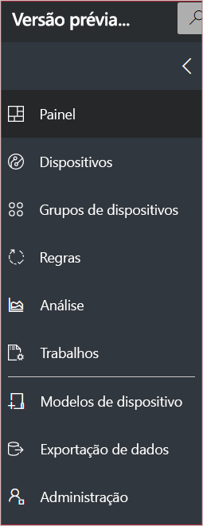
  :::column-end:::
  :::column span="2":::
     **Painel** exibe o painel de seu aplicativo. Como um construtor, você pode personalizar o painel para seus operadores. Os usuários também podem criar seus próprios painéis.
     
     **Dispositivos** lista os dispositivos simulados e reais associados a cada modelo de dispositivo no aplicativo. Como um operador, use o **Device Explorer** para gerenciar os dispositivos conectados.

     **Grupos de dispositivos** permite exibir e criar grupos de dispositivos. Como operador, você pode criar grupos de dispositivos como uma coleção lógica de dispositivos especificados por uma consulta.

     **Regras** permite que você edite regras que são acionadas com base na telemetria do dispositivo e disparam ações personalizáveis.

     **Análise** mostra a análise derivada da telemetria do dispositivo para dispositivos e grupos de dispositivos. Como um operador, você pode criar exibições personalizadas sobre dados do dispositivo para derivar insights de seu aplicativo.

     **Trabalhos** habilita o gerenciamento de dispositivo em massa fazendo você criar e executar trabalhos para atualizar os dispositivos em escala.

     **Modelos de dispositivo** mostra as ferramentas usadas por um construtor para criar e gerenciar modelos de dispositivo.

     **Exportação de dados** permite que um administrador configure uma exportação contínua para outros serviços do Azure, como armazenamento e filas.

     **Administração** mostra as páginas de administração do aplicativo em que um administrador pode gerenciar as configurações de aplicativo, usuários e funções.
   :::column-end:::
:::row-end:::

## Pesquisa, ajuda e suporte

O menu superior aparece em cada página:

* Para procurar dispositivos e modelos de dispositivo, insira um valor **Pesquisar**.
* Para alterar o idioma da interface do usuário ou o tema, escolha o ícone **Configurações**.
* Para sair do aplicativo, escolha o ícone **Conta**.
* Para obter ajuda e suporte, escolha o menu suspenso da **Ajuda** para ver uma lista de recursos. Em um aplicativo de avaliação, os recursos de suporte incluem o acesso ao [chat ao vivo](howto-show-hide-chat.md?toc=/azure/iot-central-pnp/toc.json&bc=/azure/iot-central-pnp/breadcrumb/toc.json).

Você pode escolher entre um tema claro ou escuro para a interface do usuário:

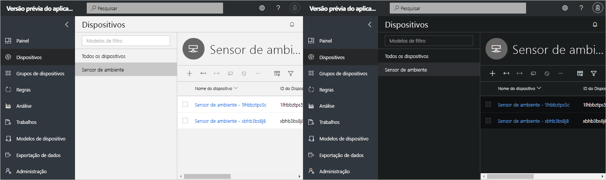

> [!NOTE]
> A opção de escolher entre os temas claro e escuro não estará disponível se o administrador tiver configurado um tema personalizado para o aplicativo.

## painel

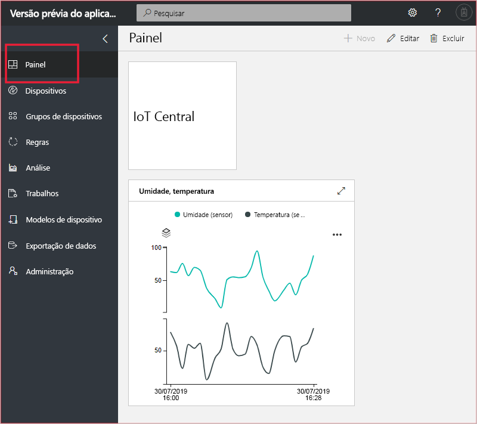

* O painel é a primeira página que você vê quando entra no seu aplicativo do Azure IoT Central. Como um construtor, você pode adicionar blocos para personalizar o painel de outros usuários do aplicativo. Para saber mais, confira o tutorial [Configurar um modelo de dispositivo](tutorial-define-device-type-pnp.md?toc=/azure/iot-central-pnp/toc.json&bc=/azure/iot-central-pnp/breadcrumb/toc.json).

* Como operador, você pode criar painéis personalizados e alternar entre eles e o painel padrão. Saiba mais no artigo de instruções [Criar e gerenciar painéis pessoais](howto-personalize-dashboard.md?toc=/azure/iot-central-pnp/toc.json&bc=/azure/iot-central-pnp/breadcrumb/toc.json).

## Dispositivos

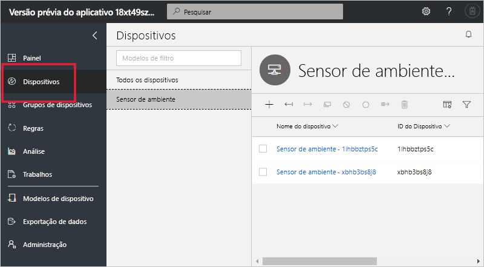

A página Explorer mostra os _dispositivos_ no aplicativo do Azure IoT Central agrupados por _modelo de dispositivo_.

* Um modelo do dispositivo define um tipo de dispositivo que pode se conectar ao seu aplicativo. Para saber mais, consulte [Definir um novo tipo de dispositivo em seu aplicativo do Azure IoT Central](tutorial-define-device-type-pnp.md?toc=/azure/iot-central-pnp/toc.json&bc=/azure/iot-central-pnp/breadcrumb/toc.json).
* Um dispositivo representa um dispositivo real ou simulado no seu aplicativo. Para saber mais, consulte [Adicionar um novo dispositivo ao seu aplicativo do Azure IoT Central](tutorial-add-device-pnp.md?toc=/azure/iot-central-pnp/toc.json&bc=/azure/iot-central-pnp/breadcrumb/toc.json).

## Grupos de dispositivos

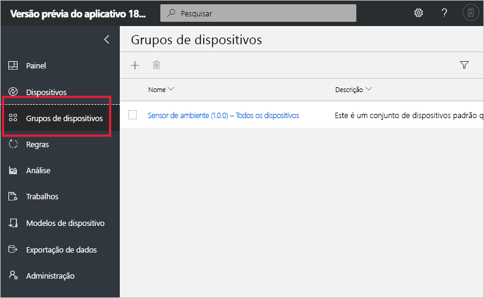

A página _Grupos de dispositivos_ mostra os grupos de dispositivos criados pelo construtor. Um grupo de dispositivos é uma coleção de dispositivos relacionados. Um construtor define uma consulta para identificar os dispositivos que estão incluídos em um grupo de dispositivos. Use grupos de dispositivos ao personalizar a análise no aplicativo. Para saber mais, confira o artigo [Usar grupos de dispositivos no aplicativo do Azure IoT Central](howto-use-device-groups-pnp.md?toc=/azure/iot-central-pnp/toc.json&bc=/azure/iot-central-pnp/breadcrumb/toc.json).

## Regras

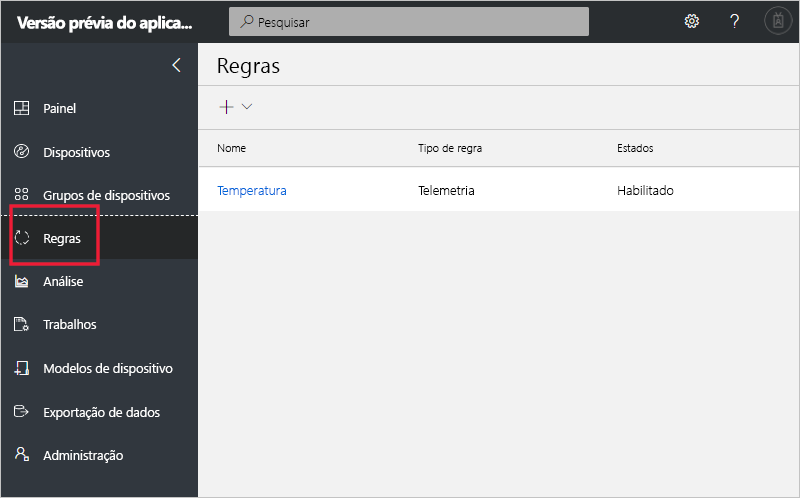

A página Regras permite definir regras com base na telemetria, no estado do dispositivo ou nos eventos do dispositivo. Quando uma regra é acionada, ela pode disparar uma ação como o envio um email para um operador. O construtor usa essa página para criar e gerenciar regras. Para obter mais informações, confira o tutorial [Configurar regras e ações para seus dispositivos no Azure IoT Central](tutorial-configure-rules-pnp.md?toc=/azure/iot-central-pnp/toc.json&bc=/azure/iot-central-pnp/breadcrumb/toc.json).

## Análise

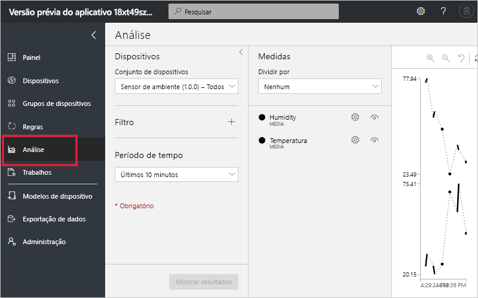

A página Análise mostra gráficos que ajudam você a entender como os dispositivos conectados ao seu aplicativo estão se comportando. Um operador usa essa página para monitorar e investigar problemas com dispositivos conectados. O construtor pode definir os gráficos mostrados nessa página. Para saber mais, consulte o artigo [Criar análises personalizadas para seu aplicativo do Azure IoT Central](howto-use-device-groups-pnp.md?toc=/azure/iot-central-pnp/toc.json&bc=/azure/iot-central-pnp/breadcrumb/toc.json).

## Trabalhos

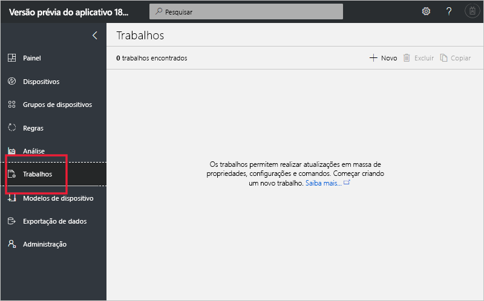

A página Trabalhos permite que você execute operações de gerenciamento de dispositivo em massa em seus dispositivos. O construtor usa essa página para atualizar propriedades do dispositivo, configurações e comandos. Para saber mais, consulte o artigo [Executar um trabalho](howto-run-a-job.md?toc=/azure/iot-central-pnp/toc.json&bc=/azure/iot-central-pnp/breadcrumb/toc.json).

## Modelos de dispositivo

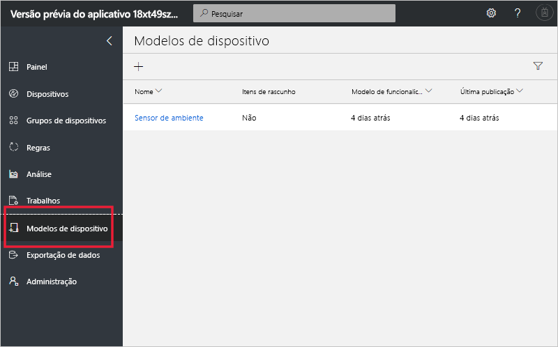

A página Modelos de Dispositivo é o local em que um construtor cria e gerencia os modelos de dispositivo no aplicativo. Um modelo de dispositivo especifica as características do dispositivo, como:

* medidas de telemetria, estado e evento.
* Propriedades.
* comandos.

O construtor também pode criar formulários e painéis para uso dos operadores no gerenciamento de dispositivo.

Para saber mais, consulte o tutorial [Definir um novo tipo de dispositivo em seu aplicativo do Azure IoT Central](tutorial-define-device-type-pnp.md?toc=/azure/iot-central-pnp/toc.json&bc=/azure/iot-central-pnp/breadcrumb/toc.json).

## Exportação de dados

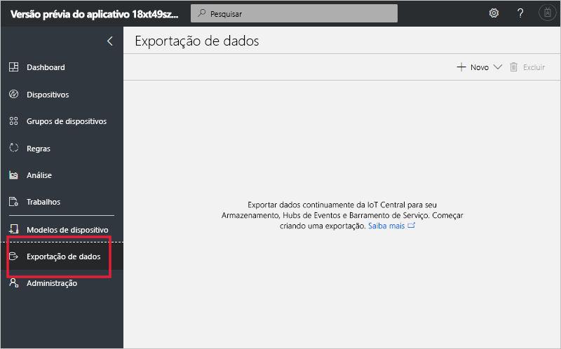

A página Exportação de dados é o local em que um administrador define como transmitir dados, como telemetria, do aplicativo. Outros serviços podem armazenar os dados exportados ou usá-los para análise. Para saber mais, confira o artigo [Exportar seus dados no Azure IoT Central](howto-export-data.md?toc=/azure/iot-central-pnp/toc.json&bc=/azure/iot-central-pnp/breadcrumb/toc.json).

## Administração

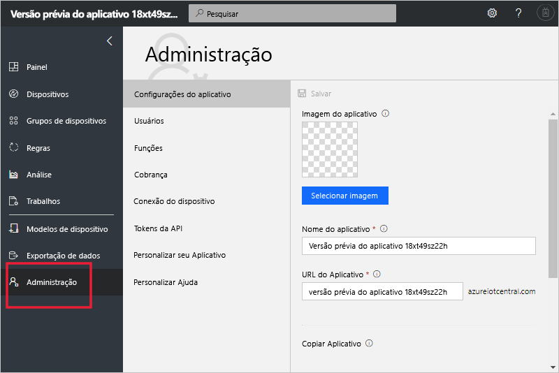

A página de administração contém links para as ferramentas usadas por um administrador para definir usuários e funções no aplicativo e personalizar a interface do usuário. Para saber mais, consulte o artigo [Administrar seu aplicativo do Azure IoT Central](howto-administer-pnp.md?toc=/azure/iot-central-pnp/toc.json&bc=/azure/iot-central-pnp/breadcrumb/toc.json).

## Próximas etapas

Agora que você tem uma visão geral do Azure IoT Central e está familiarizado com o layout da interface do usuário, a próxima etapa sugerida é concluir o início rápido [Criar um aplicativo do Azure IoT Central](quick-deploy-iot-central-pnp.md?toc=/azure/iot-central-pnp/toc.json&bc=/azure/iot-central-pnp/breadcrumb/toc.json).
