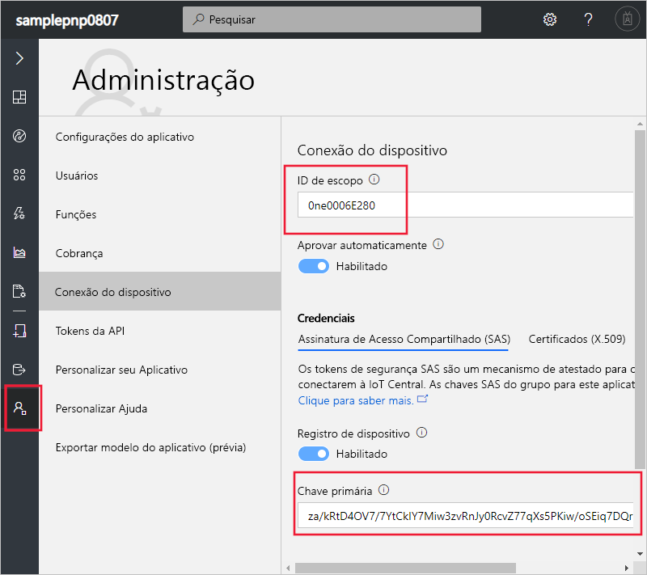
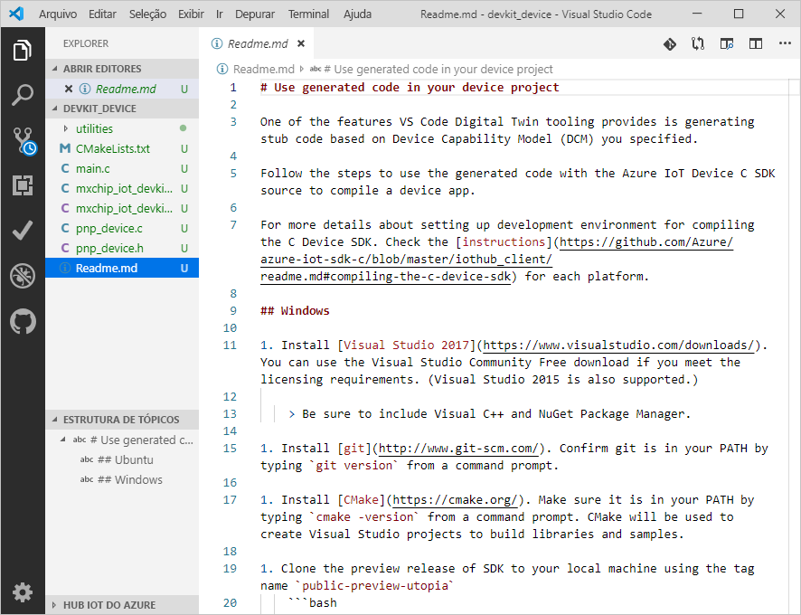
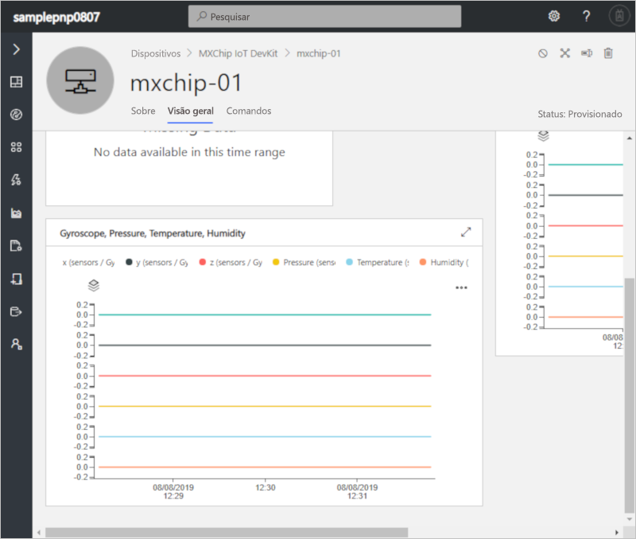
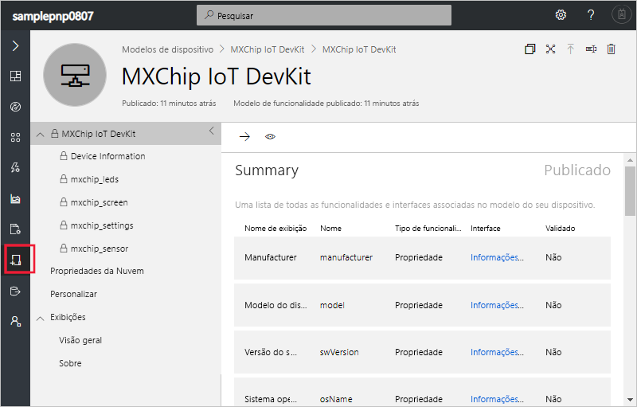

# <a name="quickstart-use-a-device-capability-model-to-create-an-iot-plug-and-play-device-and-connect-it-to-your-iot-central-application"></a>Início Rápido: Usar um modelo de funcionalidade do dispositivo para criar um dispositivo IoT Plug and Play e conectá-lo ao aplicativo do IoT Central

[!INCLUDE [iot-central-pnp-original](../../includes/iot-central-pnp-original-note.md)]

Um DCM _(modelo de funcionalidade do dispositivo)_ descreve as funcionalidades de um dispositivo [IoT Plug and Play](../iot-pnp/overview-iot-plug-and-play.md). O IoT Central pode usar um DCM para criar um modelo de dispositivo e visualizações para um dispositivo quando o dispositivo se conecta pela primeira vez. Este guia de início rápido mostra como:

* Use o Visual Studio Code para criar um dispositivo IoT Plug and Play usando um DCM.
* Execute o código do dispositivo no Windows e veja ele se conectar ao aplicativo do IoT Central.
* Exiba a telemetria simulada enviada pelo dispositivo.

## <a name="prerequisites"></a>Pré-requisitos

Conclua o início rápido [Criar um aplicativo do Azure IoT Central (versão prévia dos recursos)](./quick-deploy-iot-central-pnp.md?toc=/azure/iot-central-pnp/toc.json&bc=/azure/iot-central-pnp/breadcrumb/toc.json) para criar um aplicativo do IoT Central usando o modelo de **aplicativo de Versão Prévia**.

Para concluir este início rápido, você precisa instalar o seguinte software no computador local:

* [Visual Studio (Community, Professional ou Enterprise)](https://visualstudio.microsoft.com/downloads/) – inclua o componente **Gerenciador de pacotes NuGet** e a carga de trabalho **Desenvolvimento para desktop com C++** ao instalar o Visual Studio.
* [Git](https://git-scm.com/download/).
* [CMake](https://cmake.org/download/) – ao instalar o **CMake**, selecione a opção **Adicionar o CMake ao CAMINHO do sistema**.
* [Visual Studio Code](https://code.visualstudio.com/).
* [Node.js](https://nodejs.org/)
* O utilitário `dps-keygen`:

    ```cmd/sh
    npm i -g dps-keygen
    ```

### <a name="install-azure-iot-device-workbench"></a>Instalar o Azure IoT Device Workbench

Use as seguintes etapas para instalar a extensão Azure IoT Device Workbench no VS Code:

1. No VS Code, selecione a guia **Extensões**.
1. Pesquise **Azure IoT Device Workbench**.
1. Selecione **Instalar**.

## <a name="prepare-the-development-environment"></a>Preparar o ambiente de desenvolvimento

### <a name="get-azure-iot-device-sdk-for-c"></a>Obter o SDK do dispositivo IoT do Azure para C

Prepare um ambiente de desenvolvimento que você possa usar para criar o SDK do dispositivo IoT do Azure para C.

1. Abra um prompt de comando. Execute o seguinte comando para clonar o repositório do GitHub [SDK de C do IoT do Azure](https://github.com/Azure/azure-iot-sdk-c):

    ```cmd/sh
    git clone https://github.com/Azure/azure-iot-sdk-c --recursive -b public-preview
    ```

    Essa operação deve demorar alguns minutos.

1. Crie uma pasta `central_app` na raiz do clone local do repositório. Você usará essa pasta para os arquivos de modelo de dispositivo e o stub do código do dispositivo.

    ```cmd/sh
    cd azure-iot-sdk-c
    mkdir central_app
    ```

## <a name="generate-device-key"></a>Gerar uma chave do dispositivo

Para conectar um dispositivo a um aplicativo do IoT Central, é necessário ter uma chave de dispositivo. Para gerar uma chave de dispositivo:

1. Entre no aplicativo do IoT Central criado no início rápido anterior.

1. Acesse a página **Administração** e selecione **Conexão do Dispositivo**.

1. Anote a **ID do Escopo** e a **Chave Primária**. Você usará esses valores posteriormente neste início rápido.

    

1. Abra um prompt de comando e execute o seguinte comando para gerar uma chave de dispositivo:

    ```cmd/sh
    dps-keygen  -di:mxchip-01 -mk:{Primary Key from previous step}
    ```

    Anote a _chave do dispositivo_ gerada, você usará esse valor em uma etapa posterior neste início rápido.

## <a name="download-your-model"></a>Baixar o modelo

Neste início rápido, você usará o DCM público para um dispositivo MxChip IoT DevKit. Você não precisa de um dispositivo DevKit real para executar o código; neste início rápido, você compilará o código para ser executado no Windows.

1. Abra a pasta `azure-iot-sdk-c\central_app` com o VS Code.

1. Use **Ctrl+Shift+P** para abrir a paleta de comandos, insira **IoT Plug and Play** e selecione **Abrir Repositório de Modelos**. Selecione **Repositório público**. O VS Code mostra uma lista de DCMs no repositório de modelos públicos.

1. Selecione o DCM **MXChip IoT DevKit** com a ID `urn:mxchip:mxchip_iot_devkit:1`. Em seguida, selecione **Baixar**. Agora você tem uma cópia do DCM na pasta `central_app`.


> [!NOTE]
> Para trabalhar com o IoT Central, o modelo de funcionalidade do dispositivo precisa ter todas as interfaces definidas embutidas no mesmo arquivo.

## <a name="generate-the-c-code-stub"></a>Gerar o stub do código C

Agora que você tem o DCM **MXChip IoT DevKit** e suas interfaces associadas, gere o código do dispositivo que implementa o modelo. Para gerar o stub do código C no VS Code:

1. Com a pasta que contém os arquivos DCM aberta, use **Ctrl+Shift+P** para abrir a paleta de comandos, insira **IoT Plug and Play** e selecione **Gerar Stub do Código do Dispositivo**.

    > [!NOTE]
    > Na primeira vez que você usar o utilitário Gerador de Código do IoT Plug and Play, serão necessários alguns segundos para baixá-lo.

1. Selecione o arquivo DCM **MXChip IoT DevKit** recém-baixado.

1. Insira o nome do projeto **devkit_device**.

1. Escolha **ANSI C** como a linguagem.

1. Escolha **Projeto do CMake** como o tipo de projeto. Não escolha **Projeto MXChip IoT DevKit**; essa opção é usada quando você tem um dispositivo DevKit real.

1. Escolha **Por meio da chave simétrica do DPS (Serviço de Provisionamento de Dispositivos)** como o método de conexão.

1. O VS Code abre uma nova janela com os arquivos stub do código do dispositivo gerados na pasta `devkit_device`.



Para adicionar as informações de conexão ao código do dispositivo gerado:

1. Na janela do VS Code que contém o código C gerado. Abra o arquivo `main.c` .

1. Substitua `[DPS Id Scope]` pela **ID do Escopo** anotada anteriormente.

1. Substitua `[DPS symmetric key]` pela chave do dispositivo gerada em uma etapa anterior.

1. Substitua `[device registration Id]` por `mxchip-01`.

1. Salve suas alterações.

## <a name="build-the-code"></a>Compilar o código

Você usará o SDK do dispositivo para criar o stub do código do dispositivo gerado. O aplicativo criado simula um dispositivo **MXChip IoT DevKit** e se conecta ao aplicativo do IoT Central. O aplicativo envia a telemetria e as propriedades e recebe comandos.

1. No VS Code, abra o arquivo `CMakeLists.txt` na pasta `azure-iot-sdk-c`. Abra o arquivo `CMakeLists.txt` na pasta `azure-iot-sdk-c`, não aquele da pasta `devkit_device`.

1. Adicione a linha abaixo na parte inferior do arquivo `CMakeLists.txt` para incluir a pasta stub do código do dispositivo ao fazer a compilação:

    ```txt
    add_subdirectory(central_app/devkit_device)
    ```

1. Crie uma pasta `cmake` na pasta `azure-iot-sdk-c` e navegue até essa pasta em um prompt de comando:

    ```cmd\sh
    mkdir cmake
    cd cmake
    ```

1. Execute os seguintes comandos para compilar o SDK do dispositivo e o stub do código gerado:

    ```cmd\sh
    cmake .. -Duse_prov_client=ON -Dhsm_type_symm_key:BOOL=ON
    cmake --build . -- /m /p:Configuration=Release
    ```

1. Depois que o build for concluído com êxito, no mesmo prompt de comando, execute o aplicativo:

    ```cmd\sh
    .\central_app\devkit_device\Release\devkit_device.exe
    ```

1. O aplicativo do dispositivo começa a enviar dados para o aplicativo do IoT Central.

## <a name="view-the-device"></a>Exibir o dispositivo

Depois que o código do dispositivo se conectar ao IoT Central, você poderá exibir as propriedades e a telemetria enviadas por ele:

1. No aplicativo do IoT Central, acesse a página **Dispositivos** e selecione o dispositivo **mxchip-01**. Este dispositivo foi adicionado automaticamente quando o código do dispositivo foi conectado:

    

    Após alguns minutos, essa página mostra gráficos da telemetria que estão sendo enviados pelo dispositivo.

1. Selecione a página **Sobre** para ver os valores de propriedade enviados pelo dispositivo.

1. Selecione a página **Comandos** para chamar comandos no dispositivo. Você poderá ver o dispositivo respondendo no prompt de comando que está executando o código do dispositivo.

1. Acesse a página **Modelos de dispositivo** para ver o modelo que o IoT Central criou com base no DCM no repositório público:

    

## <a name="next-steps"></a>Próximas etapas

Neste início rápido, você aprendeu a conectar um dispositivo IoT Plug and Play que foi gerado de um DCM no repositório de modelos públicos.

Para saber mais sobre DCMs e como criar seus próprios modelos, prossiga para o guia de instruções:

> [!div class="nextstepaction"]
> [Configurar e gerenciar um modelo de dispositivo](./howto-set-up-template-pnp.md?toc=/azure/iot-central-pnp/toc.json&bc=/azure/iot-central-pnp/breadcrumb/toc.json)
