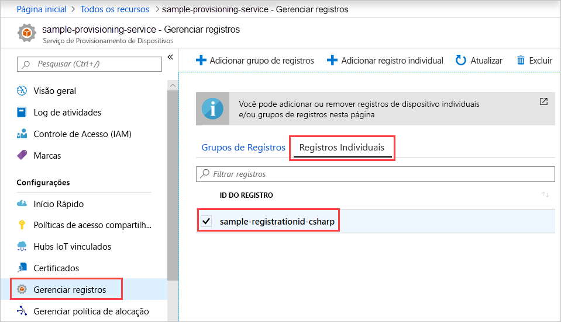

# <a name="enroll-tpm-device-to-iot-hub-device-provisioning-service-using-c-service-sdk"></a>Registrar dispositivo TPM no Serviço de Provisionamento de Dispositivos no Hub IoT usando o SDK do serviço C#

[!INCLUDE [iot-dps-selector-quick-enroll-device-tpm](../../includes/iot-dps-selector-quick-enroll-device-tpm.md)]

Este artigo mostra como criar de forma programática um registro individual para um dispositivo TPM no Serviço de Provisionamento de Dispositivos no Hub IoT do Azure usando o [SDK do Serviço C#](https://github.com/Azure/azure-iot-sdk-csharp) e um aplicativo de exemplo C# .NET Core. Opcionalmente, é possível registrar um dispositivo TPM simulado no serviço de provisionamento usando essa entrada de registro individual. Embora essas etapas funcionem em computadores Windows e Linux, este artigo usa um computador de desenvolvimento do Windows.

## <a name="prepare-the-development-environment"></a>Preparar o ambiente de desenvolvimento

1. Verifique se você tem o [Visual Studio 2019](https://www.visualstudio.com/vs/) instalado no computador.

1. Verifique se você tem o [SDK do .NET Core](https://www.microsoft.com/net/download/windows) instalado no computador.

1. Conclua as etapas em [Configurar o Serviço de Provisionamento de Dispositivos no Hub IoT com o portal do Azure](./quick-setup-auto-provision.md) antes de continuar.

1. (Opcional) Caso deseje registrar um dispositivo simulado ao final deste início rápido, siga o procedimento em [Criar e provisionar um dispositivo TPM simulado usando o SDK do dispositivo C#](quick-create-simulated-device-tpm-csharp.md) até a etapa em que você obtém uma chave de endosso para o dispositivo. Salve a chave de endosso, a ID de registro e, opcionalmente, a identidade do dispositivo, pois você precisará usá-las mais tarde neste início rápido.

   > [!NOTE]
   > Não siga as etapas para criar um registro individual usando o portal do Azure.

## <a name="get-the-connection-string-for-your-provisioning-service"></a>Obter a cadeia de conexão do serviço de provisionamento

Para o exemplo deste início rápido, é preciso ter a cadeia de conexão do serviço de provisionamento.

1. Entre no portal do Azure, selecione **Todos os recursos** e, em seguida, o Serviço de Provisionamento de Dispositivos.

1. Escolha **Políticas de acesso compartilhado** e, em seguida, selecione a política de acesso que deseja usar para abrir as propriedades. Em **Política de Acesso**, copie e salve a cadeia de conexão da chave primária.

    

## <a name="create-the-individual-enrollment-sample"></a>Criar o exemplo de registro individual

Esta seção mostra como criar um aplicativo de console .NET Core que adiciona um registro individual para um dispositivo TPM ao serviço de provisionamento. Com algumas modificações, você também pode seguir estas etapas para criar um aplicativo de console do [Windows IoT Core](https://developer.microsoft.com/en-us/windows/iot) para adicionar o registro individual. Para saber mais sobre como desenvolver com o IoT Core, confira a [documentação do desenvolvedor do Windows IoT Core](https://docs.microsoft.com/windows/iot-core/).

1. Abra o Visual Studio e selecione **Criar um projeto**. Em **Criar um projeto**, escolha o modelo de projeto **Aplicativo de Console (.NET Core)** para o C# e selecione **Avançar**.

1. Nomeie o projeto *CreateTpmEnrollment* e selecione **Criar**.

    

1. No **Gerenciador de Soluções**, clique com o botão direito do mouse no projeto **CreateTpmEnrollment** e, em seguida, selecione **Gerenciar Pacotes NuGet**.

1. No **Gerenciador de Pacotes NuGet**, selecione **Procurar**, pesquise e escolha **Microsoft.Azure.Devices.Provisioning.Service** e, em seguida, selecione **Instalar**.

   

   Essa etapa baixa, instala e adiciona uma referência ao pacote NuGet do [SDK do Cliente do Serviço de Provisionamento no Azure IoT](https://www.nuget.org/packages/Microsoft.Azure.Devices.Provisioning.Service/) e suas dependências.

1. Adicione as seguintes instruções `using` após as outras instruções `using` na parte superior de `Program.cs`:
  
   ```csharp
   using System.Threading.Tasks;
   using Microsoft.Azure.Devices.Provisioning.Service;
   ```

1. Adicione os campos a seguir à classe `Program` e faça as alterações listadas.

   ```csharp
   private static string ProvisioningConnectionString = "{Your provisioning service connection string}";
   private const string RegistrationId = "sample-registrationid-csharp";
   private const string TpmEndorsementKey =
       "AToAAQALAAMAsgAgg3GXZ0SEs/gakMyNRqXXJP1S124GUgtk8qHaGzMUaaoABgCAAEMAEAgAAAAAAAEAxsj2gUS" +
       "cTk1UjuioeTlfGYZrrimExB+bScH75adUMRIi2UOMxG1kw4y+9RW/IVoMl4e620VxZad0ARX2gUqVjYO7KPVt3d" +
       "yKhZS3dkcvfBisBhP1XH9B33VqHG9SHnbnQXdBUaCgKAfxome8UmBKfe+naTsE5fkvjb/do3/dD6l4sGBwFCnKR" +
       "dln4XpM03zLpoHFao8zOwt8l/uP3qUIxmCYv9A7m69Ms+5/pCkTu/rK4mRDsfhZ0QLfbzVI6zQFOKF/rwsfBtFe" +
       "WlWtcuJMKlXdD8TXWElTzgh7JS4qhFzreL0c1mI0GCj+Aws0usZh7dLIVPnlgZcBhgy1SSDQMQ==";
       
   // Optional parameters
   private const string OptionalDeviceId = "myCSharpDevice";
   private const ProvisioningStatus OptionalProvisioningStatus = ProvisioningStatus.Enabled;
   ```

   * Substitua o valor do espaço reservado `ProvisioningConnectionString` pela cadeia de conexão do serviço de provisionamento para o qual deseja criar o registro.

   * Outra opção é alterar a ID de registro, a chave de endosso, a ID do dispositivo e o status de provisionamento.

   * Caso esteja usando este início rápido junto com o início rápido [Criar e provisionar um dispositivo TPM simulado usando o SDK do dispositivo C#](quick-create-simulated-device-tpm-csharp.md) para provisionar um dispositivo simulado, substitua a chave de endosso e a ID de registro pelos valores que você anotou no início rápido anterior. É possível substituir a identidade do dispositivo pelo valor sugerido nesse início rápido. Para isso, use seu próprio valor ou o valor padrão nesta amostra.

1. Adicione o método a seguir à classe `Program`.  Esse código cria uma entrada de registro individual e, em seguida, chama o método `CreateOrUpdateIndividualEnrollmentAsync` no `ProvisioningServiceClient` para adicionar o registro individual ao serviço de provisionamento.

   ```csharp
   public static async Task RunSample()
   {
       Console.WriteLine("Starting sample...");

       using (ProvisioningServiceClient provisioningServiceClient =
               ProvisioningServiceClient.CreateFromConnectionString(ProvisioningConnectionString))
       {
           #region Create a new individualEnrollment config
           Console.WriteLine("\nCreating a new individualEnrollment...");
           Attestation attestation = new TpmAttestation(TpmEndorsementKey);
           IndividualEnrollment individualEnrollment =
                   new IndividualEnrollment(
                           RegistrationId,
                           attestation);

           // The following parameters are optional. Remove them if you don't need them.
           individualEnrollment.DeviceId = OptionalDeviceId;
           individualEnrollment.ProvisioningStatus = OptionalProvisioningStatus;
           #endregion

           #region Create the individualEnrollment
           Console.WriteLine("\nAdding new individualEnrollment...");
           IndividualEnrollment individualEnrollmentResult =
               await provisioningServiceClient.CreateOrUpdateIndividualEnrollmentAsync(individualEnrollment).ConfigureAwait(false);
           Console.WriteLine("\nIndividualEnrollment created with success.");
           Console.WriteLine(individualEnrollmentResult);
           #endregion
        
       }
   }
   ```

1. Por fim, substitua o corpo do método `Main` pelas seguintes linhas:

   ```csharp
   RunSample().GetAwaiter().GetResult();
   Console.WriteLine("\nHit <Enter> to exit ...");
   Console.ReadLine();
   ```

1. Compilar a solução.

## <a name="run-the-individual-enrollment-sample"></a>Executar o exemplo de registro individual
  
Execute o exemplo no Visual Studio para criar o registro individual para seu dispositivo TPM.

Após a criação bem-sucedida, a janela do prompt de comando exibirá as propriedades do novo registro individual.

Verifique se um registro individual foi criado. Acesse o resumo do Serviço de Provisionamento de Dispositivos e selecione **Gerenciar registros** e, em seguida, selecione **Registros Individuais**. Você deve ver uma nova entrada de registro que corresponda à ID de registro usada no exemplo.



Selecione a entrada para verificar a chave de endosso e outras propriedades da entrada.

Caso esteja seguindo as etapas no início rápido [Criar e provisionar um dispositivo TPM simulado usando o SDK do dispositivo C#](quick-create-simulated-device-tpm-csharp.md), você pode continuar com as etapas restantes nesse início rápido para registrar o dispositivo simulado. Certifique-se de ignorar as etapas para criar um registro individual usando o portal do Azure.

## <a name="clean-up-resources"></a>Limpar recursos

Se pretender explorar a amostra do serviço C#, não limpe os recursos criados neste início rápido. Caso contrário, use as seguintes etapas para excluir todos os recursos criados por este início rápido.

1. Feche a Janela de Saída da amostra do C# no computador.

1. Navegue até o Serviço de Provisionamento de Dispositivos no portal do Azure, selecione **Gerenciar registros** e, em seguida, selecione a guia **Registros Individuais**. Selecione a *ID de Registro* da entrada de registro que você criou usando este início rápido e selecione **Excluir**.

1. Caso tenha seguido as etapas de [Criar e provisionar um dispositivo TPM simulado usando o SDK do dispositivo C#](quick-create-simulated-device-tpm-csharp.md) para criar um dispositivo TPM simulado, execute as seguintes etapas:

    1. Feche a janela do simulador de TPM e a janela de saída de exemplo do dispositivo simulado.

    1. No portal do Azure, navegue até o Hub IoT em que o dispositivo foi provisionado. No menu de **Gerenciadores**, selecione **Dispositivos IoT**, marque a caixa de seleção ao lado do dispositivo e, em seguida, selecione **Excluir**.

## <a name="next-steps"></a>Próximas etapas

Neste início rápido, você criou de forma programática uma entrada de registro individual para um dispositivo TPM. Opcionalmente, você criou um dispositivo simulado TPM no computador e o provisionou no hub IoT usando o Serviço de Provisionamento de Dispositivos no Hub IoT do Azure. Para saber mais sobre os detalhes de configuração do dispositivo, prossiga para o tutorial de configuração do Serviço de Provisionamento de Dispositivos no portal do Azure.

> [!div class="nextstepaction"]
> [Tutoriais do Serviço de Provisionamento de Dispositivos no Hub IoT do Azure](./tutorial-set-up-cloud.md)
