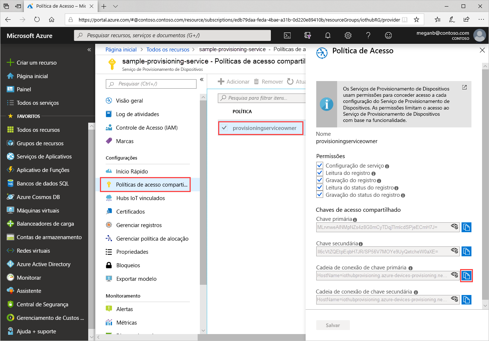
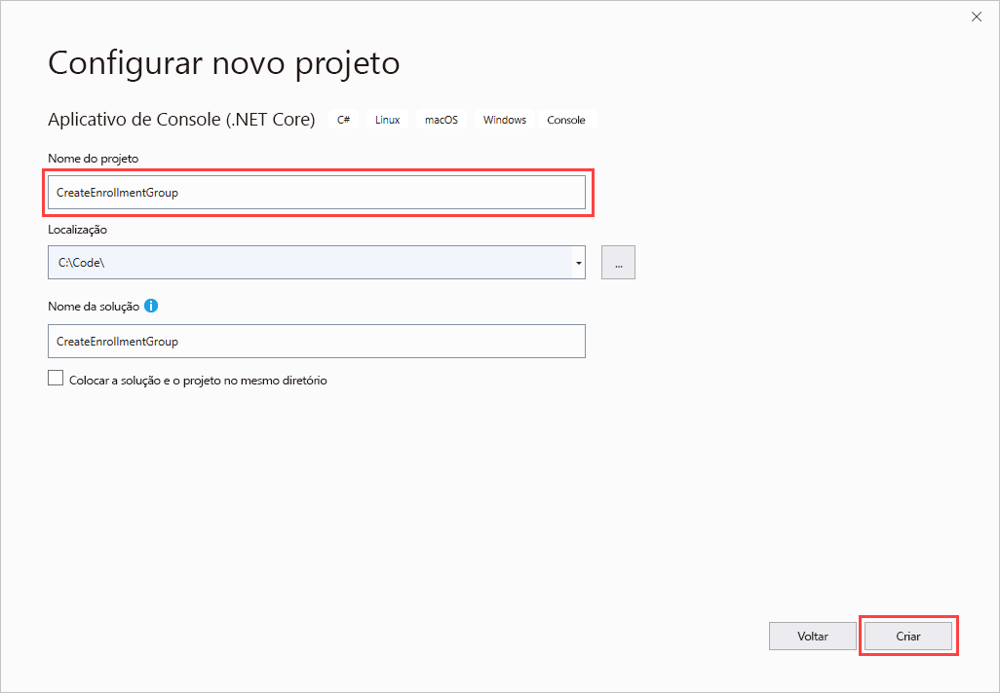
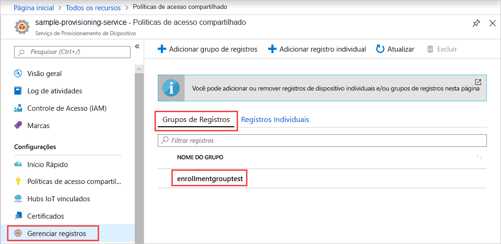

# <a name="quickstart-enroll-x509-devices-to-the-device-provisioning-service-using-c"></a>Início Rápido: Inscrever dispositivos X.509 no Serviço de Provisionamento de Dispositivos usando C#

[!INCLUDE [iot-dps-selector-quick-enroll-device-x509](../../includes/iot-dps-selector-quick-enroll-device-x509.md)]

Este início rápido mostra como usar C# para criar programaticamente um [Grupo de registro](concepts-service.md#enrollment-group) que usa certificados raiz ou intermediários de autoridade de certificação X.509. O grupo de registro é criado usando o [SDK do IoT do Microsoft Azure para .NET](https://github.com/Azure/azure-iot-sdk-csharp) e um aplicativo C# .NET Core de exemplo. Um grupo de registros controla o acesso ao serviço de provisionamento para dispositivos que compartilham um certificado de autenticação comum em sua cadeia de certificados. Para saber mais, confira [Como controlar o acesso ao dispositivo para o serviço de provisionamento com certificados X.509](./concepts-security.md#controlling-device-access-to-the-provisioning-service-with-x509-certificates). Para obter mais informações sobre como usar a Infraestrutura de Chave Pública (PKI) do X.509 baseada em certificado com o Hub IoT do Azure e o Serviço de Provisionamento do Dispositivo, confira [Visão geral de segurança do certificado de Autoridade de Certificação do X.509](https://docs.microsoft.com/azure/iot-hub/iot-hub-x509ca-overview). 

Este início rápido espera que você já tenha criado um hub IoT e uma instância do Serviço de Provisionamento de Dispositivos. Se você ainda não tiver criado esses recursos, conclua o início rápido [Configurar o Serviço de Provisionamento de Dispositivos no Hub IoT com o portal do Azure](./quick-setup-auto-provision.md) antes de continuar com este artigo.

Embora as etapas deste artigo funcionem em computadores Windows e Linux, este artigo usa um computador de desenvolvimento do Windows.

[!INCLUDE [quickstarts-free-trial-note](../../includes/quickstarts-free-trial-note.md)]

## <a name="prerequisites"></a>Pré-requisitos

* Instalar o [Visual Studio 2019](https://www.visualstudio.com/vs/).
* Instalar o [SDK do .NET Core](https://www.microsoft.com/net/download/windows).
* Instale o [Git](https://git-scm.com/download/).

## <a name="prepare-test-certificates"></a>Preparar certificados de teste

Para este início rápido, você deve ter um arquivo .pem ou .cer que contém a parte pública de um certificado raiz ou intermediário de autoridade de certificação X.509. Este certificado deve ser carregado para o serviço de provisionamento e verificado pelo serviço.

O [SDK de C do IoT do Azure](https://github.com/Azure/azure-iot-sdk-c) contém ferramentas de teste que podem ajudá-lo a criar uma cadeia de certificados X.509, fazer upload de um certificado raiz ou intermediário dessa cadeia e fazer a prova de posse com o serviço para verificar o certificado.

> [!CAUTION]
> Use certificados criados com as ferramentas do SDK apenas para testes de desenvolvimento.
> Não use esses certificados em produção.
> Eles contêm senhas embutidas em código, como *1234*, que expiram após 30 dias.
> Para obter informações sobre como obter certificados adequados para o uso de produção, confira [Como obter um certificado de Autoridade de Certificação X.509](https://docs.microsoft.com/azure/iot-hub/iot-hub-x509ca-overview#how-to-get-an-x509-ca-certificate) na documentação do Hub IoT do Azure.
>

Para usar essas ferramentas de teste para gerar certificados, execute as seguintes etapas:

1. Abra uma janela do prompt de comando ou um shell do Git Bash e altere para uma pasta de trabalho no computador. Execute o seguinte comando para clonar o repositório do GitHub do [SDK de C do IoT do Azure](https://github.com/Azure/azure-iot-sdk-c):

   ```cmd/sh
   git clone https://github.com/Azure/azure-iot-sdk-c.git --recursive
   ```

   Essa operação deve demorar alguns minutos.

   As ferramentas de teste estão localizadas em *azure-iot-sdk-c/tools/CACertificates* do repositório clonado.

1. Siga as etapas em [Gerenciar certificados de Autoridade de Certificação de teste para exemplos e tutoriais](https://github.com/Azure/azure-iot-sdk-c/blob/master/tools/CACertificates/CACertificateOverview.md).

Além das ferramentas no SDK de C, a [Amostra de verificação de certificado do grupo](https://github.com/Azure-Samples/azure-iot-samples-csharp/tree/master/provisioning/Samples/service/GroupCertificateVerificationSample) no *SDK do IoT do Microsoft Azure para .NET* mostra como fazer a prova de posse no C# com um Certificado de Autoridade de Certificação X.509 intermediária ou raiz.

## <a name="get-the-connection-string-for-your-provisioning-service"></a>Obter a cadeia de conexão do serviço de provisionamento

Para o exemplo deste início rápido, é preciso ter a cadeia de conexão do serviço de provisionamento.

1. Entre no portal do Azure, selecione **Todos os recursos** e, em seguida, o Serviço de Provisionamento de Dispositivos.

1. Selecione **Políticas de acesso compartilhado** e, em seguida, escolha a política de acesso que deseja usar para abrir as propriedades. Em **Política de Acesso**, copie e salve a cadeia de conexão da chave primária.

    

## <a name="create-the-enrollment-group-sample"></a>Criar exemplo de grupo de registros 

Esta seção mostra como criar um aplicativo de console .NET Core que adiciona um grupo de registro ao serviço de provisionamento. Com algumas modificações, você também pode seguir estas etapas para criar um aplicativo de console do [Windows IoT Core](https://developer.microsoft.com/en-us/windows/iot) para adicionar o grupo de registros. Para saber mais sobre como desenvolver com o IoT Core, confira a [Documentação do desenvolvedor do Windows IoT Core](https://docs.microsoft.com/windows/iot-core/).

1. Abra o Visual Studio e selecione **Criar um projeto**. Em **Criar um projeto**, escolha o modelo de projeto C# **Aplicativo de Console (.NET Core)** e selecione **Avançar**.

1. Nomeie o projeto *CreateEnrollmentGroup* e, em seguida, selecione **Criar**.

    

1. No **Gerenciador de Soluções**, clique com o botão direito do mouse no projeto **CreateEnrollmentGroup** e, em seguida, selecione **Gerenciar Pacotes NuGet**.

1. No **Gerenciador de Pacotes NuGet**, selecione **Procurar**, pesquise e escolha **Microsoft.Azure.Devices.Provisioning.Service** e, em seguida, selecione **Instalar**.

    

   Essa etapa baixa, instala e adiciona uma referência ao pacote NuGet do [SDK do Cliente do Serviço de Provisionamento no Azure IoT](https://www.nuget.org/packages/Microsoft.Azure.Devices.Provisioning.Service/) e suas dependências.

1. Adicione as seguintes instruções `using` após as outras instruções `using` na parte superior de `Program.cs`:

   ```csharp
   using System.Security.Cryptography.X509Certificates;
   using System.Threading.Tasks;
   using Microsoft.Azure.Devices.Provisioning.Service;
   ```

1. Adicione os campos a seguir à classe `Program` e faça as alterações listadas.  

   ```csharp
   private static string ProvisioningConnectionString = "{Your provisioning service connection string}";
   private static string EnrollmentGroupId = "enrollmentgrouptest";
   private static string X509RootCertPath = @"{Path to a .cer or .pem file for a verified root CA or intermediate CA X.509 certificate}";
   ```

   * Substitua o valor do espaço reservado `ProvisioningConnectionString` pela cadeia de conexão do serviço de provisionamento para o qual deseja criar o registro.

   * Substitua o valor de espaço reservado `X509RootCertPath` pelo caminho para um arquivo .pem ou .cer. Esse arquivo representa a parte pública de um certificado X.509 da AC raiz ou intermediária que foi previamente carregada e verificada com o serviço de provisionamento.

   * Opcionalmente, você pode alterar o valor `EnrollmentGroupId`. A cadeia de caracteres pode conter apenas letras minúsculas e hifens.

   > [!IMPORTANT]
   > No código de produção, esteja ciente das seguintes considerações de segurança:
   >
   > * Codificar a cadeia de conexão para o administrador de serviço de provisionamento é contra as práticas recomendadas de segurança. Em vez disso, a cadeia de conexão deve ser mantida de uma maneira segura, como em um arquivo de configuração seguro ou no registro.
   > * Verifique se você carregou somente a parte pública do certificado de autenticação. Nunca carregue arquivos .pfx (PKCS12) ou .pem que contenham as chaves privadas para o serviço de provisionamento.

1. Adicione o método a seguir à classe `Program`. Esse código cria uma entrada de grupo de registro e, em seguida, chama o método `CreateOrUpdateEnrollmentGroupAsync` em `ProvisioningServiceClient` para adicionar o grupo de registro ao serviço de provisionamento.

   ```csharp
   public static async Task RunSample()
   {
       Console.WriteLine("Starting sample...");
 
       using (ProvisioningServiceClient provisioningServiceClient =
               ProvisioningServiceClient.CreateFromConnectionString(ProvisioningConnectionString))
       {
           #region Create a new enrollmentGroup config
           Console.WriteLine("\nCreating a new enrollmentGroup...");
           var certificate = new X509Certificate2(X509RootCertPath);
           Attestation attestation = X509Attestation.CreateFromRootCertificates(certificate);
           EnrollmentGroup enrollmentGroup =
                   new EnrollmentGroup(
                           EnrollmentGroupId,
                           attestation)
                   {
                       ProvisioningStatus = ProvisioningStatus.Enabled
                   };
           Console.WriteLine(enrollmentGroup);
           #endregion
 
           #region Create the enrollmentGroup
           Console.WriteLine("\nAdding new enrollmentGroup...");
           EnrollmentGroup enrollmentGroupResult =
               await provisioningServiceClient.CreateOrUpdateEnrollmentGroupAsync(enrollmentGroup).ConfigureAwait(false);
           Console.WriteLine("\nEnrollmentGroup created with success.");
           Console.WriteLine(enrollmentGroupResult);
           #endregion
 
       }
   }
   ```

1. Por fim, substitua o corpo do método `Main` pelas seguintes linhas:

   ```csharp
   RunSample().GetAwaiter().GetResult();
   Console.WriteLine("\nHit <Enter> to exit ...");
   Console.ReadLine();
   ```

1. Compilar a solução.

## <a name="run-the-enrollment-group-sample"></a>Executar exemplo de grupo de registros
  
Execute o exemplo no Visual Studio para criar o grupo de registros. Após a criação bem-sucedida, a janela do prompt de comando exibirá as propriedades do novo grupo de registro.

Verifique se o grupo de registro foi criado. Acesse o resumo do Serviço de Provisionamento de Dispositivos e selecione **Gerenciar registros** e, em seguida, selecione **Grupos de Registro**. Você deve ver uma nova entrada de registro que corresponda à ID de registro usada no exemplo.



Selecione a entrada para verificar a impressão digital do certificado e outras propriedades da entrada.

## <a name="clean-up-resources"></a>Limpar recursos

Se pretender explorar a amostra do serviço C#, não limpe os recursos criados neste início rápido. Caso contrário, use as seguintes etapas para excluir todos os recursos criados por este início rápido.

1. Feche a Janela de Saída da amostra do C# no computador.

1. Navegue até o Serviço de Provisionamento de Dispositivos no portal do Azure, selecione **Gerenciar registros** e, em seguida, selecione **Grupos de Registro**. Selecione a *ID de Registro* da entrada de registro que você criou usando este início rápido e selecione **Excluir**.

1. No Serviço de Provisionamento de Dispositivos no portal do Azure, selecione **Certificados**, escolha o certificado que você carregou para este início rápido e selecione **Excluir** na parte superior de **Detalhes do Certificado**.  

## <a name="next-steps"></a>Próximas etapas

Neste início rápido, você criou um grupo de registro para um Certificado de Autoridade de Certificação X.509 raiz ou intermediária usando o Serviço de Provisionamento de Dispositivos no Hub IoT do Azure. Para saber mais sobre os detalhes de configuração do dispositivo, prossiga para o tutorial de configuração do Serviço de Provisionamento de Dispositivos no portal do Azure.

> [!div class="nextstepaction"]
> [Tutoriais do Serviço de Provisionamento de Dispositivos no Hub IoT do Azure](./tutorial-set-up-cloud.md)
