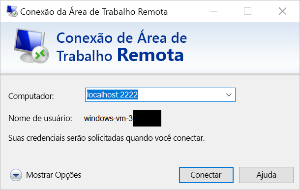

# <a name="quickstart-enable-ssh-and-rdp-over-an-iot-hub-device-stream-by-using-a-nodejs-proxy-application-preview"></a>Início Rápido: Habilitar o SSH e o RDP em fluxos de dispositivos do Hub IoT usando o aplicativo proxy do Node.js (versão prévia)

[!INCLUDE [iot-hub-quickstarts-4-selector](../../includes/iot-hub-quickstarts-4-selector.md)]

Atualmente, o Hub IoT do Microsoft Azure dá suporte a fluxos de dispositivos como uma [versão prévia do recurso](https://azure.microsoft.com/support/legal/preview-supplemental-terms/).

Os [fluxos de dispositivos do Hub IoT](./iot-hub-device-streams-overview.md) permitem que aplicativos de serviço e dispositivo se comuniquem de maneira segura e simples para o firewall. 

Este início rápido descreve a execução de um aplicativo proxy Node.js executado no lado do serviço para habilitar o tráfego RDP (protocolo RDP) e SSH (Secure Shell) para envio ao dispositivo por um fluxo de dispositivos. Para obter uma visão geral da configuração, confira [Amostra de proxy local](./iot-hub-device-streams-overview.md#local-proxy-sample-for-ssh-or-rdp). 

Durante a versão prévia pública, o SDK do Node.js dá suporte somente a fluxos de dispositivos no lado do serviço. Consequentemente, este início rápido contém instruções para executar somente o aplicativo proxy local do serviço. Para executar o aplicativo proxy local do dispositivo, confira:  

   * [Habilitar o SSH e o RDP em fluxos de dispositivos do Hub IoT usando um aplicativo proxy do C](./quickstart-device-streams-proxy-c.md)
   * [Habilitar o SSH e o RDP sobre fluxos de dispositivos do Hub IoT usando um aplicativo proxy do C#](./quickstart-device-streams-proxy-csharp.md)

Este artigo descreve a configuração do SSH (usando a porta 22) e, em seguida, descreve como modificar a configuração do RDP (que usa a porta 3389). Como os fluxos de dispositivos são independentes de protocolo e de aplicativo, você pode modificar a mesma amostra para acomodar outros tipos de tráfego do aplicativo de cliente-servidor, normalmente alterando a porta de comunicação.

[!INCLUDE [cloud-shell-try-it.md](../../includes/cloud-shell-try-it.md)]

Se você não tiver uma assinatura do Azure, crie uma [conta gratuita](https://azure.microsoft.com/free/?WT.mc_id=A261C142F) antes de começar.

## <a name="prerequisites"></a>Pré-requisitos

* Atualmente, a versão prévia dos fluxos de dispositivos só é compatível com hubs IoT criados nas seguintes regiões:

  * Centro dos EUA
  * EUA Central EUAP

* Para executar o aplicativo local do serviço neste início rápido, você precisará do Node.js v10.x.x ou posterior no computador de desenvolvimento.
  * Baixe o [Node.js](https://nodejs.org) para várias plataformas.
  * Verifique a versão atual do Node.js no computador de desenvolvimento usando o seguinte comando:

   ```
   node --version
   ```

* Adicione a Extensão do Azure IoT para a CLI do Azure à instância do Cloud Shell executando o comando a seguir. A Extensão de IoT adiciona comandos específicos do Hub IoT, do IoT Edge e do DPS (Serviço de Provisionamento de Dispositivos IoT) à CLI do Azure.

    ```azurecli-interactive
    az extension add --name azure-cli-iot-ext
    ```

* Caso ainda não tenha feito isso, [baixe o projeto de exemplo do Node.js](https://github.com/Azure-Samples/azure-iot-samples-node/archive/streams-preview.zip) e extraia o arquivo morto zip.

## <a name="create-an-iot-hub"></a>Crie um hub IoT

Se tiver concluído o [Início Rápido: enviar telemetria de um dispositivo para um hub IoT](quickstart-send-telemetry-node.md), pode ignorar esta etapa.

[!INCLUDE [iot-hub-include-create-hub-device-streams](../../includes/iot-hub-include-create-hub-device-streams.md)]

## <a name="register-a-device"></a>Registrar um dispositivo

Se você concluiu o [Início Rápido: enviar telemetria de um dispositivo para um hub IoT](quickstart-send-telemetry-node.md), pode ignorar esta etapa.

Um dispositivo deve ser registrado no hub IoT antes de poder se conectar. Nesta seção, você usará o Azure Cloud Shell para registrar um dispositivo simulado.

1. Para criar a identidade do dispositivo, execute o seguinte comando no Cloud Shell:

   > [!NOTE]
   > * Substitua o espaço reservado *YourIoTHubName* com o nome escolhido para o hub IoT.
   > * Use *MyDevice*, conforme mostrado. Esse é o nome fornecido para o dispositivo registrado. Se você escolher um nome diferente para seu dispositivo, use esse nome ao longo deste artigo e atualize o nome do dispositivo nos aplicativos de exemplo antes de executá-los.

    ```azurecli-interactive
    az iot hub device-identity create --hub-name YourIoTHubName --device-id MyDevice
    ```

1. Para permitir que o aplicativo back-end se conecte ao hub IoT e recupere as mensagens, você também precisa de uma *cadeia de conexão de serviço*. O seguinte comando recupera a cadeia de caracteres para o hub IoT:

   > [!NOTE]
   > Substitua o espaço reservado *YourIoTHubName* com o nome escolhido para o hub IoT.

    ```azurecli-interactive
    az iot hub show-connection-string --policy-name service --name YourIoTHubName
    ```

    Anote o valor retornado para uso posterior neste início rápido. Ela se parece com o seguinte exemplo:

   `"HostName={YourIoTHubName}.azure-devices.net;SharedAccessKeyName=service;SharedAccessKey={YourSharedAccessKey}"`

## <a name="ssh-to-a-device-via-device-streams"></a>SSH para um dispositivo por fluxos de dispositivos

Nesta seção, você estabelecerá um fluxo de ponta a ponta para encapsular o tráfego SSH.

### <a name="run-the-device-local-proxy-application"></a>Executar o aplicativo de proxy no local do dispositivo

Como mencionado anteriormente, o SDK do Node.js do Hub IoT dá suporte somente a fluxos de dispositivos no lado do serviço. Para o aplicativo local do dispositivo, use um aplicativo proxy de dispositivo disponível em um dos seguintes inícios rápidos:

   * [Habilitar o SSH e o RDP em fluxos de dispositivos do Hub IoT usando um aplicativo proxy do C](./quickstart-device-streams-proxy-c.md)
   * [Habilitar o SSH e o RDP sobre fluxos de dispositivos do Hub IoT usando um aplicativo proxy do C#](./quickstart-device-streams-proxy-csharp.md) 

Antes de prosseguir para a próxima etapa, verifique se o aplicativo proxy local do dispositivo está em execução.

### <a name="run-the-service-local-proxy-application"></a>Executar o aplicativo de proxy no local do serviço

Com o aplicativo proxy local do dispositivo em execução, execute o aplicativo proxy local do serviço escrito em Node.js fazendo o seguinte:

1. Para variáveis de ambiente, forneça suas credenciais do serviço, a identificação do dispositivo de destino no qual o daemon SSH é executado e o número da porta para o proxy em execução no dispositivo.

   ```
   # In Linux
   export IOTHUB_CONNECTION_STRING="<provide_your_service_connection_string>"
   export STREAMING_TARGET_DEVICE="MyDevice"
   export PROXY_PORT=2222

   # In Windows
   SET IOTHUB_CONNECTION_STRING=<provide_your_service_connection_string>
   SET STREAMING_TARGET_DEVICE=MyDevice
   SET PROXY_PORT=2222
   ```

   Altere os valores anteriores para que correspondam à identificação do dispositivo e a cadeia de conexão.

1. Acesse o diretório *Quickstarts/device-streams-service* na pasta do projeto descompactada e execute o aplicativo proxy local do serviço.

   ```
   cd azure-iot-samples-node-streams-preview/iot-hub/Quickstarts/device-streams-service

   # Install the preview service SDK, and other dependencies
   npm install azure-iothub@streams-preview
   npm install

   # Run the service-local proxy application
   node proxy.js
   ```

### <a name="ssh-to-your-device-via-device-streams"></a>SSH para o dispositivo por fluxos de dispositivos

No Linux, execute o SSH usando `ssh $USER@localhost -p 2222` em um terminal. No Windows, use seu cliente SSH favorito (por exemplo, o PuTTY).

Saída do console no local do serviço após o estabelecimento da sessão SSH (o aplicativo proxy local do serviço escuta na porta 2222):


Saída do console do aplicativo cliente SSH (o cliente SSH se comunica com o daemon SSH conectando-se à porta 22, na qual o aplicativo proxy local do serviço escuta):


### <a name="rdp-to-your-device-via-device-streams"></a>RDP para o dispositivo por fluxos de dispositivos

Agora use o aplicativo de cliente RDP e conecte-se ao proxy de serviço na porta 2222, uma porta arbitrária que você escolheu anteriormente.

> [!NOTE]
> Certifique-se de que o proxy do dispositivo foi configurado corretamente para RDP e configurado com a porta RDP 3389.



## <a name="clean-up-resources"></a>Limpar recursos

[!INCLUDE [iot-hub-quickstarts-clean-up-resources](../../includes/iot-hub-quickstarts-clean-up-resources-device-streams.md)]

## <a name="next-steps"></a>Próximas etapas

Neste início rápido, você configurou um hub IoT, registrou um dispositivo e implantou um aplicativo proxy de serviço para habilitar o RDP e o SSH em um dispositivo IoT. O tráfego RDP e SSH será passado por um túnel por meio de um fluxo de dispositivos pelo hub IoT. Esse processo elimina a necessidade de conectividade direta com o dispositivo.

Para saber mais sobre fluxos de dispositivos, confira:

> [!div class="nextstepaction"]
> [Visão geral dos fluxos de dispositivos](./iot-hub-device-streams-overview.md)
