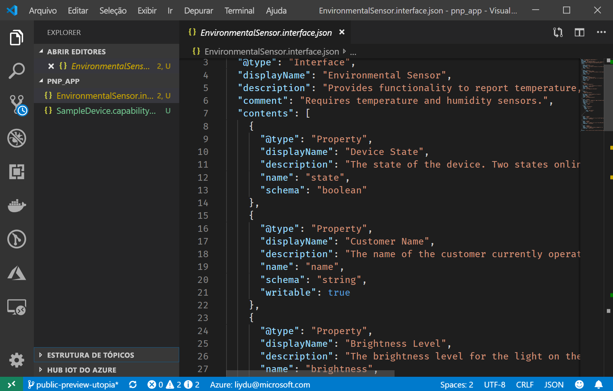
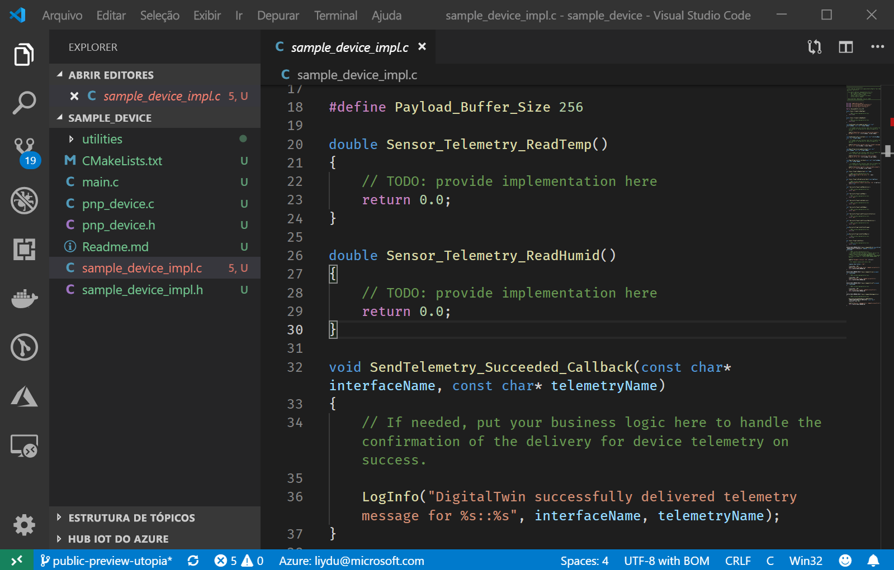

# <a name="quickstart-use-a-device-capability-model-to-create-an-iot-plug-and-play-device"></a>Início Rápido: Usar um modelo de funcionalidade do dispositivo para criar um dispositivo IoT Plug and Play

Um DCM _(modelo de funcionalidade do dispositivo)_ descreve as funcionalidades de um dispositivo IoT Plug and Play. Um DCM geralmente é associado a um SKU de produto. As funcionalidades definidas no DCM são organizadas em interfaces reutilizáveis. Você pode gerar um código do dispositivo de esqueleto com base em um DCM. Este início rápido mostra como usar o VS Code para criar um dispositivo IoT Plug and Play usando um DCM.

## <a name="prerequisites"></a>Pré-requisitos

Para concluir este início rápido, você precisa instalar o seguinte software no computador local:

* [Visual Studio (Community, Professional ou Enterprise)](https://visualstudio.microsoft.com/downloads/) – inclua o componente **Gerenciador de pacotes NuGet** e a carga de trabalho **Desenvolvimento para desktop com C++** ao instalar o Visual Studio.
* [Git](https://git-scm.com/download/).
* [CMake](https://cmake.org/download/).
* [Visual Studio Code](https://code.visualstudio.com/).

### <a name="install-azure-iot-tools"></a>Instalar as Ferramentas do Azure IoT

Use as seguintes etapas para instalar o pacote de extensão [Azure IoT Tools para VS Code](https://marketplace.visualstudio.com/items?itemName=vsciot-vscode.azure-iot-tools):

1. No VS Code, selecione a guia **Extensões**.
1. Pesquise por **Azure IoT Tools**.
1. Selecione **Instalar**.

### <a name="install-the-azure-iot-explorer"></a>Instalar o Azure IoT Explorer

Baixe e instale a ferramenta Azure IoT Explorer na página da [última versão](https://github.com/Azure/azure-iot-explorer/releases).

### <a name="get-the-connection-string-for-your-company-model-repository"></a>Obter a cadeia de conexão para o repositório de modelos da empresa

Encontre a _cadeia de conexão do repositório de modelos da empresa_ no portal do [Azure Certified para IoT](https://preview.catalog.azureiotsolutions.com) quando entrar com uma conta corporativa ou de estudante da Microsoft ou com a ID de Parceiro da Microsoft, caso tenha uma. Depois de entrar, selecione **Repositório da empresa** e, em seguida, **Cadeias de conexão**.

[!INCLUDE [cloud-shell-try-it.md](../../includes/cloud-shell-try-it.md)]

## <a name="prepare-an-iot-hub"></a>Preparar um hub IoT

Você também precisará de um Hub IoT do Azure em sua assinatura do Azure para concluir este início rápido. Se você não tiver uma assinatura do Azure, crie uma [conta gratuita](https://azure.microsoft.com/free/?WT.mc_id=A261C142F) antes de começar.

> [!NOTE]
> Durante a versão prévia pública, os recursos de IoT Plug and Play estão disponíveis apenas em hubs IoT criados nas regiões **Centro dos EUA**, **Europa Setentrional** e **Leste do Japão**.

Adicione a Extensão IoT do Microsoft Azure para a CLI do Azure:

```azurecli-interactive
az extension add --name azure-cli-iot-ext
```

Use o comando a seguir para criar uma identidade do dispositivo no Hub IoT. Substitua os espaços reservados **YourIoTHubName** e **YourDevice** pelos nomes reais. Caso não tenha um Hub IoT, siga [estas instruções para criar um](../iot-hub/iot-hub-create-using-cli.md):

```azurecli-interactive
az iot hub device-identity create --hub-name [YourIoTHubName] --device-id [YourDevice]
```

Execute os seguintes comandos para obter a _cadeia de conexão de dispositivo_ para a dispositivo recém-registrado:

```azurecli-interactive
az iot hub device-identity show-connection-string --hub-name [YourIoTHubName] --device-id [YourDevice] --output table
```

Execute os seguintes comandos para obter a _cadeia de conexão do Hub IoT_ para o hub:

```azurecli-interactive
az iot hub show-connection-string --hub-name [YourIoTHubName] --output table
```

## <a name="prepare-the-development-environment"></a>Preparar o ambiente de desenvolvimento

### <a name="get-azure-iot-device-sdk-for-c"></a>Obter o SDK do dispositivo IoT do Azure para C

Neste início rápido, você preparará um ambiente de desenvolvimento que pode ser usado para clonar e compilar o SDK do dispositivo IoT do Azure para C.

1. Abra um prompt de comando. Execute o seguinte comando para clonar o repositório do GitHub [SDK de C do IoT do Azure](https://github.com/Azure/azure-iot-sdk-c):

    ```cmd/sh
    git clone https://github.com/Azure/azure-iot-sdk-c --recursive -b public-preview
    ```

    Essa operação deve demorar alguns minutos.

1. Crie um subdiretório `pnp_app` na raiz do clone local do repositório. Você usará essa pasta para os arquivos de modelo de dispositivo e o stub do código do dispositivo.

    ```cmd/sh
    cd azure-iot-sdk-c
    mkdir pnp_app
    ```

## <a name="author-your-model"></a>Criar o modelo

Neste início rápido, você usará um modelo de funcionalidade do dispositivo de exemplo existente e as interfaces associadas.

1. Baixe o [modelo de funcionalidade do dispositivo](https://github.com/Azure/IoTPlugandPlay/blob/master/samples/SampleDevice.capabilitymodel.json) e a [amostra de interface](https://github.com/Azure/IoTPlugandPlay/blob/master/samples/EnvironmentalSensor.interface.json) e salve os arquivos na pasta `pnp_app`.

    > [!TIP]
    > Para baixar um arquivo no GitHub, navegue até o arquivo, clique com o botão direito do mouse em **Bruto** e, em seguida, selecione **Salvar link como**.

1. Abra a pasta `pnp_app` com o VS Code. Exiba os arquivos com o IntelliSense:

    

1. Nos arquivos baixados, substitua `<YOUR_COMPANY_NAME_HERE>` nos campos `@id` e `schema` por um valor exclusivo. Use somente os caracteres a-z, A-Z, 0-9 e sublinhado. Para obter mais informações, confira [Formato do identificador do Gêmeo Digital](https://github.com/Azure/IoTPlugandPlay/tree/master/DTDL#digital-twin-identifier-format).

## <a name="generate-the-c-code-stub"></a>Gerar o stub do código C

Agora que você tem um DCM e suas interfaces associadas, gere o código do dispositivo que implementa o modelo. Para gerar o stub do código C no VS Code:

1. Com a pasta que contém os arquivos DCM aberta, use **Ctrl+Shift+P** para abrir a paleta de comandos, insira **IoT Plug and Play** e selecione **Gerar Stub do Código do Dispositivo**.

    > [!NOTE]
    > Na primeira vez que você usar o utilitário Gerador de Código do IoT Plug and Play, serão necessários alguns segundos para baixá-lo.

1. Escolha o arquivo DCM que deseja usar para gerar o stub do código do dispositivo.

1. Insira o nome do projeto **sample_device**; ele será o nome do aplicativo do dispositivo.

1. Escolha **ANSI C** como a linguagem.

1. Escolha **Projeto do CMake** como o tipo de projeto.

1. Escolha **Por meio da cadeia de conexão de dispositivo do Hub IoT** como o método de conexão.

1. O VS Code abre uma nova janela com os arquivos stub do código do dispositivo gerados.
    

## <a name="build-the-code"></a>Compilar o código

Você usará o SDK do dispositivo para criar o stub do código do dispositivo gerado. O aplicativo criado simula um dispositivo que se conecta a um hub IoT. O aplicativo envia a telemetria e as propriedades e recebe comandos.

1. No VS Code, abra `CMakeLists.txt` na pasta raiz do SDK do dispositivo.

1. Adicione a linha abaixo na parte inferior do arquivo `CMakeLists.txt` para incluir a pasta stub do código do dispositivo ao fazer a compilação:

    ```txt
    add_subdirectory(pnp_app/sample_device)
    ```

1. Crie um subdiretório do CMake na pasta raiz do SDK do dispositivo e navegue até essa pasta:

    ```cmd\sh
    mkdir cmake
    cd cmake
    ```

1. Execute os seguintes comandos para compilar o SDK do dispositivo e o stub do código gerado:

    ```cmd\sh
    cmake .. -Duse_prov_client=ON -Dhsm_type_symm_key:BOOL=ON
    cmake --build . -- /m /p:Configuration=Release
    ```

    > [!NOTE]
    > Se o CMake não conseguir localizar o compilador C++, você obterá erros de build ao executar o comando anterior. Se isso acontecer, tente executar este comando no [prompt de comando do Visual Studio](https://docs.microsoft.com/dotnet/framework/tools/developer-command-prompt-for-vs).

1. Depois que o build for concluído com êxito, execute o aplicativo passando a cadeia de conexão do dispositivo do hub IoT como parâmetro.

    ```cmd\sh
    cd azure-iot-sdk-c\cmake\pnp_app\sample_device\Release\
    sample_device.exe "[IoT Hub device connection string]"
    ```

1. O aplicativo do dispositivo iniciará o envio de dados ao Hub IoT.

    

## <a name="validate-the-code"></a>Validar o código

### <a name="publish-device-model-files-to-model-repository"></a>Publicar arquivos de modelo do dispositivo no repositório de modelos

Para validar o código do dispositivo com o **Azure IoT Explorer**, você precisará publicar os arquivos no repositório de modelos.

1. Com a pasta que contém os arquivos DCM aberta, use **Ctrl+Shift+P** para abrir a paleta de comandos, digite e selecione **IoT Plug and Play: Enviar arquivos para o Repositório de Modelos**.

1. Selecione os arquivos `SampleDevice.capabilitymodel.json` e `EnvironmentalSensor.interface.json`.

1. Insira a cadeia de conexão do repositório de modelos da empresa.

    > [!NOTE]
    > A cadeia de conexão só é necessária na primeira vez que você se conecta ao repositório.

1. Na Janela de Saída e na notificação do VS Code, verifique se os arquivos foram publicados com êxito.

    > [!NOTE]
    > Se você receber erros ao publicar os arquivos de modelo do dispositivo, tente usar o comando **IoT Plug and Play: Sair do Repositório de Modelos** para sair e passar pelas etapas novamente.

### <a name="use-the-azure-iot-explorer-to-validate-the-code"></a>Usar o Azure IoT Explorer para validar o código

1. Abra o Azure IoT Explorer e você verá a página **Configurações de aplicativos**.

1. Insira a cadeia de conexão do Hub IoT e clique em **Conectar**.

1. Depois de se conectar, você verá a página de visão geral do dispositivo.

1. Para adicionar o repositório de sua empresa, selecione **Configurações**, **+Novo** e, em seguida, **Repositório da empresa**.

1. Adicione a cadeia de conexão do repositório de modelos da empresa. Selecione **Conectar**.

1. Na página de visão geral do dispositivo, localize a identidade do dispositivo criada anteriormente e selecione-a para exibir mais detalhes.

1. Expanda a interface com a ID **urn:azureiot:EnvironmentalSensor:1** para ver os primitivos do IoT Plug and Play – propriedades, comandos e telemetria.

1. Selecione a página **Telemetria** para exibir os dados telemétricos que o dispositivo está enviando.

1. Selecione a página **Propriedades (não graváveis)** para exibir as propriedades não graváveis relatadas pelo dispositivo.

1. Selecione a página **Propriedades (graváveis)** para exibir as propriedades graváveis que podem ser atualizadas.

1. Expanda o **nome** da propriedade, atualize-o com um novo nome e selecione **atualizar propriedade gravável**. 
2. Para ver o novo nome exibido na coluna **Propriedade Relatada**, clique no botão **Atualizar** na parte superior da página.

1. Selecione a página **Comando** para exibir todos os comandos aos quais o dispositivo dá suporte.

1. Expanda o comando **piscar** e defina um novo intervalo de tempo de intermitência. Selecione **Enviar Comando** para chamar o comando no dispositivo.

1. Acesse o dispositivo simulado para verificar se o comando foi executado conforme o esperado.

## <a name="next-steps"></a>Próximas etapas

Neste início rápido, você aprendeu a criar um dispositivo IoT Plug and Play usando um DCM.

Para saber mais sobre o IoT Plug and Play, prossiga para o tutorial:

> [!div class="nextstepaction"]
> [Criar e testar um modelo de funcionalidade do dispositivo usando o Visual Studio Code](tutorial-pnp-visual-studio-code.md)
