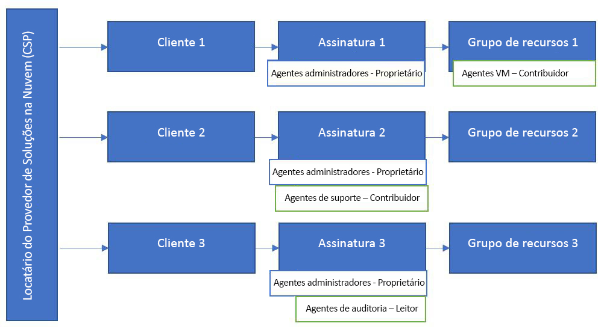

# Azure Lighthouse e o programa Provedor de Soluções na Nuvem

Se você for um [parceiro CSP (Provedor de Soluções na Nuvem)](https://docs.microsoft.com/partner-center/csp-overview), poderá acessar as assinaturas do Azure criadas para seus clientes por meio do programa CSP usando a funcionalidade [AOBO (Administrar em Nome de)](https://channel9.msdn.com/Series/cspdev/Module-11-Admin-On-Behalf-Of-AOBO). Esse acesso permite que você dê suporte, configure e gerencie diretamente as assinaturas dos seus clientes.

O mecanismo AOBO concede acesso completo a ambientes de clientes. Usar o gerenciamento de recursos delegados do Azure junto com o AOBO ajuda a aprimorar a segurança permitindo que você reduza o acesso desnecessário habilitando mais permissões granulares para seus usuários. 

## AOBO (Administrar em Nome de)

Com o AOBO, qualquer usuário com a função [Agente Administrador](https://docs.microsoft.com/partner-center/permissions-overview#manage-commercial-transactions-in-partner-center-azure-ad-and-csp-roles) em seu locatário terá acesso AOBO às assinaturas do Azure que você criar por meio do programa CSP. Os usuários que precisarem de acesso às assinaturas de clientes deverão ser um membro deste grupo. O AOBO não permite a flexibilidade de criar grupos distintos que funcionam com clientes diferentes ou de habilitar funções diferentes para grupos ou usuários.

## Gerenciamento de recursos delegados do Azure

Usando o gerenciamento de recursos delegados do Azure, é possível atribuir diferentes grupos a diferentes clientes ou funções, conforme mostrado no diagrama a seguir. Como os usuários terão o nível apropriado de acesso por meio do gerenciamento de recursos delegados do Azure, é possível reduzir o número de usuários que têm a função Agente Administrador (e, portanto, ter acesso AOBO total). Isso proporciona maior segurança limitando o acesso desnecessário aos recursos dos seus clientes. Também oferece mais flexibilidade de gerenciar vários clientes em escala.

A integração de uma assinatura que você criou por meio do programa CSP segue as etapas descritas em [Integrar uma assinatura ao gerenciamento de recursos delegados do Azure](../how-to/onboard-customer.md). Qualquer usuário que tenha a função Agente Administrador em seu locatário poderá realizar essa integração.

Observe que para assinaturas criadas por meio de programas CSP, as solicitações de suporte só podem ser geradas por usuários com a função Agente Administrador no locatário do provedor do serviço. Os usuários adicionados por meio do gerenciamento de recursos delegados do Azure não poderão abrir solicitações de suporte para recursos delegados nessas assinaturas.

## Link de Partner Admin

Você pode associar sua ID do MPN (Microsoft Partner Network) às assinaturas integradas para acompanhar o impacto nas participações dos clientes.

Se você [publicar uma oferta de serviços gerenciados no Azure Marketplace](../how-to/publish-managed-services-offers.md), sua ID do MPN será associada ao seu perfil de editor e será associada automaticamente à oferta. A receita gerada pelos recursos do Azure por meio desta oferta será atribuída à sua organização. Em sistemas de relatórios parceiros como o Partner Center ou MPN, a atribuição será exibida como PAL (Link de Partner Admin).

Se você [integrar clientes para o gerenciamento de recursos delegados do Azure usando os modelos do Azure Resource Manager](../how-to/onboard-customer.md), ainda poderá associar sua ID do MPN a fim de receber reconhecimento para seu impacto sobre participações de clientes, mas terá que fazer isso manualmente. Para saber mais, confira [Vincular uma ID de parceiro a suas contas do Azure](https://docs.microsoft.com/azure/billing/billing-partner-admin-link-started). 

## Próximas etapas

- Saiba mais sobre [experiências de gerenciamento entre locatários](cross-tenant-management-experience.md).
- Saiba mais sobre o [programa Provedor de Soluções na Nuvem](https://docs.microsoft.com/partner-center/csp-overview).
