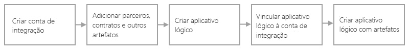

# Soluções de integração empresarial corporativa B2B com Aplicativos Lógicos do Azure e o Enterprise Integration Pack

Para soluções B2B (entre empresas) e comunicação direta entre organizações, você pode criar fluxos de trabalho de integração empresarial escalonáveis automatizados usando o EIP (Enterprise Integration Pack) com [Aplicativos Lógicos do Azure](../logic-apps/logic-apps-overview.md). Embora as organizações usem diferentes protocolos e formatos, elas podem trocar mensagens eletronicamente. O EIP transforma formatos diferentes em um formato que os sistemas de sua organização podem processar e dá suporte a protocolos padrão do setor, incluindo [AS2](../logic-apps/logic-apps-enterprise-integration-as2.md), [X12](logic-apps-enterprise-integration-x12.md) e [EDIFACT](../logic-apps/logic-apps-enterprise-integration-edifact.md). Também é possível proteger mensagens com criptografia e assinaturas digitais. O EIP dá suporte a esses [conectores de integração empresarial](../connectors/apis-list.md#integration-account-connectors) e a estes padrões do setor:

* EDI (intercâmbio eletrônico de dados)
* EAI (Integração de Aplicativos Empresariais)

Se você está familiarizado com o Microsoft BizTalk Server ou os Serviços BizTalk do Azure, o EIP segue conceitos semelhantes, tornando os recursos fáceis de usar. No entanto, uma grande diferença é que o EIP é baseado em arquiteturas em "contas de integração" para simplificar o armazenamento e o gerenciamento de artefatos usados em comunicações B2B. Essas contas são contêineres baseados em nuvem que armazenam todos os artefatos, como parceiros, acordos, esquemas, mapas e certificados. 

## Por que usar o Enterprise Integration Pack?

* Com o EIP, você pode armazenar todos os seus artefatos em um único local: sua conta de integração.

* É possível criar fluxos de trabalho B2B e integrá-los a aplicativos SaaS (software como serviço) de terceiros, locais e personalizados usando os Aplicativos Lógicos do Azure e conectores.

* Você pode criar código personalizado para seus aplicativos lógicos com o Azure Functions.

## Como começar?

Antes de começar a criar fluxos de trabalho do aplicativo lógico B2B com o EIP, você precisará destes itens:

* Uma assinatura do Azure. Se você não tiver uma assinatura do Azure, [inscreva-se em uma conta gratuita do Azure](https://azure.microsoft.com/free/).

* Uma [conta de integração](../logic-apps/logic-apps-enterprise-integration-create-integration-account.md) com os artefatos que você deseja usar

* Para criar mapas e esquemas, você pode usar as [Ferramentas de Integração Empresarial dos Aplicativos Lógicos do Microsoft Azure para Visual Studio 2015 2.0](https://aka.ms/vsmapsandschemas) e Visual Studio 2015.

Depois de criar uma conta de integração e adicionar seus artefatos, você pode começar a criar fluxos de trabalho B2B com esses artefatos criando um aplicativo lógico no portal do Azure. Se você não tiver familiaridade com aplicativos lógicos, tente [criar um aplicativo lógico básico](../logic-apps/quickstart-create-first-logic-app-workflow.md). Para trabalhar com esses artefatos, primeiro vincule sua conta de integração ao seu aplicativo lógico. Depois, o aplicativo lógico poderá acessar sua conta de integração. Você também pode criar, gerenciar e implantar aplicativos lógicos usando o Visual Studio ou o [PowerShell](https://docs.microsoft.com/powershell/module/az.logicapp).

Aqui estão as etapas de alto nível para começar a criar aplicativos lógicos B2B:

  

## Experimente agora

[Implantar um aplicativo lógico de exemplo totalmente operacional que envie e receba mensagens AS2](https://github.com/Azure/azure-quickstart-templates/tree/master/201-logic-app-as2-send-receive)

## Próximas etapas

* [Criar os parceiros comerciais](logic-apps-enterprise-integration-partners.md)
* [Criar contratos](../logic-apps/logic-apps-enterprise-integration-agreements.md)
* [Adicionar esquemas](logic-apps-enterprise-integration-schemas.md)
* [Adicionar mapas](../logic-apps/logic-apps-enterprise-integration-maps.md)
* [Migrar dos Serviços BizTalk](../logic-apps/logic-apps-move-from-mabs.md)
