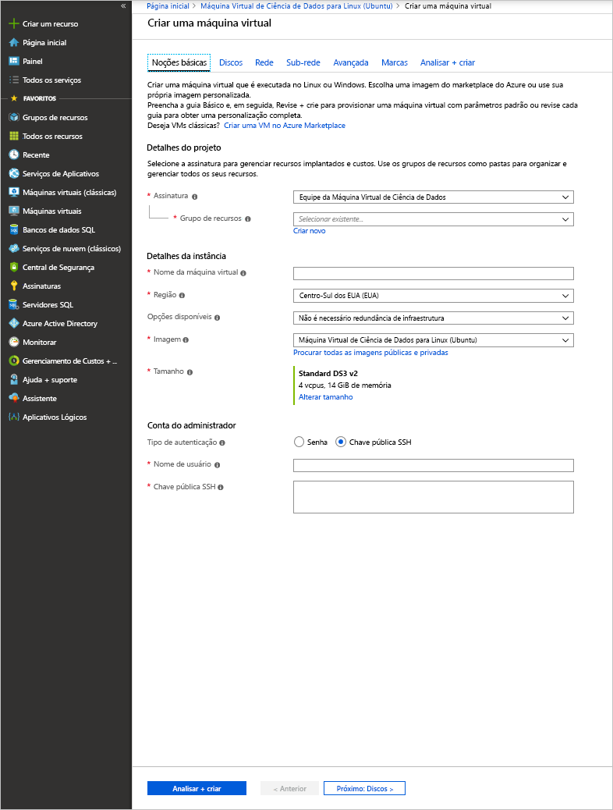

# <a name="provision-the-data-science-virtual-machine-for-linux-ubuntu"></a>Provisionar a Máquina Virtual de Ciência de Dados para Linux (Ubuntu)

A DSVM (Máquina Virtual de Ciência de Dados) para Linux é uma imagem de máquina virtual baseada no Ubuntu que facilita a introdução ao aprendizado de máquina, incluindo o aprendizado profundo, no Azure. As ferramentas de aprendizado aprofundado incluem:

* [Caffe](https://caffe.berkeleyvision.org/): uma estrutura de aprendizado profundo criada para oferecer velocidade, expressividade e modularidade.
* [Caffe2](https://github.com/caffe2/caffe2): uma versão multiplataforma do Caffe.
* [Microsoft Cognitive Toolkit](https://github.com/Microsoft/CNTK): um kit de ferramentas de software de aprendizado profundo da Microsoft Research.
* [H2O](https://www.h2o.ai/): uma plataforma de Big Data open-source e uma interface gráfica do usuário.
* [Keras](https://keras.io/): uma API de rede neural de alto nível em Python para o TensorFlow, o Microsoft Cognitive Toolkit e o Theano.
* [MXNet](https://mxnet.io/): uma biblioteca de aprendizado profundo flexível e eficiente com muitas associações de linguagem.
* [NVIDIA DIGITS](https://developer.nvidia.com/digits): um sistema gráfico que simplifica tarefas comuns de aprendizado profundo.
* [PyTorch](https://pytorch.org/): uma biblioteca Python de alto nível com suporte para redes dinâmicas.
* [TensorFlow](https://www.tensorflow.org/): uma biblioteca open-source para inteligência de máquina do Google.
* [Theano](http://deeplearning.net/software/theano/): uma biblioteca Python para definir, otimizar e avaliar com eficiência expressões matemáticas que envolvem matrizes multidimensionais.
* [Torch](http://torch.ch/): uma estrutura de computação científica com amplo suporte para algoritmos de aprendizado de máquina.
* CUDA, cuDNN e o driver NVIDIA.
* Muitos exemplos de Notebooks Jupyter.

Todas as bibliotecas são as versões de GPU, embora também sejam executadas na CPU.

A Máquina Virtual de Ciência de Dados para Linux também contém ferramentas populares para atividades de desenvolvimento e ciência de dados, incluindo:

* O Microsoft Machine Learning Server com o Microsoft R Open.
* Distribuição do Anaconda Python (versões 2.7 e 3.5), incluindo bibliotecas de análise de dados populares.
* JuliaPro, uma distribuição curada da linguagem Julia com bibliotecas populares de análise de dados e científicas.
* Instância autônoma do Spark e Hadoop de nó único (HDFS, YARN).
* JupyterHub, um servidor do Jupyter Notebook multiusuário compatível com kernels R, Python, PySpark e Julia.
* Gerenciador de Armazenamento do Azure.
* CLI do Azure para gerenciar recursos do Azure.
* Ferramentas de aprendizado de máquina:
  * [Vowpal Wabbit](https://github.com/JohnLangford/vowpal_wabbit): Um sistema de aprendizado de máquina rápido compatível com técnicas como online, hash, allreduce, reduções, learning2search, ativo e aprendizado interativo.
  * [XGBoost](https://xgboost.readthedocs.org/en/latest/): Uma ferramenta que fornece implementação de árvore aumentada rápida e precisa.
  * [Rattle](https://togaware.com/rattle/): Uma ferramenta gráfica que facilita o uso de análise de dados e aprendizado de máquina em R.
  * [LightGBM](https://github.com/Microsoft/LightGBM): Uma estrutura de gradient boosting rápida, distribuída e de alto desempenho.
* SDK do Azure em Java, Python, Node.js, Ruby e PHP.
* Bibliotecas em R e Python para uso no Azure Machine Learning e em outros serviços do Azure.
* Ferramentas de desenvolvimento e editores (RStudio, PyCharm, IntelliJ, Emacs, vim).

Fazer a ciência de dados envolve a iteração em uma sequência de tarefas:

1. Localizar, carregar e pré-processar dados
1. Compilar e testar modelos
1. Implantar os modelos para consumo em aplicativos inteligentes

Cientistas de dados usam várias ferramentas para concluir essas tarefas. Pode ser demorado encontrar as versões apropriadas do software e depois baixar, compilar e instalar essas versões.

A Máquina Virtual de Ciência de Dados para Linux pode aliviar essa carga substancialmente. Use-a para iniciar rapidamente seu projeto de análise. Ela permite que você trabalhe nas tarefas em várias linguagens, incluindo R, Python, SQL, Java e C++. O SDK do Azure incluído na VM permite que você compile seus aplicativos usando vários serviços em Linux para a plataforma de nuvem da Microsoft. Além disso, você tem acesso a outras linguagens como Ruby, Perl, PHP e Node.js, também pré-instaladas.

Não há encargos de software para essa imagem de VM da DSVM. Você paga apenas pelas taxas de uso de hardware do Azure, que são avaliadas com base no tamanho da máquina virtual que você provisiona. Para saber mais sobre valores de computação, confira a [Página de listagem de VMs no Azure Marketplace](https://azure.microsoft.com/marketplace/partners/microsoft-ads/linux-data-science-vm/).

## <a name="other-versions-of-the-data-science-virtual-machine"></a>Outras versões da Máquina Virtual de Ciência de Dados

A imagem do [CentOS](linux-dsvm-intro.md) também está disponível, com muitas das mesmas ferramentas que a imagem do Ubuntu. Uma imagem do [Windows](provision-vm.md) também está disponível.

## <a name="prerequisites"></a>Pré-requisitos

Antes de criar uma Máquina Virtual de Ciência de Dados para Linux, você deve ter uma assinatura do Azure. Você pode [obter uma avaliação gratuita do Azure](https://azure.microsoft.com/free/).

## <a name="create-your-data-science-virtual-machine-for-linux"></a>Criar sua Máquina Virtual de Ciência de Dados para Linux

Veja as etapas para criar uma instância da Máquina Virtual de Ciência de Dados para Linux:

1. Acesse a listagem de máquinas virtuais no [portal do Azure](https://portal.azure.com/#create/microsoft-dsvm.linux-data-science-vm-ubuntulinuxdsvmubuntu). Você pode ser solicitado a entrar na sua conta do Azure, caso ainda não esteja conectado. 
1. Selecione **Criar** para abrir o assistente.
    
1. Insira as seguintes informações para configurar cada etapa do assistente:

    1. **Noções básicas**:
    
       * **Assinatura**: se você tiver mais de uma assinatura, selecione aquela em que o computador será criado e cobrado. Você deve ter privilégios de criação de recurso nessa assinatura.
       * **Grupo de recursos**: Você pode criar um grupo novo ou usar um grupo existente.
       * **Nome da máquina virtual**: Insira o nome do servidor de ciência de dados que você está criando.
       * **Região**: selecione o datacenter mais apropriado. Normalmente, é o datacenter que contém a maioria dos seus dados ou que está mais próximo de sua localização física para o acesso mais rápido à rede.
       * **Opções de disponibilidade**: Defina isso se você quiser usar essa VM em conjuntos de disponibilidade ou zonas. Caso contrário, deixe o padrão.
       * **Imagem**: Mantenha o valor padrão.
       * **Tamanho**: selecione o tipo de servidor que atende aos seus requisitos funcionais e restrições de custo. Selecione uma VM de classe NC ou ND para instâncias de VMs com base em GPU. 
       * **Nome de usuário**: Insira o nome de usuário do administrador.
       * **Chave pública SSH**: Insira a chave pública RSA em formato de linha única. (Você pode usar uma senha, vez de uma chave SSH.)
    
    1. **Discos**:
    
       * **Tipo de disco de SO**: Escolha **SSD Premium** se preferir uma unidade de estado sólido (SSD). Caso contrário, escolha **HDD Standard**.
    
    1. Para o restante das configurações, você pode usar os valores padrão. Passe o ponteiro do mouse sobre o link informativo para obter ajuda sobre um campo não padrão. Quando terminar, selecione **Examinar + criar**.
    
    1. Depois que a validação da VM for aprovada, verifique se todas as informações inseridas estão corretas. Um link direciona você aos termos de uso. A VM não tem encargos adicionais além dos de computação para o tamanho do servidor que você escolheu na entrada **Tamanho**. Para iniciar o provisionamento, selecione **Criar**.
    
    O provisionamento deve demorar cerca de 5 minutos. O status é exibido no portal do Azure.

## <a name="how-to-access-the-data-science-virtual-machine-for-linux"></a>Como acessar uma Máquina Virtual de Ciência de Dados para Linux

É possível acessar a DSVM Ubuntu usando três métodos:

- SSH para sessões de terminal
- X2Go para sessões gráficas
- JupyterHub e JupyterLab para notebooks Jupyter

Também é possível anexar uma Máquina Virtual de Ciência de Dados ao Azure Notebooks para executar os notebooks Jupyter na VM e ignorar as limitações da camada de serviço gratuita. Para saber mais, confira [Gerenciar e configurar projetos do Azure Notebooks](../../notebooks/configure-manage-azure-notebooks-projects.md#compute-tier).

### <a name="ssh"></a>SSH

Após a criação da VM, você poderá entrar nela usando SSH. Use as credenciais da conta criada na seção **Noções básicas** da etapa 3 para a interface shell de texto. No Windows, é possível baixar uma ferramenta de cliente SSH, como o [PuTTY](https://www.putty.org). Se preferir uma área de trabalho gráfica (Sistema Window X), você poderá usar o encaminhamento X11 no PuTTY ou instalar o cliente X2Go.

> [!NOTE]
> O cliente X2Go apresentou desempenho melhor do que o encaminhamento X11 em testes. Recomendamos o uso do cliente X2Go para uma interface gráfica de área de trabalho.

### <a name="x2go"></a>X2Go

A VM Linux já está provisionada com um servidor X2Go e pronta para aceitar conexões de cliente. Para se conectar à área de trabalho gráfica da VM do Linux, realize o seguinte procedimento em seu cliente:

1. Baixe e instale o cliente X2Go para sua plataforma de cliente [X2Go](https://wiki.x2go.org/doku.php/doc:installation:x2goclient).
1. Execute o cliente X2Go e selecione **Nova Sessão**. Ele abrirá uma janela de configuração com várias guias. Insira os seguintes parâmetros de configuração:
   * **Guia Sessão**:
     * **Host**: Insira o nome do host ou o endereço IP de sua Máquina Virtual de Ciência de Dados Linux.
     * **Logon**: Insira o nome de usuário na VM Linux.
     * **Porta SSH**: Deixe em 22, o valor padrão.
     * **Tipo de Sessão**: Altere o valor para **XFCE**. No momento, a VM Linux dá suporte apenas à área de trabalho XFCE.
   * **Guia Mídia**: Você poderá desligar o suporte a som e impressão de cliente se não precisar usá-los.
   * **Pastas compartilhadas**: Caso você queira que os diretórios de seus computadores cliente sejam montados na VM Linux, adicione os diretórios de computador cliente que você deseja compartilhar com a VM nesta guia.

Após entrar na VM usando o cliente SSH ou a área de trabalho gráfica XFCE por meio do cliente X2Go, você estará pronto para começar a usar as ferramentas instaladas e configuradas na VM. No XFCE, você pode ver atalhos do menu de aplicativos e ícones da área de trabalho para muitas das ferramentas.

### <a name="jupyterhub-and-jupyterlab"></a>JupyterHub e JupyterLab

A DSVM do Ubuntu executa o [JupyterHub](https://github.com/jupyterhub/jupyterhub), um servidor Jupyter multiusuário. Para se conectar, navegue até https:\//your-vm-ip:8000 em seu laptop ou área de trabalho. Insira o nome de usuário e a senha usados para criar a VM e entre. Muitos notebooks de exemplo estão disponíveis para você procurar e experimentar.

O JupyterLab, a próxima geração de notebooks Jupyter e JupyterHub, também está disponível. Para acessá-lo, entre no JupyterHub e, em seguida, procure a URL https:\//your-vm-ip:8000/user/your-username/lab. É possível definir o JupyterLab como o servidor de Notebook padrão adicionando esta linha a `/etc/jupyterhub/jupyterhub_config.py`:

```python
c.Spawner.default_url = '/lab'
```

## <a name="tools-installed-on-the-data-science-virtual-machine-for-linux"></a>Ferramentas Instaladas na Máquina Virtual de Ciência de Dados para Linux

### <a name="deep-learning-libraries"></a>Bibliotecas de aprendizado profundo

#### <a name="cntk"></a>CNTK

O Microsoft Cognitive Toolkit é um kit de ferramentas de aprendizado profundo open-source. As associações do Python estão disponíveis nos ambientes raiz e py35 do Conda. Ele também tem uma ferramenta de linha de comando (CNTK) que já está no caminho.

Os blocos de anotações de amostra de Python estão disponíveis no JupyterHub. Para executar um exemplo básico na linha de comando, execute os comandos a seguir no shell:

```bash
cd /home/[USERNAME]/notebooks/CNTK/HelloWorld-LogisticRegression
cntk configFile=lr_bs.cntk makeMode=false command=Train
```

Para saber mais, confira a seção sobre CNTK do [GitHub](https://github.com/Microsoft/CNTK) e o [wiki de CNTK](https://github.com/Microsoft/CNTK/wiki).

#### <a name="caffe"></a>Caffe

Caffe é uma estrutura de aprendizado aprofundado da Berkeley Vision and Learning Center. Ele está disponível em /opt/caffe. Você pode encontrar exemplos em /opt/caffe/examples.

#### <a name="caffe2"></a>Caffe2

Caffe2 é uma estrutura de aprendizado do Facebook que se baseia no Caffe. Ele está disponível no Python 2.7 no ambiente raiz do Conda. Para ativá-lo, execute o seguinte comando no shell:

```bash
source /anaconda/bin/activate root
```

Alguns blocos de anotações de amostra também estão disponíveis no JupyterHub.

#### <a name="h2o"></a>H2O

H2O é uma plataforma de análise preditiva e aprendizado de máquina rápido, na memória e distribuído. Um pacote do Python é instalado nos ambientes raiz e py35 do Anaconda. Um pacote R também é instalado. 

Para abrir o H2O na linha de comando, execute `java -jar /dsvm/tools/h2o/current/h2o.jar`. Há várias [opções de linha de comando](http://docs.h2o.ai/h2o/latest-stable/h2o-docs/starting-h2o.html#from-the-command-line) que você pode querer configurar. Você pode acessar a interface do usuário Web do Flow navegando até http://localhost:54321 para começar. Os blocos de anotações de amostra também estão disponíveis no JupyterHub.

#### <a name="keras"></a>Keras

O Keras é uma API de rede neural de alto nível em Python. Ele pode ser executado com base no TensorFlow, no Microsoft Cognitive Toolkit ou no Theano. Ele está disponível nos ambientes raiz e py35 do Python.

#### <a name="mxnet"></a>MXNet

MXNet é uma estrutura de aprendizado profunda criada para eficiência e flexibilidade. Ela tem associações R e Python incluídas no DSVM. Os blocos de anotações de amostra estão incluído no JupyterHub e o código de exemplo está disponível em /dsvm/samples/mxnet.

#### <a name="nvidia-digits"></a>NVIDIA DIGITS

O NVIDIA Deep Learning GPU Training System, conhecido como DIGITS, é um sistema para simplificar tarefas comuns de aprendizado profundo. As tarefas incluem gerenciamento de dados, design e treinamento de redes neurais em sistemas GPU e monitoramento de desempenho em tempo real com visualização avançada.

DIGITS está disponível como um serviço, chamado de *dígitos*. Inicie o serviço e navegue até http://localhost:5000 para começar.

DIGITS também é instalado como um módulo do Python no ambiente raiz Conda.

#### <a name="tensorflow"></a>TensorFlow

TensorFlow é a biblioteca de aprendizado aprofundado do Google. É uma biblioteca de software open-source para computação numérica usando grafos de fluxo de dados. O TensorFlow está disponível no ambiente de py35 do Python e alguns blocos de anotações de amostra estão incluídos no JupyterHub.

#### <a name="theano"></a>Theano

Theano é uma biblioteca do Python para computação numérica eficiente. Ele está disponível nos ambientes raiz e py35 do Python. 

#### <a name="torch"></a>Torch

Tocha é uma estrutura de computação científica com amplo suporte para algoritmos de aprendizado de máquina. Ela está disponível em /dsvm/tools/torch e a **enésima** sessão interativa e o gerenciador de pacotes LuaRocks estão disponíveis na linha de comando. Os exemplos estão disponíveis em /dsvm/samples/torch.

PyTorch também está disponível no ambiente raiz do Anaconda. Os exemplos estão em /dsvm/samples/pytorch.

### <a name="microsoft-machine-learning-server"></a>Microsoft Machine Learning Server

R é uma das linguagens mais populares para análise de dados e aprendizado de máquina. Se deseja usar o R para sua análise, a VM tem o Microsoft Machine Learning Server com o Microsoft R Open e a Math Kernel Library. A Math Kernel Library otimiza as operações matemáticas frequentes em algoritmos analíticos. O Microsoft R Open é 100% compatível com CRAN R e qualquer uma das bibliotecas R publicadas em CRAN pode ser instalada no Microsoft R Open. 

O Machine Learning Server fornece dimensionamento e operacionalização de modelos R em serviços Web. Edite seus programas R em um dos editores padrão como RStudio, vi ou Emacs. Se você preferir usar o editor de Emacs, ele estará pré-instalado. O pacote de Emacs ESS (Emacs Speaks Statistics) simplifica o trabalho com arquivos R no editor Emacs.

Para abrir o console R, insira **R** no shell. Esse comando leva você para um ambiente interativo. Para desenvolver seu programa R, você normalmente usa um editor como vi ou Emacs e, em seguida, executa os scripts no R. Com o RStudio, você tem um IDE gráfico completo para desenvolver o seu programa R.

Também há um script de R para você instalar os [20 melhores pacotes do R](https://www.kdnuggets.com/2015/06/top-20-r-packages.html), caso queira. Você pode executar esse script depois de estar na interface do R Interativo. Conforme mencionado anteriormente, você pode abrir essa interface inserindo **R** no shell.  

### <a name="python"></a>Python

O Anaconda Python é instalado com os ambientes Python 2.7 e 3.5. O ambiente 2.7 é chamado _raiz_ e o ambiente 3.5 é chamado _py35_. Essa distribuição contém o Python base com aproximadamente 300 dos mais populares pacotes de matemática, engenharia e análise de dados.

O ambiente py35 é o padrão. Para ativar o ambiente raiz (2.7), use este comando:

```bash
source activate root
```

Para ativar o ambiente py35 novamente, use este comando:

```bash
source activate py35
```

Para invocar uma sessão interativa do Python, insira **python** no shell. 

Instale outras bibliotecas Python usando Conda ou pip. Para pip, ative o ambiente correto primeiro se você não quiser o padrão:

```bash
source activate root
pip install <package>
```

Ou especifique o caminho completo até o pip:

```bash
/anaconda/bin/pip install <package>
```

Para Conda, você deve sempre especificar o nome do ambiente (py35 ou raiz):

```bash
conda install <package> -n py35
```

Se estiver em uma interface gráfica ou tiver a configuração do encaminhamento X11, você poderá inserir o comando **pycharm** para abrir o IDE do PyCharm Python. Você pode usar os editores de texto padrão. Além disso, você pode usar o Spyder, um IDE do Python que é fornecido com distribuições do Anaconda Python. O Spyder precisa de uma área de trabalho gráfica ou de encaminhamento X11. A área de trabalho gráfica tem um atalho para o Spyder.

### <a name="jupyter-notebook"></a>Notebook Jupyter

A distribuição do Anaconda também acompanha um notebook Jupyter, um ambiente de compartilhamento de código e de análise. O notebook Jupyter é acessado com o JupyterHub. Entre usando seu nome de usuário e senha locais do Linux.

O servidor do notebook Jupyter foi previamente configurado com os kernels do Python 2, do Python 3 e do R. Use o ícone de área de trabalho do **Jupyter Notebook** para abrir o navegador e acessar o servidor de notebook. Se você estiver na VM via cliente SSH ou X2Go, também poderá acessar o servidor do Jupyter Notebook em [https://localhost:8000/](https://localhost:8000/).

> [!NOTE]
> Continue se você obtiver quaisquer avisos de certificado.

Você pode acessar o servidor de bloco de anotações do Jupyter por meio de qualquer host. Insira **https://\<endereço IP ou nome DNS da VM\>:8000/** .

> [!NOTE]
> A porta 8000 é aberta no firewall por padrão quando a VM é provisionada. 

Empacotamos exemplos de notebooks, um em Python em outro em R. Você pode ver o link para os exemplos na home page do notebook após a autenticação no Jupyter Notebook usando a senha e o nome de usuário Linux locais. Você pode criar um novo notebook selecionando **Novo** e selecionando o kernel de linguagem apropriado. Caso não veja o botão **Novo**, selecione o ícone do **Jupyter** na parte superior esquerda para acessar a home page do servidor de notebook.

### <a name="apache-spark-standalone"></a>Apache Spark autônomo

Uma instância autônomo do Apache Spark é pré-instalada na DSVM Linux para ajudar você a desenvolver aplicativos Spark localmente antes de testá-los e implantá-los em clusters grandes. 

Execute programas PySpark através do kernel de Jupyter. Ao abrir o Jupyter, selecione o botão **Novo** e você verá uma lista de kernels disponíveis. O **Spark – Python** é o kernel PySpark que permite a criação de aplicativos Spark usando a linguagem Python. Também é possível usar um IDE Python como PyCharm ou Spyder para criar seu programa em Spark. 

Nessa instância autônoma, a pilha do Spark é executada dentro do programa de chamada cliente. Esse recurso torna mais rápido e fácil solucionar problemas, em comparação com o desenvolvimento em um cluster Spark.

O Jupyter oferece um notebook PySpark de exemplo. Você pode encontrá-lo no diretório SparkML no diretório base do Jupyter ($HOME/notebooks/SparkML/pySpark). 

Se você estiver programando em R para Spark, use o Microsoft Machine Learning Server, SparkR ou sparklyr. 

Antes de executar em um contexto do Spark no Microsoft Machine Learning Server, execute uma etapa de configuração única para habilitar uma instância local de HDFS Hadoop e YARN de nó único. Por padrão, os serviços do Hadoop serão instalados, mas desabilitados no DSVM. Para habilitá-los, execute os seguintes comandos como raiz na primeira vez:

```bash
echo -e 'y\n' | ssh-keygen -t rsa -P '' -f ~hadoop/.ssh/id_rsa
cat ~hadoop/.ssh/id_rsa.pub >> ~hadoop/.ssh/authorized_keys
chmod 0600 ~hadoop/.ssh/authorized_keys
chown hadoop:hadoop ~hadoop/.ssh/id_rsa
chown hadoop:hadoop ~hadoop/.ssh/id_rsa.pub
chown hadoop:hadoop ~hadoop/.ssh/authorized_keys
systemctl start hadoop-namenode hadoop-datanode hadoop-yarn
```

Será possível interromper os serviços relacionados ao Hadoop relacionados quando você não precisar deles executando ```systemctl stop hadoop-namenode hadoop-datanode hadoop-yarn```.

O diretório /dsvm/samples/MRS oferece um exemplo que demonstra como desenvolver e testar o Microsoft Machine Learning Server em um contexto de Spark remoto (a instância de Spark autônoma na DSVM).

### <a name="ides-and-editors"></a>IDEs e editores

Você tem a opção de vários editores de código, incluindo vi/Vim, Emacs, PyCharm, RStudio e IntelliJ. 

PyCharm, RStudio e IntelliJ são editores gráficos. Para usá-los, você precisa estar conectado a uma área de trabalho gráfica. Você os abre usando os atalhos de menu de área de trabalho e de aplicativo.

Vim e Emacs são editores baseados em texto. No Emacs, o pacote complementar do ESS facilita o trabalho com R no editor Emacs. Você pode encontrar mais informações no [site do ESS](https://ess.r-project.org/).

O LaTex é instalado por meio do pacote texlive, juntamente com um pacote complementar do Emacs chamado [AUCTeX](https://www.gnu.org/software/auctex/manual/auctex/auctex.html). Esse pacote simplifica a criação de seus documentos do LaTex no Emacs.  

### <a name="databases"></a>Bancos de dados

#### <a name="graphical-sql-client"></a>Cliente gráfico do SQL

SQuirrel SQL, um cliente gráfico do SQL, pode conectar-se a vários bancos de dados (como o Microsoft SQL Server e MySQL) e executar consultas SQL. É possível executar o SQuirreL SQL em uma sessão de área de trabalho gráfica (usando o cliente X2Go, por exemplo) usando um ícone de área de trabalho. Ou você pode executar o cliente usando o seguinte comando no shell:

```bash
/usr/local/squirrel-sql-3.7/squirrel-sql.sh
```

Antes do primeiro uso, configure os drivers e aliases de banco de dados. Os drivers JDBC estão localizados em /usr/share/java/jdbcdrivers.

Para saber mais, confira [SQuirrel SQL](http://squirrel-sql.sourceforge.net/index.php?page=screenshots).

#### <a name="command-line-tools-for-accessing-microsoft-sql-server"></a>Ferramentas de linha de comando para acessar o Microsoft SQL Server

O pacote de driver ODBC do SQL Server também vem com duas ferramentas de linha de comando:

- **bcp**: A ferramenta bcp copia em massa dados entre uma instância do Microsoft SQL Server e um arquivo de dados em um formato especificado pelo usuário. Você pode usá-la para importar grandes números de novas linhas para tabelas do SQL Server ou para exportar dados de tabelas para arquivos de dados. Para importar dados para uma tabela, você deve usar um arquivo de formato criado para essa tabela. Ou você deve entender a estrutura da tabela e os tipos de dados que são válidos para suas colunas.

  Para saber mais, confira [Conectando-se com o bcp](https://msdn.microsoft.com/library/hh568446.aspx).

- **sqlcmd**: Você pode inserir instruções Transact-SQL usando a ferramenta sqlcmd. Você também pode inserir procedimentos do sistema e arquivos de script no prompt de comando. Essa ferramenta usa o ODBC para executar lotes do Transact-SQL.

  Para saber mais, confira [Conectando-se com o sqlcmd](https://msdn.microsoft.com/library/hh568447.aspx).

  > [!NOTE]
  > Há algumas diferenças nessa ferramenta entre as plataformas Linux e Windows. Consulte a documentação para obter detalhes.

#### <a name="database-access-libraries"></a>Bibliotecas de acesso do banco de dados

As bibliotecas estão disponíveis em R e Python para acesso do banco de dados:

* No R, você pode usar o pacote RODBC ou o dplyr para consultar ou executar instruções SQL no servidor de banco de dados.
* No Python, a biblioteca pyodbc fornece acesso ao banco de dados com o ODBC como a camada subjacente.  

### <a name="azure-tools"></a>Ferramentas do Azure

As ferramentas do Azure a seguir são instaladas na VM:

* **CLI do Azure**: Você pode usar a interface de linha de comando no Azure para criar e gerenciar recursos do Azure por meio de comandos do shell. Para abrir as ferramentas do Azure, insira **ajuda do azure**. Para saber mais, confira a [página de documentação da CLI do Azure](https://docs.microsoft.com/cli/azure/get-started-with-az-cli2).
* **Gerenciador de Armazenamento do Azure**: o Gerenciador de Armazenamento do Azure é uma ferramenta gráfica que você pode usar para navegar pelos objetos armazenados na sua conta de armazenamento do Azure e fazer upload e baixar os dados nos blobs do Azure. Você pode acessar o Gerenciador de Armazenamento do ícone de atalho da área de trabalho. Você também pode abri-lo em um prompt do shell inserindo **StorageExplorer**. É necessário estar conectado em um cliente X2Go ou ter a configuração de encaminhamento X11.
* **Bibliotecas do Azure**: Veja a seguir algumas das bibliotecas pré-instaladas.
  
  * **Python**: as bibliotecas relacionadas ao Azure no Python são *azure*, *azureml*, *pydocumentdb* e *pyodbc*. Com as três primeiras bibliotecas, você pode acessar os serviços de armazenamento do Azure, o Azure Machine Learning e o Azure Cosmos DB (um banco de dados NoSQL no Azure). A quarta biblioteca, pyodbc (juntamente com o Microsoft ODBC Driver for SQL Server), habilita, do Python, o acesso ao SQL Server, ao Banco de Dados SQL do Azure e ao SQL Data Warehouse do Azure pelo uso de uma interface do ODBC. Insira **pip list** para ver todas as bibliotecas listadas. Certifique-se de executar este comando nos ambientes do Python 2.7 e 3.5.
  * **R**: as bibliotecas relacionadas ao Azure em R são AzureML e RODBC.
  * **Java**: A lista de bibliotecas Java do Azure pode ser encontrada no diretório /dsvm/sdk/AzureSDKJava na VM. As bibliotecas principais são as APIs de armazenamento e gerenciamento do Azure, o Azure Cosmos DB e os drivers JDBC para SQL Server.  

Você pode acessar o [portal do Azure](https://portal.azure.com) do navegador Firefox previamente instalado. No portal do Azure, você pode criar, gerenciar e monitorar recursos do Azure.

### <a name="azure-machine-learning"></a>Azure Machine Learning

O Azure Machine Learning é um serviço de nuvem totalmente gerenciado que habilita você a compilar, implantar e compartilhar soluções de análise preditiva. Você compila seus modelos e experimentos do Azure Machine Learning Studio. Você pode acessá-lo de um navegador da Web na Máquina Virtual de Ciência de Dados acessando o [Microsoft Azure Machine Learning](https://studio.azureml.net).

Após entrar no Azure Machine Learning Studio, você pode usar uma tela de experimentação para criar um fluxo lógico para os algoritmos de aprendizado de máquina. Você também tem acesso a um Jupyter Notebook hospedado no Azure Machine Learning e pode trabalhar perfeitamente com o Machine Learning Studio. 

Coloque em operação os modelos de aprendizado de máquina compilados encapsulando-os em uma interface de serviço Web. A operacionalização de modelos de machine learning permite que clientes escritos em qualquer linguagem invoquem previsões desses modelos. Para saber mais, confira a [Documentação do Machine Learning](https://azure.microsoft.com/documentation/services/machine-learning/).

Você também pode criar seus modelos em R ou Python na VM e, em seguida, implantá-los em produção no Azure Machine Learning. Instalamos bibliotecas em R (**AzureML**) e Python (**azureml**) para habilitar essa funcionalidade.

Para saber mais sobre como implantar modelos em R e Python no Azure Machine Learning, confira [Dez coisas que você pode fazer na Máquina Virtual de Ciência de Dados](vm-do-ten-things.md).

> [!NOTE]
> Essas instruções foram escritas para a versão do Windows da Máquina Virtual de Ciência de Dados. Mas as informações fornecidas sobre a implantação de modelos para o Azure Machine Learning são aplicáveis à VM Linux.

### <a name="machine-learning-tools"></a>Ferramentas de Machine Learning

A VM vem com ferramentas e algoritmos de aprendizado de máquina que foram pré-compiladas e pré-instaladas localmente. Estão incluídos:

* **Vowpal Wabbit**: Um algoritmo de aprendizado rápido online.
* **xgboost**: Uma ferramenta que fornece algoritmos de árvore aumentados e otimizados.
* **Rattle**: Uma ferramenta gráfica baseada em R para facilitar a exploração de dados e a modelagem.
* **Python**: O Anaconda Python é fornecido com os algoritmos de aprendizado de máquina com bibliotecas como Scikit-learn. Você pode instalar outras bibliotecas usando o comando `pip install` .
* **LightGBM**: Uma estrutura de gradient boosting rápida, distribuída e de alto desempenho baseada em algoritmos de árvore de decisão.
* **R**: Uma vasta biblioteca de funções de aprendizado de máquina está disponível para R. As bibliotecas pré-instaladas incluem lm, glm, randomForest e rpart. Você pode instalar outras bibliotecas executando este comando:
  
        install.packages(<lib name>)

Veja algumas informações adicionais sobre as três primeiras ferramentas de aprendizado de máquina na lista.

#### <a name="vowpal-wabbit"></a>Vowpal Wabbit

Vowpal Wabbit é um sistema de aprendizado de máquina rápido que usa técnicas como online, hash, allreduce, reduções, learning2search, ativo e aprendizado interativo.

Para executar a ferramenta em um exemplo básico, use os seguintes comandos:

```bash
cp -r /dsvm/tools/VowpalWabbit/demo vwdemo
cd vwdemo
vw house_dataset
```

Há outras demonstrações maiores nesse diretório. Para saber mais sobre Vowpal Wabbit, confira [esta seção do GitHub](https://github.com/JohnLangford/vowpal_wabbit) e o [wiki do Vowpal Wabbit](https://github.com/JohnLangford/vowpal_wabbit/wiki).

#### <a name="xgboost"></a>XGBoost

A biblioteca xgboost foi projetada e otimizada para algoritmos aumentados (de árvore). O objetivo dessa biblioteca é estender os limites de computação de máquinas para os extremos necessários de modo a fornecer aumento de árvore de grande escala escalonável, portátil e preciso.

Ele é fornecido como uma linha de comando e uma biblioteca do R. Para usar esta biblioteca em R, você pode iniciar a sessão interativa do R (inserindo **R** no shell) e carregar a biblioteca.

Veja um exemplo simples que você pode executar em um prompt do R:

```R
library(xgboost)

data(agaricus.train, package='xgboost')
data(agaricus.test, package='xgboost')
train <- agaricus.train
test <- agaricus.test
bst <- xgboost(data = train$data, label = train$label, max.depth = 2,
                eta = 1, nthread = 2, nround = 2, objective = "binary:logistic")
pred <- predict(bst, test$data)
```

Para executar a linha de comando do xgboost, veja os comandos a serem executados no shell:

```bash
cp -r /dsvm/tools/xgboost/demo/binary_classification/ xgboostdemo
cd xgboostdemo
xgboost mushroom.conf
```

Um arquivo .model é gravado no diretório especificado. Você pode encontrar informações sobre esse exemplo de demonstração [no GitHub](https://github.com/dmlc/xgboost/tree/master/demo/binary_classification).

Para saber mais sobre o xgboost, confira a [página de documentação do xgboost](https://xgboost.readthedocs.org/en/latest/) e seu [repositório GitHub](https://github.com/dmlc/xgboost).

#### <a name="rattle"></a>Rattle

Rattle (the **R** **A**nalytical **T**ool **T**o **L**earn **E**asily – Ferramenta Analítica do R para Aprender com Facilidade) usa exploração e modelagem de dados com base em GUI. Ele apresenta resumos estatísticos e visuais dos dados, transforma os dados que podem ser modelados prontamente, compila modelos de dados supervisionados e sem supervisão, apresenta o desempenho dos modelos graficamente e calcula as pontuações de novos conjuntos de dados. Ele também gera código R, replicando as operações na interface do usuário que pode ser executado diretamente em R ou usado como ponto de partida para análise posterior.

Para executar o Rattle, você precisa estar em uma sessão de logon da área de trabalho gráfica. No terminal, insira **R** para abrir o ambiente R. No prompt do R, digite os seguintes comandos:

```R
library(rattle)
rattle()
```

Agora, uma interface gráfica é aberta com um conjunto de guias. Use as seguintes etapas de início rápido no Rattle para usar um conjunto de dados meteorológicos de exemplo e criar um modelo. Em algumas das etapas, você deve instalar e carregar automaticamente alguns pacotes do R que ainda não estão no sistema.

> [!NOTE]
> Se não tiver acesso para instalar o pacote no diretório do sistema (o padrão), você poderá ver uma solicitação na janela do console do R para instalar pacotes na sua biblioteca pessoal. Caso veja essas solicitações, responda **s** .

1. Selecione **Executar**.
1. Uma caixa de diálogo é exibida perguntando se você deseja usar o conjunto de dados meteorológicos de exemplo. Selecione **Sim** para carregar o exemplo.
1. Selecione a guia **Modelo**.
1. Selecione **Executar** para criar uma árvore de decisão.
1. Selecione **Desenhar** para exibir a árvore de decisão.
1. Selecione a opção **Floresta** e **Executar** para criar uma floresta aleatória.
1. Selecione a guia **Avaliar**.
1. Selecione a opção **Risco** e **Executar** para exibir dois gráficos de desempenho de **Risco (Cumulativo)** .
1. Selecione a guia **Log** para mostrar o código R gerado para as operações anteriores.
   (Devido a um bug na versão atual do Rattle, você precisa inserir um caractere **#** na frente de **Exportar este log...** no texto do log.)
1. Selecione o botão **Exportar** para salvar o arquivo de script do R chamado *weather_script.R* na pasta base.

Você pode sair do Rattle e do R. Agora, você pode modificar o script de R gerado. Ou você pode usá-lo no estado em que se encontra e executá-lo em qualquer momento, para repetir tudo o que foi feito na interface do usuário do Rattle. Essa é uma maneira, especialmente para iniciantes em R, de fazer análise e aprendizado de máquina rapidamente em uma interface gráfica e, ao mesmo tempo, gerar código em R automaticamente para modificar ou aprender.

## <a name="next-steps"></a>Próximas etapas

Veja como você pode continuar seu aprendizado e exploração:

* O passo a passo [Ciência de dados na Máquina Virtual de Ciência de Dados para Linux](linux-dsvm-walkthrough.md) mostra como executar várias tarefas comuns de ciência de dados com a DSVM Linux provisionada aqui. 
* Explore as várias ferramentas de ciência de dados na DSVM experimentando as ferramentas descritas neste artigo. Você também pode executar `dsvm-more-info` no shell contido na máquina virtual para uma introdução básica e ponteiros para obter mais informações sobre as ferramentas instaladas na VM.  
* Saiba como criar soluções completas de análise sistematicamente usando o [Processo de Ciência de Dados de Equipe](https://aka.ms/tdsp).
* Visite a [Galeria de IA do Azure](https://gallery.azure.ai/) para obter exemplos de análise de dados e aprendizado de máquina que usam os serviços de IA do Azure.
