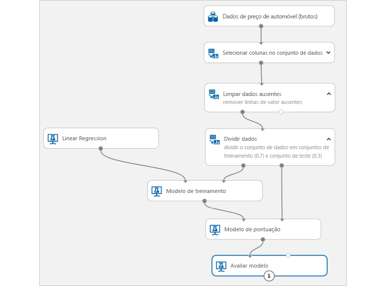

# O que é o Azure Machine Learning?

O Azure Machine Learning é um serviço de nuvem usado para treinar, implantar, automatizar e gerenciar modelos de machine learning, tudo isso na ampla escala oferecida pela nuvem.

## O que aprendizado da máquina?

O Machine Learning é uma técnica da ciência de dados que permite que os computadores usem os dados existentes para prever tendências, resultados e comportamentos futuros. Usando o aprendizado de máquina, os computadores aprendem sem serem explicitamente programados.

As estimativas ou previsões de aprendizado de máquina podem tornar aplicativos e dispositivos mais inteligentes. Por exemplo, quando você faz compras online, o aprendizado de máquina ajuda a recomendar outros produtos que podem lhe agradar com base no que você já comprou. Ou, ao passar seu cartão de crédito, o aprendizado de máquina compara a transação com um banco de dados de transações e ajuda a detectar fraudes. E, quando o aspirador de pó robô aspira uma sala, o aprendizado de máquina ajuda a decidir se o trabalho está concluído.

## O que é o Azure Machine Learning?

O Azure Machine Learning fornece um ambiente baseado em nuvem que pode ser usado para preparar dados, treinar, testar, implantar, gerenciar e acompanhar modelos de machine learning. Inicie o treinamento do seu computador local e expanda para a nuvem. O serviço dá suporte total a tecnologias open-source como PyTorch, TensorFlow e Scikit-learn e pode ser usado para qualquer tipo de aprendizado de máquina, do ML clássico ao aprendizado profundo, supervisionado e não supervisionado.

Explore e prepare dados, treine e teste modelos e implante-os usando ferramentas avançadas como:
+ Uma [interface visual](ui-tutorial-automobile-price-train-score.md) na qual você pode arrastar e soltar módulos para criar seus testes e, em seguida, implantar modelos
+ [Jupyter Notebooks](https://jupyter.org) nos quais você usa os [SDKs](https://docs.microsoft.com/azure/machine-learning) para escrever seu próprio código, tal como [esses notebooks de exemplo](https://aka.ms/aml-notebooks)
+ [Extensão do Visual Studio Code](how-to-vscode-tools.md)

> [!VIDEO https://channel9.msdn.com/Events/Connect/Microsoft-Connect--2018/D240/player]

## O que eu posso fazer com o Azure Machine Learning?

Use o <a href="https://docs.microsoft.com/python/api/overview/azure/ml/intro?view=azure-ml-py" target="_blank">SDK do Python do Azure Machine Learning</a> com pacotes open-source do Python ou a [interface visual (versão prévia)](ui-tutorial-automobile-price-train-score.md) para criar e treinar modelos altamente precisos de machine learning e aprendizado profundo por conta própria em um Workspace do Azure Machine Learning.

É possível escolher entre muitos componentes de aprendizado de máquina disponíveis em pacotes do Python open-source, como <a href="https://scikit-learn.org/stable/" target="_blank">Scikit-learn</a>, <a href="https://www.tensorflow.org" target="_blank">Tensorflow</a>, <a href="https://pytorch.org" target="_blank">PyTorch</a> e <a href="https://mxnet.io" target="_blank">MXNet</a>.

Independentemente se você escreve código ou usa a interface visual, é possível controlar várias execuções à medida que você testa para encontrar a melhor solução, assim como gerenciar os modelos implantados.

### Experiência de primeiro código

Inicie o treinamento em seu computador local usando o <a href="https://docs.microsoft.com/python/api/overview/azure/ml/intro?view=azure-ml-py" target="_blank">SDK do Python do Azure Machine Learning</a> e, em seguida, expanda para a nuvem. Com muitos [destinos de computação](how-to-set-up-training-targets.md) disponíveis, como a Computação do Azure Machine Learning e o [Azure Databricks](/azure/azure-databricks/what-is-azure-databricks), além de [serviços avançados de ajuste de hiperparâmetro](how-to-tune-hyperparameters.md), você pode criar modelos melhores com mais rapidez usando o poder da nuvem.

Também é possível [automatizar o treinamento e o ajuste do modelo](tutorial-auto-train-models.md) usando o SDK.

### Experiência de baixo código baseada na interface do usuário

Para o treinamento sem código, experimente:

+ Como criar [experimentos de ML automatizados](tutorial-first-experiment-automated-ml.md) na interface fácil de usar.
+ A [experimentação do recurso do tipo "arrastar e soltar" na interface visual](ui-tutorial-automobile-price-train-score.md).
  

### Operacionalização (MLOps)

Quando você tem o modelo certo, é possível usá-lo facilmente em um serviço Web, em um dispositivo IoT ou do Power BI. Para obter mais informações, confira o artigo [Como e onde implantar](how-to-deploy-and-where.md).

Em seguida, você pode gerenciar seus modelos implantados usando o [SDK do Azure Machine Learning para Python](https://aka.ms/aml-sdk), o [portal do Azure](https://portal.azure.com/) ou a [página de aterrissagem do workspace (versão prévia)](https://ml.azure.com).

Esses modelos podem ser consumidos e retornar previsões em [tempo real](how-to-consume-web-service.md) ou [assincronamente](how-to-run-batch-predictions.md) em grandes quantidades de dados.

E com [pipelines de aprendizado de máquina](concept-ml-pipelines.md) avançados, é possível colaborar em cada etapa desde a preparação de dados, do treinamento do modelo e da avaliação, por meio da implantação. Os pipelines permitem:

* Automatizar o processo de aprendizado de máquina de ponta a ponta na nuvem
* Reutilizar os componentes e apenas executar as etapas novamente quando necessário
* Usar diferentes recursos de computação em cada etapa
* Executar tarefas de pontuação em lote

Para começar a usar o Azure Machine Learning, confira [Próximas etapas](#next-steps).

## Qual a diferença entre o Azure Machine Learning e o Studio?

O [Machine Learning Studio](../studio/what-is-ml-studio.md) é um workspace visual do tipo "arrastar e soltar" colaborativo em que é possível criar, testar e implantar soluções de aprendizado de máquina sem precisar escrever código. Ele usa algoritmos de aprendizado de máquina predefinidos e pré-configurados e módulos de manipulação de dados, assim como uma plataforma de computação proprietária.

O Azure Machine Learning fornece SDKs **-e-** uma interface visual (versão prévia) para preparar dados rapidamente e treinar e implantar modelos de machine learning. Esta interface visual (versão prévia) oferece uma experiência do tipo "arrastar e soltar" semelhante para o Studio. No entanto, ao contrário da plataforma de computação proprietária do Studio, a interface visual usa seus próprios recursos de computação e é totalmente integrada ao Azure Machine Learning.

Veja uma comparação rápida.

|| Machine Learning Studio | Azure Machine Learning: Interface visual|
|---| --- | --- |
|| GA (em disponibilidade geral) | Em versão prévia|
|Módulos de interface| Muitos | Conjunto inicial de módulos populares|
|Destinos de computação de treinamento| Destino de computação proprietário, apenas suporte à CPU| Dá suporte à computação do Azure Machine Learning, GPU ou CPU. (Outros serviços de computação com suporte no SDK)|
|Destinos de computação de implantação| Formato do serviço Web proprietário, não personalizável | Opções de segurança empresariais e Serviço de Kubernetes do Azure.  ([Outros serviços de computação](how-to-deploy-and-where.md) com suporte no SDK) |
|Treinamento de modelo automatizado e ajuste de hiperparâmetro | Não | Ainda não está na interface visual.   (Com suporte no SDK e no portal do Azure/página de aterrissagem do workspace). |

Experimente a interface visual (versão prévia) com o [Tutorial: Prever o preço de automóveis com a interface visual](ui-tutorial-automobile-price-train-score.md).

> [!NOTE]
> Os modelos criados no Studio não podem ser implantados nem gerenciados pelo Azure Machine Learning. No entanto, os modelos criados e implantados na interface visual do serviço podem ser gerenciados por meio do Workspace do Azure Machine Learning.

## Avaliação gratuita

Se você não tiver uma assinatura do Azure, crie uma conta gratuita antes de começar. Experimente hoje mesmo a [versão gratuita ou paga do Azure Machine Learning](https://aka.ms/AMLFree).

Você recebe créditos para gastar em serviços do Azure. Depois que eles forem utilizados, você poderá manter a conta e usar os [serviços gratuitos do Azure](https://azure.microsoft.com/free/). Seu cartão de crédito nunca será cobrado, a menos que você altere explicitamente suas configurações, solicitando esse tipo de cobrança. Outra opção é [ativar benefícios para assinantes do MSDN](https://azure.microsoft.com/pricing/member-offers/msdn-benefits-details/?WT.mc_id=A261C142F), que concede créditos mensais que podem ser usados para serviços pagos do Azure.

## Próximas etapas

- [Crie um workspace de serviço do Machine Learning](how-to-manage-workspace.md) para começar a usar.

- Siga os tutoriais completos:
  + [Criar um workspace e treinar seu primeiro modelo de ML](tutorial-1st-experiment-sdk-setup.md)
  + [Treinar um modelo de classificação de imagem com o Azure Machine Learning](tutorial-train-models-with-aml.md)

- Saiba mais sobre [pipelines de aprendizado de máquina](/azure/machine-learning/service/concept-ml-pipelines) para compilar, otimizar e gerenciar cenários de aprendizado de máquina.

- Leia o artigo detalhado [Arquitetura e conceitos do Azure Machine Learning](concept-azure-machine-learning-architecture.md).

- Para obter mais informações, confira [outros produtos de aprendizado de máquina da Microsoft](/azure/architecture/data-guide/technology-choices/data-science-and-machine-learning).
