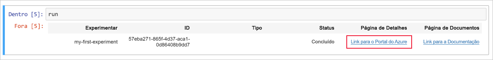

# <a name="quickstart-use-a-cloud-based-notebook-server-to-get-started-with-azure-machine-learning"></a>Início Rápido: Usar um servidor do notebook baseado em nuvem para começar a usar o Azure Machine Learning

Este início rápido ensina a você como começar a usar o serviço do Azure Machine Learning usando um servidor de notebook gerenciado na nuvem. Nenhuma instalação é necessária. Se, em vez disso, você quiser instalar o SDK em seu próprio ambiente Python, confira [Início Rápido: Usar seu próprio servidor do notebook para começar a usar o Azure Machine Learning](quickstart-run-local-notebook.md).

Este início rápido mostra a você como usar o [workspace de serviço do Azure Machine Learning](concept-azure-machine-learning-architecture.md) para acompanhar seus experimentos de ML (aprendizado de máquina). Você faz isso criando uma [máquina virtual do notebook (versão prévia)](how-to-configure-environment.md#notebookvm): uma estação de trabalho segura do Azure baseada em nuvem que fornece um servidor do Jupyter Notebook, o JupyterLab e um ambiente de ML totalmente preparado. Assim, você pode executar um notebook Python nessa VM (máquina virtual) que registra os valores no workspace.

Para fazer isso, execute as seguintes ações:

* Crie um workspace.
* Crie uma VM do notebook no seu espaço de trabalho.
* Abra a interface Web do Jupyter.
* Abra um notebook que contém código para estimar o pi e registrar erros em cada iteração.
* Execute o notebook.
* Exiba os valores de erro registrados em log no workspace. O exemplo a seguir mostra como o workspace ajuda a manter o controle das informações geradas em um script.

Se você não tiver uma assinatura do Azure, crie uma conta gratuita antes de começar. Experimente a [versão gratuita ou paga do serviço do Azure Machine Learning](https://aka.ms/AMLFree).

## <a name="create-a-workspace"></a>Criar um workspace

Se você tiver um workspace do Serviço do Azure Machine Learning, passe para a [próxima seção](#create-notebook). Caso contrário, crie um agora.

[!INCLUDE [aml-create-portal](../../../includes/aml-create-in-portal.md)]

## <a name="create-notebook"></a>Criar uma VM do notebook

 Em seu workspace, crie um recurso de nuvem para começar a usar Jupyter Notebooks. Esse recurso é uma plataforma baseada em nuvem pré-configurada com tudo o que você precisa para executar o serviço do Azure Machine Learning.

1. Abra seu workspace na [portal do Azure](https://portal.azure.com/). Se você não souber direito como localizar seu workspace no portal, veja como [exibir seu workspace](how-to-manage-workspace.md#view).

1. Na página do seu workspace, selecione **VMs de Notebook**, à esquerda.

1. Selecione **+Novo** para criar uma VM de notebook.  

     

1. Forneça um nome para sua VM. Em seguida, selecione **Criar**.

    > [!NOTE]
    > O nome da sua VM de Notebook deve ter entre 2 e 16 caracteres. Letras, dígitos e hifens são caracteres válidos. O nome deve ser exclusivo em toda a sua assinatura do Azure.

    

1. Aguarde aproximadamente de 4 a 5 minutos, até que o status mude para **Executando**.


## <a name="open-the-jupyter-web-interface"></a>Abra a interface Web do Jupyter

Depois que sua VM estiver em execução, use a seção **VMs de Notebook** para abrir a interface Web do Jupyter.

1. Selecione **Jupyter** na coluna **URI** para sua VM.  

    

    O link inicia seu servidor de notebook e abre a página da Web do Jupyter notebook em uma nova guia do navegador.  O link só funcionará para a pessoa que cria a VM.  Cada usuário do workspace deve criar sua própria VM.

1. Na página da Web do Jupyter Notebook, o nome da pasta superior é o seu nome de usuário. Selecione esta pasta.

    > [!TIP]
    > Esta pasta está localizada no [contêiner de armazenamento](concept-workspace.md#resources) em seu espaço de trabalho, não na VM do notebook.  Você pode excluir a VM do notebook e ainda manter todo o seu trabalho.  Quando você criar uma nova VM do notebook posteriormente, ela será carregada dessa mesma pasta.  Se você compartilhar seu workspace com outras pessoas, elas verão sua pasta e você verá as pastas delas. 

1. O nome da pasta de amostras inclui um número de versão (**por exemplo, amostras-1.0.33.1**). Selecione a pasta de amostras.

1. Selecione a pasta **Início Rápido**.

## <a name="run-the-notebook"></a>Executar o notebook

Execute um notebook que estima o pi e registra o erro em seu workspace.

1. Selecione **01.run experiment.ipynb** para abrir o notebook.

1. Se você vir um alerta de "Kernel não encontrado", selecione o kernel **Python 3.6 – AzureML** (localizado aproximadamente na metade da lista) e defina o kernel.

1. Selecione a primeira célula de código e, em seguida, selecione **Executar**.

    > [!NOTE]
    > As células de código têm colchetes antes delas. Se os colchetes estiverem vazios ( __[]__ ), o código não terá sido executado. Enquanto o código está em execução, um asterisco é exibido ( __[*]__ ). Após a conclusão do código, o número **[1]** é exibido.  O número indica a ordem na qual as células foram executadas.
    >
    > Use **Shift + Enter** como um atalho para executar uma célula.

    

1. Execute a segunda célula de código. Se você vir instruções para se autenticar, copie o código e siga o link para entrar. Após entrar, seu navegador se lembrará dessa configuração.  

    

1. Quando a execução da célula de código for bem-sucedida, o número da célula __[2]__ será exibido. Se você precisasse entrar, veria uma mensagem de autenticação bem-sucedida.   Se não tiver que entrar, você não verá nenhuma saída para essa célula. Você verá apenas o número, que é exibido para mostrar que a célula foi executada com sucesso.

    

1. Execute o restante das células de código. À medida que cada célula concluir a execução, o número de célula de cada uma delas será exibido. Somente a última célula exibe qualquer outra saída.  

    Na maior célula de código, `run.log` é exibido em vários lugares. Cada `run.log` adiciona seu valor ao seu workspace.

## <a name="view-logged-values"></a>Exibir valores registrados em log

1. A saída da célula `run` contém um link de volta para o portal do Azure, no qual você pode exibir os resultados do experimento em seu workspace.

    

1. Selecione o **Link para o portal do Azure** para exibir informações sobre a execução em seu workspace. Esse link abre seu workspace no portal do Azure.

1. Os gráficos dos valores registrados que você vê foram criados automaticamente no workspace. Sempre que registra diversos valores com o mesmo parâmetro de nome, um gráfico é gerado automaticamente para você. Veja um exemplo:

   

Já que o código para aproximar o pi usa valores aleatórios, seus gráficos poderão ser diferentes.  

## <a name="clean-up-resources"></a>Limpar recursos

### <a name="stop-the-notebook-vm"></a>Interromper a VM de notebook

Interrompa a VM de notebook quando você não a estiver usando para reduzir o custo.  

1. Em seu workspace, selecione **VMs de Notebook**.

   

1. Selecione a VM na lista.

1. Selecione **Interromper**.

1. Quando estiver pronto para usar o servidor novamente, selecione **Iniciar**.

### <a name="delete-everything"></a>Excluir tudo

[!INCLUDE [aml-delete-resource-group](../../../includes/aml-delete-resource-group.md)]

Você também pode manter o grupo de recursos, mas excluir um único workspace. Exiba as propriedades do workspace e, em seguida, selecione **Excluir**.

## <a name="next-steps"></a>Próximas etapas

Depois de concluir essas tarefas, acesse a página da Web do Jupyter Notebook. Na pasta **Início Rápido**, abra e execute o notebook **02.deploy-web-service.ipynb** para saber como implantar um serviço Web.

Quando quiser instalar outros pacotes do Python em seu ambiente Jupyter, use este código dentro de um notebook:

```
!source activate py36 && pip install <packagename>
```

Novamente na página da Web do Jupyter Notebook, procure entre os outros notebooks da pasta de exemplos para saber mais sobre o serviço do Azure Machine Learning.

Para obter uma experiência de fluxo de trabalho detalhado, siga os tutoriais do Machine Learning para treinar e implantar um modelo:  

> [!div class="nextstepaction"]
> [Tutorial: treinar um modelo de classificação de imagem](tutorial-train-models-with-aml.md)
