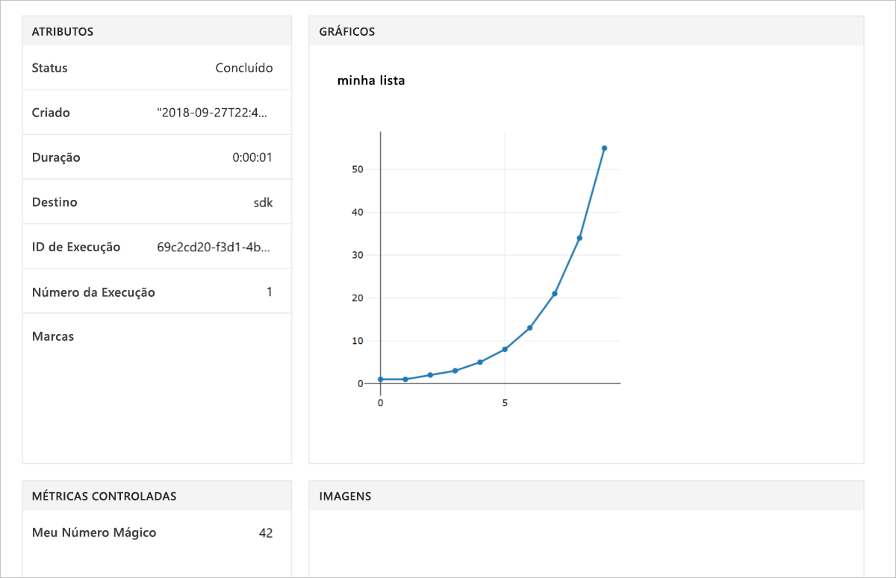

# <a name="quickstart-use-your-own-notebook-server-to-get-started-with-azure-machine-learning"></a>Início Rápido: Usar seu próprio servidor do notebook para começar a usar o Azure Machine Learning

Use seu próprio ambiente Python e o Servidor do Jupyter Notebook para introdução ao serviço do Azure Machine Learning.  Para ver um início rápido sem nenhuma instalação de SDK, confira [Início Rápido: Usar um servidor do notebook baseado em nuvem para começar a usar o Azure Machine Learning](quickstart-run-cloud-notebook.md).

Este início rápido mostra como você pode usar o [espaço de trabalho de serviço do Azure Machine Learning](concept-azure-machine-learning-architecture.md) para acompanhar seus experimentos de aprendizado de máquina. Você executará o código Python que registra os valores no espaço de trabalho.

Exiba uma versão em vídeo deste início rápido:

> [!VIDEO https://www.microsoft.com/videoplayer/embed/RE2G9N6]

Se você não tiver uma assinatura do Azure, crie uma conta gratuita antes de começar. Teste hoje mesmo a [versão gratuita ou paga do Serviço do Azure Machine Learning](https://aka.ms/AMLFree).

## <a name="prerequisites"></a>Pré-requisitos

* Um servidor de notebook do Python 3.6 com o SDK do Azure Machine Learning instalado
* Um workspace de serviço do Azure Machine Learning
* Um arquivo de configuração do espaço de trabalho ( **.azureml/config.json**).

Obtenha todos esses pré-requisitos em [Criar um workspace de serviço do Azure Machine Learning](setup-create-workspace.md#sdk).


## <a name="use-the-workspace"></a>Usar o workspace

Crie um script ou inicie um notebook no mesmo diretório do arquivo de configuração do espaço de trabalho ( **.azureml/config.json**).

### <a name="attach-to-workspace"></a>Anexar ao espaço de trabalho

Esse código lê as informações do arquivo de configuração para anexar ao espaço de trabalho.

```
from azureml.core import Workspace

ws = Workspace.from_config()
```

### <a name="log-values"></a>Valores de log

Execute este código que usa as APIs básicas do SDK para acompanhar execuções do experimento.

1. Crie um experimento no workspace.
1. Registre em log um único valor para o experimento.
1. Faça uma lista de valores para o experimento.

[!code-python[](~/aml-sdk-samples/ignore/doc-qa/quickstart-create-workspace-with-python/quickstart.py?name=useWs)]

## <a name="view-logged-results"></a>Exibir os valores registrados em log

Quando a execução for concluída, você poderá exibir o execução do experimento no portal do Azure. Para imprimir uma URL que direciona você aos resultados da última execução, use o seguinte código:

```python
print(run.get_portal_url())
```

Esse código retorna um link que você pode usar para exibir os valores registrados no portal do Azure em seu navegador.



## <a name="clean-up-resources"></a>Limpar recursos 

>[!IMPORTANT]
>Use os recursos criados aqui como pré-requisitos para outros tutoriais e artigos de instruções sobre o Machine Learning.

Se você não pretende usar os recursos criados neste artigo, exclua-os para evitar a geração de encargos.

[!code-python[](~/aml-sdk-samples/ignore/doc-qa/quickstart-create-workspace-with-python/quickstart.py?name=delete)]

## <a name="next-steps"></a>Próximas etapas

Neste artigo, você criou os recursos necessários para experimentar e implantar modelos. Você executou um código em um notebook e explorou o histórico de execuções desse código no workspace na nuvem.

> [!div class="nextstepaction"]
> [Tutorial: treinar um modelo de classificação de imagem](tutorial-train-models-with-aml.md)

Você também pode explorar [exemplos mais avançados no GitHub](https://aka.ms/aml-notebooks) ou exibir o [guia do usuário do SDK](https://docs.microsoft.com/python/api/overview/azure/ml/intro?view=azure-ml-py).
