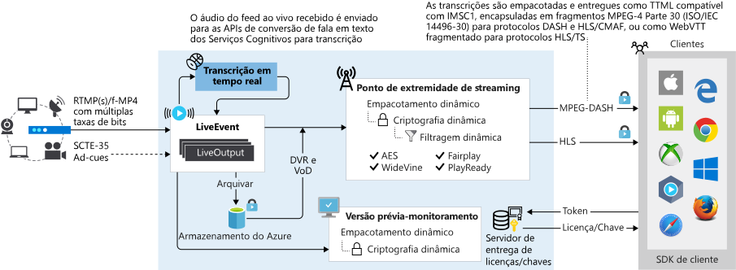

# <a name="dynamic-packaging"></a>Empacotamento dinâmico

Os Serviços de Mídia do Microsoft Azure podem ser usados para fornecer vários formatos de arquivos de mídia de origem, formatos de streaming de mídia e formatos de proteção de conteúdo para diversas tecnologias de cliente (por exemplo, iOS e XBOX). Esses clientes entendem protocolos diferentes, por exemplo, o iOS requer um formato HTTP Live Streaming (HLS), enquanto o Xbox requer Smooth Streaming. Se você tiver um conjunto de arquivos MP4 (mídia base ISO 14496-12) de taxa de bits adaptável (múltiplas taxas de bits) ou um conjunto de arquivos Smooth Streaming de taxa de bits adaptável que queira fornecer a clientes que entendam HLS, MPEG DASH ou Smooth Streaming, pode se beneficiar do *Empacotamento dinâmico*. O empacotamento é independente de resolução de vídeo, SD/HD/UHD-4K têm suporte.

Nos Serviços de Mídia, um [Ponto de Extremidade de Streaming](streaming-endpoint-concept.md) representa um serviço de origem e empacotamento dinâmico (just-in-time) que pode fornecer seu conteúdo ao vivo e sob demanda diretamente para um aplicativo de reprodução de cliente, usando um dos protocolos de mídia de transmissão comuns (HLS ou DASH). O empacotamento dinâmico é um recurso que vem por padrão em todos os **Pontos de Extremidade de Streaming** (Standard ou Premium). 

Para se beneficiar do empacotamento dinâmico, você precisa ter um **Ativo** com um conjunto de arquivos MP4 de taxa de bits adaptável e arquivos de configuração de streaming requeridos pelo empacotamento dinâmico dos Serviços de Mídia. Uma maneira de obter os arquivos é codificar seu arquivo mezanino (fonte) com os Serviços de Mídia. Para fazer vídeos no ativo codificado disponível para clientes de reprodução, você precisará criar um **Localizador de Streaming** e URLs de streaming. Em seguida, com base no formato especificado no manifesto do cliente de streaming (HLS, DASH ou Smooth), você recebe o fluxo no protocolo que você escolheu.

Como resultado você só precisa armazenar e pagar pelos arquivos em um único formato de armazenamento, e os Serviços de Mídia vão criar e fornecer a resposta apropriada com base nas solicitações de um cliente. 

Nos Serviços de Mídia, o empacotamento dinâmico é usado, independentemente de você estar transmitindo ao vivo ou sob demanda. 

> [!NOTE]
> Atualmente, você não pode usar o portal do Azure para gerenciar recursos da v3. Use a [API REST](https://aka.ms/ams-v3-rest-ref), a [CLI](https://aka.ms/ams-v3-cli-ref) ou um dos [SDKs](media-services-apis-overview.md#sdks) com suporte.

## <a name="on-demand-streaming-workflow"></a>Fluxo de trabalho do streaming sob demanda

Aqui está um fluxo de trabalho comum para o streaming sob demanda de Serviços de Mídia com empacotamento dinâmico:

1. Carregar um arquivo de entrada ou fonte (chamado de arquivo de *mezanino*). Exemplos incluem um arquivo MP4, MOV ou MXF. 
1. Codifique o arquivo de mezanino para conjuntos de taxa de bits adaptável MP4 H.264. 
1. Publicar o ativo que contém o conjunto MP4 de taxa de bits adaptável. Você publica criando um localizador de streaming.
1. Criar URLs que segmentam diferentes formatos (HLS, MPEG-DASH e Smooth Streaming). O ponto de extremidade de streaming cuida de servir o manifesto correto e solicita os diferentes formatos.

Este diagrama mostra o fluxo de trabalho para streaming sob demanda com empacotamento dinâmico:


## <a name="live-streaming-workflow"></a>Fluxo de trabalho de streaming ao vivo

Um evento ao vivo pode ser de dois tipos: passagem ou codificação ativa. 

Aqui está um fluxo de trabalho comum para transmissão ao vivo com empacotamento dinâmico:

1. Crie um [evento ao vivo](live-events-outputs-concept.md).
1. Obtenha a URL de ingestão e configure seu codificador local para usar a URL no envio do feed de contribuição.
1. Obtenha a URL de visualização e use-a para verificar se a entrada do codificador está sendo recebida.
1. Crie um novo ativo.
1. Crie uma saída dinâmica e use o nome do ativo que você criou.<br />A saída dinâmica arquiva o fluxo no ativo.
1. Crie um localizador de streaming com os tipos internos da política de streaming.<br />Se você pretende criptografar seu conteúdo, reveja a [Visão geral da proteção de conteúdo](content-protection-overview.md).
1. Liste os caminhos no localizador de streaming para retornar as URLs a serem usadas.
1. Obtenha o nome do host para o ponto de extremidade de streaming do qual você deseja transmitir.
1. Criar URLs que segmentam diferentes formatos (HLS, MPEG-DASH e Smooth Streaming). O ponto de extremidade de streaming cuida de servir o manifesto correto e solicita os diferentes formatos.

Este diagrama mostra o fluxo de trabalho para transmissão ao vivo com empacotamento dinâmico:



Para obter informações sobre transmissão ao vivo nos Serviços de Mídia v3, confira [Visão geral de transmissão ao vivo](live-streaming-overview.md).

## <a name="delivery-protocols"></a>Protocolos de entrega

Você pode usar esses protocolos de entrega para o seu conteúdo no pacote dinâmico de Serviços de Mídia:

|Protocolo|Exemplo|
|---|---|
|HLS V4 |`https://amsv3account-usw22.streaming.media.azure.net/21b17732-0112-4d76-b526-763dcd843449/ignite.ism/manifest(format=m3u8-aapl)`|
|HLS V3 |`https://amsv3account-usw22.streaming.media.azure.net/21b17732-0112-4d76-b526-763dcd843449/ignite.ism/manifest(format=m3u8-aapl-v3)`|
|HLS CMAF| `https://amsv3account-usw22.streaming.media.azure.net/21b17732-0112-4d76-b526-763dcd843449/ignite.ism/manifest(format=m3u8-cmaf)`|
|MPEG-DASH CSF| `https://amsv3account-usw22.streaming.media.azure.net/21b17732-0112-4d76-b526-763dcd843449/ignite.ism/manifest(format=mpd-time-csf)` |
|MPEG-DASH CMAF|`https://amsv3account-usw22.streaming.media.azure.net/21b17732-0112-4d76-b526-763dcd843449/ignite.ism/manifest(format=mpd-time-cmaf)` |
|Smooth Streaming| `https://amsv3account-usw22.streaming.media.azure.net/21b17732-0112-4d76-b526-763dcd843449/ignite.ism/manifest`|

## <a name="encode-to-adaptive-bitrate-mp4s"></a>Codificar para MP4s de taxa de bits adaptável

Os artigos a seguir mostram exemplos de [como codificar um vídeo com os Serviços de Mídia](encoding-concept.md):

* [Codificar de uma URL HTTPS usando predefinições internas](job-input-from-http-how-to.md)
* [Codificar um arquivo local usando predefinições internas](job-input-from-local-file-how-to.md)
* [Criar uma predefinição personalizada para segmentar seu cenário específico ou requisitos de dispositivo](customize-encoder-presets-how-to.md)

Confira a lista de [codecs e formatos](media-encoder-standard-formats.md) do Media Encoder Standard.

## <a name="video-codecs"></a>Codecs de vídeo

O empacotamento dinâmico oferece suporte aos seguintes codecs de vídeo:
* Arquivos MP4 files, que contêm vídeo codificado com [H.264](https://en.m.wikipedia.org/wiki/H.264/MPEG-4_AVC) (MPEG-4 AVC ou AVC1) ou [H.265](https://en.m.wikipedia.org/wiki/High_Efficiency_Video_Coding) (HEVC, hev1, ou hvc1).

## <a name="audio-codecs"></a>Codecs de áudio

O empacotamento dinâmico oferece suporte aos seguintes protocolos de áudio:
* Arquivos MP4
* Várias faixas de áudio

O empacotamento dinâmico não oferece suporte a arquivos que contenham áudio [Dolby Digital](https://en.wikipedia.org/wiki/Dolby_Digital) (AC3) (codec herdado).

### <a name="mp4-files"></a>Arquivos MP4

O empacotamento dinâmico oferece suporte a arquivos MP4, que contêm áudio é codificado com os seguintes protocolos: 

* [AAC](https://en.wikipedia.org/wiki/Advanced_Audio_Coding) (AAC-LC, HE-AAC v1, ou HE-AAC v2)
* [Dolby Digital Plus](https://en.wikipedia.org/wiki/Dolby_Digital_Plus) (AC-3 ou E-AC3 avançado)
* Dolby Atmos<br />
   O streaming de conteúdo Dolby Atmos tem suporte para padrões como o protocolo MPEG-DASH com formato CSF (Common Streaming Format) ou MP4 fragmentado CMAF (Common Media Application Format) e via HTTP Live Streaming (HLS) com CMAF.

* [DTS](https://en.wikipedia.org/wiki/DTS_%28sound_system%29)<br />
   Os codecs DTS com suporte pelos formatos de pacote DASH-CSF, DASH-CMAF, HLS-M2TS e HLS-CMAF são:  

    * DTS Digital Surround (dtsc)
    * DTS-HD High Resolution e DTS-HD Master Audio  (dtsh)
    * DTS Express (dtse)
    * DTS-HD Lossless (no core) (dtsl)

### <a name="multiple-audio-tracks"></a>Várias faixas de áudio

O empacotamento dinâmico oferece suporte a múltiplas faixas de áudio para saída HLS (versão 4 ou posterior) para recursos de streaming que possuem várias faixas de áudio com vários codecs e idiomas.

## <a name="dynamic-encryption"></a>Criptografia dinâmica

Você pode usar *criptografia dinâmica* para criptografar dinamicamente seu conteúdo ao vivo ou sob demanda com o AES-128 ou qualquer um dos três sistemas principais de gerenciamento de direitos digitais (DRM): Microsoft PlayReady, Google Widevine e Apple FairPlay. Os Serviços de Mídia também fornecem um serviço para entrega de chaves AES e licenças DRM a clientes autorizados. Para saber mais, confira [criptografia dinâmica](content-protection-overview.md).

## <a name="manifest-examples"></a>Exemplos de manifesto 
 
No empacotamento dinâmico dos Serviços de Mídia, os manifestos do cliente de streaming para HLS, MPEG-DASH e Smooth Streaming são gerados dinamicamente com base no seletor de formato na URL. Para saber mais, confira [protocolos de entrega](#delivery-protocols). 

Um arquivo de manifesto inclui o streaming de metadados, como: tipo da trilha (áudio, vídeo ou texto), nome da trilha, hora de início e término, taxa de bits (qualidades), idiomas da trilha, janela de apresentação (janela deslizante de duração fixa) e codec de vídeo (FourCC). Também instrui o player a recuperar o próximo fragmento, fornecendo informações sobre os próximos fragmentos de vídeo executáveis que estão disponíveis e sua localização. Os fragmentos (ou segmentos) são os "pedaços" reais de um conteúdo de vídeo.

### <a name="hls"></a>HLS

Aqui está um exemplo de um arquivo de manifesto HLS, também chamado de uma lista de reprodução principal HLS: 

```
#EXTM3U
#EXT-X-VERSION:4
#EXT-X-MEDIA:TYPE=AUDIO,GROUP-ID="audio",NAME="aac_eng_2_128041_2_1",LANGUAGE="eng",DEFAULT=YES,AUTOSELECT=YES,URI="QualityLevels(128041)/Manifest(aac_eng_2_128041_2_1,format=m3u8-aapl)"
#EXT-X-STREAM-INF:BANDWIDTH=536608,RESOLUTION=320x180,CODECS="avc1.64000d,mp4a.40.2",AUDIO="audio"
QualityLevels(381048)/Manifest(video,format=m3u8-aapl)
#EXT-X-I-FRAME-STREAM-INF:BANDWIDTH=536608,RESOLUTION=320x180,CODECS="avc1.64000d",URI="QualityLevels(381048)/Manifest(video,format=m3u8-aapl,type=keyframes)"
#EXT-X-STREAM-INF:BANDWIDTH=884544,RESOLUTION=480x270,CODECS="avc1.640015,mp4a.40.2",AUDIO="audio"
QualityLevels(721495)/Manifest(video,format=m3u8-aapl)
#EXT-X-I-FRAME-STREAM-INF:BANDWIDTH=884544,RESOLUTION=480x270,CODECS="avc1.640015",URI="QualityLevels(721495)/Manifest(video,format=m3u8-aapl,type=keyframes)"
#EXT-X-STREAM-INF:BANDWIDTH=1327398,RESOLUTION=640x360,CODECS="avc1.64001e,mp4a.40.2",AUDIO="audio"
QualityLevels(1154816)/Manifest(video,format=m3u8-aapl)
#EXT-X-I-FRAME-STREAM-INF:BANDWIDTH=1327398,RESOLUTION=640x360,CODECS="avc1.64001e",URI="QualityLevels(1154816)/Manifest(video,format=m3u8-aapl,type=keyframes)"
#EXT-X-STREAM-INF:BANDWIDTH=2413312,RESOLUTION=960x540,CODECS="avc1.64001f,mp4a.40.2",AUDIO="audio"
QualityLevels(2217354)/Manifest(video,format=m3u8-aapl)
#EXT-X-I-FRAME-STREAM-INF:BANDWIDTH=2413312,RESOLUTION=960x540,CODECS="avc1.64001f",URI="QualityLevels(2217354)/Manifest(video,format=m3u8-aapl,type=keyframes)"
#EXT-X-STREAM-INF:BANDWIDTH=3805760,RESOLUTION=1280x720,CODECS="avc1.640020,mp4a.40.2",AUDIO="audio"
QualityLevels(3579827)/Manifest(video,format=m3u8-aapl)
#EXT-X-I-FRAME-STREAM-INF:BANDWIDTH=3805760,RESOLUTION=1280x720,CODECS="avc1.640020",URI="QualityLevels(3579827)/Manifest(video,format=m3u8-aapl,type=keyframes)"
#EXT-X-STREAM-INF:BANDWIDTH=139017,CODECS="mp4a.40.2",AUDIO="audio"
QualityLevels(128041)/Manifest(aac_eng_2_128041_2_1,format=m3u8-aapl)
```

### <a name="mpeg-dash"></a>MPEG-DASH

Aqui está um exemplo de um arquivo de manifesto MPEG-DASH, também chamado MPEG-DASH Media Presentation Description (MPD):

```xml
<?xml version="1.0" encoding="UTF-8"?>
<MPD xmlns="urn:mpeg:dash:schema:mpd:2011" xmlns:xsi="https://www.w3.org/2001/XMLSchema-instance" profiles="urn:mpeg:dash:profile:isoff-live:2011" type="static" mediaPresentationDuration="PT1M10.315S" minBufferTime="PT7S">
   <Period>
      <AdaptationSet id="1" group="5" profiles="ccff" bitstreamSwitching="false" segmentAlignment="true" contentType="audio" mimeType="audio/mp4" codecs="mp4a.40.2" lang="en">
         <SegmentTemplate timescale="10000000" media="QualityLevels($Bandwidth$)/Fragments(aac_eng_2_128041_2_1=$Time$,format=mpd-time-csf)" initialization="QualityLevels($Bandwidth$)/Fragments(aac_eng_2_128041_2_1=i,format=mpd-time-csf)">
            <SegmentTimeline>
               <S d="60160000" r="10" />
               <S d="41386666" />
            </SegmentTimeline>
         </SegmentTemplate>
         <Representation id="5_A_aac_eng_2_128041_2_1_1" bandwidth="128041" audioSamplingRate="48000" />
      </AdaptationSet>
      <AdaptationSet id="2" group="1" profiles="ccff" bitstreamSwitching="false" segmentAlignment="true" contentType="video" mimeType="video/mp4" codecs="avc1.640020" maxWidth="1280" maxHeight="720" startWithSAP="1">
         <SegmentTemplate timescale="10000000" media="QualityLevels($Bandwidth$)/Fragments(video=$Time$,format=mpd-time-csf)" initialization="QualityLevels($Bandwidth$)/Fragments(video=i,format=mpd-time-csf)">
            <SegmentTimeline>
               <S d="60060000" r="10" />
               <S d="42375666" />
            </SegmentTimeline>
         </SegmentTemplate>
         <Representation id="1_V_video_1" bandwidth="3579827" width="1280" height="720" />
         <Representation id="1_V_video_2" bandwidth="2217354" codecs="avc1.64001F" width="960" height="540" />
         <Representation id="1_V_video_3" bandwidth="1154816" codecs="avc1.64001E" width="640" height="360" />
         <Representation id="1_V_video_4" bandwidth="721495" codecs="avc1.640015" width="480" height="270" />
         <Representation id="1_V_video_5" bandwidth="381048" codecs="avc1.64000D" width="320" height="180" />
      </AdaptationSet>
   </Period>
</MPD>
```
### <a name="smooth-streaming"></a>Smooth Streaming

Aqui está um exemplo de um arquivo de manifesto de Smooth Streaming:

```xml
<?xml version="1.0" encoding="UTF-8"?>
<SmoothStreamingMedia MajorVersion="2" MinorVersion="2" Duration="703146666" TimeScale="10000000">
   <StreamIndex Chunks="12" Type="audio" Url="QualityLevels({bitrate})/Fragments(aac_eng_2_128041_2_1={start time})" QualityLevels="1" Language="eng" Name="aac_eng_2_128041_2_1">
      <QualityLevel AudioTag="255" Index="0" BitsPerSample="16" Bitrate="128041" FourCC="AACL" CodecPrivateData="1190" Channels="2" PacketSize="4" SamplingRate="48000" />
      <c t="0" d="60160000" r="11" />
      <c d="41386666" />
   </StreamIndex>
   <StreamIndex Chunks="12" Type="video" Url="QualityLevels({bitrate})/Fragments(video={start time})" QualityLevels="5">
      <QualityLevel Index="0" Bitrate="3579827" FourCC="H264" MaxWidth="1280" MaxHeight="720" CodecPrivateData="0000000167640020ACD9405005BB011000003E90000EA600F18319600000000168EBECB22C" />
      <QualityLevel Index="1" Bitrate="2217354" FourCC="H264" MaxWidth="960" MaxHeight="540" CodecPrivateData="000000016764001FACD940F0117EF01100000303E90000EA600F1831960000000168EBECB22C" />
      <QualityLevel Index="2" Bitrate="1154816" FourCC="H264" MaxWidth="640" MaxHeight="360" CodecPrivateData="000000016764001EACD940A02FF9701100000303E90000EA600F162D960000000168EBECB22C" />
      <QualityLevel Index="3" Bitrate="721495" FourCC="H264" MaxWidth="480" MaxHeight="270" CodecPrivateData="0000000167640015ACD941E08FEB011000003E90000EA600F162D9600000000168EBECB22C" />
      <QualityLevel Index="4" Bitrate="381048" FourCC="H264" MaxWidth="320" MaxHeight="180" CodecPrivateData="000000016764000DACD941419F9F011000003E90000EA600F14299600000000168EBECB22C" />
      <c t="0" d="60060000" r="11" />
      <c d="42375666" />
   </StreamIndex>
</SmoothStreamingMedia>
```

## <a name="dynamic-manifest"></a>Manifesto dinâmico

Para controlar o número de faixas, formatos, taxas de bits e janelas de tempo de apresentação que são enviadas aos players, você pode usar a filtragem dinâmica com o empacotador dinâmico dos Serviços de Mídia. Para saber mais, confira [Pré-filtragem de manifestos com o empacotador dinâmico](filters-dynamic-manifest-overview.md).

## <a name="more-information"></a>Mais informações

Confira a [comunidade dos Serviços de Mídia do Azure](media-services-community.md) para ver diferentes maneiras de fazer perguntas, comentários e obter atualizações sobre os serviços de mídia.

## <a name="next-steps"></a>Próximas etapas

Saiba como [carregar, codificar e transmitir vídeos](stream-files-tutorial-with-api.md).

