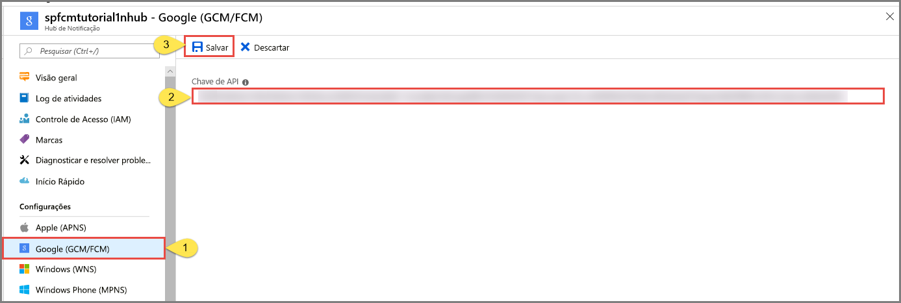

# <a name="tutorial-push-notifications-to-android-devices-by-using-azure-notification-hubs-and-google-firebase-cloud-messaging"></a>Tutorial: Enviar notificações por push para dispositivos Android usando Hubs de Notificação do Azure e Google Firebase Cloud Messaging

[!INCLUDE [notification-hubs-selector-get-started](../../includes/notification-hubs-selector-get-started.md)]

Este tutorial mostra como usar os Hubs de Notificação do Azure e o FCM (Firebase Cloud Messaging) para enviar notificações por push a um aplicativo do Android. Neste tutorial, você cria um aplicativo Android em branco que recebe notificações por push usando o FCM.

O código completo deste tutorial pode ser baixado [no GitHub](https://github.com/Azure/azure-notificationhubs-android/tree/master/samples/FCMTutorialApp).

Neste tutorial, você deve executar as seguintes etapas:

> [!div class="checklist"]
> * Criar um projeto do Android Studio.
> * Criar um projeto do Firebase que ofereça suporte ao Firebase Cloud Messaging.
> * Criar um hub.
> * Conectar seu aplicativo ao hub.
> * Testar o aplicativo.

## <a name="prerequisites"></a>Pré-requisitos

Para concluir este tutorial, você precisa ter uma conta ativa do Azure. Se não tiver uma conta, você poderá criar uma conta de avaliação gratuita em apenas alguns minutos. Para obter detalhes, consulte [Avaliação gratuita do Azure](https://azure.microsoft.com/free/). 

Você também precisará dos seguintes itens: 

* A versão mais recente do [Android Studio](https://go.microsoft.com/fwlink/?LinkId=389797)
* Android 2.3 ou superior para Firebase Cloud Messaging
* A revisão 27 ou superior do Repositório do Google para o Firebase Cloud Messaging
* Google Play Services 9.0.2 ou superior para Firebase Cloud Messaging

A conclusão deste tutorial é um pré-requisito para prosseguir com todos os outros tutoriais sobre Hubs de Notificação para aplicativos Android.

## <a name="create-an-android-studio-project"></a>Criar um projeto do Android Studio

1. Inicie o Android Studio.
2. Selecione **Arquivo**, aponte para **Novo** e selecione **Novo Projeto**. 
2. Na página **Escolher o projeto**, selecione **Atividade vazia** e, em seguida, selecione **Avançar**. 
3. Na página **Configurar o projeto**, siga as seguintes etapas: 
    1. Insira um nome para o aplicativo.
    2. Especifique um local para salvar os arquivos do projeto. 
    3. Selecione **Concluir**. 

        

## <a name="create-a-firebase-project-that-supports-fcm"></a>Crie um projeto do Firebase que ofereça suporte ao FCM

[!INCLUDE [notification-hubs-enable-firebase-cloud-messaging](../../includes/notification-hubs-enable-firebase-cloud-messaging.md)]

## <a name="configure-a-hub"></a>Configurar um hub

[!INCLUDE [notification-hubs-portal-create-new-hub](../../includes/notification-hubs-portal-create-new-hub.md)]

### <a name="configure-firebase-cloud-messaging-settings-for-the-hub"></a>Definir as configurações do Firebase Cloud Messaging para o hub

1. No painel esquerdo, em **Configurações**, selecione **Google (GCM/FCM)** . 
2. Insira a **chave do servidor** do projeto do FCM, salva anteriormente. 
3. Na barra de ferramentas, selecione **Salvar**. 

    
4. O portal do Azure exibirá uma mensagem como alertas indicando que o hub foi atualizado com êxito. O botão **Salvar** está desabilitado. 

O serviço agora está configurado para trabalhar com o Firebase Cloud Messaging. Você também tem as cadeias de caracteres de conexão que são necessárias para enviar notificações para um dispositivo e registrar um aplicativo para receber notificações.

## <a id="connecting-app"></a>Conectar seu aplicativo ao hub de notificação

### <a name="add-google-play-services-to-the-project"></a>Adicionar serviços do Google Play ao projeto

1. No Android Studio, selecione **Ferramentas** no menu e selecione **Gerenciador do SDK**. 
2. Selecione a versão de destino do SDK do Android que é usada em seu projeto. Em seguida, selecione **Mostrar detalhes do pacote**. 

    
3. Selecione **APIs do Google**, caso ainda não estejam instaladas.

    
4. Alterne para a guia **SDK Tools**. Caso ainda não tenha instalado o Google Play Services, selecione **Google Play Services**, conforme mostrado na imagem a seguir. Em seguida, selecione **Aplicar** para instalar. Anote o caminho do SDK, a ser usado em uma etapa posterior.

    
3. Se a caixa de diálogo **Confirmar Alteração** for exibida, selecione **OK**. O Instalador de Componente instalará os componentes solicitados. Selecione **Concluir** depois que os componentes forem instalados.
4. Selecione **OK** para fechar a caixa de diálogo **Configurações para Novos Projetos**.  
1. Abra o arquivo AndroidManifest.xml e adicione a seguinte marca ao *aplicativo*.

    ```xml
    <meta-data android:name="com.google.android.gms.version"
         android:value="@integer/google_play_services_version" />
    ```


### <a name="add-azure-notification-hubs-libraries"></a>Adicionar bibliotecas de Hubs de Notificação do Azure

1. No arquivo Build.Gradle do aplicativo, adicione as seguintes linhas na seção de dependências.

    ```gradle
    implementation 'com.microsoft.azure:notification-hubs-android-sdk:0.6@aar'
    ```

2. Adicione o seguinte repositório após a seção dependencies .

    ```gradle
    repositories {
        maven {
            url "https://dl.bintray.com/microsoftazuremobile/SDK"
        }
    }
    ```

### <a name="add-google-firebase-support"></a>Adicionar suporte ao Google Firebase

1. No arquivo Build.Gradle do aplicativo, adicione as seguintes linhas na seção de **dependências** se elas ainda não existirem. 

    ```gradle
    implementation 'com.google.firebase:firebase-core:16.0.8'
    implementation 'com.google.firebase:firebase-messaging:17.3.4'
    ```

2. Adicione o plug-in a seguir ao final do arquivo, caso ele ainda não esteja lá. 

    ```gradle
    apply plugin: 'com.google.gms.google-services'
    ```
3. Selecione **Sincronizar Agora** na barra de ferramentas.

### <a name="update-the-androidmanifestxml-file"></a>Atualizar o arquivo AndroidManifest.xml

1. Depois de receber seu token de registro do FCM, use-o para [se registrar nos Hubs de Notificação do Azure](notification-hubs-push-notification-registration-management.md). Você oferecerá suporte a esse registro em segundo plano, usando um `IntentService` chamado `RegistrationIntentService`. Esse serviço também atualiza seu token de registro do FCM. Você também cria uma classe chamada `FirebaseService` como uma subclasse de `FirebaseMessagingService` e substitui o método `onMessageReceived` para receber e manipular notificações. 

    Adicione a seguinte definição de serviço ao arquivo Androidmanifest.xml, dentro da marcação `<application>` .

    ```xml
    <service
        android:name=".RegistrationIntentService"
        android:exported="false">
    </service>
    <service
        android:name=".FirebaseService"
        android:exported="false">
        <intent-filter>
            <action android:name="com.google.firebase.MESSAGING_EVENT" />
        </intent-filter>
    </service>
    ```
3. Adicione as permissões necessárias relacionadas ao FCM a seguir abaixo da marca `</application>`.

    ```xml
    <uses-permission android:name="android.permission.INTERNET"/>
    <uses-permission android:name="android.permission.GET_ACCOUNTS"/>
    <uses-permission android:name="com.google.android.c2dm.permission.RECEIVE" />
    ```

### <a name="add-code"></a>Incluir código

1. Na Exibição de Projeto, expanda **app** > **src** > **main** > **java**. Clique com o botão direto do mouse na pasta do seu pacote, em **java**, selecione **Novo** e, em seguida, **Classe Java**. Insira **NotificationSettings** como nome e, em seguida, selecione **OK**.

    Atualize esses três espaços reservados no código a seguir para a classe `NotificationSettings`:

   * **HubListenConnectionString**: a cadeia de conexão **DefaultListenAccessSignature** do hub. É possível copiar essa cadeia de conexão clicando em **Políticas de Acesso** no hub no [portal do Azure].
   * **HubName**: Use o nome do hub de notificação que aparece na página do hub no [Portal do Azure].

     `NotificationSettings` :

        ```java
        public class NotificationSettings {
            public static String HubName = "<Your HubName>";
            public static String HubListenConnectionString = "<Enter your DefaultListenSharedAccessSignature connection string>";
        }
        ```

     > [!IMPORTANT]
     > Insira o **nome** e a **DefaultListenSharedAccessSignature** de seu hub antes de prosseguir. 

3. Adicione outra classe nova ao projeto denominada `RegistrationIntentService`. Essa classe implementa a interface `IntentService`. Ela também processa a [atualização do token do FCM](https://developers.google.com/instance-id/guides/android-implementation#refresh_tokens) e o [registro no hub de notificação](notification-hubs-push-notification-registration-management.md).

    Use o código a seguir para essa classe.

    ```java
    import android.app.IntentService;
    import android.content.Intent;
    import android.content.SharedPreferences;
    import android.preference.PreferenceManager;
    import android.util.Log;
    import com.google.android.gms.tasks.OnSuccessListener;
    import com.google.firebase.iid.FirebaseInstanceId;
    import com.google.firebase.iid.InstanceIdResult;
    import com.microsoft.windowsazure.messaging.NotificationHub;
    import java.util.concurrent.TimeUnit;

    public class RegistrationIntentService extends IntentService {

        private static final String TAG = "RegIntentService";
        String FCM_token = null;

        private NotificationHub hub;

        public RegistrationIntentService() {
            super(TAG);
        }

        @Override
        protected void onHandleIntent(Intent intent) {

            SharedPreferences sharedPreferences = PreferenceManager.getDefaultSharedPreferences(this);
            String resultString = null;
            String regID = null;
            String storedToken = null;

            try {
                FirebaseInstanceId.getInstance().getInstanceId().addOnSuccessListener(new OnSuccessListener<InstanceIdResult>() { 
                    @Override 
                    public void onSuccess(InstanceIdResult instanceIdResult) { 
                        FCM_token = instanceIdResult.getToken(); 
                        Log.d(TAG, "FCM Registration Token: " + FCM_token); 
                    } 
                }); 
                TimeUnit.SECONDS.sleep(1);

                // Storing the registration ID that indicates whether the generated token has been
                // sent to your server. If it is not stored, send the token to your server.
                // Otherwise, your server should have already received the token.
                if (((regID=sharedPreferences.getString("registrationID", null)) == null)){

                    NotificationHub hub = new NotificationHub(NotificationSettings.HubName,
                            NotificationSettings.HubListenConnectionString, this);
                    Log.d(TAG, "Attempting a new registration with NH using FCM token : " + FCM_token);
                    regID = hub.register(FCM_token).getRegistrationId();

                    // If you want to use tags...
                    // Refer to : https://azure.microsoft.com/documentation/articles/notification-hubs-routing-tag-expressions/
                    // regID = hub.register(token, "tag1,tag2").getRegistrationId();

                    resultString = "New NH Registration Successfully - RegId : " + regID;
                    Log.d(TAG, resultString);

                    sharedPreferences.edit().putString("registrationID", regID ).apply();
                    sharedPreferences.edit().putString("FCMtoken", FCM_token ).apply();
                }

                // Check to see if the token has been compromised and needs refreshing.
                else if ((storedToken=sharedPreferences.getString("FCMtoken", "")) != FCM_token) {

                    NotificationHub hub = new NotificationHub(NotificationSettings.HubName,
                            NotificationSettings.HubListenConnectionString, this);
                    Log.d(TAG, "NH Registration refreshing with token : " + FCM_token);
                    regID = hub.register(FCM_token).getRegistrationId();

                    // If you want to use tags...
                    // Refer to : https://azure.microsoft.com/documentation/articles/notification-hubs-routing-tag-expressions/
                    // regID = hub.register(token, "tag1,tag2").getRegistrationId();

                    resultString = "New NH Registration Successfully - RegId : " + regID;
                    Log.d(TAG, resultString);

                    sharedPreferences.edit().putString("registrationID", regID ).apply();
                    sharedPreferences.edit().putString("FCMtoken", FCM_token ).apply();
                }

                else {
                    resultString = "Previously Registered Successfully - RegId : " + regID;
                }
            } catch (Exception e) {
                Log.e(TAG, resultString="Failed to complete registration", e);
                // If an exception happens while fetching the new token or updating registration data
                // on a third-party server, this ensures that we'll attempt the update at a later time.
            }

            // Notify UI that registration has completed.
            if (MainActivity.isVisible) {
                MainActivity.mainActivity.ToastNotify(resultString);
            }
        }
    }
    ```

4. Na classe `MainActivity`, adicione as seguintes instruções `import` acima da declaração da classe.

    ```java
    import com.google.android.gms.common.ConnectionResult;
    import com.google.android.gms.common.GoogleApiAvailability;
    import android.content.Intent;
    import android.util.Log;
    import android.widget.TextView;
    import android.widget.Toast;
    ```

5. Adicione os membros a seguir à parte superior da classe. Use esses campos para [verificar a disponibilidade do Google Play Services, conforme recomendado pelo Google](https://developers.google.com/android/guides/setup#ensure_devices_have_the_google_play_services_apk).

    ```java
    public static MainActivity mainActivity;
    public static Boolean isVisible = false;
    private static final String TAG = "MainActivity";
    private static final int PLAY_SERVICES_RESOLUTION_REQUEST = 9000;
    ```

6. Na classe `MainActivity`, adicione o método a seguir para verificar a disponibilidade do Google Play Services.

    ```java
    /**
    * Check the device to make sure it has the Google Play Services APK. If
    * it doesn't, display a dialog box that enables  users to download the APK from
    * the Google Play Store or enable it in the device's system settings.
    */

    private boolean checkPlayServices() {
        GoogleApiAvailability apiAvailability = GoogleApiAvailability.getInstance();
        int resultCode = apiAvailability.isGooglePlayServicesAvailable(this);
        if (resultCode != ConnectionResult.SUCCESS) {
            if (apiAvailability.isUserResolvableError(resultCode)) {
                apiAvailability.getErrorDialog(this, resultCode, PLAY_SERVICES_RESOLUTION_REQUEST)
                        .show();
            } else {
                Log.i(TAG, "This device is not supported by Google Play Services.");
                ToastNotify("This device is not supported by Google Play Services.");
                finish();
            }
            return false;
        }
        return true;
    }
    ```

7. Na classe `MainActivity`, adicione o seguinte código que verifica o Google Play Services antes de chamar o `IntentService` para obter seu token de registro do FCM e registrá-lo com o seu hub:

    ```java
    public void registerWithNotificationHubs()
    {
        if (checkPlayServices()) {
            // Start IntentService to register this application with FCM.
            Intent intent = new Intent(this, RegistrationIntentService.class);
            startService(intent);
        }
    }
    ```

8. No método `OnCreate` da classe `MainActivity`, adicione o código a seguir para começar o processo de registro quando a atividade for criada:

    ```java
    @Override
    protected void onCreate(Bundle savedInstanceState) {
        super.onCreate(savedInstanceState);
        setContentView(R.layout.activity_main);

        mainActivity = this;
        registerWithNotificationHubs();
        FirebaseService.createChannelAndHandleNotifications(getApplicationContext());
    }
    ```

9. Para verificar o estado do aplicativo e informar o status em seu aplicativo, inclua estes métodos adicionais a `MainActivity`:

    ```java
    @Override
    protected void onStart() {
        super.onStart();
        isVisible = true;
    }

    @Override
    protected void onPause() {
        super.onPause();
        isVisible = false;
    }

    @Override
    protected void onResume() {
        super.onResume();
        isVisible = true;
    }

    @Override
    protected void onStop() {
        super.onStop();
        isVisible = false;
    }

    public void ToastNotify(final String notificationMessage) {
        runOnUiThread(new Runnable() {
            @Override
            public void run() {
                Toast.makeText(MainActivity.this, notificationMessage, Toast.LENGTH_LONG).show();
                TextView helloText = (TextView) findViewById(R.id.text_hello);
                helloText.setText(notificationMessage);
            }
        });
    }
    ```

10. O método `ToastNotify` usa o controle *"Hello World"* `TextView` para informar de forma persistente o status e as notificações no aplicativo. No layout **res** > **layout** > **activity_main.xml**, adicione a ID a seguir a esse controle.

    ```java
    android:id="@+id/text_hello"
    ```

11. Em seguida, adicione a subclasse no receptor que você definiu no AndroidManifest.xml. Adicione outra classe nova ao projeto denominada `FirebaseService`.

12. Adicione as seguintes instruções de importação na parte superior de `FirebaseService.java`:

    ```java
    import com.google.firebase.messaging.FirebaseMessagingService;
    import com.google.firebase.messaging.RemoteMessage;
    import android.util.Log;
    import android.app.NotificationChannel;
    import android.app.NotificationManager;
    import android.app.PendingIntent;
    import android.content.Context;
    import android.content.Intent;
    import android.media.RingtoneManager;
    import android.net.Uri;
    import android.os.Build;
    import android.os.Bundle;
    import android.support.v4.app.NotificationCompat;
    ```

13. Adicione o código a seguir à classe `FirebaseService`, tornando-a uma subclasse de `FirebaseMessagingService`.

    Esse código substitui o método `onMessageReceived` e relata as notificações recebidas. Ele também envia a notificação por push ao gerenciador de notificações do Android usando o método `sendNotification()`. Chame o método `sendNotification()` quando o aplicativo não estiver em execução e uma notificação for recebida.

    ```java
    public class FirebaseService extends FirebaseMessagingService
    {
        private String TAG = "FirebaseService";
    
        public static final String NOTIFICATION_CHANNEL_ID = "nh-demo-channel-id";
        public static final String NOTIFICATION_CHANNEL_NAME = "Notification Hubs Demo Channel";
        public static final String NOTIFICATION_CHANNEL_DESCRIPTION = "Notification Hubs Demo Channel";
    
        public static final int NOTIFICATION_ID = 1;
        private NotificationManager mNotificationManager;
        NotificationCompat.Builder builder;
        static Context ctx;
    
        @Override
        public void onMessageReceived(RemoteMessage remoteMessage) {
            // ...
    
            // TODO(developer): Handle FCM messages here.
            // Not getting messages here? See why this may be: https://goo.gl/39bRNJ
            Log.d(TAG, "From: " + remoteMessage.getFrom());
    
            String nhMessage;
            // Check if message contains a notification payload.
            if (remoteMessage.getNotification() != null) {
                Log.d(TAG, "Message Notification Body: " + remoteMessage.getNotification().getBody());
    
                nhMessage = remoteMessage.getNotification().getBody();
            }
            else {
                nhMessage = remoteMessage.getData().values().iterator().next();
            }
    
            // Also if you intend on generating your own notifications as a result of a received FCM
            // message, here is where that should be initiated. See sendNotification method below.
            if (MainActivity.isVisible) {
                MainActivity.mainActivity.ToastNotify(nhMessage);
            }
            sendNotification(nhMessage);
        }
    
        private void sendNotification(String msg) {
    
            Intent intent = new Intent(ctx, MainActivity.class);
            intent.addFlags(Intent.FLAG_ACTIVITY_CLEAR_TOP);
    
            mNotificationManager = (NotificationManager)
                    ctx.getSystemService(Context.NOTIFICATION_SERVICE);
    
            PendingIntent contentIntent = PendingIntent.getActivity(ctx, 0,
                    intent, PendingIntent.FLAG_ONE_SHOT);
    
            Uri defaultSoundUri = RingtoneManager.getDefaultUri(RingtoneManager.TYPE_NOTIFICATION);
            NotificationCompat.Builder notificationBuilder = new NotificationCompat.Builder(
                    ctx,
                    NOTIFICATION_CHANNEL_ID)
                    .setContentText(msg)
                    .setPriority(NotificationCompat.PRIORITY_HIGH)
                    .setSmallIcon(android.R.drawable.ic_popup_reminder)
                    .setBadgeIconType(NotificationCompat.BADGE_ICON_SMALL);
    
            notificationBuilder.setContentIntent(contentIntent);
            mNotificationManager.notify(NOTIFICATION_ID, notificationBuilder.build());
        }
    
        public static void createChannelAndHandleNotifications(Context context) {
            ctx = context;
    
            if (Build.VERSION.SDK_INT >= Build.VERSION_CODES.O) {
                NotificationChannel channel = new NotificationChannel(
                        NOTIFICATION_CHANNEL_ID,
                        NOTIFICATION_CHANNEL_NAME,
                        NotificationManager.IMPORTANCE_HIGH);
                channel.setDescription(NOTIFICATION_CHANNEL_DESCRIPTION);
                channel.setShowBadge(true);
    
                NotificationManager notificationManager = context.getSystemService(NotificationManager.class);
                notificationManager.createNotificationChannel(channel);
             }
        }
    }
    ```

14. No Android Studio, na barra de menus, selecione **Compilar** > **Recompilar Projeto** para garantir que não haja erros no código. Se você receber um erro sobre o ícone `ic_launcher`, remova a instrução a seguir do arquivo AndroidManifest.xml: 

    ```
        android:icon="@mipmap/ic_launcher"
    ```
15. Execute o aplicativo no dispositivo e verifique se ele é registrado com êxito no hub.

    > [!NOTE]
    > O registro poderá falhar na primeira inicialização até que o método `onTokenRefresh()` do serviço de ID da instância seja chamado. A atualização deve iniciar um registro bem-sucedido com o hub de notificação.

    

## <a name="test-send-notification-from-the-notification-hub"></a>Teste enviar notificação pelo hub de notificação

Você pode enviar notificações por push pelo [Portal do Azure] seguindo estas etapas:

1. No portal do Azure, na página do Hub de Notificação de seu hub, selecione **Envio de Teste** na seção **Solução de Problemas**.
3. Em **Plataformas**, selecione **Android**.
4. Selecione **Enviar**.  Você ainda não verá a notificação no dispositivo Android porque não executou o aplicativo móvel nele. Depois de executar o aplicativo móvel, selecione o botão **Enviar** novamente para ver a mensagem de notificação.
5. Confira o resultado da operação na lista na parte inferior.

    
6. Você verá a mensagem de notificação no dispositivo. 

    
    

[!INCLUDE [notification-hubs-sending-notifications-from-the-portal](../../includes/notification-hubs-sending-notifications-from-the-portal.md)]

### <a name="run-the-mobile-app-on-emulator"></a>Executar o aplicativo móvel no emulador
Antes de testar notificações por push em um emulador, verifique se a imagem do emulador dá suporte ao nível de API do Google que você escolheu para o aplicativo. Se a imagem não der suporte às APIs nativas do Google, você poderá receber a exceção **SERVICE\_NOT\_AVAILABLE**.

Além disso, verifique se você adicionou a conta do Google ao emulador em execução em **Configurações** > **Contas**. Caso contrário, suas tentativas de se registrar no FCM poderão resultar na exceção **AUTHENTICATION\_FAILED**.

## <a name="next-steps"></a>Próximas etapas
Neste tutorial, você usou o Firebase Cloud Messaging para difundir notificações a todos os dispositivos Android que estavam registrados no serviço. Para saber como enviar notificações por push a dispositivos específicos, avance ao seguinte tutorial:

> [!div class="nextstepaction"]
>[Tutorial: Enviar notificações por push para dispositivos Android específicos](push-notifications-android-specific-devices-firebase-cloud-messaging.md)

<!-- Images. -->

<!-- URLs. -->
[Get started with push notifications in Mobile Services]: ../mobile-services-javascript-backend-android-get-started-push.md  
[Mobile Services Android SDK]: https://go.microsoft.com/fwLink/?LinkID=280126&clcid=0x409
[Referencing a library project]: https://go.microsoft.com/fwlink/?LinkId=389800
[Notification Hubs Guidance]: notification-hubs-push-notification-overview.md
[Portal do Azure]: https://portal.azure.com
