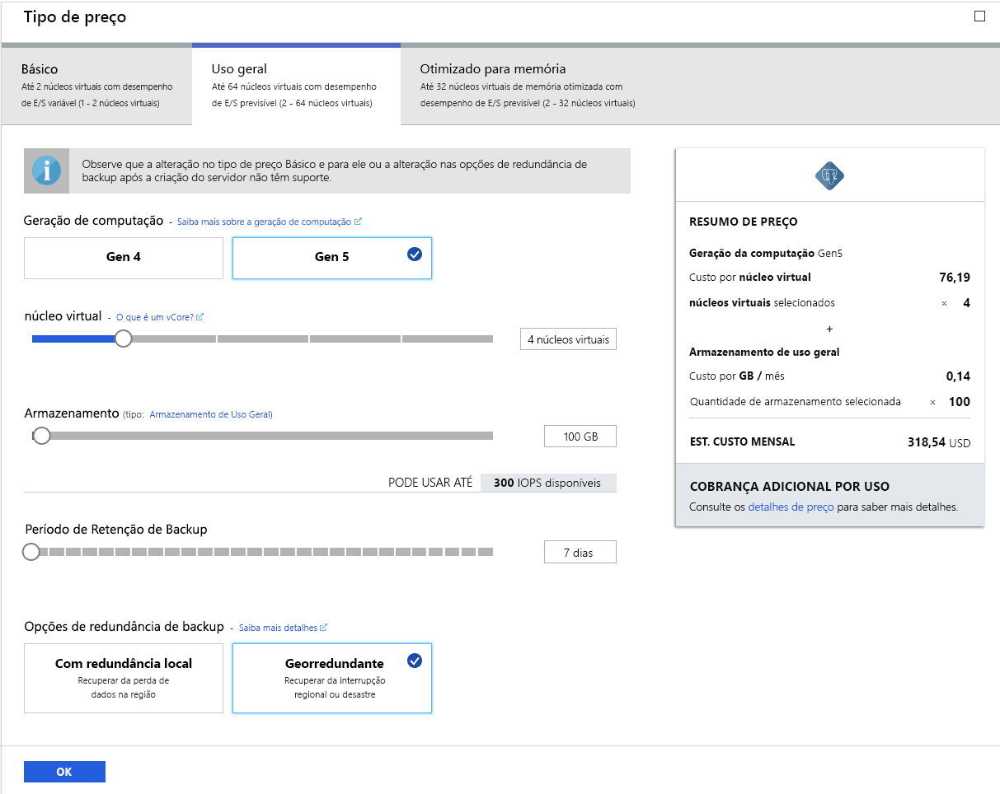

# <a name="tutorial-design-an-azure-database-for-postgresql---single-server-using-the-azure-portal"></a>Tutorial: Criar um Banco de Dados do Azure para PostgreSQL – Servidor único usando o portal do Azure

O Banco de Dados do Azure para PostgreSQL é um serviço gerenciado que permite executar, gerenciar e dimensionar os bancos de dados altamente disponíveis do PostgreSQL na nuvem. Usando o Portal do Azure, você pode gerenciar facilmente seu servidor e projetar um banco de dados.

Neste tutorial, você usará o Portal do Azure para aprender a:
> [!div class="checklist"]
> * Criar um Banco de Dados do Azure para o servidor PostgreSQL
> * Configurar o firewall do servidor
> * Useo utilitário [**psql**](https://www.postgresql.org/docs/9.6/static/app-psql.html) para criar um banco de dados
> * Carregar dados de exemplo
> * Consultar dados
> * Atualizar dados
> * Restaurar dados

## <a name="prerequisites"></a>Pré-requisitos
Se você não tiver uma assinatura do Azure, crie uma conta [gratuita](https://azure.microsoft.com/free/) antes de começar.

## <a name="create-an-azure-database-for-postgresql"></a>Criar um Banco de Dados do Azure para o PostgreSQL

Um Banco de Dados do Azure para PostgreSQL é criado com um conjunto definido de [recursos de computação e armazenamento](./concepts-compute-unit-and-storage.md). O servidor é criado dentro de um [Grupo de recursos do Azure](../azure-resource-manager/resource-group-overview.md).

Siga estas etapas para criar um Banco de Dados do Azure para o servidor PostgreSQL:
1. Clique em **Criar um recurso** no canto superior esquerdo do portal do Azure.
2. Selecione **Bancos de Dados** na página **Novo** e selecione **Banco de Dados do Azure para PostgreSQL** na página **Bancos de Dados**.
   

3. Selecione a opção de implantação **Servidor único**.

   

4. Preencha o formulário **Básico** com as seguintes informações:

    

    Configuração|Valor sugerido|DESCRIÇÃO
    ---|---|---
    Assinatura|O nome da sua assinatura|A assinatura do Azure que você deseja usar para o servidor. Se você tiver várias assinaturas, escolha a assinatura para a qual você recebe a cobrança do recurso.
    Grupo de recursos|*myresourcegroup*| Um novo nome do grupo de recursos ou um existente de sua assinatura.
    Nome do servidor |*mydemoserver*|Um nome exclusivo que identifica o Banco de Dados do Azure para o servidor PostgreSQL. O nome de domínio *postgres.database.azure.com* é acrescentado ao nome do servidor fornecido. O servidor pode conter apenas letras minúsculas, números e o caractere de hífen (-). Ele deve conter, pelo menos, 3 até 63 caracteres.
    Fonte de dados | *Nenhum* | Selecione *Nenhum* para criar um novo servidor do zero. (Você selecionaria *Backup* se estivesse criando um servidor de um backup de replicação geográfica de um Banco de Dados do Azure para servidor PostgreSQL existente).
    Nome de usuário do administrador |*myadmin*| Sua própria conta de logon para uso ao se conectar ao servidor. O nome de logon do administrador não pode ser **azure_superuser,** **azure_pg_admin,** **admin,** **administrator,** **root,** **guest** ou **public**. Ele não pode começar com **pg_** .
    Senha |Sua senha| Uma nova senha para a conta do administrador do servidor. Ele deve conter entre 8 e 128 caracteres. A senha precisa conter caracteres de três das seguintes categorias: Letras maiúsculas, letras minúsculas, números (0 a 9) e caracteres não alfanuméricos (!, $, #, % etc.).
    Local padrão|A região mais próxima dos usuários| A localização mais próxima dos usuários.
    Versão|A última versão principal| A última versão principal do PostgreSQL, a menos que você tenha requisitos específicos.
    Computação + armazenamento | **Uso Geral**, **Gen 5**, **2 vCores**, **5 GB**, **7 dias**, **Com redundância geográfica** | As configurações de computação, armazenamento e backup para o novo servidor. Selecione **Configurar servidor**. Em seguida, selecione a guia **Uso Geral**. *Gen 5*, *4 vCores*, *100 GB* e *7 dias* são os valores padrão de **Geração da Computação**, **vCore**, **Armazenamento** e **Período de Retenção de Backup**. Você pode deixar esses controles deslizantes como estão ou ajustá-los. Para habilitar os backups do servidor em armazenamento com redundância geográfica, selecione **Redundância Geográfica** das **Opções de Redundância de Backup**. Para salvar a seleção desse tipo de preço, selecione **OK**. A captura de tela a seguir demonstra essas seleções.

   > [!NOTE]
   > Considere usar o tipo de preço Básico se computação leve e E/S forem adequadas para sua carga de trabalho. Observe que servidores criados no tipo de preço Básico não podem ser dimensionados mais tarde para Uso Geral ou Otimizado para Memória. Veja a [página de preço](https://azure.microsoft.com/pricing/details/postgresql/) para obter mais informações.
   > 

    

    > [!TIP]
    > Com o **aumento automático** habilitado, seu servidor aumenta o armazenamento quando você está se aproximando do limite alocado, sem afetar sua carga de trabalho.

5. Selecione **Revisar + criar** para revisar suas seleções. Selecione **Criar** para provisionar o servidor. Esta operação pode levar alguns minutos.

6. Na barra de ferramentas, selecione o ícone (sino) **Notificações** para monitorar o processo de implantação. Depois que a implantação é feita, você pode selecionar **Fixar no painel**, que cria um bloco para esse servidor no seu painel do portal do Azure como um atalho para a página **Visão geral** do servidor. A opção **Ir para recurso** abre a página **Visão geral** do servidor.

    
   
   Por padrão, um banco de dados **postgres** é criado no servidor. O banco de dados [postgres](https://www.postgresql.org/docs/9.6/static/app-initdb.html) é um banco de dados padrão destinado ao uso dos usuários, de utilitários e de aplicativos de terceiros. (O outro banco de dados padrão é o **azure_maintenance**. Sua função é separar os processos de serviço gerenciado das ações do usuário. Não é possível acessar este banco de dados).


## <a name="configure-a-server-level-firewall-rule"></a>Configurar uma regra de firewall no nível de servidor

O serviço do Banco de Dados do Azure para PostgreSQL cria um firewall no nível do servidor. Por padrão, esse firewall impede que todos os aplicativos e ferramentas externos se conectem ao servidor e a todos os bancos de dados no servidor, a menos que uma regra de firewall seja criada para abrir o firewall para um intervalo de endereços IP específico. 

1. Após a implantação ser concluída, clique em **Todos os Recursos** no menu esquerdo e digite o nome **mydemoserver**, para pesquisar o servidor recém-criado. Clique no nome do servidor listado nos resultados da pesquisa. A página **Visão geral** do servidor é aberta e oferece outras opções de configuração.

   

2. Na página do servidor, selecione **Segurança da conexão**. 

3. Clique na caixa de texto em **Nome da regra** e adicione uma nova regra de firewall para especificar o intervalo de IP para conectividade. Insira o intervalo de IP. Clique em **Save** (Salvar).

   

4. Clique em **Salvar** e, em seguida, clique no **X** para fechar a página de **Segurança de conexões**.

   > [!NOTE]
   > O servidor PostgreSQL do Azure se comunica pela porta 5432. Se você estiver tentando se conectar de dentro de uma rede corporativa, o tráfego de saída pela porta 5432 talvez não seja permitido pelo firewall de sua rede. Se isso acontecer, você não poderá conectar o servidor do Banco de Dados SQL do Azure, a menos que o departamento de TI abra a porta 5432.
   >

## <a name="get-the-connection-information"></a>Obter informações de conexão

Quando você criou o servidor do Banco de dados do Azure para PostgreSQL, o banco de dados **postgres** padrão também foi criado. Para se conectar ao seu servidor de banco de dados, você precisa fornecer credenciais de acesso e informações de host.

1. No menu à esquerda no portal do Azure, clique em **Todos os recursos** e pesquise pelo servidor que você acabou de criar.

   

2. Clique no nome do servidor **mydemoserver**.

3. Selecione a página **Visão geral** do servidor. Anote o **Nome do servidor** e o **Nome de logon de administrador do servidor**.

   


## <a name="connect-to-postgresql-database-using-psql"></a>Conectar-se ao banco de dados PostgreSQL usando psql
Se o computador cliente tiver o PostgreSQL instalado, você poderá usar uma instância local do [psql](https://www.postgresql.org/docs/9.6/static/app-psql.html), ou o Azure Cloud Console para se conectar a um servidor PostgreSQL do Azure. Usaremos agora o utilitário de linha de comando psql para nos conectarmos ao Banco de Dados do Azure para o servidor PostgreSQL.

1. Execute o comando psql a seguir para se conectar a um Banco de Dados do Azure para PostgreSQL:
   ```
   psql --host=<servername> --port=<port> --username=<user@servername> --dbname=<dbname>
   ```

   Por exemplo, o comando a seguir se conecta ao banco de dados padrão chamado **postgres** no seu servidor PostgreSQL **mydemoserver.postgres.database.azure.com** usando as credenciais de acesso. Insira o `<server_admin_password>` que você escolheu quando uma senha foi solicitada a você.
  
   ```
   psql --host=mydemoserver.postgres.database.azure.com --port=5432 --username=myadmin@mydemoserver --dbname=postgres
   ```

   > [!TIP]
   > Se você preferir usar um caminho de URL para se conectar ao Postgres, codifique a URL de entrada @ do nome de usuário com `%40`. Por exemplo, a cadeia de conexão para psql seria,
   > ```
   > psql postgresql://myadmin%40mydemoserver@mydemoserver.postgres.database.azure.com:5432/postgres
   > ```

2. Quando já estiver conectado ao servidor, crie um banco de dados em branco no prompt:
   ```sql
   CREATE DATABASE mypgsqldb;
   ```

3. No prompt, execute o seguinte comando para mudar a conexão para o banco de dados **mypgsqldb** recém-criado:
   ```sql
   \c mypgsqldb
   ```

## <a name="create-tables-in-the-database"></a>Criar tabelas no banco de dados
Agora que você sabe como se conectar ao Banco de Dados do Azure para PostgreSQL, pode concluir algumas tarefas básicas:

Primeiro, crie uma tabela e carregue-a com alguns dados. Vamos criar uma tabela que acompanha as informações de inventário usando este código SQL:
```sql
CREATE TABLE inventory (
    id serial PRIMARY KEY, 
    name VARCHAR(50), 
    quantity INTEGER
);
```

Você agora pode ver a tabela recém-criada na lista de tabelas digitando:
```sql
\dt
```

## <a name="load-data-into-the-tables"></a>Carregar dados nas tabelas
Agora que você tem uma tabela, insira alguns dados nela. Na janela do prompt de comando aberta, execute a consulta a seguir para inserir algumas linhas de dados.
```sql
INSERT INTO inventory (id, name, quantity) VALUES (1, 'banana', 150); 
INSERT INTO inventory (id, name, quantity) VALUES (2, 'orange', 154);
```

Você tem agora duas linhas de dados de exemplo na tabela de inventário criada anteriormente.

## <a name="query-and-update-the-data-in-the-tables"></a>Consultar e atualizar os dados nas tabelas
Execute a seguinte consulta para recuperar as informações da tabela do banco de dados de inventário. 
```sql
SELECT * FROM inventory;
```

Também é possível atualizar os dados na tabela.
```sql
UPDATE inventory SET quantity = 200 WHERE name = 'banana';
```

Você pode ver os valores atualizados quando recuperar os dados.
```sql
SELECT * FROM inventory;
```

## <a name="restore-data-to-a-previous-point-in-time"></a>Restaurar dados para um ponto anterior no tempo
Imagine que você excluiu acidentalmente essa tabela. Essa situação é algo do qual você não pode se recuperar facilmente. O Banco de Dados do Azure para PostgreSQL permite que você volte para qualquer ponto anterior no qual o servidor tenha backups (determinados pelo período de retenção de backup que você configurou) e restaure esse ponto como um novo servidor. Use esse novo servidor para recuperar seus dados excluídos. As etapas a seguir restauram o servidor **mydemoserver** para um ponto anterior à adição da tabela de inventário.

1. Na página de **Visão geral** do Banco de Dados do Azure para PostgreSQL para o servidor, clique em **Restaurar** na barra de ferramentas. A página **Restaurar** será aberta.

   

2. Preencha o formulário **Restaurar** com as informações necessárias:

   

   - **Ponto de restauração**: Selecione um ponto no tempo anterior à alteração do servidor
   - **Servidor de destino**: Forneça o novo nome do servidor para o qual deseja fazer a restauração
   - **Localização**: Não é possível selecionar a região; por padrão, ela é a mesma do servidor de origem
   - **Tipo de preço**: Não é possível alterar esse valor ao restaurar um servidor. Ele é igual ao servidor de origem. 
3. Clique em **OK** para [restaurar o servidor para um ponto](./howto-restore-server-portal.md) anterior à exclusão da tabela. A restauração de um servidor para um ponto diferente no tempo cria um novo servidor duplicado como o servidor original a partir do ponto no tempo especificado por você, desde que esteja dentro do período de retenção do seu [tipo de preço](./concepts-pricing-tiers.md).

## <a name="next-steps"></a>Próximas etapas
Neste tutorial, você aprendeu a usar o portal do Azure e outros utilitários para:
> [!div class="checklist"]
> * Criar um Banco de Dados do Azure para o servidor PostgreSQL
> * Configurar o firewall do servidor
> * Useo utilitário [**psql**](https://www.postgresql.org/docs/9.6/static/app-psql.html) para criar um banco de dados
> * Carregar dados de exemplo
> * Consultar dados
> * Atualizar dados
> * Restaurar dados

Em seguida, para saber como usar a CLI do Azure para executar tarefas semelhantes, examine este tutorial: [Criar seu primeiro Banco de Dados do Azure para PostgreSQL usando a CLI do Azure](tutorial-design-database-using-azure-cli.md)
