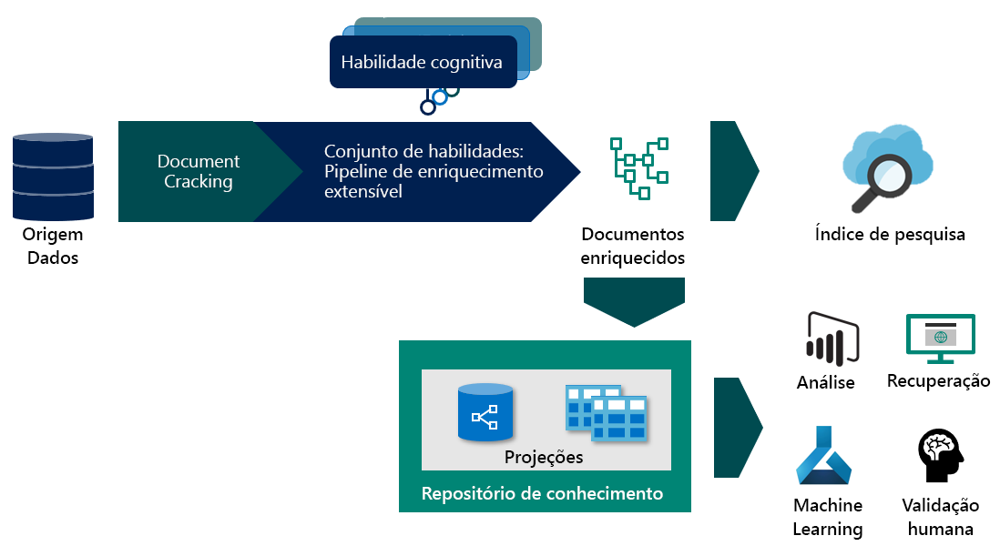

# <a name="working-with-skillsets"></a>Trabalhando com habilidades
Este artigo é para os desenvolvedores que precisam de uma compreensão mais profunda de como o pipeline de enriquecimento funciona e pressupõe que você tenha um entendimento conceitual do processo de pesquisa cognitiva. Se você for novo na pesquisa cognitiva, comece com:
+ [O que é "pesquisa cognitiva" em Azure Search?](cognitive-search-concept-intro.md)
+ [O que é o repositório de conhecimento em Azure Search?](knowledge-store-concept-intro.md)

## <a name="specify-the-skillset"></a>Especificar o conconhecimento
Um conjunto de qualificações é um recurso reutilizável no Azure Search que especifica uma coleção de habilidades cognitivas usadas para analisar, transformar e enriquecer o conteúdo de texto ou imagem durante a indexação. A criação de um habilidades permite anexar aprimoramentos de texto e imagem na fase de ingestão de dados, extraindo e criando novas informações e estruturas de conteúdo bruto.

Um qualificable tem três propriedades:

+   ```skills```, uma coleção não ordenada de habilidades para as quais a plataforma determina a sequência de execução com base nas entradas necessárias para cada habilidade
+   ```cognitiveServices```, a chave de serviços cognitivas necessária para cobrança das habilidades cognitivas invocadas
+   ```knowledgeStore```, a conta de armazenamento em que seus documentos aprimorados serão projetados


Habilidades são criados em JSON. Você pode criar habilidades complexas com loop e [ramificação](https://docs.microsoft.com/en-us/azure/search/cognitive-search-skill-conditional) usando a [linguagem de expressão](https://docs.microsoft.com/azure/search/cognitive-search-skill-conditional). A linguagem de expressão usa a notação de caminho de [ponteiro JSON](https://tools.ietf.org/html/rfc6901) com algumas modificações para identificar nós na árvore de enriquecimento. Um ```"/"``` percorre um nível inferior na árvore e ```"*"``` atua como um operador for-each no contexto. Esses conceitos são mais bem descritos com um exemplo. Para ilustrar alguns dos conceitos e funcionalidades, veremos o Skill [Reviews Sample](knowledge-store-connect-powerbi.md) Configurations. Para exibir o configurador de conhecimentos depois de seguir o fluxo de trabalho importar dados, você precisará usar um cliente da API REST para obter o configurador [de habilidades](https://docs.microsoft.com/en-us/rest/api/searchservice/get-skillset).

### <a name="enrichment-tree"></a>Árvore de enriquecimento

Para prever como um tipo de habilidade enriquece o seu documento progressivamente, vamos começar com a aparência do documento antes de qualquer enriquecimento. A saída da quebra de documento depende da fonte de dados e do modo de análise específico selecionado. Esse também é o estado do documento do qual os [mapeamentos de campo](search-indexer-field-mappings.md) podem fazer o conteúdo de origem ao adicionar dados ao índice de pesquisa.


Quando um documento está no pipeline de enriquecimento, ele é representado como uma árvore de conteúdo e aprimoramentos associados. Essa árvore é instanciada como a saída da quebra de documento. O formato de árvore de enriquecimento permite que o pipeline de enriquecimento anexe metadados a tipos de dados primitivos pares, ele não é um objeto JSON válido, mas pode ser projetado em um formato JSON válido. A tabela a seguir mostra o estado de um documento entrando no pipeline de enriquecimento:

|Modo de Source\Parsing de dados|Padrão|JSON, linhas JSON & CSV|
|---|---|---|
|Armazenamento de Blob|/document/content<br>/document/normalized_images/*<br>…|/document/{key1}<br>/document/{key2}<br>…|
|SQL|/document/{column1}<br>/document/{column2}<br>…|N/D |
|Cosmos DB|/document/{key1}<br>/document/{key2}<br>…|N/D|

 À medida que as habilidades são executadas, elas adicionam novos nós à árvore de enriquecimento. Esses novos nós podem ser usados como entradas para habilidades de downstream, projeção para a loja de conhecimento ou mapeamento para campos de índice. Os aprimoramentos não são mutáveis: uma vez criados, os nós não podem ser editados. À medida que seu habilidades se tornar mais complexo, sua árvore de enriquecimento, mas nem todos os nós na árvore de enriquecimento precisarão fazê-lo no índice ou na loja de conhecimento. Você pode persistir seletivamente apenas um subconjunto dos aprimoramentos no índice ou na loja de conhecimento.

Você pode persistir seletivamente apenas um subconjunto dos aprimoramentos no índice ou na loja de conhecimento.
No restante deste documento, vamos pressupor que estamos trabalhando com o [exemplo de revisões de Hotel](https://docs.microsoft.com/en-us/azure/search/knowledge-store-connect-powerbi), mas os mesmos conceitos se aplicam a documentos aprimorados de todas as outras fontes de dados.

### <a name="context"></a>Contexto
Cada habilidade requer um contexto. Um contexto determina:
+   O número de vezes que a habilidade é executada, com base nos nós selecionados. Para valores de contexto da coleção de tipos, ```/*``` adicionar um no final resultará na invocação da habilidade para cada instância na coleção. 
+   Em que na árvore de enriquecimento as saídas de habilidades são adicionadas. As saídas são sempre adicionadas à árvore como filhos do nó de contexto. 
+   Forma das entradas. Para coleções de vários níveis, definir o contexto para a coleção pai afetará a forma da entrada da habilidade. Por exemplo, se você tiver uma árvore de enriquecimento com uma lista de países, cada um deles será aprimorado com uma lista de Estados que contém uma lista de ZipCodes.

|Contexto|Entrada|Forma de entrada|Invocação de habilidades|
|---|---|---|---|
|```/document/countries/*``` |```/document/countries/*/states/*/zipcodes/*``` |Uma lista de todos os ZipCodes no país |Uma vez por país |
|```/document/countries/*/states/*``` |```/document/countries/*/states/*/zipcodes/*``` |Uma lista de ZipCodes no estado | Uma vez por combinação de país e estado|

### <a name="sourcecontext"></a>SourceContext

O `sourceContext` é usado apenas em habilidades e [projeções](knowledge-store-projection-overview.md)de [formador](cognitive-search-skill-shaper.md) . Ele é usado para construir objetos aninhados de vários níveis. O `sourceContext` permite que você construa um objeto de tipo anônimo e hierárquico, que exigiria várias habilidades se você estivesse usando apenas o contexto. O `sourceContext` uso do é mostrado na próxima seção.

### <a name="projections"></a>Projeções

Projeção é o processo de selecionar os nós da árvore de enriquecimento a ser salva na loja de conhecimento. As projeções são formas personalizadas do documento (conteúdo e aprimoramentos) que podem ser geradas como projeções de tabela ou de objeto. Para saber mais sobre como trabalhar com projeções, consulte [trabalhando com projeções](knowledge-store-projection-overview.md).


O diagrama acima descreve o seletor com base em onde você está no pipeline de enriquecimento.

## <a name="generate-enriched-data"></a>Gerar dados aprimorados 

Agora, vamos percorrer as revisões do Hotel, você pode seguir o [tutorial](knowledge-store-connect-powerbi.md) para criar o skillset ou [Exibir](https://github.com/Azure-Samples/azure-search-postman-samples/blob/master/samples/skillset.json) o skillset. Vamos examinar:

* como a árvore de enriquecimento evolui com a execução de cada habilidade 
* como o contexto e as entradas funcionam para determinar quantas vezes uma habilidade é executada 
* Qual a forma da entrada é baseada no contexto. 

Como estamos usando o modo de análise de texto delimitado para o indexador, um documento dentro do processo de enriquecimento representa uma única linha dentro do arquivo CSV.

### <a name="skill-1-split-skill"></a>#1 de habilidades: Dividir habilidade 


Com o contexto de habilidade ```"/document/reviews_text"```do, essa habilidade será executada uma vez `reviews_text`para o. A saída da habilidade é uma lista em `reviews_text` que o é dividido em segmentos de caractere de 5000. A saída da habilidade de divisão é nomeada `pages` e adicionada à árvore de enriquecimento. O `targetName` recurso permite que você renomeie uma saída de habilidade antes de ser adicionada à árvore de enriquecimento.

A árvore de enriquecimento agora tem um novo nó colocado sob o contexto da habilidade. Esse nó está disponível para qualquer habilidade, projeção ou mapeamento de campo de saída.


O nó raiz de todos os aprimoramentos é `"/document"`. Ao trabalhar com indexadores de BLOB, `"/document"` o nó terá nós filho de `"/document/content"` e `"/document/normalized_images"`. Ao trabalhar com dados CSV, como estamos neste exemplo, os nomes de coluna serão mapeados para nós abaixo `"/document"`. Para acessar qualquer um dos aprimoramentos adicionados a um nó por uma habilidade, o caminho completo para o enriquecimento é necessário. Por exemplo, se você quiser usar o texto do ```pages``` nó como uma entrada para outra habilidade, será necessário especificá-lo como. ```"/document/reviews_text/pages/*"```
 
 

### <a name="skill-2-language-detection"></a>Detecção de idioma #2 de habilidades
 Embora a habilidade de detecção de idioma seja a terceira habilidade (#3 de habilidades) definida no Skill, é a próxima habilidade a ser executada. Como ela não é bloqueada exigindo qualquer entrada, ela será executada em paralelo com a habilidade anterior. Como a habilidade de divisão que precedeu, a habilidade de detecção de idioma também é invocada uma vez para cada documento. A árvore de enriquecimento agora tem um novo nó para o idioma.
 
 
 ### <a name="skill-3-key-phrases-skill"></a>#3 de habilidades: Habilidade de frases-chave 

Considerando que o contexto ```/document/reviews_text/pages/*``` da habilidade de frases-chave será invocado uma vez para cada um dos `pages` itens na coleção. A saída da habilidade será um nó sob o elemento de página associado. 

 Agora você deve ser capaz de examinar o restante das habilidades no configurador de habilidades e visualizar como a árvore de aprimoramentos continuará crescendo com a execução de cada habilidade. Algumas habilidades, como a habilidade de mesclagem e a habilidade do modelador, também criam novos nós, mas usam apenas dados de nós existentes e não criam novos aprimoramentos.


As cores dos conectores na árvore acima indicam que os aprimoramentos foram criados por habilidades diferentes e os nós precisarão ser resolvidos individualmente e não serão parte do objeto retornado ao selecionar o nó pai.

## <a name="save-enrichments-in-a-knowledge-store"></a>Economize os aprimoramentos em uma loja de conhecimento 

Habilidades também definem uma loja de conhecimento onde seus documentos aprimorados podem ser projetados como tabelas ou objetos. Para salvar seus dados aprimorados na loja de conhecimento, você define um conjunto de projeções de seu documento aprimorado. Para saber mais sobre a loja de conhecimento, consulte [o que é armazenamento de conhecimento em Azure Search?](knowledge-store-concept-intro.md)

### <a name="slicing-projections"></a>Projeções de fatias

Ao definir um grupo de projeção de tabela, um único nó na árvore de enriquecimento pode ser dividido em várias tabelas relacionadas. Se você adicionar uma tabela com um caminho de origem que seja filho de uma projeção de tabela existente, o nó filho resultante não será um filho da projeção de tabela existente, mas, em vez disso, será projetado para a tabela nova e relacionada. Essa técnica de divisão permite que você defina um único nó em uma habilidade de forma que possa ser a origem de todas as suas projeções de tabela. 

### <a name="shaping-projections"></a>Projeções de modelagem

Há duas maneiras de definir uma projeção. Você pode usar uma habilidade de modelador para criar um novo nó que é o nó raiz de todos os aprimoramentos que você está projetando. Em seguida, em suas projeções, você só deve fazer referência à saída da habilidade do modelador. Você também poderia embutir a forma em uma projeção dentro da própria definição de projeção.

A abordagem de Modelador é mais detalhada do que a formatação embutida, mas garante que todas as mutações da árvore de enriquecimento estejam contidas nas habilidades e que a saída seja um objeto que possa ser reutilizado. O Shaping embutido permite que você crie a forma de que precisa, mas é um objeto anônimo e só está disponível para a projeção para a qual ela está definida. As abordagens podem ser usadas juntas ou separadamente. O qualificable criado para você no fluxo de trabalho do portal contém ambos. Ele usa uma habilidade de modelador para as projeções de tabela, mas também usa Shaping embutida para projetar a tabela de frases-chave.

Para estender o exemplo, você pode optar por remover o Shaping embutido e usar uma habilidade de formador para criar um novo nó para as frases-chave. Para criar uma forma projetada em três tabelas, isto é, `hotelReviewsDocument` `hotelReviewsPages`, e `hotelReviewsKeyPhrases`, as duas opções são descritas nas seções a seguir.


#### <a name="shaper-skill-and-projection"></a>Habilidade e projeção do modelador 

> [!Note]
> Algumas das colunas da tabela de documentos foram removidas deste exemplo para brevidade.
>
```json
{
    "@odata.type": "#Microsoft.Skills.Util.ShaperSkill",
    "name": "#5",
    "description": null,
    "context": "/document",
    "inputs": [        
        {
            "name": "reviews_text",
            "source": "/document/reviews_text",
            "sourceContext": null,
            "inputs": []
        },
        {
            "name": "reviews_title",
            "source": "/document/reviews_title",
            "sourceContext": null,
            "inputs": []
        },
        {
            "name": "AzureSearch_DocumentKey",
            "source": "/document/AzureSearch_DocumentKey",
            "sourceContext": null,
            "inputs": []
        },  
        {
            "name": "pages",
            "source": null,
            "sourceContext": "/document/reviews_text/pages/*",
            "inputs": [
                {
                    "name": "SentimentScore",
                    "source": "/document/reviews_text/pages/*/Sentiment",
                    "sourceContext": null,
                    "inputs": []
                },
                {
                    "name": "LanguageCode",
                    "source": "/document/Language",
                    "sourceContext": null,
                    "inputs": []
                },
                {
                    "name": "Page",
                    "source": "/document/reviews_text/pages/*",
                    "sourceContext": null,
                    "inputs": []
                },
                {
                    "name": "keyphrase",
                    "sourceContext": "/document/reviews_text/pages/*/Keyphrases/*",
                    "inputs": [
                        {
                            "source": "/document/reviews_text/pages/*/Keyphrases/*",
                            "name": "Keyphrases"
                        }
                    ]
                }
            ]
        }
    ],
    "outputs": [
        {
            "name": "output",
            "targetName": "tableprojection"
        }
    ]
}
```

Com o `tableprojection` nó definido `outputs` na seção acima, agora podemos usar o recurso de divisão `tableprojection` para projetar partes do nó em tabelas diferentes:

> [!Note]
> Isso é apenas um trecho da projeção dentro da configuração da loja de conhecimento.
>
```json
"projections": [
    {
        "tables": [
            {
                "tableName": "hotelReviewsDocument",
                "generatedKeyName": "Documentid",
                "source": "/document/tableprojection"
            },
            {
                "tableName": "hotelReviewsPages",
                "generatedKeyName": "Pagesid",
                "source": "/document/tableprojection/pages/*"
            },
            {
                "tableName": "hotelReviewsKeyPhrases",
                "generatedKeyName": "KeyPhrasesid",
                "source": "/document/tableprojection/pages/*/keyphrase/*"
            }
        ]
    }
]
```

#### <a name="inline-shaping-projections"></a>Projeções de modelagem embutida

A abordagem de modelagem embutida não requer uma habilidade de formador, pois todas as formas necessárias para as projeções são criadas no momento em que são necessárias. Para projetar os mesmos dados do exemplo anterior, a opção de projeção embutida ficaria assim:

```json
"projections": [
    {
        "tables": [
            {
                "tableName": "hotelReviewsInlineDocument",
                "generatedKeyName": "Documentid",
                "sourceContext": "/document",     
                "inputs": [
                    {
                        "name": "reviews_text",
                        "source": "/document/reviews_text"
                    },
                    {
                        "name": "reviews_title",
                        "source": "/document/reviews_title"
                    },
                    {
                        "name": "AzureSearch_DocumentKey",
                        "source": "/document/AzureSearch_DocumentKey"
                    }                             
                ]
            },
            {
                "tableName": "hotelReviewsInlinePages",
                "generatedKeyName": "Pagesid",
                "sourceContext": "/document/reviews_text/pages/*",
                "inputs": [
                        {
                    "name": "SentimentScore",
                    "source": "/document/reviews_text/pages/*/Sentiment"
                    },
                    {
                        "name": "LanguageCode",
                        "source": "/document/Language"
                    },
                    {
                        "name": "Page",
                        "source": "/document/reviews_text/pages/*"
                    }
                ]
            },
            {
                "tableName": "hotelReviewsInlineKeyPhrases",
                "generatedKeyName": "KeyPhraseId",
                "sourceContext": "/document/reviews_text/pages/*/Keyphrases/*",
                "inputs": [
                    {
                        "name": "Keyphrases",
                        "source": "/document/reviews_text/pages/*/Keyphrases/*"
                    }
                ]
            }
        ]
    }
]
```
  
Uma observação de ambas as abordagens é como os valores `"Keyphrases"` de são projetados usando o `"sourceContext"`. O `"Keyphrases"` nó, que contém uma coleção de cadeias de caracteres, é, em si, um filho do texto da página. No entanto, como as projeções exigem um objeto JSON e a página é uma primitiva (cadeia `"sourceContext"` de caracteres), a é usada para encapsular a frase-chave em um objeto com uma propriedade nomeada. Essa técnica permite que até mesmo primitivos sejam projetados de forma independente.

## <a name="next-steps"></a>Próximas etapas

Como uma próxima etapa, crie seu primeiro Conmy Skill com habilidades cognitivas.

> [!div class="nextstepaction"]
> [Crie seu primeiro](cognitive-search-defining-skillset.md)conpróprio Skill.
