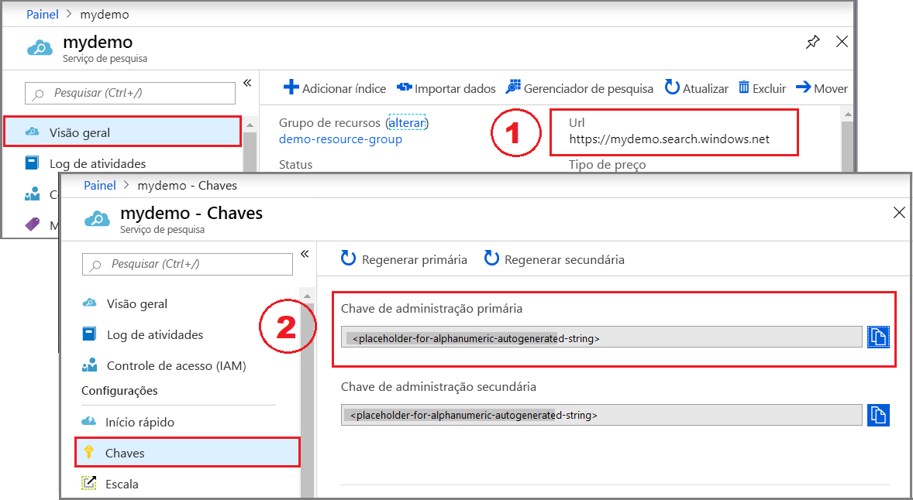
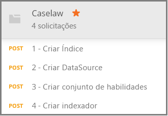

# <a name="how-to-get-started-with-knowledge-mining-in-azure-search"></a>Introdução à mineração de conhecimento no Azure Search

> [!Note]
> O armazenamento de dados de conhecimento está em versão prévia e não é destinado para uso em produção. A [API REST versão 2019-05-06-versão prévia](search-api-preview.md) fornece esse recurso. Não há suporte para SDK do .NET no momento.
>
O [repositório de conhecimento](knowledge-store-concept-intro.md) salva documentos aprimorados com IA criados durante a indexação em sua conta de armazenamento do Azure para mineração de conhecimento downstream em outros aplicativos. Você também pode usar enriquecimentos salvos para entender e refinar um pipeline de indexação do Azure Search. 

Um repositório de conhecimento é definido por um *conjunto de habilidades* e criado por um *indexador*. A expressão física de um repositório de conhecimento é especificada por *projeções* que determinam as estruturas de dados no armazenamento. Ao concluir este passo a passo, você terá criado todos esses objetos e saberá como eles funcionam juntos. 

Neste exercício, comece com dados de exemplo, serviços e ferramentas para aprender o fluxo de trabalho básico para criar e usar seu primeiro repositório de dados de conhecimento, com ênfase na definição do conjunto de qualificações.

## <a name="prerequisites"></a>Pré-requisitos

O repositório de conhecimento está no centro de vários serviços, com o Armazenamento de Blobs do Azure e o armazenamento de Tabelas do Azure fornecendo o armazenamento físico e o Azure Search e os Serviços Cognitivos para atualizações e a criação de objeto. Familiaridade com a [arquitetura básica](knowledge-store-concept-intro.md) é um pré-requisito para este passo a passo.

Os serviços e as ferramentas a seguir são usados neste Início Rápido. 

+ [Obtenha o aplicativo da área de trabalho do Postman](https://www.getpostman.com/), usado para enviar solicitações HTTP para o Azure Search.

+ [Crie uma conta de Armazenamento do Azure](https://docs.microsoft.com/azure/storage/common/storage-quickstart-create-account) para armazenar dados de exemplo e o repositório de conhecimento. O repositório de dados de conhecimento continuará a existir no armazenamento do Azure.

+ [Criar um recurso de Serviços Cognitivos](https://docs.microsoft.com/azure/cognitive-services/cognitive-services-apis-create-account) na camada pós-paga do S0 para ter acesso alargado a toda a gama de habilidades usadas em enriquecimentos por IA. Os Serviços Cognitivos e seu serviço do Azure Search precisam estar na mesma região.

+ [Crie um serviço Azure Search](search-create-service-portal.md) ou [localize um serviço existente](https://ms.portal.azure.com/#blade/HubsExtension/BrowseResourceBlade/resourceType/Microsoft.Search%2FsearchServices) na assinatura atual. Você pode usar um serviço gratuito para este tutorial. 

Documentos do JSON de exemplo e um arquivo de coleção do Postman também são necessários. Instruções para localizar e carregar arquivos suplementares são fornecidas na seção [Preparar dados de exemplo](#prepare-sample-data).

## <a name="get-a-key-and-url"></a>Obter uma chave e uma URL

As chamadas REST exigem a URL do serviço e uma chave de acesso em cada solicitação. Um serviço de pesquisa é criado com ambos, portanto, se você adicionou o Azure Search à sua assinatura, siga estas etapas para obter as informações necessárias:

1. [Entre no portal do Azure](https://portal.azure.com/) e, na página **Visão Geral** do serviço de pesquisa, obtenha a URL. Um ponto de extremidade de exemplo pode parecer com `https://mydemo.search.windows.net`.

1. Em **Configurações** > **Chaves**, obtenha uma chave de administração para adquirir todos os direitos sobre o serviço. Há duas chaves de administração intercambiáveis, fornecidas para a continuidade dos negócios, caso seja necessário sobrepor uma. É possível usar a chave primária ou secundária em solicitações para adicionar, modificar e excluir objetos.

    

Todas as solicitações requerem uma chave de api em cada pedido enviado ao serviço. Você fornecerá o nome do serviço e a chave de API em cada solicitação HTTP nas seções a seguir.

<a name="prepare-sample-data"></a>

## <a name="prepare-sample-data"></a>Preparar os dados de exemplo

Um repositório de conhecimento contém a saída de um pipeline de enriquecimento. Entradas consistem em dados "não utilizáveis" que, por fim, tornam-se "utilizáveis" à medida que progridem pelo pipeline. Exemplos de dados não utilizáveis podem incluir arquivos de imagem que precisam ser analisados quanto a características de imagem ou texto ou arquivos de texto denso que podem ser analisados para sentimento, frases-chave ou entidades. 

Este exercício usa arquivos de texto denso (informações de caselaw) que se originam da página de download de Dados em Massa Públicos do [Projeto de Acesso Caselaw](https://case.law/bulk/download/). Para este exercício, fizemos o download de um exemplo de 10 documentos para o GitHub. 

Nesta tarefa, você criará um contêiner de Blobs do Azure para esses documentos para ser usado como uma entrada para o pipeline. 

1. Baixe e extraia o repositório de [Dados de Exemplo do Azure Search](https://github.com/Azure-Samples/azure-search-sample-data/tree/master/caselaw) para obter o [Conjunto de dados Caselaw](https://github.com/Azure-Samples/azure-search-sample-data/tree/master/caselaw). 

1. [Entre no portal do Azure](https://portal.azure.com), navegue até sua conta de Armazenamento do Azure, clique em **Blobs** e, em seguida, clique em **+ Contêiner**.

1. [Crie um contêiner de Blobs](https://docs.microsoft.com/azure/storage/blobs/storage-quickstart-blobs-portal) para conter dados de exemplo: 

   1. Dê ao contêiner o nome de `caselaw-test`. 
   
   1. Defina o Nível de Acesso Público para qualquer um de seus valores válidos.

1. Depois que o contêiner for criado, abra-o e selecione **Carregar** na barra de comandos.

   

1. Navegue até a pasta que contém os arquivos de exemplo **caselaw-sample.json**. Escolha o arquivo e, em seguida, clique em **Carregar**.

1. Enquanto você estiver no armazenamento do Azure, obtenha o nome de contêiner e a cadeia de conexão.  Você precisará de ambas as cadeias de caracteres em [Criar Fonte de Dados](#create-data-source):

   1. Na página de visão geral, clique em **Chaves de Acesso** e copie uma *cadeia de conexão*. Ela começa com `DefaultEndpointsProtocol=https;` e termina com `EndpointSuffix=core.windows.net`. O nome e a chave da sua conta estão entre as duas. 

   1. O nome do contêiner deve ser `caselaw-test` ou qualquer nome que você tenha atribuído.


## <a name="set-up-postman"></a>Configurar o Postman

Postman é o aplicativo cliente que você usará para enviar solicitações e documentos JSON para o Azure Search. Várias das solicitações podem ser formuladas usando apenas as informações neste artigo. No entanto, duas das maiores solicitações (criar um índice, criar um conjunto de habilidades) incluem JSON detalhado grande demais para ser inserido em um artigo. 

Para disponibilizar totalmente todos os documentos e solicitações JSON, criamos um arquivo de coleção do Postman. Baixar e então importar esse arquivo são as primeiras tarefas na configuração do cliente.

1. Baixe e descompacte o repositório de [exemplos do Postman do Azure Search](https://github.com/Azure-Samples/azure-search-postman-samples).

1. Inicie o Postman e importe a coleção do Postman de Caselaw:

   1. Clique em **Importar** > **Importar Arquivos** > **Escolher arquivos**. 

   1. Navegue até a pasta \azure-search-postman-samples-master\azure-search-postman-samples-master\Caselaw.

   1. Selecione **Caselaw.postman_collection_v2.json**. Você deverá ver quatro solicitações **POST** na coleção.

   
   

## <a name="create-an-index"></a>Crie um índice
    
A primeira solicitação usa a [API de Criar Índice](https://docs.microsoft.com/rest/api/searchservice/create-data-source), criando um índice do Azure Search que armazena todos os dados pesquisáveis. Um índice especifica todos os campos, parâmetros e atributos.

Você não precisa necessariamente de um índice para minerar o conhecimento, mas um indexador não será executado a menos que um índice seja fornecido. 

1. Na URL `https://YOUR-AZURE-SEARCH-SERVICE-NAME.search.windows.net/indexes?api-version=2019-05-06-Preview`, substitua `YOUR-AZURE-SEARCH-SERVICE-NAME` pelo nome do serviço de pesquisa. 

1. Na seção de Cabeçalho, substitua `<YOUR AZURE SEARCH ADMIN API-KEY>` por uma chave de API de administrador para o Azure Search.

1. Na seção de corpo, o documento JSON é um esquema de índice. Recolhido para visibilidade, o shell externo de um índice consiste nos seguintes elementos. A coleção de campos corresponde aos campos no conjunto de dados de caselaw.

   ```json
   {
      "name": "caselaw",
      "defaultScoringProfile": null,
      "fields": [],
      "scoringProfiles": [],
      "corsOptions": null,
      "suggesters": [],
      "analyzers": [],
      "tokenizers": [],
      "tokenFilters": [],
      "charFilters": [],
      "encryptionKey": null
   }
   ```

1. Expanda a coleção `fields`. Ela contém a maior parte da definição de índice, composta por campos simples, [campos complexos](search-howto-complex-data-types.md) com subestruturas aninhadas e coleções.

   Reserve um tempo para examinar a definição de campo para o campo complexo `casebody` nas linhas 302-384. Observe que um campo complexo poderá conter outros campos complexos quando representações hierárquicas forem necessárias. Estruturas hierárquicas podem ser modeladas em um índice, conforme mostrado aqui, e também como uma projeção em um conjunto de habilidades, criando uma estrutura de dados aninhada no repositório de conhecimento.

   ```json
   {
    "name": "casebody",
    "type": "Edm.ComplexType",
    "fields": [
        {
            "name": "status",
            "type": "Edm.String",
            "searchable": true,
            "filterable": true,
            "retrievable": true,
            "sortable": true,
            "facetable": true,
            "key": false,
            "indexAnalyzer": null,
            "searchAnalyzer": null,
            "analyzer": null,
            "synonymMaps": []
        },
        {
            "name": "data",
            "type": "Edm.ComplexType",
            "fields": [
                {
                    "name": "head_matter",
                    "type": "Edm.String",
                    "searchable": true,
                    "filterable": false,
                    "retrievable": true,
                    "sortable": false,
                    "facetable": false,
                    "key": false,
                    "indexAnalyzer": null,
                    "searchAnalyzer": null,
                    "analyzer": null,
                    "synonymMaps": []
                },
                {
                    "name": "opinions",
                    "type": "Collection(Edm.ComplexType)",
                    "fields": [
                        {
                            "name": "author",
                            "type": "Edm.String",
                            "searchable": true,
                            "filterable": true,
                            "retrievable": true,
                            "sortable": false,
                            "facetable": true,
                            "key": false,
                            "indexAnalyzer": null,
                            "searchAnalyzer": null,
                            "analyzer": null,
                            "synonymMaps": []
                        },
                        {
                            "name": "text",
                            "type": "Edm.String",
                            "searchable": true,
                            "filterable": false,
                            "retrievable": true,
                            "sortable": false,
                            "facetable": false,
                            "key": false,
                            "indexAnalyzer": null,
                            "searchAnalyzer": null,
                            "analyzer": null,
                            "synonymMaps": []
                        },
                        {
                            "name": "type",
                            "type": "Edm.String",
                            "searchable": true,
                            "filterable": true,
                            "retrievable": true,
                            "sortable": false,
                            "facetable": true,
                            "key": false,
                            "indexAnalyzer": null,
                            "searchAnalyzer": null,
                            "analyzer": null,
                            "synonymMaps": []
                        }
                    ]
                },
    . . .
   ```

1. Clique em **Enviar** para executar a solicitação.  Você deve obter uma mensagem de **Status: 201 Criado** como resposta.

<a name="create-data-source"></a>

## <a name="create-a-data-source"></a>Criar uma fonte de dados

A segunda solicitação usa a [API de Criar Fonte de Dados](https://docs.microsoft.com/rest/api/searchservice/create-data-source) para conectar-se ao Armazenamento de Blobs do Azure. 

1. Na URL `https://YOUR-AZURE-SEARCH-SERVICE-NAME.search.windows.net/datasources?api-version=2019-05-06-Preview`, substitua `YOUR-AZURE-SEARCH-SERVICE-NAME` pelo nome do serviço de pesquisa. 

1. Na seção de Cabeçalho, substitua `<YOUR AZURE SEARCH ADMIN API-KEY>` por uma chave de API de administrador para o Azure Search.

1. Na seção de corpo, o documento JSON inclui o nome do contêiner de blob e a cadeia de conexão da conta de armazenamento. A cadeia de conexão pode ser encontrada no portal do Azure dentro das **Chaves de Acesso** da sua conta de armazenamento. 

    ```json
    {
        "name": "caselaw-ds",
        "description": null,
        "type": "azureblob",
        "subtype": null,
        "credentials": {
            "connectionString": "DefaultEndpointsProtocol=https;AccountName=<YOUR-STORAGE-ACCOUNT>;AccountKey=<YOUR-STORAGE-KEY>;EndpointSuffix=core.windows.net"
        },
        "container": {
            "name": "<YOUR-BLOB-CONTAINER-NAME>",
            "query": null
        },
        "dataChangeDetectionPolicy": null,
        "dataDeletionDetectionPolicy": null
    }
    ```

1. Clique em **Enviar** para executar a solicitação.  Você deve obter uma mensagem de **Status: 201 Criado** como resposta.


<a name="create-skillset"></a>

## <a name="create-a-skillset-and-knowledge-store"></a>Criar um conjunto de qualificações e um repositório de conhecimento

A terceira solicitação usa a [API de Criar Conjunto de Habilidades](https://docs.microsoft.com/rest/api/searchservice/create-skillset), criando um objeto do Azure Search que especifica quais habilidades cognitivas chamar, como interligar habilidades e, o ponto mais importante desse passo a passo, como especificar um repositório de dados de conhecimento.

1. Na URL `https://YOUR-AZURE-SEARCH-SERVICE-NAME.search.windows.net/skillsets?api-version=2019-05-06-Preview`, substitua `YOUR-AZURE-SEARCH-SERVICE-NAME` pelo nome do serviço de pesquisa. 

1. Na seção de Cabeçalho, substitua `<YOUR AZURE SEARCH ADMIN API-KEY>` por uma chave de API de administrador para o Azure Search.

1. Na seção Corpo, o documento JSON é uma definição de conjunto de habilidades. Recolhido para visibilidade, o shell externo de um conjunto de habilidades é formado pelos seguintes elementos. A coleção `skills` define enriquecimentos na memória, mas a definição `knowledgeStore` especifica como a saída é armazenada. A definição de `cognitiveServices` é sua conexão aos mecanismos de enriquecimento por IA.

   ```json
   {
    "name": "caselaw-ss",
    "description": null,
    "skills": [],
    "cognitiveServices": [],
    "knowledgeStore": []
   }
   ```

1. Expanda `cognitiveServices` e `knowledgeStore` para que possa fornecer informações de conexão. No exemplo, essas cadeias estão localizadas após a definição do conjunto de qualificações, no final do corpo da solicitação. 

   Para `cognitiveServices`, provisione um recurso no nível S0, localizado na mesma região que o Azure Search. Você pode obter o nome e a chave do cognitiveServices da mesma página no portal do Azure. 
   
   Para `knowledgeStore`, você pode usar a mesma cadeia de conexão usada para o contêiner de Blobs de caselaw.

    ```json
    "cognitiveServices": {
        "@odata.type": "#Microsoft.Azure.Search.CognitiveServicesByKey",
        "description": "YOUR-SAME-REGION-S0-COGNITIVE-SERVICES-RESOURCE",
        "key": "YOUR-COGNITIVE-SERVICES-KEY"
    },
    "knowledgeStore": {
        "storageConnectionString": "YOUR-STORAGE-ACCOUNT-CONNECTION-STRING",
    ```

1. Expanda o conjunto de habilidades, especialmente as habilidades do Shaper nas linhas 85 e 179, respectivamente. A habilidade do Shaper é importante porque reúne as estruturas de dados que você deseja ter na mineração de dados de conhecimento. Durante a execução da habilidade, essas estruturas estão apenas na memória, mas, à medida que você avança para a próxima etapa, você verá como essa saída pode ser salva em um repositório de dados de conhecimento para poder ser ainda mais explorada.

   O snippet de código a seguir é da linha 217. 

    ```json
    "name": "Opinions",
    "source": null,
    "sourceContext": "/document/casebody/data/opinions/*",
    "inputs": [
        {
            "name": "Text",
            "source": "/document/casebody/data/opinions/*/text"
        },
        {
            "name": "Author",
            "source": "/document/casebody/data/opinions/*/author"
        },
        {
            "name": "Entities",
            "source": null,
            "sourceContext": "/document/casebody/data/opinions/*/text/pages/*/entities/*",
            "inputs": [
                {
                    "name": "Entity",
                    "source": "/document/casebody/data/opinions/*/text/pages/*/entities/*/value"
                },
                {
                    "name": "EntityType",
                    "source": "/document/casebody/data/opinions/*/text/pages/*/entities/*/category"
                }
            ]
        }
    ]
   . . .
   ```

1. Expanda o elemento `projections` em `knowledgeStore`, começando na linha 262. As projeções especificam a composição do repositório de dados de conhecimento. As projeções são especificadas em pares de tabelas-objetos, mas, no momento, são especificadas individualmente. Como você pode ver na primeira projeção, `tables` foi especificada, mas `objects` não foi. Na segunda projeção, temos o oposto.

   No armazenamento do Azure, as tabelas serão criadas no armazenamento Tabela para cada tabela criada e cada objeto receberá um contêiner no armazenamento Blob.

   Os objetos de blob geralmente contêm a expressão completa de um enriquecimento. As tabelas geralmente contêm enriquecimentos parciais em combinações organizadas para fins específicos. Este exemplo mostra uma tabela de Casos e uma tabela de Opiniões, mas não são mostradas outras tabelas como Entidades, Advogados, Juízes e Partes.

    ```json
    "projections": [
        {
            "tables": [
                {
                    "tableName": "Cases",
                    "generatedKeyName": "CaseId",
                    "source": "/document/Case"
                },
                {
                    "tableName": "Opinions",
                    "generatedKeyName": "OpinionId",
                    "source": "/document/Case/OpinionsSnippets/*"
                }
            ],
            "objects": []
        },
        {
            "tables": [],
            "objects": [
                {
                    "storageContainer": "enrichedcases",
                    
                    "source": "/document/CaseFull"
                }
            ]
        }
    ]
    ```

1. Clique em **Enviar** para executar a solicitação. A resposta deve ser **201** e deve ser semelhante ao exemplo a seguir que exibe a primeira parte da resposta.

    ```json
    {
    "name": "caselaw-ss",
    "description": null,
    "skills": [
        {
            "@odata.type": "#Microsoft.Skills.Text.SplitSkill",
            "name": "SplitSkill#1",
            "description": null,
            "context": "/document/casebody/data/opinions/*/text",
            "defaultLanguageCode": "en",
            "textSplitMode": "pages",
            "maximumPageLength": 5000,
            "inputs": [
                {
                    "name": "text",
                    "source": "/document/casebody/data/opinions/*/text
                }
            ],
            "outputs": [
                {
                    "name": "textItems",
                    "targetName": "pages"
                }
            ]
        },
        . . .
    ```

## <a name="create-and-run-an-indexer"></a>Criar e executar um indexador

A quarta solicitação usa a [API Criar Indexador](https://docs.microsoft.com/rest/api/searchservice/create-indexer), criando um indexador do Azure Search. Um indexador é o mecanismo de execução do pipeline de indexação. Com esta etapa, todas as definições que você criou até agora são colocadas em funcionamento.

1. Na URL `https://YOUR-AZURE-SEARCH-SERVICE-NAME.search.windows.net/indexers?api-version=2019-05-06-Preview`, substitua `YOUR-AZURE-SEARCH-SERVICE-NAME` pelo nome do serviço de pesquisa. 

1. Na seção de Cabeçalho, substitua `<YOUR AZURE SEARCH ADMIN API-KEY>` por uma chave de API de administrador para o Azure Search.

1. Na seção Corpo, o documento JSON especifica o nome do indexador. O indexador precisa de uma fonte de dados e um índice. Um conjunto de qualificações é opcional para um indexador, mas necessário para enriquecer a Inteligência Artificial.

    ```json
    {
        "name": "caselaw-idxr",
        "description": null,
        "dataSourceName": "caselaw-ds",
        "skillsetName": "caselaw-ss",
        "targetIndexName": "caselaw",
        "disabled": null,
        "schedule": null,
        "parameters": { },
        "fieldMappings": [],
        "outputFieldMappings": [ ]
    ```

1. Expanda outputFieldMappings. Em contraste com fieldMappings, que são usados para mapeamento personalizado entre campos em uma fonte de dados e campos em um índice, os outputFieldMappings são usados para mapear campos enriquecidos, criados e preenchidos pelo pipeline, para campos de saída em um índice ou em uma projeção.

    ```json
    "outputFieldMappings": [
        {
            "sourceFieldName": "/document/casebody/data/opinions/*/text/pages/*/people/*",
            "targetFieldName": "people",
            "mappingFunction": null
        },
        {
            "sourceFieldName": "/document/casebody/data/opinions/*/text/pages/*/organizations/*",
            "targetFieldName": "orginizations",
            "mappingFunction": null
        },
        {
            "sourceFieldName": "/document/casebody/data/opinions/*/text/pages/*/locations/*",
            "targetFieldName": "locations",
            "mappingFunction": null
        },
        {
            "sourceFieldName": "/document/Case/OpinionsSnippets/*/Entities/*",
            "targetFieldName": "entities",
            "mappingFunction": null
        },
        {
            "sourceFieldName": "/document/casebody/data/opinions/*/text/pages/*/keyPhrases/*",
            "targetFieldName": "keyPhrases",
            "mappingFunction": null
        }
    ]
    ```

1. Clique em **Enviar** para executar a solicitação. A resposta deve ser **201** e o corpo da resposta deve ser quase idêntico à carga útil da solicitação fornecida (resumida por economizar tempo).

    ```json
    {
        "name": "caselaw-idxr",
        "description": null,
        "dataSourceName": "caselaw-ds",
        "skillsetName": "caselaw-ss",
        "targetIndexName": "caselaw",
        "disabled": null,
        "schedule": null,
        "parameters": { },
        "fieldMappings": [],
        "outputFieldMappings": [ ]
    }
    ```

## <a name="explore-knowledge-store"></a>Explorar o repositório de dados de conhecimento

Comece a explorar assim que o primeiro documento for importado. Para essa tarefa, use o [**Gerenciador de Armazenamento**](https://docs.microsoft.com/azure/storage/blobs/storage-quickstart-blobs-storage-explorer) no portal.

É importante perceber que um repositório de dados de conhecimento é totalmente desanexado do Azure Search. O repositório de dados de conhecimento e o índice do Azure Search contêm o conteúdo e a representação de dados, mas separam-se a partir desse ponto. Use o índice na pesquisa de texto completo, pesquisa filtrada e todos os cenários com suporte no Azure Search. Ou siga em frente apenas com o repositório de dados de conhecimento anexando outras ferramentas para analisar o conteúdo.

## <a name="takeaways"></a>Observações

Agora você criou seu primeiro repositório de dados de conhecimento no armazenamento do Azure e usou o Gerenciador de Armazenamento para visualizar os enriquecimentos. Essa é a principal experiência para trabalhar com enriquecimentos armazenados. 

## <a name="next-steps"></a>Próximas etapas

A habilidade do Shaper faz o trabalho pesado na criação de formulários de dados granulares que podem ser combinados em novas formas. Como etapa seguinte, analise a página de referência da habilidade para ver detalhes sobre como ela é usada.

> [!div class="nextstepaction"]
> [Referência da habilidade do Shaper](cognitive-search-skill-shaper.md)


<!---
## Keep This

How to convert unformatted JSON into an indented JSON document structure that allows you to quickly identify nested structures. Useful for creating an index that includes complex types.

1. Use Visual Studio Code.
2. Open data.jsonl
--->
