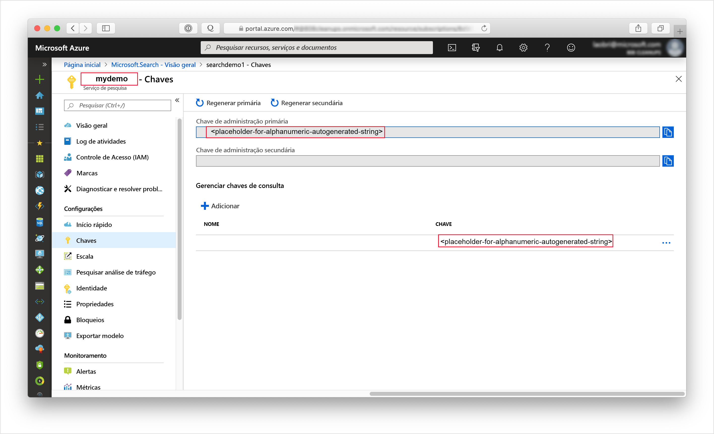
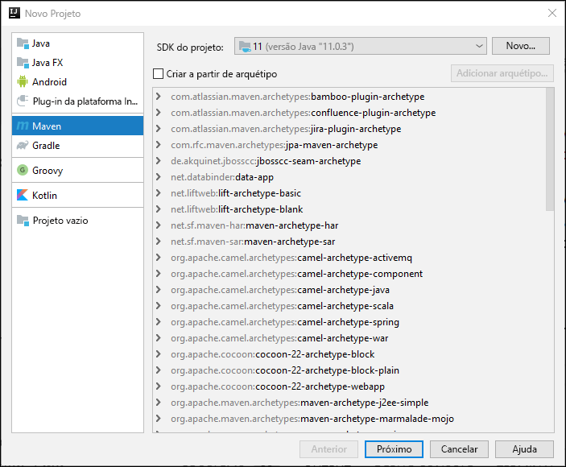
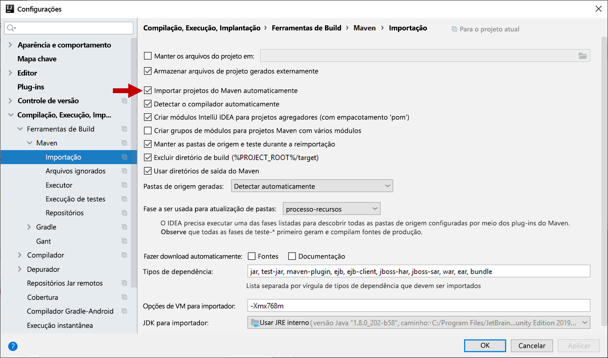
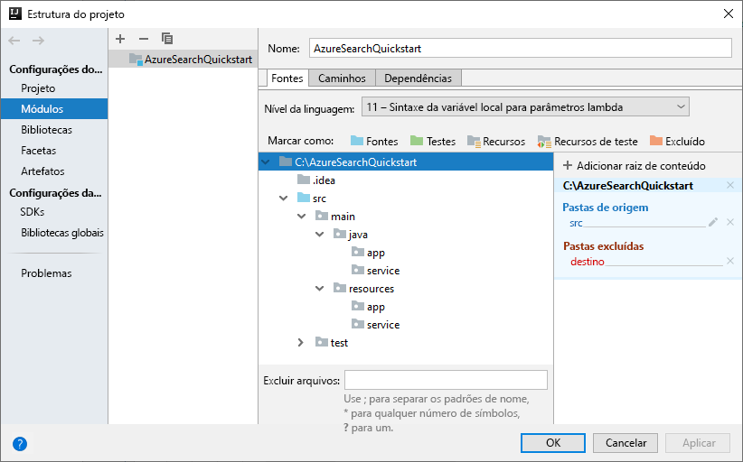
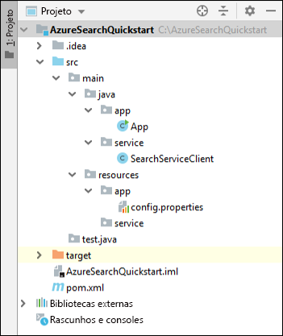
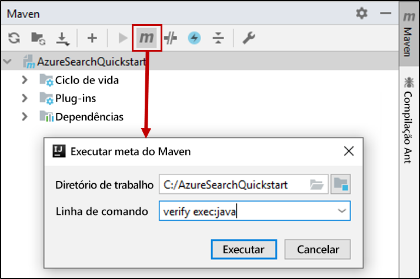

# <a name="quickstart-create-an-azure-search-index-in-java-using-rest-apis"></a>Início Rápido: Criar um índice do Azure Search em Java usando as APIs REST
> [!div class="op_single_selector"]
> * [JavaScript](search-get-started-nodejs.md)
> * [C#](search-get-started-dotnet.md)
> * [Java](search-get-started-java.md)
> * [Portal](search-get-started-portal.md)
> * [PowerShell](search-create-index-rest-api.md)
> * [Python](search-get-started-python.md)
> * [Postman](search-get-started-postman.md)

Crie um aplicativo de console Java que cria, carrega e consulta um índice do Azure Search usando o [IntelliJ](https://www.jetbrains.com/idea/), o [SDK 11 do Java](/java/azure/jdk/?view=azure-java-stable) e a [API REST do Serviço do Azure Search](/rest/api/searchservice/). Este artigo fornece instruções passo a passo para a criação do aplicativo. Como alternativa, você pode [baixar e executar o aplicativo completo](/samples/azure-samples/azure-search-java-samples/java-sample-quickstart/).

Se você não tiver uma assinatura do Azure, crie uma [conta gratuita](https://azure.microsoft.com/free/?WT.mc_id=A261C142F) antes de começar.

## <a name="prerequisites"></a>Pré-requisitos

Usamos os seguintes softwares e serviços para compilar e testar este exemplo:

+ [IntelliJ IDEA](https://www.jetbrains.com/idea/)

+ [SDK 11 do Java](/java/azure/jdk/?view=azure-java-stable)

+ [Crie um serviço Azure Search](search-create-service-portal.md) ou [localize um serviço existente](https://ms.portal.azure.com/#blade/HubsExtension/BrowseResourceBlade/resourceType/Microsoft.Search%2FsearchServices) na assinatura atual. É possível usar um serviço gratuito para este início rápido.

<a name="get-service-info"></a>

## <a name="get-a-key-and-url"></a>Obter uma chave e uma URL

As chamadas ao serviço exigem um ponto de extremidade de URL e uma chave de acesso em cada solicitação. Um serviço de pesquisa é criado com ambos, portanto, se você adicionou o Azure Search à sua assinatura, siga estas etapas para obter as informações necessárias:

1. [Entre no portal do Azure](https://portal.azure.com/) e, na página **Visão Geral** do serviço de pesquisa, obtenha a URL. Um ponto de extremidade de exemplo pode parecer com `https://mydemo.search.windows.net`.

2. Em **Configurações** > **Chaves**, obtenha uma chave de administração para adquirir todos os direitos sobre o serviço. Há duas chaves de administração intercambiáveis, fornecidas para a continuidade dos negócios, caso seja necessário sobrepor uma. É possível usar a chave primária ou secundária em solicitações para adicionar, modificar e excluir objetos.

   Crie também uma chave de consulta. É uma melhor prática para emitir solicitações de consulta com acesso somente leitura.



Todas as solicitações enviadas ao seu serviço requerem uma chave de api. Ter uma chave válida estabelece a relação de confiança, para cada solicitação, entre o aplicativo que envia a solicitação e o serviço que lida com ela.

## <a name="set-up-your-environment"></a>Configure seu ambiente

Comece abrindo o IntelliJ IDEA e configurando um novo projeto.

### <a name="create-the-project"></a>Criar o projeto

1. Abra o IntelliJ IDEA e selecione **Criar Novo Projeto**.
1. Selecione **Maven**.
1. Na lista **SDK do Projeto**, selecione o SDK 11 do Java.

     

1. Para **GroupId** e **ArtifactId**, insira `AzureSearchQuickstart`.
1. Aceite os padrões restantes para abrir o projeto.

### <a name="specify-maven-dependencies"></a>Especificar as dependências do Maven

1. Selecione **Arquivo** > **Configurações**.
1. Na janela **Configurações**, selecione **Build, Execução, Implantação** > **Ferramentas de Build** > **Maven** > **Importando**.
1. Marque a caixa de seleção **Importar projetos Maven automaticamente** e clique em **OK** para fechar a janela. Agora, os plug-ins e outras dependências do Maven serão sincronizados automaticamente quando você atualizar o arquivo pom.xml na etapa seguinte.

    

1. Abra o arquivo pom.xml e substitua o conteúdo pelos seguintes detalhes de configuração do Maven. Isso inclui referências ao [Plug-in Exec Maven](https://www.mojohaus.org/exec-maven-plugin/) e uma [API de interface JSON](https://javadoc.io/doc/org.glassfish/javax.json/1.0.2)

    ```xml
    <?xml version="1.0" encoding="UTF-8"?>
    <project xmlns="http://maven.apache.org/POM/4.0.0"
             xmlns:xsi="http://www.w3.org/2001/XMLSchema-instance"
             xsi:schemaLocation="http://maven.apache.org/POM/4.0.0 http://maven.apache.org/xsd/maven-4.0.0.xsd">
        <modelVersion>4.0.0</modelVersion>
    
        <groupId>AzureSearchQuickstart</groupId>
        <artifactId>AzureSearchQuickstart</artifactId>
        <version>1.0-SNAPSHOT</version>
        <build>
            <sourceDirectory>src</sourceDirectory>
            <plugins>
                <plugin>
                    <artifactId>maven-compiler-plugin</artifactId>
                    <version>3.1</version>
                    <configuration>
                        <source>11</source>
                        <target>11</target>
                    </configuration>
                </plugin>
                <plugin>
                    <groupId>org.codehaus.mojo</groupId>
                    <artifactId>exec-maven-plugin</artifactId>
                    <version>1.6.0</version>
                    <executions>
                        <execution>
                            <goals>
                                <goal>exec</goal>
                            </goals>
                        </execution>
                    </executions>
                    <configuration>
                        <mainClass>main.java.app.App</mainClass>
                        <cleanupDaemonThreads>false</cleanupDaemonThreads>
                    </configuration>
                </plugin>
            </plugins>
        </build>
        <dependencies>
            <dependency>
                <groupId>org.glassfish</groupId>
                <artifactId>javax.json</artifactId>
                <version>1.0.2</version>
            </dependency>
        </dependencies>   
    </project>
    ```

### <a name="set-up-the-project-structure"></a>Configurar a estrutura do projeto

1. Selecione **Arquivo** > **Estrutura do Projeto**.
1. Selecione **Módulos** e expanda a árvore de origem para acessar o conteúdo da pasta `src` >  `main`.
1. Na pasta `src` >  `main` > `java`, adicione as pastas `app` e `service`. Para fazer isso, selecione a pasta `java`, pressione Alt + Insert e, em seguida, insira o nome da pasta.
1. Na pasta `src` >  `main` >`resources`, adicione as pastas `app` e `service`.

    Quando você terminar, a árvore do projeto deverá ser semelhante à imagem a seguir.

    

1. Clique em **OK** para fechar a janela.

### <a name="add-azure-search-service-information"></a>Adicionar informações de serviço do Azure Search

1. Na janela **Projeto**, expanda a árvore de origem para acessar a pasta `src` >  `main` >`resources` > `app` e adicione um arquivo `config.properties`. Para fazer isso, selecione a pasta `app`, pressione Alt + Insert, selecione **Arquivo** e, em seguida, insira o nome do arquivo.

1. Copie as configurações a seguir no novo arquivo e substitua `<YOUR-SEARCH-SERVICE-NAME>`, `<YOUR-ADMIN-KEY>` e `<YOUR-QUERY-KEY>` pelo nome do serviço e pelas chaves. Se o ponto de extremidade de serviço for `https://mydemo.search.windows.net`, o nome do serviço será "mydemo".

    ```java
        SearchServiceName=<YOUR-SEARCH-SERVICE-NAME>
        SearchServiceAdminKey=<YOUR-ADMIN-KEY>
        SearchServiceQueryKey=<YOUR-QUERY-KEY>
        IndexName=hotels-quickstart
        ApiVersion=2019-05-06
    ```

### <a name="add-the-main-method"></a>Adicionar o método principal

1. Na pasta `src` >  `main` > `java` > `app`, adicione uma classe `App`. Para fazer isso, selecione a pasta `app`, pressione Alt + Insert, selecione **Classe de Java** e, em seguida, insira o nome da classe.
1. Abra a classe `App` e substitua o conteúdo pelo seguinte código. Esse código contém o método `main`. 

    O código sem comentários lê os parâmetros do serviço de pesquisa e os usa para criar uma instância do cliente do serviço de pesquisa. O código do cliente do serviço de pesquisa será adicionado na próxima seção.

    O código com comentários nesta classe terá suas marcas de comentário removidas em uma seção posterior deste guia de início rápido.

    ```java
    package main.java.app;
    
    import main.java.service.SearchServiceClient;
    import java.io.IOException;
    import java.util.Properties;
    
    public class App {
    
        private static Properties loadPropertiesFromResource(String resourcePath) throws IOException {
            var inputStream = App.class.getResourceAsStream(resourcePath);
            var configProperties = new Properties();
            configProperties.load(inputStream);
            return configProperties;
        }
    
        public static void main(String[] args) {
            try {
                var config = loadPropertiesFromResource("/app/config.properties");
                var client = new SearchServiceClient(
                        config.getProperty("SearchServiceName"),
                        config.getProperty("SearchServiceAdminKey"),
                        config.getProperty("SearchServiceQueryKey"),
                        config.getProperty("ApiVersion"),
                        config.getProperty("IndexName")
                );
    
    
    //Uncomment the next 3 lines in the 1 - Create Index section of the quickstart
    //            if(client.indexExists()){ client.deleteIndex();}
    //            client.createIndex("/service/index.json");
    //            Thread.sleep(1000L); // wait a second to create the index
    
    //Uncomment the next 2 lines in the 2 - Load Documents section of the quickstart
    //            client.uploadDocuments("/service/hotels.json");
    //            Thread.sleep(2000L); // wait 2 seconds for data to upload
    
    //Uncomment the following 5 search queries in the 3 - Search an index section of the quickstart
    //            // Query 1
    //            client.logMessage("\n*QUERY 1****************************************************************");
    //            client.logMessage("Search for: Atlanta'");
    //            client.logMessage("Return: All fields'");
    //            client.searchPlus("Atlanta");
    //
    //            // Query 2
    //            client.logMessage("\n*QUERY 2****************************************************************");
    //            client.logMessage("Search for: Atlanta");
    //            client.logMessage("Return: HotelName, Tags, Address");
    //            SearchServiceClient.SearchOptions options2 = client.createSearchOptions();
    //            options2.select = "HotelName,Tags,Address";
    //            client.searchPlus("Atlanta", options2);
    //
    //            //Query 3
    //            client.logMessage("\n*QUERY 3****************************************************************");
    //            client.logMessage("Search for: wifi & restaurant");
    //            client.logMessage("Return: HotelName, Description, Tags");
    //            SearchServiceClient.SearchOptions options3 = client.createSearchOptions();
    //            options3.select = "HotelName,Description,Tags";
    //            client.searchPlus("wifi,restaurant", options3);
    //
    //            // Query 4 -filtered query
    //            client.logMessage("\n*QUERY 4****************************************************************");
    //            client.logMessage("Search for: all");
    //            client.logMessage("Filter: Ratings greater than 4");
    //            client.logMessage("Return: HotelName, Rating");
    //            SearchServiceClient.SearchOptions options4 = client.createSearchOptions();
    //            options4.filter="Rating%20gt%204";
    //            options4.select = "HotelName,Rating";
    //            client.searchPlus("*",options4);
    //
    //            // Query 5 - top 2 results, ordered by
    //            client.logMessage("\n*QUERY 5****************************************************************");
    //            client.logMessage("Search for: boutique");
    //            client.logMessage("Get: Top 2 results");
    //            client.logMessage("Order by: Rating in descending order");
    //            client.logMessage("Return: HotelId, HotelName, Category, Rating");
    //            SearchServiceClient.SearchOptions options5 = client.createSearchOptions();
    //            options5.top=2;
    //            options5.orderby = "Rating%20desc";
    //            options5.select = "HotelId,HotelName,Category,Rating";
    //            client.searchPlus("boutique", options5);
    
            } catch (Exception e) {
                System.err.println("Exception:" + e.getMessage());
                e.printStackTrace();
            }
        }
    }
    ```

### <a name="add-the-http-operations"></a>Adicionar as operações HTTP

1. Na pasta `src` >  `main` > `java` > `service`, adicione uma classe `SearchServiceClient`. Para fazer isso, selecione a pasta `service`, pressione Alt + Insert, selecione **Classe de Java** e, em seguida, insira o nome da classe.
1. Abra a classe `SearchServiceClient` e substitua o conteúdo pelo código a seguir. Esse código fornece as operações HTTP necessárias para usar a API REST do Azure Search. Métodos adicionais para criar um índice, carregar documentos e consultar o índice serão adicionados em uma seção posterior.

    ```java
    package main.java.service;

    import javax.json.Json;
    import javax.net.ssl.HttpsURLConnection;
    import java.io.IOException;
    import java.io.StringReader;
    import java.net.HttpURLConnection;
    import java.net.URI;
    import java.net.http.HttpClient;
    import java.net.http.HttpRequest;
    import java.net.http.HttpResponse;
    import java.nio.charset.StandardCharsets;
    import java.util.Formatter;
    import java.util.function.Consumer;
    
        /* This class is responsible for implementing HTTP operations for creating the index, uploading documents and searching the data*/
        public class SearchServiceClient {
            private final String _adminKey;
            private final String _queryKey;
            private final String _apiVersion;
            private final String _serviceName;
            private final String _indexName;
            private final static HttpClient client = HttpClient.newHttpClient();
    
        public SearchServiceClient(String serviceName, String adminKey, String queryKey, String apiVersion, String indexName) {
            this._serviceName = serviceName;
            this._adminKey = adminKey;
            this._queryKey = queryKey;
            this._apiVersion = apiVersion;
            this._indexName = indexName;
        }

        private static HttpResponse<String> sendRequest(HttpRequest request) throws IOException, InterruptedException {
            logMessage(String.format("%s: %s", request.method(), request.uri()));
            return client.send(request, HttpResponse.BodyHandlers.ofString());
        }

        private static URI buildURI(Consumer<Formatter> fmtFn)
                {
                    Formatter strFormatter = new Formatter();
                    fmtFn.accept(strFormatter);
                    String url = strFormatter.out().toString();
                    strFormatter.close();
                    return URI.create(url);
        }
    
        public static void logMessage(String message) {
            System.out.println(message);
        }
    
        public static boolean isSuccessResponse(HttpResponse<String> response) {
            try {
                int responseCode = response.statusCode();
    
                logMessage("\n Response code = " + responseCode);
    
                if (responseCode == HttpURLConnection.HTTP_OK || responseCode == HttpURLConnection.HTTP_ACCEPTED
                        || responseCode == HttpURLConnection.HTTP_NO_CONTENT || responseCode == HttpsURLConnection.HTTP_CREATED) {
                    return true;
                }
    
                // We got an error
                var msg = response.body();
                if (msg != null) {
                    logMessage(String.format("\n MESSAGE: %s", msg));
                }
    
            } catch (Exception e) {
                e.printStackTrace();
            }
    
            return false;
        }
    
        public static HttpRequest httpRequest(URI uri, String key, String method, String contents) {
            contents = contents == null ? "" : contents;
            var builder = HttpRequest.newBuilder();
            builder.uri(uri);
            builder.setHeader("content-type", "application/json");
            builder.setHeader("api-key", key);
    
            switch (method) {
                case "GET":
                    builder = builder.GET();
                    break;
                case "HEAD":
                    builder = builder.GET();
                    break;
                case "DELETE":
                    builder = builder.DELETE();
                    break;
                case "PUT":
                    builder = builder.PUT(HttpRequest.BodyPublishers.ofString(contents));
                    break;
                case "POST":
                    builder = builder.POST(HttpRequest.BodyPublishers.ofString(contents));
                    break;
                default:
                    throw new IllegalArgumentException(String.format("Can't create request for method '%s'", method));
            }
            return builder.build();
        }
    }
    
    ```

### <a name="build-the-project"></a>Compilar o projeto

1. Verifique se o projeto tem a seguinte estrutura.

    

1. Abra a janela de ferramentas do **Maven** e execute esta meta do Maven: `verify exec:java`


Quando o processamento for concluído, procure uma mensagem de SUCESSO NO BUILD seguida de um código de saída igual a zero (0).

## <a name="1---create-index"></a>1 – Criar o índice

A definição do índice de hotéis contém campos simples e um campo complexo. Exemplos de um campo simples são "Nome do hotel" ou "Descrição". O campo "Endereço" é um campo complexo porque tem subcampos, como "Rua" e "Cidade". Neste guia de início rápido, a definição do índice é especificada usando JSON.

1. Na janela **Projeto**, expanda a árvore de origem para acessar a pasta `src` >  `main` >`resources` > `service` e adicione um arquivo `index.json`. Para fazer isso, selecione a pasta `app`, pressione Alt + Insert, selecione **Arquivo** e, em seguida, insira o nome do arquivo.

1. Abra o arquivo `index.json` e insira a seguinte definição de índice.

    ```json
    {
      "name": "hotels-quickstart",
      "fields": [
        {
          "name": "HotelId",
          "type": "Edm.String",
          "key": true,
          "filterable": true
        },
        {
          "name": "HotelName",
          "type": "Edm.String",
          "searchable": true,
          "filterable": false,
          "sortable": true,
          "facetable": false
        },
        {
          "name": "Description",
          "type": "Edm.String",
          "searchable": true,
          "filterable": false,
          "sortable": false,
          "facetable": false,
          "analyzer": "en.lucene"
        },
        {
          "name": "Description_fr",
          "type": "Edm.String",
          "searchable": true,
          "filterable": false,
          "sortable": false,
          "facetable": false,
          "analyzer": "fr.lucene"
        },
        {
          "name": "Category",
          "type": "Edm.String",
          "searchable": true,
          "filterable": true,
          "sortable": true,
          "facetable": true
        },
        {
          "name": "Tags",
          "type": "Collection(Edm.String)",
          "searchable": true,
          "filterable": true,
          "sortable": false,
          "facetable": true
        },
        {
          "name": "ParkingIncluded",
          "type": "Edm.Boolean",
          "filterable": true,
          "sortable": true,
          "facetable": true
        },
        {
          "name": "LastRenovationDate",
          "type": "Edm.DateTimeOffset",
          "filterable": true,
          "sortable": true,
          "facetable": true
        },
        {
          "name": "Rating",
          "type": "Edm.Double",
          "filterable": true,
          "sortable": true,
          "facetable": true
        },
        {
          "name": "Address",
          "type": "Edm.ComplexType",
          "fields": [
            {
              "name": "StreetAddress",
              "type": "Edm.String",
              "filterable": false,
              "sortable": false,
              "facetable": false,
              "searchable": true
            },
            {
              "name": "City",
              "type": "Edm.String",
              "searchable": true,
              "filterable": true,
              "sortable": true,
              "facetable": true
            },
            {
              "name": "StateProvince",
              "type": "Edm.String",
              "searchable": true,
              "filterable": true,
              "sortable": true,
              "facetable": true
            },
            {
              "name": "PostalCode",
              "type": "Edm.String",
              "searchable": true,
              "filterable": true,
              "sortable": true,
              "facetable": true
            },
            {
              "name": "Country",
              "type": "Edm.String",
              "searchable": true,
              "filterable": true,
              "sortable": true,
              "facetable": true
            }
          ]
        }
      ]
    }
    ```

    O nome do índice será "hotels-quickstart". Os atributos nos campos do índice determinam como os dados indexados podem ser pesquisados em um aplicativo. Por exemplo, o atributo `IsSearchable` deve ser atribuído a todos os campos que devem ser incluídos em uma pesquisa de texto completo. Para saber mais sobre atributos, confira [Coleção e atributo de campos](search-what-is-an-index.md#fields-collection).
    
    O campo `Description` neste índice usa a propriedade opcional `analyzer` para substituir o analisador da linguagem Lucene padrão. O campo `Description_fr` está usando o analisador Lucene em francês `fr.lucene` porque ele armazena o texto em francês. O `Description` está usando o analisador de linguagem opcional da Microsoft en.lucene. Para saber mais sobre analisadores, confira [Analisadores para processamento de texto no Azure Search](search-analyzers.md).

1. Adicione o código a seguir à classe `SearchServiceClient` . Esses métodos criam URLS do serviço REST do Azure Search que criam e excluem um índice e que determinam se um índice existe. Os métodos também fazem a solicitação HTTP.

    ```java
    public boolean indexExists() throws IOException, InterruptedException {
        logMessage("\n Checking if index exists...");
        var uri = buildURI(strFormatter -> strFormatter.format(
                "https://%s.search.windows.net/indexes/%s/docs?api-version=%s&search=*",
                _serviceName,_indexName,_apiVersion));
        var request = httpRequest(uri, _adminKey, "HEAD", "");
        var response = sendRequest(request);
        return isSuccessResponse(response);
    }
    
    public boolean deleteIndex() throws IOException, InterruptedException {
        logMessage("\n Deleting index...");
        var uri = buildURI(strFormatter -> strFormatter.format(
                "https://%s.search.windows.net/indexes/%s?api-version=%s",
                _serviceName,_indexName,_apiVersion));
        var request = httpRequest(uri, _adminKey, "DELETE", "*");
        var response = sendRequest(request);
        return isSuccessResponse(response);
    }
    
    
    public boolean createIndex(String indexDefinitionFile) throws IOException, InterruptedException {
        logMessage("\n Creating index...");
        //Build the search service URL
        var uri = buildURI(strFormatter -> strFormatter.format(
                "https://%s.search.windows.net/indexes/%s?api-version=%s",
                _serviceName,_indexName,_apiVersion));
        //Read in index definition file
        var inputStream = SearchServiceClient.class.getResourceAsStream(indexDefinitionFile);
        var indexDef = new String(inputStream.readAllBytes(), StandardCharsets.UTF_8);
        //Send HTTP PUT request to create the index in the search service
        var request = httpRequest(uri, _adminKey, "PUT", indexDef);
        var response = sendRequest(request);
        return isSuccessResponse(response);
    }
    ```

1. Remova a marca de comentário do seguinte código na classe `App`. Esse código exclui o índice "hotels-quickstart", se ele existir, e cria um novo índice com base na definição de índice no arquivo "index.json". 

    Uma pausa de um segundo é inserida após a solicitação de criação do índice. Essa pausa garante que o índice seja criado antes de você carregar documentos.

    ```java
        if (client.indexExists()) { client.deleteIndex();}
          client.createIndex("/service/index.json");
          Thread.sleep(1000L); // wait a second to create the index
    ```

1. Abra a janela de ferramentas do **Maven** e execute esta meta do Maven: `verify exec:java`

    À medida que o código é executado, procure a mensagem "Criando índice" seguida pelo código de resposta 201. Esse código de resposta confirma que o índice foi criado. A execução deve terminar com uma mensagem de SUCESSO NO BUILD seguida de um código de saída igual a zero (0).
    
## <a name="2---load-documents"></a>2 - Carregar documentos

1. Na janela **Projeto**, expanda a árvore de origem para acessar a pasta `src` >  `main` >`resources` > `service` e adicione um arquivo `hotels.json`. Para fazer isso, selecione a pasta `app`, pressione Alt + Insert, selecione **Arquivo** e, em seguida, insira o nome do arquivo.
1. Insira os seguintes documentos de hotel no arquivo.

    ```json
    {
      "value": [
        {
          "@search.action": "upload",
          "HotelId": "1",
          "HotelName": "Secret Point Motel",
          "Description": "The hotel is ideally located on the main commercial artery of the city in the heart of New York. A few minutes away is Time's Square and the historic centre of the city, as well as other places of interest that make New York one of America's most attractive and cosmopolitan cities.",
          "Description_fr": "L'hôtel est idéalement situé sur la principale artère commerciale de la ville en plein cœur de New York. A quelques minutes se trouve la place du temps et le centre historique de la ville, ainsi que d'autres lieux d'intérêt qui font de New York l'une des villes les plus attractives et cosmopolites de l'Amérique.",
          "Category": "Boutique",
          "Tags": [ "pool", "air conditioning", "concierge" ],
          "ParkingIncluded": "false",
          "LastRenovationDate": "1970-01-18T00:00:00Z",
          "Rating": 3.60,
          "Address": {
            "StreetAddress": "677 5th Ave",
            "City": "New York",
            "StateProvince": "NY",
            "PostalCode": "10022",
            "Country": "USA"
          }
        },
        {
          "@search.action": "upload",
          "HotelId": "2",
          "HotelName": "Twin Dome Motel",
          "Description": "The hotel is situated in a  nineteenth century plaza, which has been expanded and renovated to the highest architectural standards to create a modern, functional and first-class hotel in which art and unique historical elements coexist with the most modern comforts.",
          "Description_fr": "L'hôtel est situé dans une place du XIXe siècle, qui a été agrandie et rénovée aux plus hautes normes architecturales pour créer un hôtel moderne, fonctionnel et de première classe dans lequel l'art et les éléments historiques uniques coexistent avec le confort le plus moderne.",
          "Category": "Boutique",
          "Tags": [ "pool", "free wifi", "concierge" ],
          "ParkingIncluded": "false",
          "LastRenovationDate": "1979-02-18T00:00:00Z",
          "Rating": 3.60,
          "Address": {
            "StreetAddress": "140 University Town Center Dr",
            "City": "Sarasota",
            "StateProvince": "FL",
            "PostalCode": "34243",
            "Country": "USA"
          }
        },
        {
          "@search.action": "upload",
          "HotelId": "3",
          "HotelName": "Triple Landscape Hotel",
          "Description": "The Hotel stands out for its gastronomic excellence under the management of William Dough, who advises on and oversees all of the Hotel’s restaurant services.",
          "Description_fr": "L'hôtel est situé dans une place du XIXe siècle, qui a été agrandie et rénovée aux plus hautes normes architecturales pour créer un hôtel moderne, fonctionnel et de première classe dans lequel l'art et les éléments historiques uniques coexistent avec le confort le plus moderne.",
          "Category": "Resort and Spa",
          "Tags": [ "air conditioning", "bar", "continental breakfast" ],
          "ParkingIncluded": "true",
          "LastRenovationDate": "2015-09-20T00:00:00Z",
          "Rating": 4.80,
          "Address": {
            "StreetAddress": "3393 Peachtree Rd",
            "City": "Atlanta",
            "StateProvince": "GA",
            "PostalCode": "30326",
            "Country": "USA"
          }
        },
        {
          "@search.action": "upload",
          "HotelId": "4",
          "HotelName": "Sublime Cliff Hotel",
          "Description": "Sublime Cliff Hotel is located in the heart of the historic center of Sublime in an extremely vibrant and lively area within short walking distance to the sites and landmarks of the city and is surrounded by the extraordinary beauty of churches, buildings, shops and monuments. Sublime Cliff is part of a lovingly restored 1800 palace.",
          "Description_fr": "Le sublime Cliff Hotel est situé au coeur du centre historique de sublime dans un quartier extrêmement animé et vivant, à courte distance de marche des sites et monuments de la ville et est entouré par l'extraordinaire beauté des églises, des bâtiments, des commerces et Monuments. Sublime Cliff fait partie d'un Palace 1800 restauré avec amour.",
          "Category": "Boutique",
          "Tags": [ "concierge", "view", "24-hour front desk service" ],
          "ParkingIncluded": "true",
          "LastRenovationDate": "1960-02-06T00:00:00Z",
          "Rating": 4.60,
          "Address": {
            "StreetAddress": "7400 San Pedro Ave",
            "City": "San Antonio",
            "StateProvince": "TX",
            "PostalCode": "78216",
            "Country": "USA"
          }
        }
      ]
    }
    ```

1. Insira o código a seguir na classe `SearchServiceClient`. Esse código cria a URL do serviço REST para carregar os documentos de hotel no índice e, em seguida, faz a solicitação HTTP POST.

    ```java
    public boolean uploadDocuments(String documentsFile) throws IOException, InterruptedException {
        logMessage("\n Uploading documents...");
        //Build the search service URL
        var endpoint = buildURI(strFormatter -> strFormatter.format(
                "https://%s.search.windows.net/indexes/%s/docs/index?api-version=%s",
                _serviceName,_indexName,_apiVersion));
        //Read in the data to index
        var inputStream = SearchServiceClient.class.getResourceAsStream(documentsFile);
        var documents = new String(inputStream.readAllBytes(), StandardCharsets.UTF_8);
        //Send HTTP POST request to upload and index the data
        var request = httpRequest(endpoint, _adminKey, "POST", documents);
        var response = sendRequest(request);
        return isSuccessResponse(response);
    }
    ```

1. Remova a marca de comentário do seguinte código na classe `App`. Esse código carrega os documentos em "hotels.json" no índice.

    ```java
    client.uploadDocuments("/service/hotels.json");
    Thread.sleep(2000L); // wait 2 seconds for data to upload
    ```

    Uma pausa de dois segundos é inserida após a solicitação de upload para garantir que o processo de carregamento de documento seja concluído antes de consultar o índice.

1. Abra a janela de ferramentas do **Maven** e execute esta meta do Maven: `verify exec:java`

    Como você criou um índice "hotels-quickstart" na etapa anterior, o código agora o excluirá e recriará antes de carregar os documentos de hotel.

    À medida que o código é executado, procure a mensagem "Carregando documentos" seguida pelo código de resposta 200. Esse código de resposta confirma que os documentos foram carregados no índice. A execução deve terminar com uma mensagem de SUCESSO NO BUILD seguida de um código de saída igual a zero (0).

## <a name="3---search-an-index"></a>3 - Pesquisar um índice

Agora que carregou os documentos de hotéis, você pode criar consultas de pesquisa para acessar os dados dos hotéis.

1. Adicione o código a seguir à classe `SearchServiceClient` . Esse código cria URLs de serviço REST do Azure Search para pesquisar os dados indexados e imprime os resultados da pesquisa.

    A classe `SearchOptions` e o método `createSearchOptions` permitem especificar um subconjunto das opções de consulta da API REST do Azure Search disponíveis. Para obter mais informações sobre as opções de consulta da API REST, consulte [Pesquisar documentos (API REST do serviço Azure Search)](/rest/api/searchservice/search-documents).

    O método `SearchPlus` cria a URL de consulta de pesquisa, faz a solicitação de pesquisa e, em seguida, imprime os resultados no console. 

    ```java
    public SearchOptions createSearchOptions() { return new SearchOptions();}

    //Defines available search parameters that can be set
    public static class SearchOptions {

        public String select = "";
        public String filter = "";
        public int top = 0;
        public String orderby= "";
    }

    //Concatenates search parameters to append to the search request
    private String createOptionsString(SearchOptions options)
    {
        String optionsString = "";
        if (options != null) {
            if (options.select != "")
                optionsString = optionsString + "&$select=" + options.select;
            if (options.filter != "")
                optionsString = optionsString + "&$filter=" + options.filter;
            if (options.top != 0)
                optionsString = optionsString + "&$top=" + options.top;
            if (options.orderby != "")
                optionsString = optionsString + "&$orderby=" +options.orderby;
        }
        return optionsString;
    }
    
    public void searchPlus(String queryString)
    {
        searchPlus( queryString, null);
    }
    
    public void searchPlus(String queryString, SearchOptions options) {
    
        try {
            String optionsString = createOptionsString(options);
            var uri = buildURI(strFormatter -> strFormatter.format(
                    "https://%s.search.windows.net/indexes/%s/docs?api-version=%s&search=%s%s",
                    _serviceName, _indexName, _apiVersion, queryString, optionsString));
            var request = httpRequest(uri, _queryKey, "GET", null);
            var response = sendRequest(request);
            var jsonReader = Json.createReader(new StringReader(response.body()));
            var jsonArray = jsonReader.readObject().getJsonArray("value");
            var resultsCount = jsonArray.size();
            logMessage("Results:\nCount: " + resultsCount);
            for (int i = 0; i <= resultsCount - 1; i++) {
                logMessage(jsonArray.get(i).toString());
            }
    
            jsonReader.close();
    
        }
        catch (Exception e) {
            e.printStackTrace();
        }
    
    }
    ```

1. Na classe `App`, remova a marca de comentário do seguinte código. Esse código configura cinco consultas diferentes, incluindo o texto da pesquisa, os parâmetros de consulta e os campos de dados a serem retornados. 

    ```java
    // Query 1
    client.logMessage("\n*QUERY 1****************************************************************");
    client.logMessage("Search for: Atlanta");
    client.logMessage("Return: All fields'");
    client.searchPlus("Atlanta");

    // Query 2
    client.logMessage("\n*QUERY 2****************************************************************");
    client.logMessage("Search for: Atlanta");
    client.logMessage("Return: HotelName, Tags, Address");
    SearchServiceClient.SearchOptions options2 = client.createSearchOptions();
    options2.select = "HotelName,Tags,Address";
    client.searchPlus("Atlanta", options2);

    //Query 3
    client.logMessage("\n*QUERY 3****************************************************************");
    client.logMessage("Search for: wifi & restaurant");
    client.logMessage("Return: HotelName, Description, Tags");
    SearchServiceClient.SearchOptions options3 = client.createSearchOptions();
    options3.select = "HotelName,Description,Tags";
    client.searchPlus("wifi,restaurant", options3);

    // Query 4 -filtered query
    client.logMessage("\n*QUERY 4****************************************************************");
    client.logMessage("Search for: all");
    client.logMessage("Filter: Ratings greater than 4");
    client.logMessage("Return: HotelName, Rating");
    SearchServiceClient.SearchOptions options4 = client.createSearchOptions();
    options4.filter="Rating%20gt%204";
    options4.select = "HotelName,Rating";
    client.searchPlus("*",options4);

    // Query 5 - top 2 results, ordered by
    client.logMessage("\n*QUERY 5****************************************************************");
    client.logMessage("Search for: boutique");
    client.logMessage("Get: Top 2 results");
    client.logMessage("Order by: Rating in descending order");
    client.logMessage("Return: HotelId, HotelName, Category, Rating");
    SearchServiceClient.SearchOptions options5 = client.createSearchOptions();
    options5.top=2;
    options5.orderby = "Rating%20desc";
    options5.select = "HotelId,HotelName,Category,Rating";
    client.searchPlus("boutique", options5);
    ```


    Há duas [maneiras de encontrar a correspondência de termos em uma consulta](search-query-overview.md#types-of-queries): pesquisa de texto completo e filtros. Uma consulta de pesquisa de texto completo pesquisa um ou mais termos em campos `IsSearchable` no índice. Um filtro é uma expressão booliana que é avaliada em campos `IsFilterable` em um índice. Você pode usar a pesquisa de texto completo e os filtros juntos ou separadamente.

1. Abra a janela de ferramentas do **Maven** e execute esta meta do Maven: `verify exec:java`

    Procure um resumo de cada consulta e seus resultados. A execução deve ser concluída com uma mensagem de SUCESSO NO BUILD seguida de um código de saída igual a zero (0).

## <a name="clean-up"></a>Limpar

Quando você está trabalhando em sua própria assinatura, no final de um projeto, é uma boa ideia remover os recursos que já não são necessários. Recursos deixados em execução podem custar dinheiro. Você pode excluir os recursos individualmente ou excluir o grupo de recursos para excluir todo o conjunto de recursos.

Você pode localizar e gerenciar recursos no portal usando o link **Todos os recursos** ou **Grupos de recursos** no painel de navegação à esquerda.

Se você estiver usando um serviço gratuito, estará limitado a três índices, indexadores e fontes de dados. Você pode excluir itens individuais no portal para permanecer abaixo do limite. 

## <a name="next-steps"></a>Próximas etapas

Neste início rápido do Java, você trabalhou com uma série de tarefas para criar um índice, carregá-lo com documentos e executar consultas. Se você estiver familiarizado com os conceitos básicos, recomendamos os seguintes artigos para um aprendizado mais profundo.

+ [Operações de índice](/rest/api/searchservice/index-operations)

+ [Operações de documento](/rest/api/searchservice/document-operations)

+ [Operações de indexador](/rest/api/searchservice/indexer-operations)
