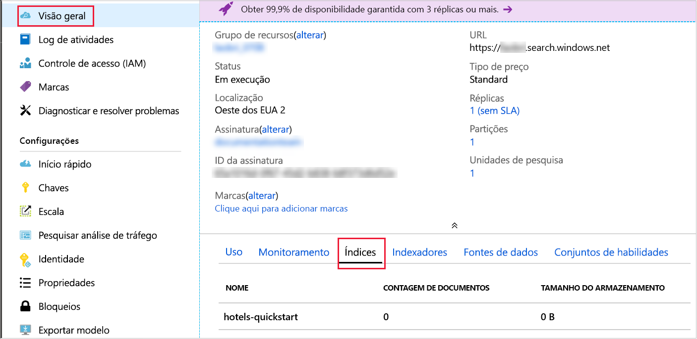

# <a name="quickstart-create-an-azure-search-index-in-nodejs-using-rest-apis"></a>Início Rápido: Criar um índice do Azure Search em Node.js usando APIs REST
> [!div class="op_single_selector"]
> * [JavaScript](search-get-started-nodejs.md)
> * [C#](search-get-started-dotnet.md)
> * [Portal](search-get-started-portal.md)
> * [PowerShell](search-create-index-rest-api.md)
> * [Python](search-get-started-python.md)
> * [Postman](search-get-started-postman.md)

Crie um aplicativo Node.js que crie, carregue e consulte um índice do Azure Search. Este artigo demonstra como criar o aplicativo passo a passo. Como alternativa, você pode [baixar o código-fonte e os dados](https://github.com/Azure-Samples/azure-search-javascript-samples/tree/master/quickstart/) e executar o aplicativo da linha de comando.

Se você não tiver uma assinatura do Azure, crie uma [conta gratuita](https://azure.microsoft.com/free/?WT.mc_id=A261C142F) antes de começar.

## <a name="prerequisites"></a>Pré-requisitos

Os serviços, as ferramentas e os dados a seguir são usados neste início rápido.

+ [Node.js](https://nodejs.org).
+ O [NPM](https://www.npmjs.com) deve ser instalado pelo Node.js.
+ Uma estrutura de índice de exemplo e documentos correspondentes são fornecidos neste artigo ou no diretório [**início rápido** do repositório](https://github.com/Azure-Samples/azure-search-javascript-samples/).
+ [Crie um serviço Azure Search](search-create-service-portal.md) ou [localize um serviço existente](https://ms.portal.azure.com/#blade/HubsExtension/BrowseResourceBlade/resourceType/Microsoft.Search%2FsearchServices) na assinatura atual. É possível usar um serviço gratuito para este início rápido.

Recomendável:

* [Visual Studio Code](https://code.visualstudio.com).
* Extensões [Prettier](https://marketplace.visualstudio.com/items?itemName=esbenp.prettier-vscode) e [ESLint](https://marketplace.visualstudio.com/items?itemName=dbaeumer.vscode-eslint) para VSCode.

<a name="get-service-info"></a>
## <a name="get-keys-and-urls"></a>Obter chaves e URLs

As chamadas ao serviço exigem um ponto de extremidade de URL e uma chave de acesso em cada solicitação. Um serviço de pesquisa é criado com ambos, portanto, se você adicionou o Azure Search à sua assinatura, siga estas etapas para obter as informações necessárias:

1. [Entre no portal do Azure](https://portal.azure.com/) e, na página **Visão Geral** do serviço de pesquisa, obtenha o nome de seu serviço de pesquisa. Você pode confirmar o nome do serviço examinando a URL do ponto de extremidade. Se a URL do ponto de extremidade for `https://mydemo.search.windows.net`, o nome do serviço será `mydemo`.

2. Em **Configurações** > **Chaves**, obtenha uma chave de administração para adquirir todos os direitos sobre o serviço. Há duas chaves de administração intercambiáveis, fornecidas para a continuidade dos negócios, caso seja necessário sobrepor uma. É possível usar a chave primária ou secundária em solicitações para adicionar, modificar e excluir objetos.

    Obtenha a chave de consulta também. É uma melhor prática para emitir solicitações de consulta com acesso somente leitura.


Todas as solicitações exigem uma api-key no cabeçalho de cada solicitação enviada a seu serviço. Uma chave válida estabelece a relação de confiança, para cada solicitação, entre o aplicativo que envia a solicitação e o serviço que a manipula.

## <a name="set-up-your-environment"></a>Configure seu ambiente

Comece abrindo um console do PowerShell ou outro ambiente no qual você instalou o Node.js.

1. Crie um diretório de desenvolvimento e dê a ele o nome `quickstart`:

    ```powershell
    mkdir quickstart
    cd quickstart
    ```

2. Inicialize um projeto vazio com NPM executando `npm init`. Aceite os valores padrão, exceto para a licença, que você deve definir como "MIT". 

1. Adicionar pacotes que serão dependentes do código e vão auxiliar no desenvolvimento:

    ```powershell
    npm install nconf node-fetch
    npm install --save-dev eslint eslint-config-prettier eslint-config-airbnb-base eslint-plugin-import prettier
    ```

4. Confirme que você configurou os projetos e suas dependências verificando se o arquivo **package.json** é semelhante ao seguinte:

    ```json
    {
      "name": "quickstart",
      "version": "1.0.0",
      "description": "Azure Search Quickstart",
      "main": "index.js",
      "scripts": {
        "test": "echo \"Error: no test specified\" && exit 1"
      },
      "keywords": [
        "Azure",
        "Azure_Search"
      ],
      "author": "Your Name",
      "license": "MIT",
      "dependencies": {
        "nconf": "^0.10.0",
        "node-fetch": "^2.6.0"
      },
      "devDependencies": {
        "eslint": "^6.1.0",
        "eslint-config-airbnb-base": "^13.2.0",
        "eslint-config-prettier": "^6.0.0",
        "eslint-plugin-import": "^2.18.2",
        "prettier": "^1.18.2"
      }
    }
    ```
Crie um arquivo **azure_search_config.json** para manter os dados do serviço de pesquisa:

```json
{
    "serviceName" : "[SERVICE_NAME]",
    "adminKey" : "[ADMIN_KEY]",
    "queryKey" : "[QUERY_KEY]",
    "indexName" : "hotels-quickstart"
}
```

Substitua o valor `[SERVICE_NAME]` pelo nome do serviço de pesquisa. Substitua `[ADMIN_KEY]` e`[QUERY_KEY]` pelos valores de chave que você registrou anteriormente. 

## <a name="1---create-index"></a>1 – Criar o índice 

Crie um arquivo **hotels_quickstart_index. JSON**.  Este arquivo define como o Azure Search funciona com os documentos que você carregará na próxima etapa. Cada campo será identificado por um `name` e terá um `type` especificado. Cada campo também tem uma série de atributos de índice que especificam se o Azure Search pode pesquisar, filtrar, classificar e facetar o campo. A maioria dos campos é composta por tipos de dados simples, mas alguns, como `AddressType`, são tipos complexos que permitem que você crie estruturas de dados avançadas em seu índice.  Você pode ler mais sobre [tipos de dados](https://docs.microsoft.com/rest/api/searchservice/supported-data-types) e [atributos de índice compatíveis](https://docs.microsoft.com/azure/search/search-what-is-an-index#index-attributes). 

Adicione o seguinte a **hotels_quickstart_index.json** ou [baixe o arquivo](https://github.com/Azure-Samples/azure-search-javascript-samples/blob/master/quickstart/hotels_quickstart_index.json). 

```json
{
    "name": "hotels-quickstart",
    "fields": [
        {
            "name": "HotelId",
            "type": "Edm.String",
            "key": true,
            "filterable": true
        },
        {
            "name": "HotelName",
            "type": "Edm.String",
            "searchable": true,
            "filterable": false,
            "sortable": true,
            "facetable": false
        },
        {
            "name": "Description",
            "type": "Edm.String",
            "searchable": true,
            "filterable": false,
            "sortable": false,
            "facetable": false,
            "analyzer": "en.lucene"
        },
        {
            "name": "Description_fr",
            "type": "Edm.String",
            "searchable": true,
            "filterable": false,
            "sortable": false,
            "facetable": false,
            "analyzer": "fr.lucene"
        },
        {
            "name": "Category",
            "type": "Edm.String",
            "searchable": true,
            "filterable": true,
            "sortable": true,
            "facetable": true
        },
        {
            "name": "Tags",
            "type": "Collection(Edm.String)",
            "searchable": true,
            "filterable": true,
            "sortable": false,
            "facetable": true
        },
        {
            "name": "ParkingIncluded",
            "type": "Edm.Boolean",
            "filterable": true,
            "sortable": true,
            "facetable": true
        },
        {
            "name": "LastRenovationDate",
            "type": "Edm.DateTimeOffset",
            "filterable": true,
            "sortable": true,
            "facetable": true
        },
        {
            "name": "Rating",
            "type": "Edm.Double",
            "filterable": true,
            "sortable": true,
            "facetable": true
        },
        {
            "name": "Address",
            "type": "Edm.ComplexType",
            "fields": [
                {
                    "name": "StreetAddress",
                    "type": "Edm.String",
                    "filterable": false,
                    "sortable": false,
                    "facetable": false,
                    "searchable": true
                },
                {
                    "name": "City",
                    "type": "Edm.String",
                    "searchable": true,
                    "filterable": true,
                    "sortable": true,
                    "facetable": true
                },
                {
                    "name": "StateProvince",
                    "type": "Edm.String",
                    "searchable": true,
                    "filterable": true,
                    "sortable": true,
                    "facetable": true
                },
                {
                    "name": "PostalCode",
                    "type": "Edm.String",
                    "searchable": true,
                    "filterable": true,
                    "sortable": true,
                    "facetable": true
                },
                {
                    "name": "Country",
                    "type": "Edm.String",
                    "searchable": true,
                    "filterable": true,
                    "sortable": true,
                    "facetable": true
                }
            ]
        }
    ],
    "suggesters": [
        {
            "name": "sg",
            "searchMode": "analyzingInfixMatching",
            "sourceFields": [
                "HotelName"
            ]
        }
    ]
}
```
    

É uma boa prática separar os detalhes de um cenário específico do código que será amplamente aplicável. A classe `AzureSearchClient` definida no arquivo **AzureSearchClient.js** saberá como construir URLs de solicitação, fazer uma solicitação usando a API de Busca e reagir ao código de status da resposta.

Comece a trabalhar no **AzureSearchClient.js** importando o pacote **node-fetch** e criando uma classe simples. Isole as partes alteráveis da classe `AzureSearchClient` passando para seu construtor os diversos valores de configuração:

```javascript
const fetch = require('node-fetch');

class AzureSearchClient {
    constructor(searchServiceName, adminKey, queryKey, indexName) {
        this.searchServiceName = searchServiceName;
        this.adminKey = adminKey;
        // The query key is used for read-only requests and so can be distributed with less risk of abuse.
        this.queryKey = queryKey;
        this.indexName = indexName;
        this.apiVersion = '2019-05-06';
    }

    // All methods go inside class body here!
}

module.exports = AzureSearchClient;
```

A primeira responsabilidade da classe é saber como construir URLs para as quais enviar as várias solicitações. Crie essas URLs com métodos de instância que usam os dados de configuração passados para o construtor de classe. Observe que a URL que ele constrói é específica de uma versão de API e deve ter um argumento especificando essa versão (neste aplicativo, `2019-05-06`). 

O primeiro desses métodos retornará a URL para o índice em si. Adicione o seguinte método dentro do corpo da classe:

```javascript
getIndexUrl() { return `https://${this.searchServiceName}.search.windows.net/indexes/${this.indexName}?api-version=${this.apiVersion}`; }

```

A próxima responsabilidade de `AzureSearchClient` é fazer uma solicitação assíncrona com a API Fetch. O método estático assíncrono `request` usa uma URL, uma cadeia de caracteres especificando o método HTTP ("GET", "PUT", "POST", "DELETE"), a chave a ser usada na solicitação e um objeto JSON opcional. A variável `headers` mapeia o `queryKey` (seja a chave de administração ou a chave de consulta somente leitura) para o cabeçalho de solicitação HTTP "api-key". As opções de solicitação sempre contêm o `method` a ser usado e o `headers`. Se `bodyJson` não for `null`, o corpo da solicitação HTTP será definido como a representação da cadeia de caracteres de `bodyJson`. O método `request` retorna a Promessa da API Fetch para executar a solicitação HTTP.

```javascript
static async request(url, method, apiKey, bodyJson = null) {
    // Uncomment the following for request details:
    /*
    console.log(`\n${method} ${url}`);
    console.log(`\nKey ${apiKey}`);
    if (bodyJson !== null) {
        console.log(`\ncontent: ${JSON.stringify(bodyJson, null, 4)}`);
    }
    */

    const headers = {
        'content-type' : 'application/json',
        'api-key' : apiKey
    };
    const init = bodyJson === null ?
        { 
            method, 
            headers
        }
        : 
        {
            method, 
            headers,
            body : JSON.stringify(bodyJson)
        };
    return fetch(url, init);
}
```

Para fins de demonstração, gere uma exceção apenas se a solicitação HTTP não for um sucesso. Em um aplicativo real, você provavelmente faria algum registro em log e diagnóstico do código de status HTTP no `response` da solicitação de serviço de pesquisa. 
    
```javascript
static throwOnHttpError(response) {
    const statusCode = response.status;
    if (statusCode >= 300){
        console.log(`Request failed: ${JSON.stringify(response, null, 4)}`);
        throw new Error(`Failure in request. HTTP Status was ${statusCode}`);
    }
}
```

Por fim, adicione os métodos para detectar, excluir e criar o índice do Azure Search. Todos esses métodos têm a mesma estrutura:

* Obtenha o ponto de extremidade para o qual a solicitação será feita.
* Gere a solicitação com o ponto de extremidade apropriado, o verbo HTTP, a chave de API e, se adequado, um corpo JSON. `indexExistsAsync()` e `deleteIndexAsync()` não têm um corpo JSON, mas `createIndexAsync(definition)` tem.
* `await` a resposta à solicitação.  
* Aja com relação ao código de status HTTP da resposta.
* Retorne uma Promessa de algum valor apropriado (um Booliano, `this` ou os resultados da consulta). 

```javascript
async indexExistsAsync() { 
    console.log("\n Checking if index exists...");
    const endpoint = this.getIndexUrl();
    const response = await AzureSearchClient.request(endpoint, "GET", this.adminKey);
    // Success has a few likely status codes: 200 or 204 (No Content), but accept all in 200 range...
    const exists = response.status >= 200 && response.status < 300;
    return exists;
}

async deleteIndexAsync() {
    console.log("\n Deleting existing index...");
    const endpoint = this.getIndexUrl();
    const response = await AzureSearchClient.request(endpoint, "DELETE", this.adminKey);
    AzureSearchClient.throwOnHttpError(response);
    return this;
}

async createIndexAsync(definition) {
    console.log("\n Creating index...");
    const endpoint = this.getIndexUrl();
    const response = await AzureSearchClient.request(endpoint, "PUT", this.adminKey, definition);
    AzureSearchClient.throwOnHttpError(response);
    return this;
}
```

Confirme se os seus métodos estão dentro da classe e se você está exportando a classe. O escopo mais externo de **AzureSearchClient.js** deve ser:

```javascript
const fetch = require('node-fetch');

class AzureSearchClient {
    // ... code here ...
}

module.exports = AzureSearchClient;
```

Uma classe orientada a objeto era uma boa opção para o módulo **AzureSearchClient.js** potencialmente reutilizável, mas não é necessária para o programa principal, que deve ser colocado em um arquivo chamado **index.js**. 

Crie **index.js** e comece trazendo:

* O pacote **nconf**, que oferece flexibilidade para especificar a configuração com JSON, variáveis de ambiente ou argumentos de linha de comando.
* Os dados do arquivo **hotels_quickstart_index.json**.
* O módulo `AzureSearchClient`.

```javascript
const nconf = require('nconf');

const indexDefinition = require('./hotels_quickstart_index.json');
const AzureSearchClient = require('./AzureSearchClient.js');
```

O [pacote **nconf**](https://github.com/indexzero/nconf) permite especificar dados de configuração em uma variedade de formatos, como variáveis de ambiente ou linha de comando. Este exemplo usa **nconf** de uma maneira básica para ler o arquivo **azure_search_config.json** e retornar o conteúdo desse arquivo como um dicionário. Usando a função `get(key)` de **nconf**, você pode fazer uma verificação rápida de que as informações de configuração foram personalizadas corretamente. Por fim, a função retorna a configuração:

```javascript
function getAzureConfiguration() {
    const config = nconf.file({ file: 'azure_search_config.json' });
    if (config.get('serviceName') === '[SEARCH_SERVICE_NAME' ) {
        throw new Error("You have not set the values in your azure_search_config.json file. Change them to match your search service's values.");
    }
    return config;
}
```

A função `sleep` cria um `Promise` que é resolvido após um período de tempo especificado. Usar essa função permite que o aplicativo seja pausado enquanto aguarda as operações de índice assíncronas serem concluídas e ficarem disponíveis. Adicionar esse atraso costuma ser necessário apenas em demonstrações, testes e aplicativos de exemplo.

```javascript
function sleep(ms) {
    return(
        new Promise(function(resolve, reject) {
            setTimeout(function() { resolve(); }, ms);
        })
    );
}
```

Por fim, especifique e chame a função `run` assíncrona principal. Essa função chama as outras funções em ordem, aguardando conforme necessário para resolver `Promise`s.

* Recuperar a configuração com a `getAzureConfiguration()` escrita anteriormente
* Criar uma nova instância `AzureSearchClient`, passando valores de sua configuração
* Verifique se o índice existe e, se existir, exclua-o
* Criar um índice usando o `indexDefinition` carregado de **hotels_quickstart_index.json**

```javascript
const run = async () => {
    try {
        const cfg = getAzureConfiguration();
        const client = new AzureSearchClient(cfg.get("serviceName"), cfg.get("adminKey"), cfg.get("queryKey"), cfg.get["serviceName"]);
        
        const exists = await client.indexExistsAsync();
        await exists ? client.deleteIndexAsync() : Promise.resolve();
        // Deleting index can take a few seconds
        await sleep(2000);
        await client.createIndexAsync(indexDefinition);
    } catch (x) {
        console.log(x);
    }
}

run();
```

Não se esqueça dessa chamada final para `run()`. É o ponto de entrada para seu programa quando você executa `node index.js` na próxima etapa.

Observe que `AzureSearchClient.indexExistsAsync()` e `AzureSearchClient.deleteIndexAsync()` não usam parâmetros. Essas funções chamam `AzureSearchClient.request()` sem argumentos `bodyJson`. Em `AzureSearchClient.request()`, como `bodyJson === null` é `true`, a estrutura `init` é definida para ser apenas o verbo HTTP ("GET" para `indexExistsAsync()` e "DELETE" para `deleteIndexAsync()`) e os cabeçalhos, que especificam a chave de solicitação.  

Por outro lado, o método `AzureSearchClient.createIndexAsync(indexDefinition)` _usa_ um parâmetro. A função `run` em `index.js` passa o conteúdo do arquivo **hotels_quickstart_index.json** para o método `AzureSearchClient.createIndexAsync(indexDefinition)`. O método `createIndexAsync()` passa essa definição para `AzureSearchClient.request()`. Em `AzureSearchClient.request()`, como `bodyJson === null` agora é `false`, a estrutura `init` inclui não apenas o verbo HTTP ("PUT") e os cabeçalhos, mas define o `body` para os dados de definição do índice.

### <a name="prepare-and-run-the-sample"></a>Preparar e executar o exemplo

Use uma janela de terminal para os seguintes comandos.

1. Navegue até a pasta que contém o arquivo **package.json** e o restante do seu código.
1. Instale os pacotes para o exemplo com `npm install`.  Esse comando baixará os pacotes dos quais o código depende.
1. Execute o programa com `node index.js`.

Você deve ver uma série de mensagens que descrevem as ações que estão sendo executadas pelo programa. Se desejar ver mais detalhes das solicitações, você poderá remover a marca de comentário das [linhas no início do método `AzureSearchClient.request()`]https://github.com/Azure-Samples/azure-search-javascript-samples/blob/master/quickstart/AzureSearchClient.js#L21-L27) em **AzureSearchClient.js**. 

Abra a **Visão geral** do serviço de pesquisa no portal do Azure. Selecione a guia **Índices**. Você verá algo semelhante ao que se segue:



Na próxima etapa, você adicionará dados ao índice. 

## <a name="2---load-documents"></a>2 – Carregar documentos 

No Azure Search, os documentos são estruturas de dados que são entradas para indexação e saídas de consultas. Você precisa POSTAR esses dados no índice. Esse processo usa um ponto de extremidade diferente das operações realizadas na etapa anterior. Abra **AzureSearchClient.js** e adicione o seguinte método após `getIndexUrl()`:

```javascript
 getPostDataUrl() { return `https://${this.searchServiceName}.search.windows.net/indexes/${this.indexName}/docs/index?api-version=${this.apiVersion}`;  }
```

Assim como `AzureSearchClient.createIndexAsync(definition)`, você precisa de uma função que chame `AzureSearchClient.request()` e passe os dados do hotel para que sejam seu corpo. Em **AzureSearchClient.js**, adicione `postDataAsync(hotelsData)` após `createIndexAsync(definition)`:

```javascript
async postDataAsync(hotelsData) {
    console.log("\n Adding hotel data...");
    const endpoint = this.getPostDataUrl();
    const response = await AzureSearchClient.request(endpoint,"POST", this.adminKey, hotelsData);
    AzureSearchClient.throwOnHttpError(response);
    return this;
}
```

 As entradas de documento podem ser linhas em um banco de dados, blobs no armazenamento de Blobs ou, como neste exemplo, documentos JSON em disco. Você pode baixar [hotels.json](https://github.com/Azure-Samples/azure-search-javascript-samples/blob/master/quickstart/hotels.json) ou criar seu próprio arquivo **hotels.json** com o seguinte conteúdo:

```json
{
    "value": [
        {
            "HotelId": "1",
            "HotelName": "Secret Point Motel",
            "Description": "The hotel is ideally located on the main commercial artery of the city in the heart of New York. A few minutes away is Time's Square and the historic centre of the city, as well as other places of interest that make New York one of America's most attractive and cosmopolitan cities.",
            "Description_fr": "L'hôtel est idéalement situé sur la principale artère commerciale de la ville en plein cœur de New York. A quelques minutes se trouve la place du temps et le centre historique de la ville, ainsi que d'autres lieux d'intérêt qui font de New York l'une des villes les plus attractives et cosmopolites de l'Amérique.",
            "Category": "Boutique",
            "Tags": ["pool", "air conditioning", "concierge"],
            "ParkingIncluded": false,
            "LastRenovationDate": "1970-01-18T00:00:00Z",
            "Rating": 3.6,
            "Address": {
                "StreetAddress": "677 5th Ave",
                "City": "New York",
                "StateProvince": "NY",
                "PostalCode": "10022"
            }
        },
        {
            "HotelId": "2",
            "HotelName": "Twin Dome Motel",
            "Description": "The hotel is situated in a  nineteenth century plaza, which has been expanded and renovated to the highest architectural standards to create a modern, functional and first-class hotel in which art and unique historical elements coexist with the most modern comforts.",
            "Description_fr": "L'hôtel est situé dans une place du XIXe siècle, qui a été agrandie et rénovée aux plus hautes normes architecturales pour créer un hôtel moderne, fonctionnel et de première classe dans lequel l'art et les éléments historiques uniques coexistent avec le confort le plus moderne.",
            "Category": "Boutique",
            "Tags": ["pool", "free wifi", "concierge"],
            "ParkingIncluded": "false",
            "LastRenovationDate": "1979-02-18T00:00:00Z",
            "Rating": 3.6,
            "Address": {
                "StreetAddress": "140 University Town Center Dr",
                "City": "Sarasota",
                "StateProvince": "FL",
                "PostalCode": "34243"
            }
        },
        {
            "HotelId": "3",
            "HotelName": "Triple Landscape Hotel",
            "Description": "The Hotel stands out for its gastronomic excellence under the management of William Dough, who advises on and oversees all of the Hotel’s restaurant services.",
            "Description_fr": "L'hôtel est situé dans une place du XIXe siècle, qui a été agrandie et rénovée aux plus hautes normes architecturales pour créer un hôtel moderne, fonctionnel et de première classe dans lequel l'art et les éléments historiques uniques coexistent avec le confort le plus moderne.",
            "Category": "Resort and Spa",
            "Tags": ["air conditioning", "bar", "continental breakfast"],
            "ParkingIncluded": "true",
            "LastRenovationDate": "2015-09-20T00:00:00Z",
            "Rating": 4.8,
            "Address": {
                "StreetAddress": "3393 Peachtree Rd",
                "City": "Atlanta",
                "StateProvince": "GA",
                "PostalCode": "30326"
            }
        },
        {
            "HotelId": "4",
            "HotelName": "Sublime Cliff Hotel",
            "Description": "Sublime Cliff Hotel is located in the heart of the historic center of Sublime in an extremely vibrant and lively area within short walking distance to the sites and landmarks of the city and is surrounded by the extraordinary beauty of churches, buildings, shops and monuments. Sublime Cliff is part of a lovingly restored 1800 palace.",
            "Description_fr": "Le sublime Cliff Hotel est situé au coeur du centre historique de sublime dans un quartier extrêmement animé et vivant, à courte distance de marche des sites et monuments de la ville et est entouré par l'extraordinaire beauté des églises, des bâtiments, des commerces et Monuments. Sublime Cliff fait partie d'un Palace 1800 restauré avec amour.",
            "Category": "Boutique",
            "Tags": ["concierge", "view", "24-hour front desk service"],
            "ParkingIncluded": true,
            "LastRenovationDate": "1960-02-06T00:00:00Z",
            "Rating": 4.6,
            "Address": {
                "StreetAddress": "7400 San Pedro Ave",
                "City": "San Antonio",
                "StateProvince": "TX",
                "PostalCode": "78216"
            }
        }
    ]
}

```

Para carregar esses dados em seu programa, modifique **index.js** adicionando a linha que se refere a `hotelData` próximo da parte superior:

```javascript
const nconf = require('nconf');

const hotelData = require('./hotels.json');
const indexDefinition = require('./hotels_quickstart_index.json');
```

Agora, modifique a função `run()` em **index.js**. Pode levar alguns segundos para que o índice fique disponível, portanto, adicione uma pausa de 2 segundos antes de chamar `AzureSearchClient.postDataAsync(hotelData)`:

```javascript
const run = async () => {
    try {
        const cfg = getAzureConfiguration();
        const client = new AzureSearchClient(cfg.get("serviceName"), cfg.get("adminKey"), cfg.get("queryKey"), cfg.get("indexName"));
        
        const exists = await client.indexExistsAsync();
        await exists ? client.deleteIndexAsync() : Promise.resolve();
        // Deleting index can take a few seconds
        await sleep(2000);
        await client.createIndexAsync(indexDefinition);
        // Index availability can take a few seconds
        await sleep(2000);
        await client.postDataAsync(hotelData);
    } catch (x) {
        console.log(x);
    }
}
```

Execute o programa novamente com `node index.js`. Você verá um conjunto de mensagens ligeiramente diferente daquelas vistas na Etapa 1. Desta vez, o índice _existe_ e você deverá ver uma mensagem sobre como excluí-lo antes que o aplicativo crie o novo índice e poste dados nele. 

## <a name="3---search-an-index"></a>3 - Pesquisar um índice

Volte para a guia **Índices** na **Visão geral** do serviço de pesquisa no portal do Azure. Agora, seu índice contém quatro documentos e consome alguma quantidade de armazenamento (pode levar alguns minutos para que a interface do usuário reflita corretamente o estado subjacente do índice). Clique no nome do índice para ser levado para o **Gerenciador de Pesquisa**. Esta página permite que você experimente com consultas de dados. Tente pesquisar em uma cadeia de caracteres de consulta de `*&$count=true` e você deverá recuperar todos os seus documentos e o número de resultados. Experimente com a cadeia de caracteres de consulta `historic&highlight=Description&$filter=Rating gt 4` e você deverá obter um único documento, com a palavra "history" encapsulada em marcas `<em></em>`. Leia mais sobre [como compor uma consulta no Azure Search](https://docs.microsoft.com/azure/search/search-query-overview). 

Reproduza essas consultas no código abrindo **index.js** e adicionando esse código próximo à parte superior:

```javascript
const queries = [
    "*&$count=true",
    "historic&highlight=Description&$filter=Rating gt 4&"
];
```

No mesmo arquivo **index.js**, escreva a função `doQueriesAsync()` mostrada abaixo. Essa função usa um objeto `AzureSearchClient` e aplica o método `AzureSearchClient.queryAsync` a cada um dos valores na matriz `queries`. Ele usa a função `Promise.all()` para retornar um único `Promise` que só é resolvido quando todas as consultas foram resolvidas. A chamada para `JSON.stringify(body, null, 4)` formata o resultado da consulta para ser mais legível.

```javascript
async function doQueriesAsync(client) {
    return Promise.all(
        queries.map( async query => {
            const result = await client.queryAsync(query);
            const body = await result.json();
            const str = JSON.stringify( body, null, 4);
            console.log(`Query: ${query} \n ${str}`);
        })
    );
}
```

Modifique a função `run()` para pausar por tempo suficiente para que o indexador funcione e, em seguida, chamar a função `doQueriesAsync(client)`:

```javascript
const run = async () => {
    try {
        const cfg = getAzureConfiguration();
        const client = new AzureSearchClient(cfg.get("serviceName"), cfg.get("adminKey"), cfg.get("queryKey"), cfg.get("indexName"));
        
        const exists = await client.indexExistsAsync();
        await exists ? client.deleteIndexAsync() : Promise.resolve();
        // Deleting index can take a few seconds
        await sleep(2000);
        await client.createIndexAsync(indexDefinition);
        // Index availability can take a few seconds
        await sleep(2000);
        await client.postDataAsync(hotelData);
        // Data availability can take a few seconds
        await sleep(5000);
        await doQueriesAsync(client);
    } catch (x) {
        console.log(x);
    }
}
```

Para implementar `AzureSearchClient.queryAsync(query)`, edite o arquivo **AzureSearchClient.js**. A pesquisa requer um ponto de extremidade diferente e os termos de pesquisa se tornam argumentos de URL, portanto, adicione a função `getSearchUrl(searchTerm)` ao lado dos métodos `getIndexUrl()` e `getPostDataUrl()` que você já escreveu.

```javascript
getSearchUrl(searchTerm) { return `https://${this.searchServiceName}.search.windows.net/indexes/${this.indexName}/docs?api-version=${this.apiVersion}&search=${searchTerm}&searchMode=all`; }
 ```

A função `queryAsync(searchTerm)` também entra em **AzureSearchClient.js** e segue a mesma estrutura que `postDataAsync(data)` e as outras funções de consulta: 

```javascript
async queryAsync(searchTerm) {
    console.log("\n Querying...")
    const endpoint = this.getSearchUrl(searchTerm);
    const response = await AzureSearchClient.request(endpoint, "GET", this.queryKey);
    AzureSearchClient.throwOnHttpError(response);
    return response;
}
```

A pesquisa é feita com o verbo "GET" e nenhum corpo, uma vez que o termo de pesquisa faz parte da URL. Observe que `queryAsync(searchTerm)` usa `this.queryKey`, diferente das outras funções que usaram a chave de administração. As chaves de consulta, como o nome indica, só podem ser usadas para consultar o índice, e não para modificar o índice de forma alguma. As chaves de consulta são, portanto, mais seguras para serem distribuídas aos aplicativos cliente.

Execute o programa com `node index.js`. Agora, além das etapas anteriores, as consultas serão enviadas e os resultados gravados no console.

### <a name="about-the-sample"></a>Sobre o exemplo

O exemplo usa uma pequena quantidade de dados de hotel, o suficiente para demonstrar as noções básicas de criar e consultar um índice do Azure Search.

A classe **AzureSearchClient** encapsula a configuração, as URLs e as solicitações HTTP básicas para o serviço de pesquisa. O arquivo **index.js** carrega os dados de configuração para o serviço do Azure Search, os dados de hotel que serão carregados para indexação e, em sua função `run`, ordena e executa as várias operações.

O comportamento geral da função `run` é excluir o índice do Azure Search, se ele existir, criar o índice, adicionar alguns dados e executar algumas consultas.  

## <a name="clean-up"></a>Limpar 

Quando você está trabalhando em sua própria assinatura, é uma boa ideia identificar, no final de um projeto, se você ainda precisa dos recursos criados. Recursos deixados em execução podem custar dinheiro. Você pode excluir os recursos individualmente ou excluir o grupo de recursos para excluir todo o conjunto de recursos.

Você pode localizar e gerenciar recursos no portal usando o link **Todos os recursos** ou **Grupos de recursos** no painel de navegação à esquerda.
Se você estiver usando um serviço gratuito, estará limitado a três índices, indexadores e fontes de dados. Você pode excluir itens individuais no portal para permanecer abaixo do limite. 

## <a name="next-steps"></a>Próximas etapas

Neste início rápido do Node.js, você trabalhou com uma série de tarefas para criar um índice, carregá-lo com documentos e executar consultas. Realizamos determinadas etapas, como ler a configuração e definir as consultas, da maneira mais simples possível. Em um aplicativo real, você desejaria colocar essas preocupações em módulos separados que dariam flexibilidade e encapsulamento. 
 
Se você já tiver alguma experiência com o Azure Search, use este exemplo como um trampolim para experimentar sugestões (consultas de preenchimento automático ou de digitação antecipada), filtros e navegação facetada. Se você for novo no Azure Search, recomendamos os outros tutoriais para que você compreenda o que pode criar. Visite nossa [página de documentação](https://azure.microsoft.com/documentation/services/search/) para encontrar mais recursos. 

> [!div class="nextstepaction"]
> [Chamar o Azure Search de uma página da Web usando JavaScript](https://github.com/liamca/azure-search-javascript-samples)
