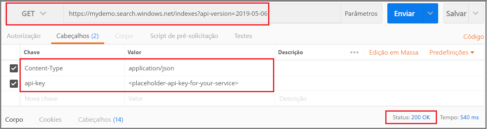
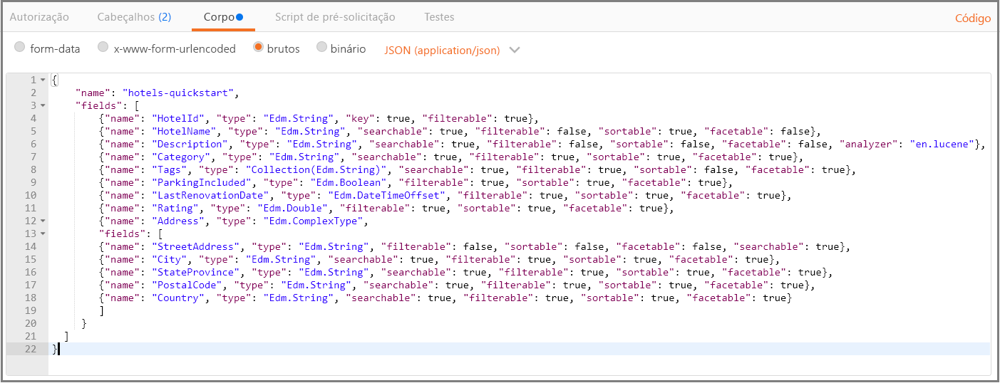
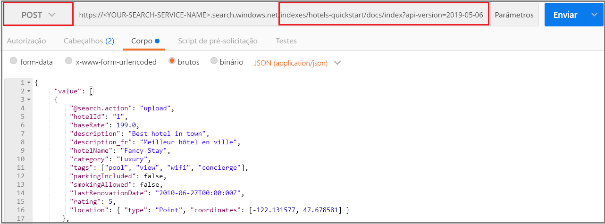
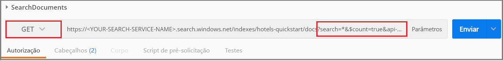
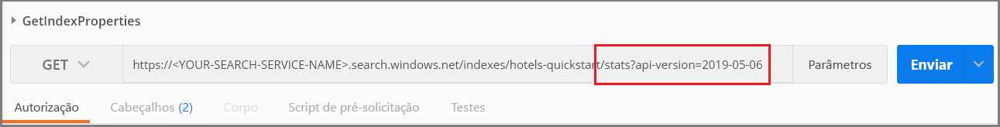

# <a name="quickstart-create-an-azure-search-index-in-postman-using-rest-apis"></a>Início Rápido: Criar um índice do Azure Search no Postman usando as APIs REST
> [!div class="op_single_selector"]
> * [Postman](search-get-started-postman.md)
> * [C#](search-create-index-dotnet.md)
> * [Python](search-get-started-python.md)
> * [Portal](search-get-started-portal.md)
> * [PowerShell](search-howto-dotnet-sdk.md)
>*

Uma das maneiras mais fáceis de explorar as [APIs REST do Azure Search](https://docs.microsoft.com/rest/api/searchservice) é usar o Postman ou outra ferramenta de teste da Web para formular solicitações HTTP e inspecionar as respostas. Com as ferramentas certas e essas instruções, você pode enviar pedidos e exibir respostas antes de escrever qualquer código.

Este artigo explica como formular solicitações de maneira interativa. Como alternativa, você pode [baixar e importar uma coleção do Postman](https://github.com/Azure-Samples/azure-search-postman-samples/tree/master/Quickstart) para usar solicitações predefinidas.

Se você não tiver uma assinatura do Azure, crie uma [conta gratuita](https://azure.microsoft.com/free/?WT.mc_id=A261C142F) antes de começar.

## <a name="prerequisites"></a>Pré-requisitos

Os serviços e as ferramentas a seguir são necessários para este início rápido. 

+ [Aplicativo da área de trabalho do Postman](https://www.getpostman.com/) é usado para enviar solicitações para o Azure Search.

+ [Crie um serviço Azure Search](search-create-service-portal.md) ou [localize um serviço existente](https://ms.portal.azure.com/#blade/HubsExtension/BrowseResourceBlade/resourceType/Microsoft.Search%2FsearchServices) na assinatura atual. É possível usar um serviço gratuito para este início rápido. 

## <a name="get-a-key-and-url"></a>Obter uma chave e uma URL

As chamadas REST exigem a URL do serviço e uma chave de acesso em cada solicitação. Um serviço de pesquisa é criado com ambos, portanto, se você adicionou o Azure Search à sua assinatura, siga estas etapas para obter as informações necessárias:

1. [Entre no portal do Azure](https://portal.azure.com/) e, na página **Visão Geral** do serviço de pesquisa, obtenha a URL. Um ponto de extremidade de exemplo pode parecer com `https://mydemo.search.windows.net`.

1. Em **Configurações** > **Chaves**, obtenha uma chave de administração para adquirir todos os direitos sobre o serviço. Há duas chaves de administração intercambiáveis, fornecidas para a continuidade dos negócios, caso seja necessário sobrepor uma. É possível usar a chave primária ou secundária em solicitações para adicionar, modificar e excluir objetos.


Todas as solicitações requerem uma chave de api em cada pedido enviado ao serviço. Ter uma chave válida estabelece a relação de confiança, para cada solicitação, entre o aplicativo que envia a solicitação e o serviço que lida com ela.

## <a name="connect-to-azure-search"></a>Conectar-se ao Azure Search

Nesta seção, use a sua ferramenta de escolha da web para configurar as conexões para o Azure Search. Cada ferramenta mantém as informações do cabeçalho de solicitação para a sessão, o que significa que você só precisa inserir a chave da API e o tipo de conteúdo uma vez.

Para qualquer uma dessas ferramentas, você precisa escolher um comando (GET, POST, PUT e assim por diante) fornecer um ponto de extremidade de URL e para algumas tarefas, fornecer o JSON no corpo da solicitação. Substitua o nome do serviço de pesquisa (YOUR-SEARCH-SERVICE-NAME) por um valor válido. Adicione `$select=name` para retornar apenas o nome de cada índice. 

    https://<YOUR-SEARCH-SERVICE-NAME>.search.windows.net/indexes?api-version=2019-05-06&$select=name

Observe o prefixo HTTPS, o nome do serviço, o nome de um objeto (nesse caso, a coleção de índices) e a [versão da API](search-api-versions.md). A versão da API é uma cadeia de caracteres em minúsculas obrigatória especificada como `?api-version=2019-05-06` para a versão atual. As versões de API são atualizadas regularmente. Incluir a versão de API em cada solicitação lhe dá controle total sobre qual é usada.  

A composição de cabeçalho de solicitação inclui dois elementos, o tipo de conteúdo e a chave de API usada para autenticar a Azure Search. Substitua a chave de API de administração (SUA-CHAVE-DE-API-DE-ADMINISTRAÇÃO-DO-AZURE-SEARCH) por um valor válido. 

    api-key: <YOUR-AZURE-SEARCH-ADMIN-API-KEY>
    Content-Type: application/json

No Postman, formule uma solicitação semelhante à captura de tela a seguir. Escolha **GET** como o verbo, forneça a URL e clique em **Enviar**. Esse comando conecta ao Azure Search, lê a coleção de índices e retorna o código de status HTTP 200 em uma conexão bem-sucedida. Se o serviço já tiver índices, a resposta também incluirá as definições de índice.



## <a name="1---create-an-index"></a>1 - Criar um índice

No Azure Search, você normalmente cria o índice antes de carregá-lo com dados. A [API REST Criar Índice](https://docs.microsoft.com/rest/api/searchservice/create-index) é usada para essa tarefa. 

A URL é estendida para incluir o nome do índice `hotels`.

Para fazer isso no Postman:

1. Altere o verbo para **PUT**.

2. Copie nesta URL `https://<YOUR-SEARCH-SERVICE-NAME>.search.windows.net/indexes/hotels?api-version=2019-05-06`.

3. Forneça a definição de índice (o código pronto para cópia é fornecido abaixo) no corpo da solicitação.

4. Clique em **Enviar**.



### <a name="index-definition"></a>Definição do índice

A coleção de campos define a estrutura do documento. Cada documento deve ter esses campos, e cada campo deve ter um tipo de dados. Os campos de cadeia de caracteres são usados na pesquisa de texto completo, portanto, talvez você queira converter dados numéricos como cadeias de caracteres, se você precisa que esse conteúdo seja pesquisável.

Os atributos no campo determinam a ação repetida. As APIs REST permitem muitas ações por padrão. Por exemplo, todas as cadeias de caracteres são pesquisáveis, recuperáveis, podem ser filtradas e podem possuir faceta por padrão. Geralmente, você só precisa definir atributos quando você precisa desabilitar um comportamento.

```json
{
    "name": "hotels-quickstart",  
    "fields": [
        {"name": "HotelId", "type": "Edm.String", "key": true, "filterable": true},
        {"name": "HotelName", "type": "Edm.String", "searchable": true, "filterable": false, "sortable": true, "facetable": false},
        {"name": "Description", "type": "Edm.String", "searchable": true, "filterable": false, "sortable": false, "facetable": false, "analyzer": "en.lucene"},
        {"name": "Category", "type": "Edm.String", "searchable": true, "filterable": true, "sortable": true, "facetable": true},
        {"name": "Tags", "type": "Collection(Edm.String)", "searchable": true, "filterable": true, "sortable": false, "facetable": true},
        {"name": "ParkingIncluded", "type": "Edm.Boolean", "filterable": true, "sortable": true, "facetable": true},
        {"name": "LastRenovationDate", "type": "Edm.DateTimeOffset", "filterable": true, "sortable": true, "facetable": true},
        {"name": "Rating", "type": "Edm.Double", "filterable": true, "sortable": true, "facetable": true},
        {"name": "Address", "type": "Edm.ComplexType", 
        "fields": [
        {"name": "StreetAddress", "type": "Edm.String", "filterable": false, "sortable": false, "facetable": false, "searchable": true},
        {"name": "City", "type": "Edm.String", "searchable": true, "filterable": true, "sortable": true, "facetable": true},
        {"name": "StateProvince", "type": "Edm.String", "searchable": true, "filterable": true, "sortable": true, "facetable": true},
        {"name": "PostalCode", "type": "Edm.String", "searchable": true, "filterable": true, "sortable": true, "facetable": true},
        {"name": "Country", "type": "Edm.String", "searchable": true, "filterable": true, "sortable": true, "facetable": true}
        ]
     }
  ]
}
```

Quando você enviar esta solicitação, você deve obter uma resposta HTTP 201, indicando que o índice foi criado com sucesso. Você pode verificar essa ação no portal, mas observe que a página do portal possui intervalos de atualização, portanto, pode levar um minuto ou dois para que ela seja atualizada.

> [!TIP]
> Se obtiver o HTTP 504, veja se a URL especifica HTTPS. Caso veja HTTP 400 ou 404, confira o corpo da solicitação para verificar se não houve erros ao copiar e colar. Um HTTP 403 normalmente indica um problema com a chave de API (uma chave inválida ou um problema de sintaxe com o modo que a chave de API está especificada).

## <a name="2---load-documents"></a>2 - Carregar documentos

Criar o índice e popular o índice são etapas separadas. No Azure Search, o índice contém todos os dados pesquisáveis, os quais você pode fornecer como documentos JSON. A [API REST Adicionar, Atualizar ou Excluir Documentos ](https://docs.microsoft.com/rest/api/searchservice/addupdate-or-delete-documents) é usada para essa tarefa. 

A URL é estendida para incluir as coleções `docs` e a operação `index`.

Para fazer isso no Postman:

1. Altere o verbo para **POST**.

2. Copie nesta URL `https://<YOUR-SEARCH-SERVICE-NAME>.search.windows.net/indexes/hotels-quickstart/docs/index?api-version=2019-05-06`.

3. Indique os documentos JSON (o código pronto para cópia é mostrado abaixo) no corpo da solicitação.

4. Clique em **Enviar**.



### <a name="json-documents-to-load-into-the-index"></a>Documentos JSON para carregar em um índice

O Corpo da solicitação contém quatro documentos a serem adicionados ao índice de hotéis.

```json
{
    "value": [
    {
    "@search.action": "upload",
    "HotelId": "1",
    "HotelName": "Secret Point Motel",
    "Description": "The hotel is ideally located on the main commercial artery of the city in the heart of New York. A few minutes away is Time's Square and the historic centre of the city, as well as other places of interest that make New York one of America's most attractive and cosmopolitan cities.",
    "Category": "Boutique",
    "Tags": [ "pool", "air conditioning", "concierge" ],
    "ParkingIncluded": false,
    "LastRenovationDate": "1970-01-18T00:00:00Z",
    "Rating": 3.60,
    "Address": 
        {
        "StreetAddress": "677 5th Ave",
        "City": "New York",
        "StateProvince": "NY",
        "PostalCode": "10022",
        "Country": "USA"
        } 
    },
    {
    "@search.action": "upload",
    "HotelId": "2",
    "HotelName": "Twin Dome Motel",
    "Description": "The hotel is situated in a  nineteenth century plaza, which has been expanded and renovated to the highest architectural standards to create a modern, functional and first-class hotel in which art and unique historical elements coexist with the most modern comforts.",
    "Category": "Boutique",
    "Tags": [ "pool", "free wifi", "concierge" ],
    "ParkingIncluded": false,
    "LastRenovationDate": "1979-02-18T00:00:00Z",
    "Rating": 3.60,
    "Address": 
        {
        "StreetAddress": "140 University Town Center Dr",
        "City": "Sarasota",
        "StateProvince": "FL",
        "PostalCode": "34243",
        "Country": "USA"
        } 
    },
    {
    "@search.action": "upload",
    "HotelId": "3",
    "HotelName": "Triple Landscape Hotel",
    "Description": "The Hotel stands out for its gastronomic excellence under the management of William Dough, who advises on and oversees all of the Hotel’s restaurant services.",
    "Category": "Resort and Spa",
    "Tags": [ "air conditioning", "bar", "continental breakfast" ],
    "ParkingIncluded": true,
    "LastRenovationDate": "2015-09-20T00:00:00Z",
    "Rating": 4.80,
    "Address": 
        {
        "StreetAddress": "3393 Peachtree Rd",
        "City": "Atlanta",
        "StateProvince": "GA",
        "PostalCode": "30326",
        "Country": "USA"
        } 
    },
    {
    "@search.action": "upload",
    "HotelId": "4",
    "HotelName": "Sublime Cliff Hotel",
    "Description": "Sublime Cliff Hotel is located in the heart of the historic center of Sublime in an extremely vibrant and lively area within short walking distance to the sites and landmarks of the city and is surrounded by the extraordinary beauty of churches, buildings, shops and monuments. Sublime Cliff is part of a lovingly restored 1800 palace.",
    "Category": "Boutique",
    "Tags": [ "concierge", "view", "24-hour front desk service" ],
    "ParkingIncluded": true,
    "LastRenovationDate": "1960-02-06T00:00:00Z",
    "Rating": 4.60,
    "Address": 
        {
        "StreetAddress": "7400 San Pedro Ave",
        "City": "San Antonio",
        "StateProvince": "TX",
        "PostalCode": "78216",
        "Country": "USA"
        }
    }
  ]
}
```

Em alguns segundos, você deverá ver uma resposta HTTP 201 na lista de sessões. Isso indica que os documentos foram criados com êxito. 

Se você obtiver um 207, houve falha no carregamento de pelo menos um documento. Se você obtiver um 404, há um erro de sintaxe no cabeçalho ou no corpo da solicitação: verifique se você alterou o ponto de extremidade para incluir `/docs/index`.

> [!Tip]
> Para fontes de dados selecionadas, você pode escolher a abordagem alternativa do *indexador* que simplifica e reduz a quantidade de código necessária para indexação. Para obter mais informações, confira [Operações do indexador](https://docs.microsoft.com/rest/api/searchservice/indexer-operations).


## <a name="3---search-an-index"></a>3 - Pesquisar um índice

Como um índice e documentos foram carregados, agora é possível emitir consultas usando a [API REST Pesquisar Documentos](https://docs.microsoft.com/rest/api/searchservice/search-documents).

A URL é estendida para incluir uma expressão de consulta, especificada usando o operador de pesquisa.

Para fazer isso no Postman:

1. Altere o verbo para **GET**.

2. Copie nesta URL `https://<YOUR-SEARCH-SERVICE-NAME>.search.windows.net/indexes/hotels-quickstart/docs?search=*&$count=true&api-version=2019-05-06`.

3. Clique em **Enviar**.

Essa consulta é vazia e retorna uma contagem dos documentos nos resultados da pesquisa. A solicitação e resposta devem ser semelhantes à captura de tela a seguir para Postman depois de clicar em **Enviar**. O código de status deve ser 200.

 

Experimente alguns outros exemplos de consulta para ter uma ideia da sintaxe. Você pode fazer uma pesquisa de cadeia de caracteres, consultas $filter textuais, limitar o conjunto de resultados, definir o escopo da pesquisa para campos específicos, entre outros.

Troque a URL atual pelas indicadas abaixo, clicando em **Enviar** a cada troca para exibir os resultados.

```
# Query example 1 - Search on restaurant and wifi
# Return only the HotelName, Description, and Tags fields
https://<YOUR-SEARCH-SERVICE>.search.windows.net/indexes/hotels-quickstart/docs?search=restaurant wifi&$count=true&$select=HotelName,Description,Tags&api-version=2019-05-06

# Query example 2 - Apply a filter to the index to find hotels rated 4 or highter
# Returns the HotelName and Rating. Two documents match
https://<YOUR-SEARCH-SERVICE>.search.windows.net/indexes/hotels-quickstart/docs?search=*&$filter=Rating gt 4&$select=HotelName,Rating&api-version=2019-05-06

# Query example 3 - Take the top two results, and show only HotelName and Category in the results
https://<YOUR-SEARCH-SERVICE>.search.windows.net/indexes/hotels-quickstart/docs?search=boutique&$top=2&$select=HotelName,Category&api-version=2019-05-06

# Query example 4 - Sort by a specific field (Address/City) in ascending order
https://<YOUR-SEARCH-SERVICE>.search.windows.net/indexes/hotels-quickstart/docs?search=pool&$orderby=Address/City asc&$select=HotelName, Address/City, Tags, Rating&api-version=2019-05-06
```

## <a name="get-index-properties"></a>Obter propriedades de índice
Use também [Obter Estatísticas](https://docs.microsoft.com/rest/api/searchservice/get-index-statistics) para consultar as contagens dos documentos e o tamanho do índice: 

```
https://<YOUR-SEARCH-SERVICE-NAME>.search.windows.net/indexes/hotels-quickstart/stats?api-version=2019-05-06`
```

A adição de `/stats` à URL retorna informações de índice. No Postman, sua solicitação deve ser semelhante à seguinte, e a resposta inclui uma contagem de documentos e o espaço usado em bytes.

 

Observe que a sintaxe de versão da API é diferente. Para esta solicitação, use `?` para anexar a versão da API. `?` separa o caminho da URL da cadeia de cadeia de consulta, enquanto & separa cada par 'nome=valor' na cadeia de consulta. Para essa consulta, a versão da API é o primeiro e único item na cadeia de consulta.

## <a name="clean-up"></a>Limpar

Quando você está trabalhando em sua própria assinatura, é uma boa ideia identificar, no final de um projeto, se você ainda precisa dos recursos criados. Recursos deixados em execução podem custar dinheiro. Você pode excluir os recursos individualmente ou excluir o grupo de recursos para excluir todo o conjunto de recursos.

Você pode localizar e gerenciar recursos no portal usando o link **Todos os recursos** ou **Grupos de recursos** no painel de navegação à esquerda.

Se você estiver usando um serviço gratuito, estará limitado a três índices, indexadores e fontes de dados. Você pode excluir itens individuais no portal para permanecer abaixo do limite. 

## <a name="next-steps"></a>Próximas etapas

Os clientes REST são imprescindíveis para uma exploração improvisada, mas agora que você sabe como funcionam as APIs REST, você pode continuar com o código. Para a próxima etapa, confira o seguinte link:

+ [Início Rápido: Criar um índice usando SDK do .NET](search-get-started-dotnet.md)
