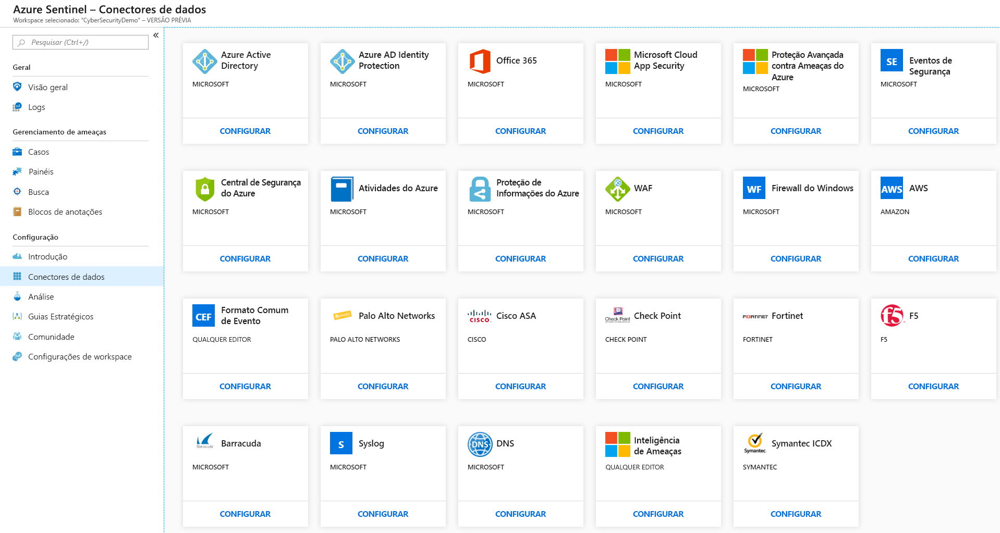
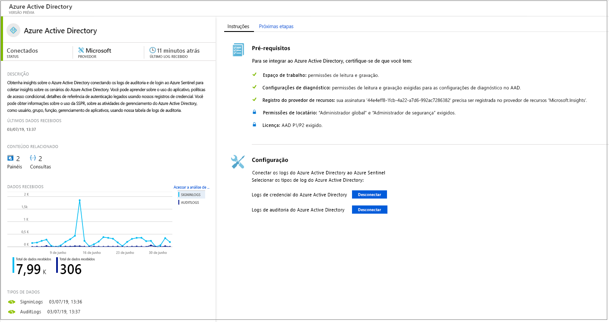
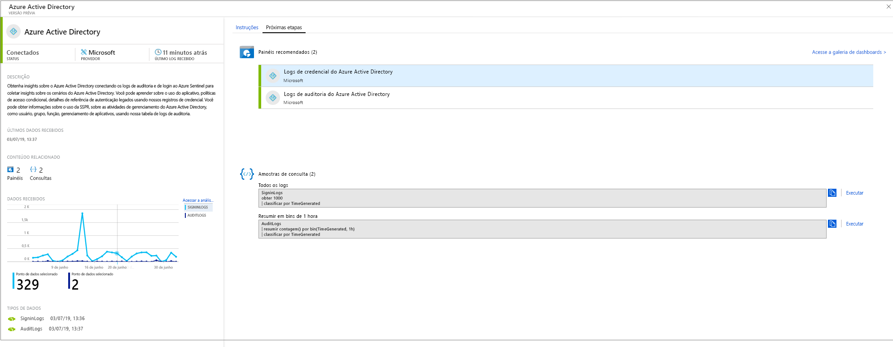
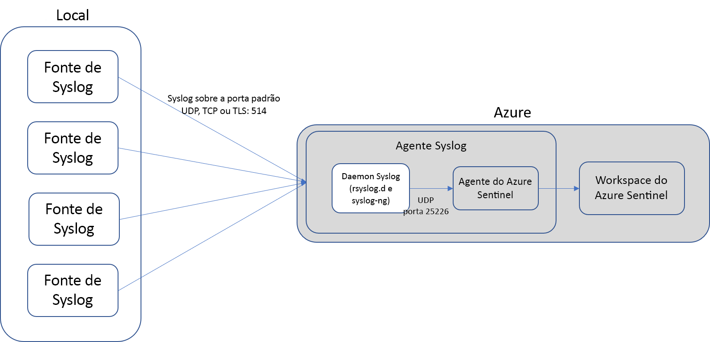
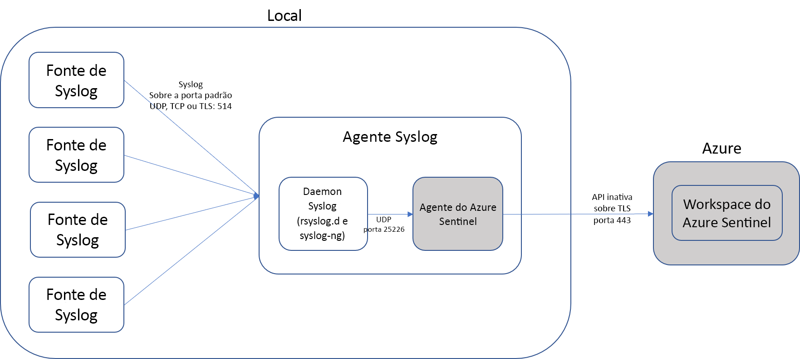

# Conectar fontes de dados

Para a integração do Azure Sentinel, você precisa primeiro se conectar às suas fontes de dados. O Azure Sentinel vem com uma série de conectores para soluções da Microsoft, disponíveis prontas para o uso e fornecendo integração em tempo real, incluindo soluções de Proteção contra Ameaças da Microsoft 365, e fontes do Microsoft 365, tais como Office 365, Azure AD, Azure ATP, Microsoft Cloud App Security e muito mais. Além disso, existem conectores internos no ecossistema de segurança mais amplo para soluções que não são da Microsoft. Você também pode usar formato comum de eventos, Syslog ou API REST para conectar suas fontes de dados ao Azure Sentinel.  

1. No menu, selecione **Conectores de dados**. Essa página permite ver a lista completa dos conectores fornecidos pelo Azure Sentinel e seus status. Selecione o conector que deseja conectar e selecione **Abrir página do conector**. 

   

1. Na página do conector específico, verifique se você atendeu a todos os pré-requisitos e siga as instruções para conectar os dados ao Azure Sentinel. Pode levar algum tempo para que a sincronização do logs com o Azure Sentinel seja iniciada. Depois de se conectar, você verá um resumo dos dados no grafo **Dados recebidos** e o status de conectividade dos tipos de dados.

   
  
1. Clique na guia **Próximas etapas** para obter uma lista do conteúdo pronto para uso fornecido pelo Azure Sentinel para o tipo de dados específico.

   
 

## Métodos de conexão de dados

O Azure Sentinel dá suporte aos métodos de conexão de dados a seguir:

- **Serviços Microsoft**:  os serviços da Microsoft são conectados nativamente, utilizando a base do Azure para integração pronta para o uso. É possível conectar as soluções a seguir em poucos cliques:
    - [Office 365](connect-office-365.md)
    - [Entradas e logs de auditoria do Microsoft Azure Active Directory](connect-azure-active-directory.md)
    - [Atividades do Azure](connect-azure-activity.md)
    - [Azure AD Identity Protection](connect-azure-ad-Identity-protection.md)
    - [Central de Segurança do Azure](connect-azure-security-center.md)
    - [Proteção de Informações do Azure](connect-azure-information-protection.md)
    - [Proteção Avançada contra Ameaças do Azure](connect-azure-atp.md)
    - [Cloud App Security](connect-cloud-app-security.md)
    - [Eventos de segurança do Windows](connect-windows-security-events.md) 
    - [Firewall do Windows](connect-windows-firewall.md)

- **Soluções externas por meio de API**: algumas fontes de dados são conectados por meio de APIs fornecidas pela fonte de dados conectada. Normalmente, a maioria das tecnologias de segurança fornece um conjunto de APIs por meio das quais os logs de eventos podem ser recuperados. As APIs se conectam ao Azure Sentinel e reúnem tipos de dados específicos e os enviam à Análise de Logs do Azure. Os dispositivos conectados por meio de API incluem:
    - [Barracuda](connect-barracuda.md)
    - [Symantec](connect-symantec.md)
- **Soluções externas por meio de agente**: o Azure Sentinel pode ser conectado a todas as outras fontes de dados capazes de executar streaming de log em tempo real usando o protocolo Syslog, por meio de um agente.  A maioria dos dispositivos usa o protocolo Syslog para enviar mensagens de eventos que incluem o próprio log e dados sobre o log. O formato dos logs varia. No entanto, a maioria dos dispositivos dá suporte ao padrão CEF (Formato Comum de Evento).  O agente do Azure Sentinel, que se baseia no agente do Log Analytics, converte logs formatados como CEF em um formato que pode ser ingerido pelo Log Analytics. Dependendo do tipo de dispositivo, o agente é instalado diretamente no dispositivo ou em um servidor dedicado do Linux. O agente para Linux recebe eventos do daemon Syslog por UDP. Porém, se um computador Linux deve coletar um alto volume de eventos de Syslog, eles são enviados por meio de TCP do daemon Syslog para o agente e de lá para o Log Analytics.
    - Firewalls, proxies e pontos de extremidade:
        - [F5](connect-f5.md)
        - [Check Point](connect-checkpoint.md)
        - [Cisco ASA](connect-cisco.md)
        - [Fortinet](connect-fortinet.md)
        - [Palo Alto](connect-paloalto.md)
        - [Outros dispositivos CEF](connect-common-event-format.md)
        - [Outros dispositivos Syslog](connect-syslog.md)
    - Soluções de DLP
    - [Provedores de inteligência contra ameaças](connect-threat-intelligence.md)
    - [Computadores DNS](connect-dns.md) - agente instalado diretamente no computador DNS
    - Servidores Linux
    - Outras nuvens
    
## Opções de conexão de agente

Para conectar seu dispositivo externo ao Azure Sentinel, o agente precisa ser implantado em um computador dedicado (VM ou local) para dar suporte à comunicação entre o dispositivo e o Azure Sentinel. Você pode implantar o agente manualmente ou automaticamente. A implantação automática só estará disponível se o computador dedicado for uma nova VM que você está criando no Azure. 

Como alternativa, você pode implantar o agente manualmente em uma VM do Azure existente em uma VM em outra nuvem ou em um computador local.

## Mapear tipos de dados com opções de conexão do Azure Sentinel

| **Tipo de dados** | **Como se conectar** | **Conector de dados?** | **Comentários** |
|------|---------|-------------|------|
| AWSCloudTrail | [Conectar AWS](connect-aws.md) | V | |
| AzureActivity | [Conectar Atividades do Azure](connect-azure-activity.md) e [Visão geral dos logs de atividade](../azure-monitor/platform/activity-logs-overview.md)| V | |
| AuditLogs | [Conectar o Azure AD](connect-azure-active-directory.md)  | V | |
| SigninLogs | [Conectar o Azure AD](connect-azure-active-directory.md)  | V | |
| AzureFirewall |[Diagnóstico do Azure](../firewall/tutorial-diagnostics.md) | V | |
| InformationProtectionLogs_CL  | [Relatórios da Proteção de Informações do Azure](https://docs.microsoft.com/azure/information-protection/reports-aip) [Conectar a Proteção de Informações do Azure](connect-azure-information-protection.md)  | V | Isso normalmente usa a função **InformationProtectionEvents** além do tipo de dados. Para saber mais, confira [Como modificar os relatórios e criar consultas personalizadas](https://docs.microsoft.com/azure/information-protection/reports-aip#how-to-modify-the-reports-and-create-custom-queries)|
| AzureNetworkAnalytics_CL  | [Esquema de análise de tráfego](../network-watcher/traffic-analytics.md) [Análise de tráfego](../network-watcher/traffic-analytics.md)  | | |
| CommonSecurityLog  | [Conectar CEF](connect-common-event-format.md)  | V | |
| OfficeActivity | [Conectar Office 365](connect-office-365.md) | V | |
| SecurityEvents | [Conectar eventos de segurança do Windows](connect-windows-security-events.md)  | V | Para as pastas de trabalho Protocolos Inseguros, confira [Configuração da pasta de trabalho de protocolos inseguros](https://blogs.technet.microsoft.com/jonsh/azure-sentinel-insecure-protocols-dashboard-setup/)  |
| syslog | [Conectar Syslog](connect-syslog.md) | V | |
| WAF (Firewall do Aplicativo Web) da Microsoft – (AzureDiagnostics) |[Conectar Firewall do Aplicativo Web da Microsoft](connect-microsoft-waf.md) | V | |
| SymantecICDx_CL | [Conectar Symantec](connect-symantec.md) | V | |
| ThreatIntelligenceIndicator  | [Conectar inteligência contra ameaças](connect-threat-intelligence.md)  | V | |
| VMConnection   ServiceMapComputer_CL  ServiceMapProcess_CL|  [Mapa do Serviço do Azure Monitor](../azure-monitor/insights/service-map.md) [Integração de insights de VM do Azure Monitor](../azure-monitor/insights/vminsights-onboard.md)   [Habilitar insights de VM do Azure Monitor](../azure-monitor/insights/vminsights-enable-overview.md)   [Usar integração de VM única](../azure-monitor/insights/vminsights-enable-single-vm.md)   [Usar integração pela política](../azure-monitor/insights/vminsights-enable-at-scale-policy.md)| X | Pasta de trabalho de insights de VM  |
| DnsEvents | [Conectar DNS](connect-dns.md) | V | |
| W3CIISLog | [Conectar logs do IIS](../azure-monitor/platform/data-sources-iis-logs.md)  | X | |
| WireData | [Conectar Wire Data](../azure-monitor/insights/wire-data.md) | X | |
| WindowsFirewall | [Conectar Firewall do Windows](connect-windows-firewall.md) | V | |
| AADIP SecurityAlert  | [Conectar Azure AD Identity Protection](connect-azure-ad-identity-protection.md)  | V | |
| AATP SecurityAlert  | [Conectar ATP do Azure](connect-azure-atp.md) | V | |
| ASC SecurityAlert  | [Conectar Central de Segurança do Azure](connect-azure-security-center.md)  | V | |
| MCAS SecurityAlert  | [Conectar Microsoft Cloud App Security](connect-cloud-app-security.md)  | V | |
| SecurityAlert | | | |
| Sysmon (Evento) | [Conectar Sysmon](https://azure.microsoft.com/blog/detecting-in-memory-attacks-with-sysmon-and-azure-security-center)  [Conectar Eventos do Windows](../azure-monitor/platform/data-sources-windows-events.md)   [Obter o Analisador Sysmon](https://github.com/Azure/Azure-Sentinel/blob/master/Parsers/SysmonParser.txt)| X | A coleção do Sysmon não está instalada por padrão em máquinas virtuais. Para obter mais informações sobre como instalar o Agente do Sysmon, confira [Sysmon](https://docs.microsoft.com/sysinternals/downloads/sysmon). |
| ConfigurationData  | [Automatizar inventário de VM](../automation/automation-vm-inventory.md)| X | |
| ConfigurationChange  | [Automatizar acompanhamento de VM](../automation/change-tracking.md) | X | |
| F5 BIG-IP | [Conectar F5 BIG-IP](https://devcentral.f5.com/s/articles/Integrating-the-F5-BIGIP-with-Azure-Sentinel.md)  | X | |
| McasShadowItReporting  |  | X | |
| Barracuda_CL | [Conectar Barracuda](connect-barracuda.md) | V | |

## Próximas etapas

- Para começar a usar o Azure Sentinel, você precisa ter uma assinatura do Microsoft Azure. Se você não tiver uma assinatura, você pode se inscrever em uma [avaliação gratuita](https://azure.microsoft.com/free/).
- Saiba como [integrar seus dados ao Azure Sentinel](quickstart-onboard.md) e [obtenha visibilidade de seus dados, além de possíveis ameaças](quickstart-get-visibility.md).
