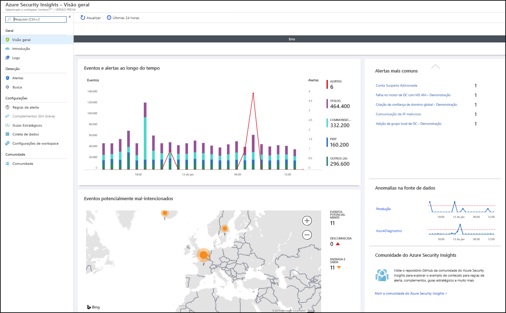
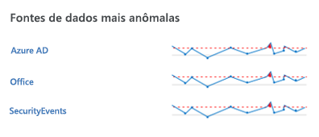
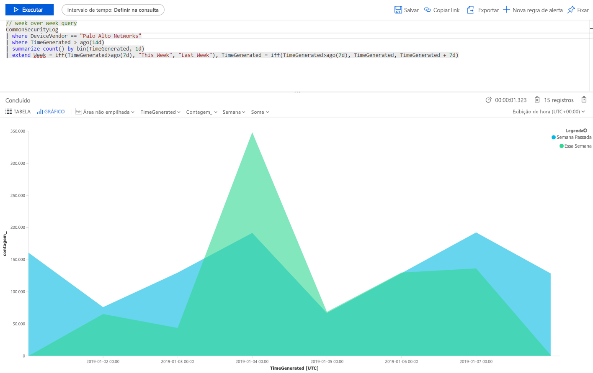

# Início Rápido: Introdução ao Azure Sentinel

Neste guia de início rápido, você aprenderá como poder exibir e monitorar rapidamente o que está acontecendo em seu ambiente usando o Azure Sentinel. Depois de conectar suas fontes de dados ao Azure Sentinel, você obtém visualização e análise instantâneas de dados para que possa saber o que está acontecendo em todas as suas fontes de dados conectadas. O Azure Sentinel oferece pastas de trabalho que oferecem toda a potência de ferramentas já disponíveis no Azure, assim como tabelas e gráficos feitos para fornecer análise para seus logs e consultas. É possível usar pastas de trabalho internas ou criar uma pasta de trabalho facilmente, do zero ou com base em uma pasta de trabalho existente. 

## Obter visualização

Para visualizar e obter uma análise do que está acontecendo em seu ambiente, primeiro, dê uma olhada no painel de visão geral para ter uma ideia da postura de segurança da organização. É possível clicar em cada elemento desses blocos para fazer busca detalhada nos dados brutos dos quais são criados. Para ajudar a reduzir o ruído e minimizar o número de alertas que você precisa analisar e investigar, o Azure Sentinel usa uma técnica de fusão para correlacionar alertas a incidentes. **Incidentes** são grupos de alertas relacionados que, juntos, criam um incidente acionável que você pode investigar e resolver.

- No portal do Microsoft Azure, selecione o Azure Sentinel e, depois, selecione o workspace que deseja monitorar.

  

- A barra de ferramentas na parte superior informa quantos eventos você obteve no período selecionado e compara com as 24 horas anteriores. A barra de ferramentas informa quantos alertas foram disparados com base nesses eventos (o número pequeno representa a mudança nas últimas 24 horas) e informa, para esses eventos, quantos estão abertos, em andamento e fechados. Verifique se não houve um aumento ou queda significativa no número de eventos. Se houve uma queda, é possível que uma conexão tenha parado de se reportar ao Azure Sentinel. Se houve um aumento, pode ter ocorrido algo suspeito. Verifique se há novos alertas.

   

O corpo principal da página de visão geral fornece insight rápido sobre o status de segurança do workspace:

- **Eventos e alertas ao longo do tempo**: Lista o número de eventos e quantos alertas foram criados com base nesses eventos. Se você vir um pico incomum, deverá ver alertas para ele. Caso haja algo incomum em que houve um pico nos eventos, mas você não viu alertas, isso pode ser motivo de preocupação.

- **Eventos mal-intencionados em potencial**: Quando se detecta tráfego de fontes que são conhecidas como mal-intencionadas, o Azure Sentinel alerta no mapa. Se você vir cor de laranja, trata-se de tráfego de entrada: alguém está tentando acessar sua organização de um endereço IP mal-intencionado conhecido. Se você vir uma atividade de saída (vermelha), significará que dados da sua rede estão saindo da organização para um endereço IP mal-intencionado conhecido.

   

- **Incidentes recentes**: Para exibir os incidentes recentes, a gravidade deles e o número de alertas associados com o incidente. Se você vir um pico repentino em um tipo específico de alerta, poderá significar que um ataque ativo está em execução no momento. Por exemplo, se você tiver um pico repentino de 20 eventos Pass-the-Hash do ATP do Azure, é possível que alguém esteja tentando atacá-lo no momento.

- **Anomalias na fonte de dados**: Analistas de dados da Microsoft criaram modelos que pesquisam constantemente anomalias nos dados de suas fontes de dados. Se não houver anomalias, nada será exibido. Se anomalias forem detectadas, você deverá examinar para ver o que aconteceu. Por exemplo, clique no pico na atividade do Azure. É possível clicar em **Gráfico** para ver quando o pico aconteceu e, em seguida, filtrar por atividades que ocorreram durante esse período para ver o que causou o pico.

   

## Usar pastas de trabalho internas

Pastas de trabalho internas oferecem dados integrados de suas fontes de dados conectadas para permitir que você examine os eventos gerados nesses serviços. As pastas de trabalho internas incluem a ID do Azure, eventos de atividades do Azure e locais, que podem ser dados de eventos do Windows de servidores, de alertas internos, de terceiros, incluindo logs de tráfego do firewall, Office 365 e protocolos inseguros com base em eventos do Windows. As pastas de trabalho são baseadas em Pastas de Trabalho do Azure Monitor para fornecer a você melhores personalização e flexibilidade na criação de sua própria pasta de trabalho. Para saber mais, confira [Pastas de Trabalho](../azure-monitor/app/usage-workbooks.md).

1. Em **Configurações**, selecione **Pastas de Trabalho**. Em **Instalados**, é possível ver todas as pastas de trabalho instaladas. Em **Todos**, é possível ver toda a galeria de pastas de trabalho internas disponíveis para instalação. 
2. Pesquise uma pasta de trabalho específica ver a lista inteira e a descrição do que cada uma oferece. 
3. Supondo que você usa o Azure AD, para começar a usar o Azure Sentinel, recomendamos que instale pelo menos as pastas de trabalho a seguir:
   - **Azure AD**: Use uma ou ambas as opções a seguir:
       - **As entradas do Azure AD** analisam as entradas ao longo do tempo para ver se há anomalias. Esta pasta de trabalho fornece entradas com falha por aplicativos, dispositivos e locais para que você possa perceber rapidamente se acontecer algo incomum. Preste atenção a várias entradas com falha. 
       - **Os logs de auditoria do Azure AD** analisam as atividades administrativas, como alterações em usuários (adicionar, remover etc.), criação de grupo e modificações.  

   - Adicione uma pasta de trabalho para seu firewall. Por exemplo, adicione a pasta de trabalho Palo Alto. A pasta de trabalho analisa o tráfego do firewall, fornecendo correlações entre eventos de ameaças e dados do firewall, além de realçar os eventos suspeitos em entidades. As pastas de trabalho fornecem informações sobre tendências no tráfego e permitem fazer busca detalhada e filtrar os resultados. 

      

Para personalizar as pastas de trabalho, edite a consulta principal . É possível clicar no botão  para acessar o [Log Analytics e editar a consulta encontrada](../azure-monitor/log-query/get-started-portal.md). Também é possível selecionar as reticências (...) e **Personalizar dados do bloco**, o que permite editar o filtro de tempo principal ou remover os blocos específicos da pasta de trabalho.

Para obter mais informações sobre como trabalhar com consultas, confira [Tutorial: Dados visuais no Log Analytics](../azure-monitor/learn/tutorial-logs-dashboards.md)

### Adicionar um novo bloco

Se desejar adicionar um novo bloco, será possível adicioná-lo a uma pasta de trabalho existente, seja um criado por você ou uma pasta de trabalho interna do Azure Sentinel. 
1. No Log Analytics, crie um bloco usando as instruções encontradas em [Tutorial: Dados visuais no Log Analytics](../azure-monitor/learn/tutorial-logs-dashboards.md). 
2. Após a criação do bloco, em **Fixar**, selecione a pasta de trabalho em que deseja que o bloco apareça.

## Criar pastas de trabalho
É possível criar uma pasta de trabalho do zero ou usar uma interna como a base da sua nova pasta de trabalho.

1. Para criar uma pasta de trabalho do zero, selecione **Pastas de Trabalho** e, em seguida, **+Nova pasta de trabalho**.
2. Selecione a assinatura em que a pasta de trabalho foi criada e lhe dê um nome descritivo. Cada pasta de trabalho é um recurso do Azure como qualquer outro. É possível atribuir funções (RBAC) para definir e limitar quem pode acessar. 
3. Para permitir que ela apareça em suas pastas de trabalho para fixar visualizações, é necessário compartilhá-la. Clique em **Compartilhar** e em **Gerenciar usuários**. 
 
1. Use **Verificar acesso** e **Atribuições de função** como faria para qualquer outro recurso do Azure. Para obter mais informações, confira [Compartilhar pastas de trabalho do Azure usando RBAC](../azure-portal/azure-portal-dashboard-share-access.md).

## Novos exemplos de pasta de trabalho

A consulta de exemplo a seguir permite que você compare as tendências de tráfego de diferentes semanas. Você pode alternar facilmente em qual fornecedor do dispositivo e fonte de dados executa a consulta. Este exemplo usa o SecurityEvent do Windows. É possível mudá-lo para ser executado no AzureActivity ou no CommonSecurityLog em qualquer outro firewall.

     |where DeviceVendor = = "Palo Alto Networks":
      // week over week query
      SecurityEvent
      | where TimeGenerated > ago(14d)
      | summarize count() by bin(TimeGenerated, 1d)
      | extend Week = iff(TimeGenerated>ago(7d), "This Week", "Last Week"), TimeGenerated = iff(TimeGenerated>ago(7d), TimeGenerated, TimeGenerated + 7d)

Talvez você queira criar uma consulta que incorpore dados de várias fontes. Você pode criar uma consulta que examina os logs de auditoria do Azure Active Directory para novos usuários que acabaram de ser criados e, em seguida, verifica os logs do Azure para ver se o usuário começou a fazer alterações na atribuição de função no prazo de 24 horas após a criação. A atividade suspeita apareceria neste painel:

    AuditLogs
    | where OperationName == "Add user"
    | project AddedTime = TimeGenerated, user = tostring(TargetResources[0].userPrincipalName)
    | join (AzureActivity
    | where OperationName == "Create role assignment"
    | project OperationName, RoleAssignmentTime = TimeGenerated, user = Caller) on user
    | project-away user1

É possível criar pastas de trabalho diferentes com base na função da pessoa que examina os dados e em que ela está procurando. É possível, por exemplo, criar uma pasta de trabalho para seu administrador de rede que inclua os dados do firewall. Também é possível criar pastas de trabalho com base na frequência com a qual deseja observá-las, se há coisas que você deseja revisar diariamente e outros itens que deseja verificar uma vez por hora, por exemplo. Talvez convenha examinar as entradas no Azure AD a cada hora em busca de anomalias. 

## Criar detecções

Gere detecções nas [fontes de dados que você conectou ao Azure Sentinel](connect-data-sources.md) para investigar ameaças em sua organização.

Quando você criar uma detecção, aproveite as detecções internas criadas por pesquisadores de segurança da Microsoft que são personalizadas para as fontes de dados conectadas.

Para exibir todas as detecções prontas para uso, acesse **Análise** e **Modelos de regra**. Esta guia contém todas as regras internas do Azure Sentinel.

   

Para obter mais informações sobre como obter detecções prontas para uso, confira [Tutorial: obter análise interna](tutorial-detect-threats-built-in.md).
 
## Próximas etapas
Neste início rápido, você aprendeu como começar a usar o Azure Sentinel. Continue com o tutorial sobre [como detectar ameaças](tutorial-detect-threats-built-in.md).
> [!div class="nextstepaction"]
> [Crie regras de detecção personalizadas](tutorial-detect-threats-custom.md) para automatizar suas respostas a ameaças.

