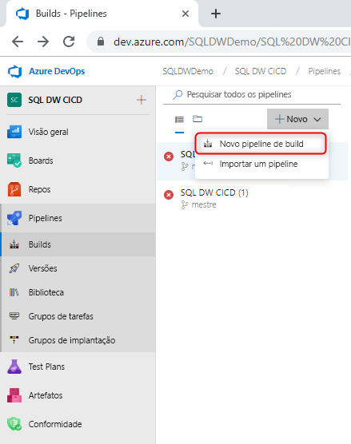
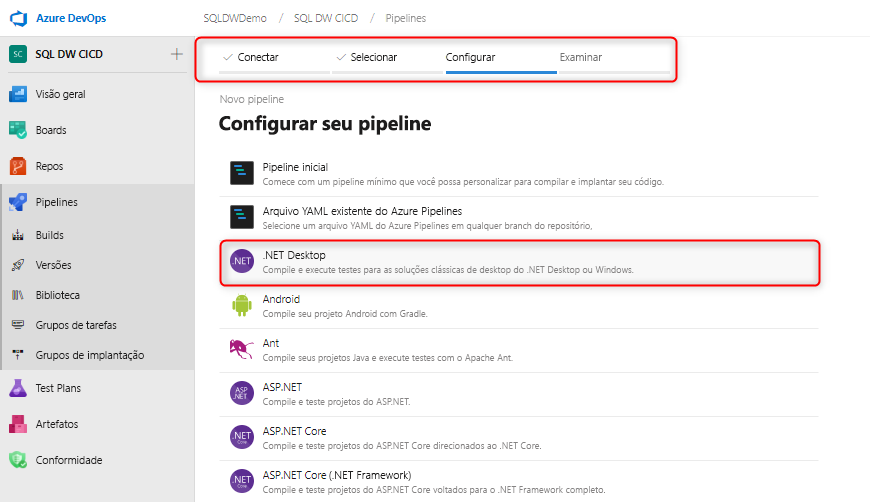
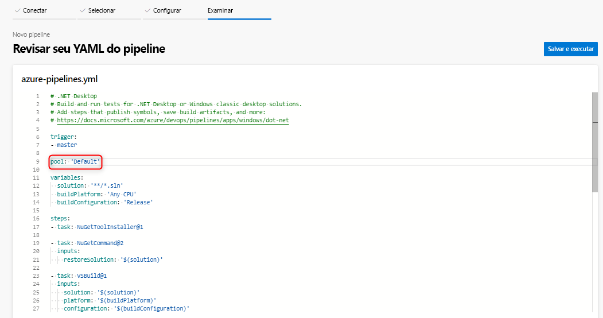
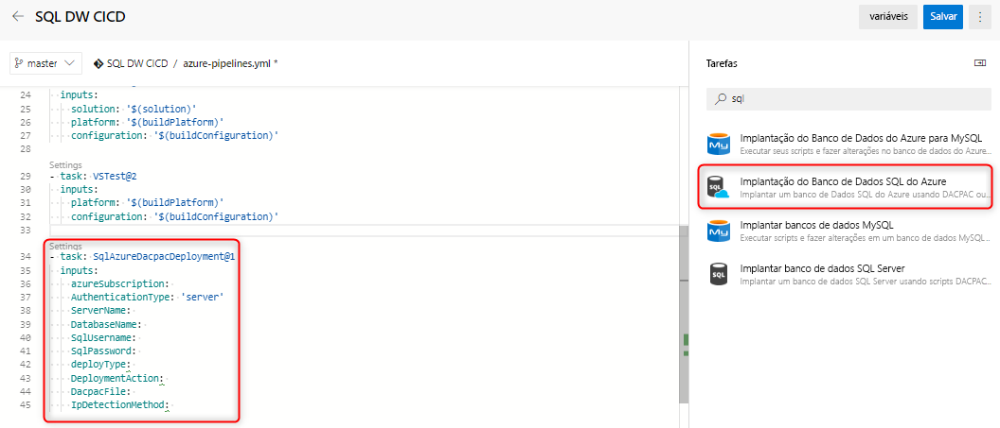
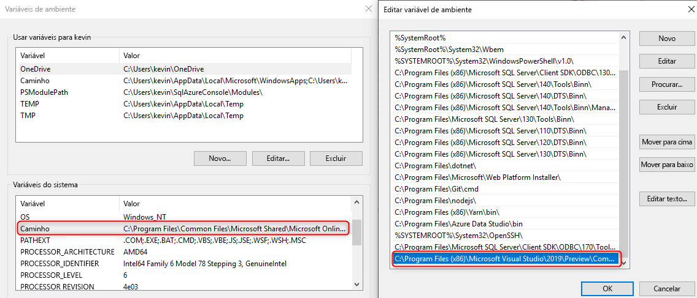

# Integração e implantação contínuas para o SQL Data Warehouse do Azure

Este tutorial simples descreve como integrar seu projeto de banco de dados SSDT (SQL Server Data Tools) ao Azure DevOps e aproveitar o Azure Pipelines para configurar a integração e a implantação contínuas. Este tutorial é a segunda etapa na criação de seu pipeline de implantação e integração contínua com o SQL Data Warehouse. 

## Antes de começar

- Percorra o [tutorial de integração de controle do código-fonte](https://docs.microsoft.com/azure/sql-data-warehouse/sql-data-warehouse-source-control-integration)

- Crie um [agente auto-hospedado](https://docs.microsoft.com/azure/devops/pipelines/agents/agents?view=azure-devops#install) que tenha os Bits de Versão Prévia do SSDT (16.3 versão prévia 2 e superior) instalados para o SQL Data Warehouse (versão prévia)

- Configurar e conectar ao Azure DevOps

  > [!NOTE]
  > No momento, o SSDT está em versão prévia, em que você precisará usar um agente auto-hospedado. Os agentes hospedados pela Microsoft serão atualizados nos próximos meses.

## Integração contínua ao build do Visual Studio

1. Navegue até o Azure Pipelines e crie um pipeline de build

      

2. Selecione o repositório de código-fonte (Git do Azure Repos) e selecione o modelo de aplicativo da área de trabalho do .NET

       

3. Edite seu arquivo YAML para usar o pool adequado do seu agente. Seu arquivo YAML deve ter a seguinte aparência:

      

Neste momento, você tem um ambiente simples no qual qualquer check-in em seu branch mestre do repositório de controle do código-fonte deve disparar automaticamente um build do Visual Studio bem-sucedido do seu projeto de banco de dados. Confirme se a automação está funcionando de ponta a ponta fazendo uma alteração em seu projeto de banco de dados local e fazendo check-in dessa alteração no branch mestre.

## Implantação contínua com a tarefa de implantação do Banco de Dados SQL do Azure

1. Adicione uma nova tarefa usando a [tarefa de implantação do Banco de Dados SQL do Azure](https://docs.microsoft.com/azure/devops/pipelines/tasks/deploy/sql-azure-dacpac-deployment?view=azure-devops) e preencha os campos obrigatórios para se conectar ao seu data warehouse de destino. Quando essa tarefa é executada, o DACPAC gerado com base no processo de build anterior é implantado no data warehouse de destino.

      

2. Ao usar um agente auto-hospedado, verifique se você definiu sua variável de ambiente para usar o SqlPackage.exe correto para o SQL Data Warehouse. O caminho deve ter a seguinte aparência:

      

   C:\Arquivos de Programas (x86)\Microsoft Visual Studio\2019\Preview\Common7\IDE\Extensions\Microsoft\SQLDB\DAC\150  

   Execute e valide seu pipeline. Você pode fazer alterações localmente e check-in do controle do código-fonte que deve gerar um build e uma implantação automáticos.

## Próximas etapas

- Explore [Arquitetura do SQL Data Warehouse do Azure](/azure/sql-data-warehouse/massively-parallel-processing-mpp-architecture)
- [Criar rapidamente um SQL Data Warehouse][create a SQL Data Warehouse]
- [Carregue dados de exemplo][load sample data].
- Explore os [Vídeos](/azure/sql-data-warehouse/sql-data-warehouse-videos)

<!--Image references-->

[1]: ./media/sql-data-warehouse-overview-what-is/dwarchitecture.png

<!--Article references-->
[Create a support ticket]: ./sql-data-warehouse-get-started-create-support-ticket.md
[load sample data]: ./sql-data-warehouse-load-sample-databases.md
[create a SQL Data Warehouse]: ./sql-data-warehouse-get-started-provision.md
[Migration documentation]: ./sql-data-warehouse-overview-migrate.md
[SQL Data Warehouse solution partners]: ./sql-data-warehouse-partner-business-intelligence.md
[Integrated tools overview]: ./sql-data-warehouse-overview-integrate.md
[Backup and restore overview]: ./sql-data-warehouse-restore-database-overview.md
[Azure glossary]: ../azure-glossary-cloud-terminology.md

<!--MSDN references-->

<!--Other Web references-->
[Blogs]: https://azure.microsoft.com/blog/tag/azure-sql-data-warehouse/
[Customer Advisory Team blogs]: https://blogs.msdn.microsoft.com/sqlcat/tag/sql-dw/
[Feature requests]: https://feedback.azure.com/forums/307516-sql-data-warehouse
[MSDN forum]: https://social.msdn.microsoft.com/Forums/azure/home?forum=AzureSQLDataWarehouse
[Stack Overflow forum]: https://stackoverflow.com/questions/tagged/azure-sqldw
[Twitter]: https://twitter.com/hashtag/SQLDW
[Videos]: https://azure.microsoft.com/documentation/videos/index/?services=sql-data-warehouse
[SLA for SQL Data Warehouse]: https://azure.microsoft.com/support/legal/sla/sql-data-warehouse/v1_0/
[Volume Licensing]: https://www.microsoftvolumelicensing.com/DocumentSearch.aspx?Mode=3&DocumentTypeId=37
[Service Level Agreements]: https://azure.microsoft.com/support/legal/sla/
