# Integração do controle do código-fonte para SQL Data Warehouse do Azure

Este tutorial descreve como integrar seu projeto de banco de dados SSDT (SQL Server Data Tools) com controle do código-fonte.  A integração do controle do código-fonte é a primeira etapa na criação de seu pipeline de implantação e integração contínua com o SQL Data Warehouse. 

## Antes de começar

- Inscreva-se para obter uma [organização do Azure DevOps](https://azure.microsoft.com/services/devops/)
- Percorra o tutorial [Criar e Conectar](https://docs.microsoft.com/azure/sql-data-warehouse/create-data-warehouse-portal)
-  [Instale o Visual Studio 2019](https://visualstudio.microsoft.com/vs/older-downloads/) 

## Configurar e conectar ao Azure DevOps

1. Em sua Organização do Azure DevOps, crie um projeto que hospedará seu projeto de banco de dados do SSDT por meio de um Repositório do Azure

   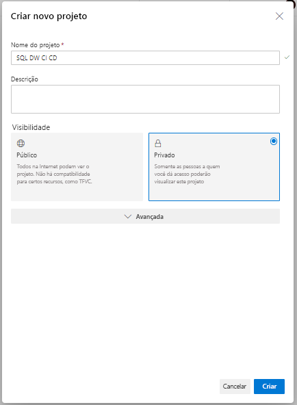

2. Abra o Visual Studio e conecte-se à sua organização e projeto do Azure DevOps da etapa 1 selecionando "Gerenciar Conexões"

   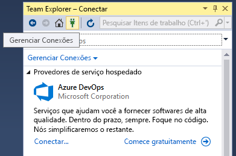

   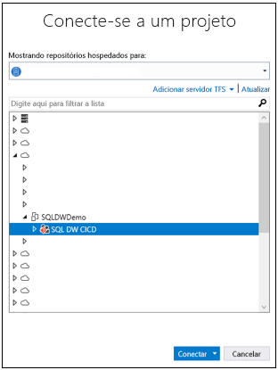

3. Clone seu repositório Azure Repo de seu projeto para o computador local

   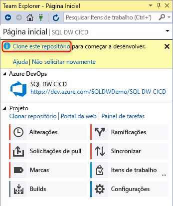

## Criar e conectar o projeto

1. No Visual Studio, crie um novo Projeto de Banco de Dados do SQL Server com um diretório e um repositório Git local em seu **repositório clonado local**

   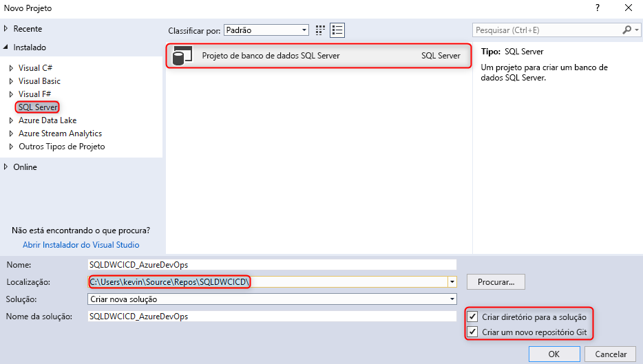  

2. Clique com o botão direito do mouse em seu sqlproject vazio e importe seu data warehouse para o projeto de banco de dados

   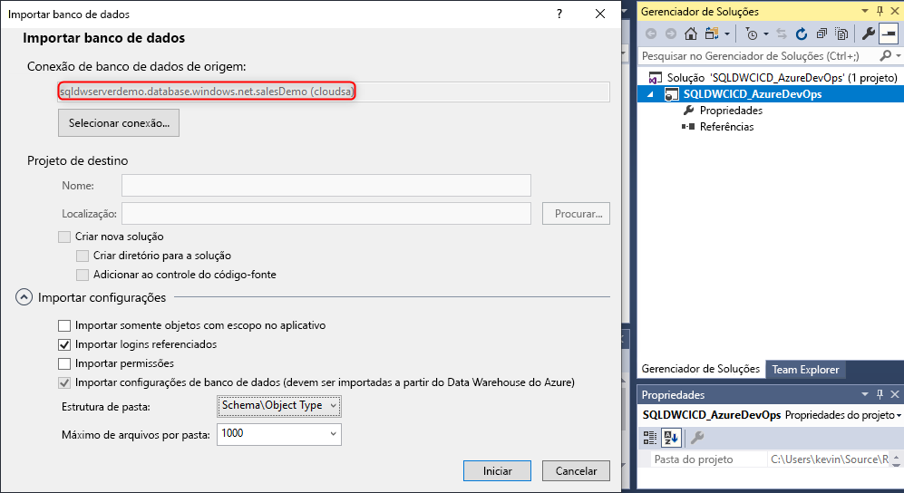  

3. No Team Explorer no Visual Studio, confirme suas alterações no repositório Git local 

   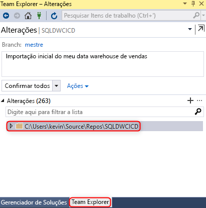  

4. Agora que você tem as alterações confirmadas localmente no repositório clonado, sincronize e envie por push suas alterações para o repositório Azure Repo em seu projeto do Azure DevOps.

   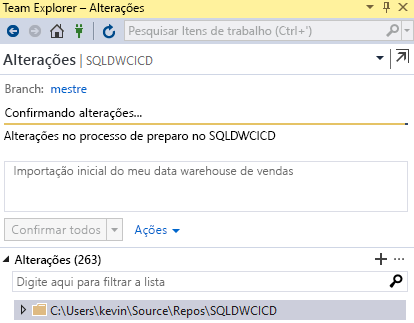

   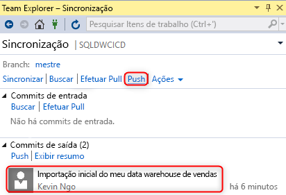  

## Validação

1. Verifique se as alterações foram enviadas por push para o Repositório do Azure atualizando uma coluna de tabela em seu projeto de banco de dados no SSDT (SQL Server Data Tools) do Visual Studio

   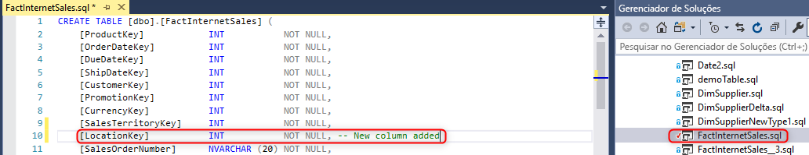

2. Confirme e envie por push a alteração do repositório local para seu Azure Repo

   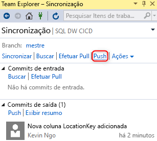

3. Verifique se a alteração foi enviada por push em seu repositório Azure Repo

   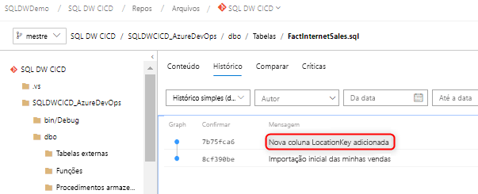

4. (**Opcional**) Use a Comparação de Esquemas e atualize as alterações de seu data warehouse de destino usando o SSDT para garantir que as definições de objeto no repositório Azure Repo e no repositório local reflitam seu data warehouse

## Próximas etapas

- [Desenvolvendo para o SQL Data Warehouse do Azure](sql-data-warehouse-overview-develop.md)

<!--Image references-->

<!--Article references-->

<!--MSDN references-->

<!--Other Web references-->

