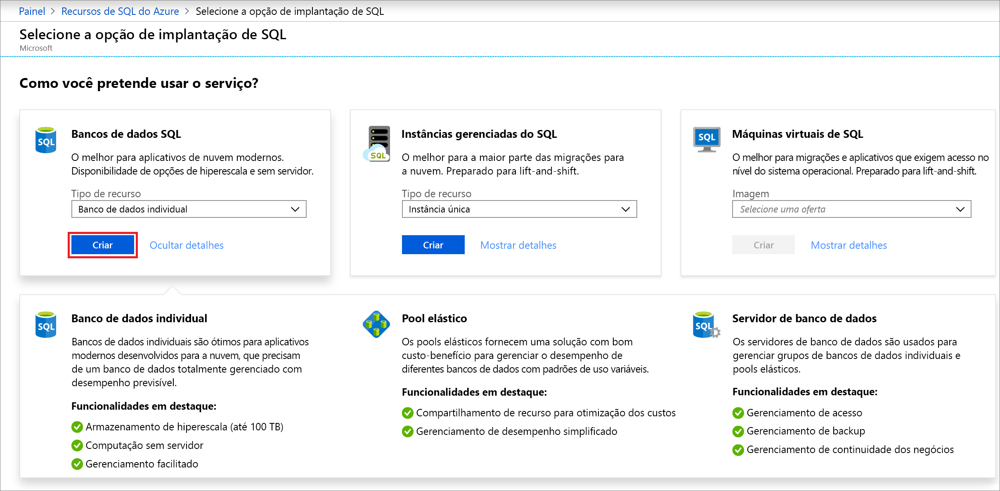
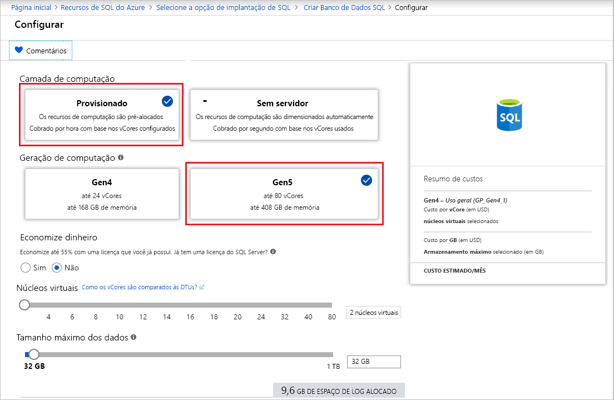

Nesta etapa, você criará um banco de dados individual do Banco de Dados SQL do Azure. 

> [!IMPORTANT]
> Não se esqueça de configurar regras de firewall para usar o endereço IP público do computador que você está usando para concluir esse artigo.
>
> Para obter informações, confira [Criar uma regra de firewall de nível de banco de dados](/sql/relational-databases/system-stored-procedures/sp-set-database-firewall-rule-azure-sql-database) ou, para determinar o endereço IP usado para a regra de firewall de nível de servidor para seu computador, confira [Criar um firewall de nível de servidor](../sql-database-server-level-firewall-rule.md).  

# <a name="portaltabazure-portal"></a>[Portal](#tab/azure-portal)

Crie o grupo de recursos e o banco de dados individual usando o portal do Azure.

1. Selecione **SQL do Azure** no menu de navegação do [portal do Azure](https://portal.azure.com) à esquerda. Se o **SQL do Azure** não estiver na lista, selecione **Todos os serviços** e, em seguida, digite *SQL do Azure* na caixa de pesquisa. (Opcional) Selecione a estrela ao lado de **SQL do Azure** para marcá-lo como favorito e adicioná-lo como um item no menu de navegação à esquerda. 
2. Selecione **+ Adicionar** para abrir a página **Selecionar opção de implantação do SQL**. Você pode exibir informações adicionais sobre os diferentes bancos de dados selecionando **Mostrar detalhes** no bloco **Bancos de dados**.
3. Selecione **Criar**:

   

3. Na guia **Informações Básicas** da seção **Detalhes do Projeto**, digite ou selecione os seguintes valores:

   - **Assinatura**: Selecione a lista suspensa e escolha a assinatura correta, caso ela não seja exibida.
   - **Grupo de recursos**: Selecione **Criar novo**, digite `myResourceGroup` e selecione **OK**.

     

4. Na seção **Detalhes do Banco de Dados**, digite ou selecione os seguintes valores:

   - **Nome do banco de dados**: Digite `mySampleDatabase`.
   - **Servidor**: Selecione **Criar**, insira os valores a seguir e, em seguida, escolha **Selecionar**.
       - **Nome do servidor**: Digite `mysqlserver`, juntamente com alguns números para exclusividade.
       - **Logon de administrador do servidor**: Digite `azureuser`.
       - **Senha**: Digite uma senha complexa que atenda aos requisitos de senha.
       - **Localização**: Escolha uma localização na lista suspensa, como `West US`.

         

      > [!IMPORTANT]
      > Lembre-se de registrar o logon de administrador do servidor e a senha para fazer logon no servidor e nos bancos de dados deste e de outros inícios rápidos. Caso esqueça seu logon ou a senha, obtenha o nome de logon ou redefina a senha na página **SQL Server**. Para abrir a página **SQL Server**, selecione o nome do servidor na página **Visão Geral** do banco de dados após a criação do banco de dados.

   - **Deseja usar o pool elástico SQL?** : Selecione a opção **Não**.
   - **Computação + armazenamento**: Selecione **Configurar o banco de dados**. 

     

   - Selecione **Provisionado** e **Gen5**.

     

   - Examine as configurações para **Máximo de vCores**, **Mínimo de vCores**, **Atraso de pausa automática** e **Tamanho máximo de dados**. Altere-as conforme desejado.
   - Aceite os termos de versão prévia e clique em **OK**.
   - Escolha **Aplicar**.

5. Selecione a guia **Configurações adicionais**. 
6. Na seção **Fonte de dados**, em **Usar dados existentes**, selecione `Sample`.

   

   > [!IMPORTANT]
   > Selecione os dados da **Amostra (AdventureWorksLT)** para seguir com facilidade este e outros Guias de Início Rápido do Banco de Dados SQL do Azure que usam esses dados.

7. Mantenha o restante dos valores como padrão e selecione **Examinar + Criar** na parte inferior do formulário.
8. Examine as configurações finais e selecione **Criar**.

9. No formulário **Banco de Dados SQL**, selecione **Criar** para implantar e provisionar o grupo de recursos, o servidor e o banco de dados.

# <a name="powershelltabazure-powershell"></a>[PowerShell](#tab/azure-powershell)

[!INCLUDE [updated-for-az](../../../includes/updated-for-az.md)]

Crie o grupo de recursos e o banco de dados individual usando o PowerShell.

   ```powershell-interactive
   # Set variables for your server and database
   $subscriptionId = '<SubscriptionID>'
   $resourceGroupName = "myResourceGroup-$(Get-Random)"
   $location = "West US"
   $adminLogin = "azureuser"
   $password = "PWD27!"+(New-Guid).Guid
   $serverName = "mysqlserver-$(Get-Random)"
   $databaseName = "mySampleDatabase"

   # The ip address range that you want to allow to access your server 
   # (leaving at 0.0.0.0 will prevent outside-of-azure connections to your DB)
   $startIp = "0.0.0.0"
   $endIp = "0.0.0.0"

   # Show randomized variables
   Write-host "Resource group name is" $resourceGroupName 
   Write-host "Password is" $password  
   Write-host "Server name is" $serverName 

   # Connect to Azure
   Connect-AzAccount

   # Set subscription ID
   Set-AzContext -SubscriptionId $subscriptionId 

   # Create a resource group
   Write-host "Creating resource group..."
   $resourceGroup = New-AzResourceGroup -Name $resourceGroupName -Location $location -Tag @{Owner="SQLDB-Samples"}
   $resourceGroup

   # Create a server with a system wide unique server name
   Write-host "Creating primary logical server..."
   $server = New-AzSqlServer -ResourceGroupName $resourceGroupName `
      -ServerName $serverName `
      -Location $location `
      -SqlAdministratorCredentials $(New-Object -TypeName System.Management.Automation.PSCredential `
      -ArgumentList $adminLogin, $(ConvertTo-SecureString -String $password -AsPlainText -Force))
   $server

   # Create a server firewall rule that allows access from the specified IP range
   Write-host "Configuring firewall for primary logical server..."
   $serverFirewallRule = New-AzSqlServerFirewallRule -ResourceGroupName $resourceGroupName `
      -ServerName $serverName `
      -FirewallRuleName "AllowedIPs" -StartIpAddress $startIp -EndIpAddress $endIp
   $serverFirewallRule

   # Create General Purpose Gen4 database with 1 vCore
   Write-host "Creating a gen5 2 vCore database..."
   $database = New-AzSqlDatabase  -ResourceGroupName $resourceGroupName `
      -ServerName $serverName `
      -DatabaseName $databaseName `
      -Edition GeneralPurpose `
      -VCore 2 `
      -ComputeGeneration Gen5 `
      -MinimumCapacity 2 `
      -SampleName "AdventureWorksLT"
   $database
   ```

# <a name="azure-clitabazure-cli"></a>[CLI do Azure](#tab/azure-cli)

Crie o grupo de recursos e o banco de dados individual usando a CLI do Azure.

   ```azurecli-interactive
   #!/bin/bash
   # Set variables
   subscriptionID=<SubscriptionID>
   resourceGroupName=myResourceGroup-$RANDOM
   location=SouthCentralUS
   adminLogin=azureuser
   password="PWD27!"+`openssl rand -base64 18`
   serverName=mysqlserver-$RANDOM
   databaseName=mySampleDatabase
   drLocation=NorthEurope
   drServerName=mysqlsecondary-$RANDOM
   failoverGroupName=failovergrouptutorial-$RANDOM

   # The ip address range that you want to allow to access your DB. 
   # Leaving at 0.0.0.0 will prevent outside-of-azure connections to your DB
   startip=0.0.0.0
   endip=0.0.0.0
  
   # Connect to Azure
   az login

   # Set the subscription context for the Azure account
   az account set -s $subscriptionID

   # Create a resource group
   echo "Creating resource group..."
   az group create \
      --name $resourceGroupName \
      --location $location \
      --tags Owner[=SQLDB-Samples]

   # Create a logical server in the resource group
   echo "Creating primary logical server..."
   az sql server create \
      --name $serverName \
      --resource-group $resourceGroupName \
      --location $location  \
      --admin-user $adminLogin \
      --admin-password $password

   # Configure a firewall rule for the server
   echo "Configuring firewall..."
   az sql server firewall-rule create \
      --resource-group $resourceGroupName \
      --server $serverName \
      -n AllowYourIp \
      --start-ip-address $startip \
      --end-ip-address $endip

   # Create a gen5 1vCore database in the server 
   echo "Creating a gen5 2 vCore database..."
   az sql db create \
      --resource-group $resourceGroupName \
      --server $serverName \
      --name $databaseName \
      --sample-name AdventureWorksLT \
      --edition GeneralPurpose \
      --family Gen5 \
      --capacity 2
   ```

---
