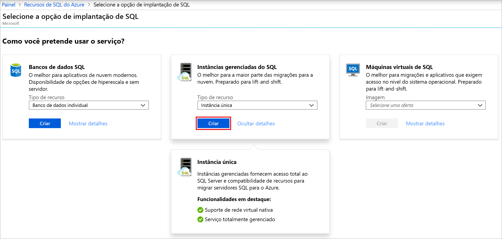

# Início Rápido: Criar uma instância gerenciada do Banco de Dados SQL do Azure

Este Início Rápido orientará você pela criação de uma [instância gerenciada do Banco de Dados SQL do Azure](sql-database-managed-instance.md) no portal do Azure.

> [!IMPORTANT]
> Para obter as limitações, confira [Regiões compatíveis](sql-database-managed-instance-resource-limits.md#supported-regions) e [Tipos de assinatura compatíveis](sql-database-managed-instance-resource-limits.md#supported-subscription-types).

## Entre no Portal do Azure

Se você não tiver uma assinatura do Azure, [crie uma conta gratuita](https://azure.microsoft.com/free/).

Entre no [Portal do Azure](https://portal.azure.com/).

## Criar uma instância gerenciada

As etapas a seguir mostram como criar uma instância gerenciada:

1. No menu esquerdo do portal do Azure, selecione **SQL do Azure**. Se **SQL do Azure** não estiver na lista, selecione **Todos os serviços** e, em seguida, digite **SQL do Azure** na caixa de pesquisa.
2. Selecione **+Adicionar** para abrir a página **Selecionar opção de implantação do SQL**. É possível exibir informações adicionais sobre uma instância gerenciada do Banco de Dados SQL do Azure selecionando **Mostrar detalhes** no bloco **Instâncias gerenciadas**.
3. Selecione **Criar**.

   

4. Use as guias no formulário de provisionamento **Criar Instância Gerenciada do Banco de Dados SQL do Azure** para adicionar informações necessárias e opcionais. As seções a seguir descrevem essas guias.

### Noções básicas

Preencha as informações necessárias na guia **Básico** usando a tabela a seguir. Este é um conjunto mínimo de informações para provisionar uma instância gerenciada.

| Configuração| Valor sugerido | DESCRIÇÃO |
| ------ | --------------- | ----------- |
| **Assinatura** | Sua assinatura. | Uma assinatura que concede a você permissão para criar recursos. |
| **Grupo de recursos** | Um grupo de recursos novo ou existente.|Para ver os nomes do grupo de recursos válidos, consulte [Regras e restrições de nomenclatura](https://docs.microsoft.com/azure/architecture/best-practices/naming-conventions).|
| **Nome da Instância Gerenciada** | Qualquer nome válido.|Para ver os nomes válidos, consulte [Regras e restrições de nomenclatura](https://docs.microsoft.com/azure/architecture/best-practices/naming-conventions).|
| **Região** |A região na qual você deseja criar a instância gerenciada.|Para obter mais informações sobre as regiões, confira [Regiões do Azure](https://azure.microsoft.com/regions/).|
| **Logon de administrador da Instância Gerenciada** | Qualquer nome de usuário válido. | Para ver os nomes válidos, consulte [Regras e restrições de nomenclatura](https://docs.microsoft.com/azure/architecture/best-practices/naming-conventions). Não use "serveradmin", pois essa é uma função reservada no nível de servidor.|
| **Senha** | Qualquer senha válida.| A senha deve ter no mínimo 16 caracteres e atender a [requisitos de complexidade definidos](../virtual-machines/windows/faq.md#what-are-the-password-requirements-when-creating-a-vm).|

Selecione **Configurar Instância Gerenciada** para dimensionar os recursos de computação e armazenamento e examinar os tipos de preço. Use os controles deslizantes ou as caixas de texto para especificar a quantidade de armazenamento e o número de núcleos virtuais. Quando terminar, selecione **Aplicar** para salvar a seleção. 

Para revisar suas escolhas antes de criar uma instância gerenciada, você pode selecionar **Revisar + criar**. Ou configure as opções de rede selecionando **Avançar: Rede**.

### Rede

Preencha as informações opcionais na guia **Rede** usando a tabela a seguir. Se você omitir essas informações, o portal aplicará as configurações padrão.

| Configuração| Valor sugerido | DESCRIÇÃO |
| ------ | --------------- | ----------- |
| **Rede virtual** | Selecione a **Criar nova rede virtual** ou uma rede virtual e uma sub-rede válidas.| Se uma rede ou uma sub-rede não estiver disponível, ela precisará ser [modificada para atender aos requisitos de rede](sql-database-managed-instance-configure-vnet-subnet.md) antes de ser selecionada como um destino para a nova instância gerenciada. Para obter mais informações sobre os requisitos de configuração do ambiente de rede para uma instância gerenciada, confira [Configurar uma rede virtual para uma instância gerenciada](sql-database-managed-instance-connectivity-architecture.md). |
| **Tipo de conexão** | Escolha entre um tipo de conexão de proxy e redirecionamento.|Para obter mais informações sobre tipos de conexão, confira [Política de conexão do Banco de Dados SQL do Azure](sql-database-connectivity-architecture.md#connection-policy).|
| **Ponto de extremidade público**  | Selecione **Habilitar**. | Para que a instância gerenciada esteja acessível por meio do ponto de extremidade de dados público, você precisa habilitar essa opção. | 
| **Permitir o acesso de** (se o **Ponto de extremidade público** estiver habilitado) | Selecione uma das opções.   |A experiência do portal permite configurar um grupo de segurança com um ponto de extremidade público.     De acordo com o seu cenário, selecione uma das seguintes opções:   <ul> <li>**Serviços do Azure**: recomendamos essa opção quando você estiver se conectando de Power BI ou de outro serviço multilocatário. </li> <li> **Internet**: use para fins de teste quando desejar criar rapidamente uma instância gerenciada. Não a recomendamos para ambientes de produção. </li> <li> **Sem acesso**: esta opção cria a regra de segurança **Negar**. Modifique essa regra para tornar uma instância gerenciada acessível por meio de um ponto de extremidade público. </li> </ul>   Para obter mais informações sobre a segurança do ponto de extremidade público, confira [Usando uma instância gerenciada do Banco de Dados SQL do Azure de forma segura com um ponto de extremidade público](sql-database-managed-instance-public-endpoint-securely.md).|

Selecione **Revisar + criar** para revisar suas escolhas antes de criar uma instância gerenciada. Ou defina mais configurações personalizadas selecionando **Avançar: configurações adicionais**.

### Configurações adicionais

Preencha as informações opcionais na guia **Configurações adicionais** usando a tabela a seguir. Se você omitir essas informações, o portal aplicará as configurações padrão.

| Configuração| Valor sugerido | DESCRIÇÃO |
| ------ | --------------- | ----------- |
| **Ordenação** | Escolha a ordenação que deseja usar para a instância gerenciada. Se estiver migrando bancos de dados do SQL Server, verifique a ordenação de origem usando `SELECT SERVERPROPERTY(N'Collation')` e use esse valor.| Para obter informações sobre ordenações, confira [Definir ou alterar a ordenação do servidor](https://docs.microsoft.com/sql/relational-databases/collations/set-or-change-the-server-collation).|   
| **Fuso horário** | Selecione o fuso horário que sua instância gerenciada observará.|Para obter mais informações, confira [Fusos horários](sql-database-managed-instance-timezone.md).|
| **Usar como secundário de failover** | Selecione **Sim**. | Habilite esta opção para usar a instância gerenciada como o secundário de um grupo de failover.|
| **Instância gerenciada primária** (se **Usar como secundário de failover** estiver definido como **Sim**) | Escolha uma instância gerenciada primária existente que será ingressada na mesma zona DNS que a instância gerenciada que você está criando. | Esta etapa habilitará a configuração pós-criação do grupo de failover. Para obter mais informações, confira [Tutorial: Adicionar uma instância gerenciada do Banco de Dados SQL a um grupo de failover](sql-database-managed-instance-failover-group-tutorial.md).|

### Examinar + criar

1. Selecione a guia **Revisar + criar** para revisar suas escolhas antes de criar uma instância gerenciada.

   

1. Selecione **Criar** para iniciar o provisionamento da instância gerenciada.

> [!IMPORTANT]
> A implantação de uma instância gerenciada é uma operação de execução longa. A implantação da primeira instância na sub-rede normalmente demora muito mais do que a implantação em uma sub-rede com instâncias gerenciadas existentes. Para ver tempos de provisionamento médios, confira [Operações de gerenciamento da instância gerenciada](sql-database-managed-instance.md#managed-instance-management-operations).

### Monitorar o progresso da implantação

1. Selecione o ícone **Notificações** para exibir o status da implantação.

    

1. Selecione **Implantação em andamento** na notificação para abrir a janela da instância gerenciada e monitorar melhor o progresso da implantação. 

> [!TIP]
> Se tiver fechado o navegador da Web ou saído da tela de progresso da implantação, siga estas etapas para localizar a tela:
> 1. No portal do Azure, abra o grupo de recursos (na guia **Básico**) no qual você está implantando uma instância gerenciada.
> 2. Selecione **Implantações**.
> 3. Selecione a operação de implantação de instância gerenciada em andamento.

## Revise os recursos e recupere o nome do host

Após a implantação ser bem-sucedida:

1. Abra o grupo de recursos da instância gerenciada. Exiba os recursos criados para você no início rápido [Criar uma instância gerenciada](#create-a-managed-instance).

   

2. Selecione a tabela de rotas para revisar a UDR (rota definida pelo usuário) criada para você.

   

3. Na tabela de rotas, revise as entradas para rotear o tráfego de/para a rede virtual da instância gerenciada. Se você criar ou configurar a tabela de rotas manualmente, crie essas entradas na tabela de rotas.

   

4. Retorne ao grupo de recursos e selecione o grupo de segurança de rede.

   

5. Examine as regras de segurança de entrada e saída. Se você tiver configurado pontos de extremidade públicos para sua instância gerenciada, confira o artigo [Configurar um ponto de extremidade público](sql-database-managed-instance-public-endpoint-configure.md#allow-public-endpoint-traffic-on-the-network-security-group) para obter mais informações.

   

6. Retorne ao grupo de recursos e selecione sua instância gerenciada.

   

7. Na guia **Visão Geral**, localize a propriedade **Host**. Copie o nome do host da instância gerenciada para uso no próximo início rápido.

   

   O nome do host também é chamado de FQDN (nome de domínio totalmente qualificado). Ele é semelhante a *nome_do_seu_computador.a1b2c3d4e5f6.database.windows.net*.

## Próximas etapas

Para saber mais sobre como se conectar a uma instância gerenciada:
- Para obter uma visão geral das opções de conexão para aplicativos, confira [Conectar seus aplicativos a uma instância gerenciada](sql-database-managed-instance-connect-app.md).
- Para obter um Início Rápido que mostra como se conectar a uma instância gerenciada em uma máquina virtual do Azure, confira [Configurar uma conexão com uma máquina virtual do Azure](sql-database-managed-instance-configure-vm.md).
- Para obter um Início Rápido que mostra como se conectar a uma instância gerenciada em um computador cliente local usando uma conexão ponto a site, confira [Configurar uma conexão ponto a site](sql-database-managed-instance-configure-p2s.md).

Para restaurar um banco de dados existente do SQL Server do local para uma instância gerenciada: 
- Use o [Serviço de Migração de Banco de Dados do Azure para migração](../dms/tutorial-sql-server-to-managed-instance.md) para fazer a restauração de um arquivo de backup de banco de dados. 
- Use o [comando T-SQL RESTORE](sql-database-managed-instance-get-started-restore.md) para fazer a restauração de um arquivo de backup de banco de dados.

Para o monitoramento avançado do desempenho de banco de dados de instância gerenciada com inteligência de solução de problemas interna, confira [Monitorar o Banco de Dados SQL do Azure usando a Análise de SQL do Azure](../azure-monitor/insights/azure-sql.md).
