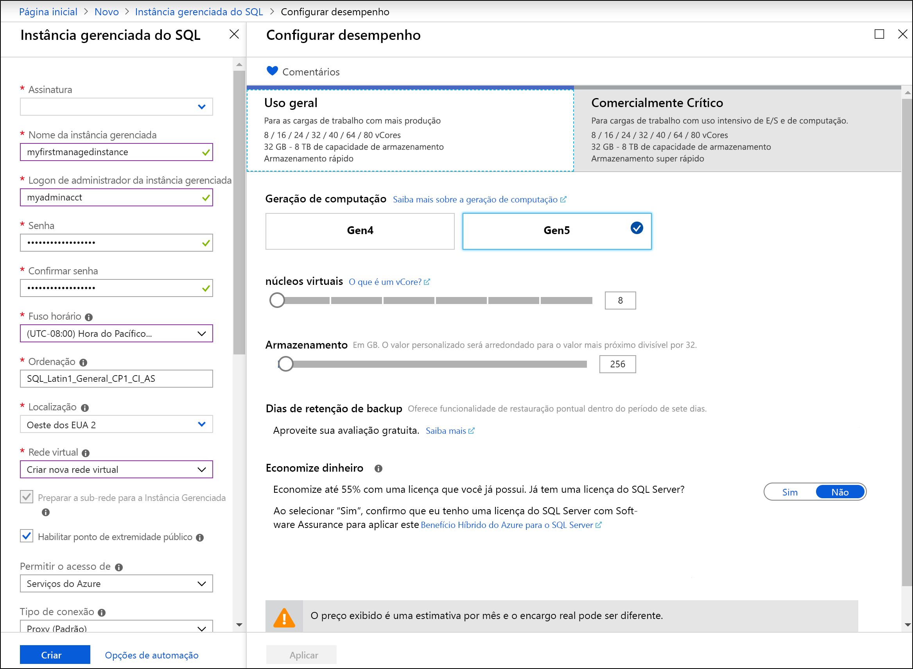

# Início Rápido: Criar uma instância gerenciada do Banco de Dados SQL do Azure

Este Início Rápido orientará você pela criação de uma [instância gerenciada do Banco de Dados SQL do Azure](sql-database-managed-instance.md) no portal do Azure.

> [!IMPORTANT]
> Para obter as limitações, confira [Regiões compatíveis](sql-database-managed-instance-resource-limits.md#supported-regions) e [Tipos de assinatura compatíveis](sql-database-managed-instance-resource-limits.md#supported-subscription-types).

## Entre no Portal do Azure

Se você não tiver uma assinatura do Azure, [crie uma conta gratuita](https://azure.microsoft.com/free/).

Entre no [Portal do Azure](https://portal.azure.com/).

## Criar uma instância gerenciada

As etapas a seguir mostram como criar uma instância gerenciada.

1. Selecione **Criar um recurso** no canto superior esquerdo do portal do Azure.
2. Localize **instância gerenciada** e, em seguida, selecione **Instância Gerenciada do SQL do Azure**.
3. Selecione **Criar**.

   

4. Preencha o formulário da **instância gerenciada do SQL** com as informações solicitadas usando as informações da tabela a seguir.

   | Configuração| Valor sugerido | DESCRIÇÃO |
   | ------ | --------------- | ----------- |
   | **Assinatura** | Sua assinatura. | Uma assinatura que concede a você permissão para criar recursos. |
   |**Nome da Instância Gerenciada**|Qualquer nome válido.|Para ver os nomes válidos, consulte [Regras e restrições de nomenclatura](https://docs.microsoft.com/azure/architecture/best-practices/naming-conventions).|
   |**Logon de administrador da Instância Gerenciada**|Qualquer nome de usuário válido.|Para ver os nomes válidos, consulte [Regras e restrições de nomenclatura](https://docs.microsoft.com/azure/architecture/best-practices/naming-conventions). Não use "serveradmin", pois essa é uma função reservada no nível de servidor.|
   |**Senha**|Qualquer senha válida.|A senha deve ter no mínimo 16 caracteres e atender a [requisitos de complexidade definidos](../virtual-machines/windows/faq.md#what-are-the-password-requirements-when-creating-a-vm).|
   |**Fuso horário**|O fuso horário a ser observado pela instância gerenciada.|Para obter mais informações, confira [Fusos horários](sql-database-managed-instance-timezone.md).|
   |**Ordenação**|A ordenação que você deseja usar para a instância gerenciada.|Se estiver migrando bancos de dados do SQL Server, verifique a ordenação de origem usando `SELECT SERVERPROPERTY(N'Collation')` e use esse valor. Para obter informações sobre ordenações, confira [Definir ou alterar a ordenação do servidor](https://docs.microsoft.com/sql/relational-databases/collations/set-or-change-the-server-collation).|
   |**Localidade**|A localização na qual você deseja criar a instância gerenciada.|Para obter mais informações sobre as regiões, confira [Regiões do Azure](https://azure.microsoft.com/regions/).|
   |**Rede virtual**|Selecione a **Criar nova rede virtual** ou uma rede virtual e uma sub-rede válidas.| Se uma rede ou uma sub-rede não estiver disponível, ela precisará ser [modificada para atender aos requisitos de rede](sql-database-managed-instance-configure-vnet-subnet.md) antes de ser selecionada como um destino para a nova instância gerenciada. Para obter mais informações sobre os requisitos de configuração do ambiente de rede para uma instância gerenciada, confira [Configurar uma rede virtual para uma instância gerenciada](sql-database-managed-instance-connectivity-architecture.md). |
   |**Habilitar o ponto de extremidade público**   |Marque essa opção para habilitar o ponto de extremidade público   |Para que a instância gerenciada esteja acessível por meio do ponto de extremidade de dados público, a opção **Habilitar o ponto de extremidade público** precisa ser marcada.| 
   |**Permitir acesso de**   |Selecione uma das opções: <ul> <li>**Serviços do Azure**</li> <li>**Internet**</li> <li>**Sem acesso**</li></ul>   |A experiência do portal permite configurar o grupo de segurança com o ponto de extremidade público.     De acordo com o seu cenário, selecione uma das seguintes opções:   <ul> <li>Serviços do Azure – recomendados ao conectar-se do Power BI ou de outro serviço multilocatário. </li> <li> Internet – use para fins de teste quando desejar criar rapidamente uma instância gerenciada. Não recomendada para uso em ambientes de produção. </li> <li> Sem acesso – essa opção cria uma regra de segurança de negação. Você precisará modificar essa regra para tornar a instância gerenciada acessível por meio do ponto de extremidade público. </li> </ul>   Para obter mais informações sobre a segurança do ponto de extremidade público, confira [Como usar a instância gerenciada do Banco de Dados SQL do Azure de forma segura com o ponto de extremidade público](sql-database-managed-instance-public-endpoint-securely.md).|
   |**Tipo de conexão**|Escolha entre um tipo de conexão de Proxy e Redirecionamento.|Para obter mais informações sobre tipos de conexão, confira [Política de conexão do Banco de Dados SQL do Azure](sql-database-connectivity-architecture.md#connection-policy).|
   |**Grupo de recursos**|Um grupo de recursos novo ou existente.|Para ver os nomes do grupo de recursos válidos, consulte [Regras e restrições de nomenclatura](https://docs.microsoft.com/azure/architecture/best-practices/naming-conventions).|

   

5. Para usar a instância gerenciada como um grupo de failover de instância secundário, selecione o check-out e especifique a instância gerenciada do DnsAzurePartner. Esse recurso está em versão prévia e não é mostrado na captura de tela a seguir.
6. Selecione **Tipo de preço** para dimensionar os recursos de computação e armazenamento e examinar as opções de tipo de preço. O tipo de preço de Uso Geral com 32 GB de memória e 16 vCores é o valor padrão.
7. Use os controles deslizantes ou as caixas de texto para especificar a quantidade de armazenamento e o número de núcleos virtuais.
8. Quando terminar, selecione **Aplicar** para salvar a seleção. 
9. Selecione **Criar** para implantar a instância gerenciada.
10. Selecione o ícone **Notificações** para exibir o status da implantação.

    

11. Selecione **Implantação em andamento** para abrir a janela de instância gerenciada e monitorar melhor o progresso da implantação. 

> [!IMPORTANT]
> Para a primeira instância em uma sub-rede, o tempo de implantação é normalmente muito maior do em instâncias subsequentes. Não cancele a operação de implantação porque ela dura mais que o esperado.

## Examinar os recursos e recuperar o nome do servidor totalmente qualificado

Depois que a implantação for bem-sucedida, examine os recursos criados e recupere o nome do servidor totalmente qualificado para uso em Inícios Rápidos posteriores.

1. Abra o grupo de recursos da instância gerenciada. Exiba os recursos criados para você no Início Rápido [Criar uma instância gerenciada](#create-a-managed-instance).

   

2. Selecione a tabela de rotas para examinar a tabela de UDR (rota definida pelo usuário) criada para você.

   

3. Na tabela de rotas, examine as entradas para rotear o tráfego de/para a rede virtual de instância gerenciada. Se você criar ou configurar a tabela de rotas manualmente, crie essas entradas na tabela de rotas.

   

4. Retorne ao grupo de recursos e selecione o grupo de segurança de rede para examinar as regras de segurança.

   

5. Examine as regras de segurança de entrada e saída. Se você tiver configurado pontos de extremidade públicos para sua instância gerenciada, confira o artigo [Configurar o ponto de extremidade público](sql-database-managed-instance-public-endpoint-configure.md#allow-public-endpoint-traffic-on-the-network-security-group) para obter mais informações.

   

6. Retorne ao grupo de recursos e selecione a instância gerenciada.

   

7. Na guia **Visão Geral**, localize a propriedade **Host**. Copie o endereço do host totalmente qualificado da instância gerenciada para uso no próximo Início Rápido.

   

   O nome será semelhante a **nome_do_seu_computador.a1b2c3d4e5f6.database.windows.net**.

## Próximas etapas

- Para saber mais sobre como se conectar a uma instância gerenciada:
  - Para obter uma visão geral das opções de conexão para aplicativos, confira [Conectar seus aplicativos a uma instância gerenciada](sql-database-managed-instance-connect-app.md).
  - Para obter um Início Rápido que mostra como se conectar a uma instância gerenciada em uma máquina virtual do Azure, confira [Configurar uma conexão com uma máquina virtual do Azure](sql-database-managed-instance-configure-vm.md).
  - Para obter um Início Rápido que mostra como se conectar a uma instância gerenciada em um computador cliente local usando uma conexão ponto a site, confira [Configurar uma conexão ponto a site](sql-database-managed-instance-configure-p2s.md).
- Para restaurar um banco de dados existente do SQL Server do local para uma instância gerenciada: 
    - Use o [DMS (Serviço de Migração de Banco de Dados do Azure) para migração](../dms/tutorial-sql-server-to-managed-instance.md) para fazer a restauração de um arquivo de backup de banco de dados. 
    - Use o [comando T-SQL RESTORE](sql-database-managed-instance-get-started-restore.md) para fazer a restauração de um arquivo de backup de banco de dados.
- Para o monitoramento avançado do desempenho de banco de dados de instância gerenciada com inteligência de solução de problemas interna, confira [Monitorar o Banco de Dados SQL do Azure usando a Análise de SQL do Azure](../azure-monitor/insights/azure-sql.md).
