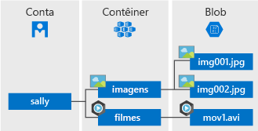

# <a name="quickstart-azure-blob-storage-client-library-for-net"></a>Início Rápido: Biblioteca de clientes do Armazenamento de Blobs do Azure para .NET

Introdução à biblioteca de clientes do Armazenamento de Blobs do Azure para .NET. O Armazenamento de Blobs do Azure é uma solução de armazenamento de objetos da Microsoft para a nuvem. Siga as etapas para instalar o pacote e testar o código de exemplo para tarefas básicas. O Armazenamento de Blobs é otimizado para armazenar grandes quantidades de dados não estruturados.

Use a biblioteca de clientes do Armazenamento de Blobs do Azure para .NET para:

* Criar um contêiner
* Definir permissões em um contêiner
* Criar um blob no Armazenamento do Azure
* Baixar o blob em seu computador local
* Listar todos os blobs em um contêiner
* Excluir um contêiner

[Documentação de referência da API](https://docs.microsoft.com/dotnet/api/overview/azure/storage?view=azure-dotnet) | [Código fonte da biblioteca](https://github.com/Azure/azure-storage-net/tree/master/Blob) | [Pacote (NuGet)](https://www.nuget.org/packages/Microsoft.Azure.Storage.Blob/) | [Exemplos](https://azure.microsoft.com/resources/samples/?sort=0&service=storage&platform=dotnet&term=blob)

## <a name="prerequisites"></a>Pré-requisitos

* Assinatura do Azure - [criar uma gratuitamente](https://azure.microsoft.com/free/)
* Conta de armazenamento do Azure - [criar uma conta de armazenamento](https://docs.microsoft.com/azure/storage/common/storage-quickstart-create-account)
* [NET Core 2.1 SDK](https://dotnet.microsoft.com/download/dotnet-core), ou superior, para o seu sistema operacional

## <a name="setting-up"></a>Configurando

Esta seção orienta você na preparação de um projeto para trabalhar com a biblioteca de clientes do Armazenamento de Blobs do Azure para .NET.

### <a name="create-the-project"></a>Criar o projeto

Primeiro, crie um aplicativo .NET Core chamado **blob-quickstart**.

1. Em uma janela do console (como cmd, PowerShell ou Bash), use o comando `dotnet new` para criar um novo aplicativo do console com o nome **blob-quickstart**. Esse comando cria um projeto simples C# "Olá, Mundo" com um arquivo de origem único: **Program.cs**.

   ```console
   dotnet new console -n blob-quickstart
   ```

2. Alterne para a pasta **blob-quickstart** recém-criada e crie o aplicativo para verificar se tudo está correto.

   ```console
   cd blob-quickstart
   ```

   ```console
   dotnet build
   ```

A saída esperada da compilação deve ser algo como:

```output
C:\QuickStarts\blob-quickstart> dotnet build
Microsoft (R) Build Engine version 16.0.450+ga8dc7f1d34 for .NET Core
Copyright (C) Microsoft Corporation. All rights reserved.

  Restore completed in 44.31 ms for C:\QuickStarts\blob-quickstart\blob-quickstart.csproj.
  blob-quickstart -> C:\QuickStarts\blob-quickstart\bin\Debug\netcoreapp2.1\blob-quickstart.dll

Build succeeded.
    0 Warning(s)
    0 Error(s)

Time Elapsed 00:00:03.08
```

### <a name="install-the-package"></a>Instalar o pacote

Ainda no diretório do aplicativo, instale a biblioteca de clientes do Armazenamento de Blobs do Azure para .NET usando o comando `dotnet add package`.

```console
dotnet add package Microsoft.Azure.Storage.Blob
```

### <a name="set-up-the-app-framework"></a>Configurar o framework de aplicativos

No diretório do projeto:

1. Abrir o arquivo Program.cs no seu editor
2. Remover a instrução **Console.WriteLine**
3. Adicionar diretivas **using**
4. Crie um método **ProcessAsync** no qual o código principal do exemplo residirá
5. Chamar de forma assíncrona o método **ProcessAsync** de **Principal**

O código é o seguinte:

```csharp
using System;
using System.IO;
using System.Threading.Tasks;
using Microsoft.Azure.Storage;
using Microsoft.Azure.Storage.Blob;

namespace blob_quickstart
{
    class Program
    {
        public static void Main()
        {
            Console.WriteLine("Azure Blob Storage - .NET quickstart sample\n");

            // Run the examples asynchronously, wait for the results before proceeding
            ProcessAsync().GetAwaiter().GetResult();

            Console.WriteLine("Press any key to exit the sample application.");
            Console.ReadLine();
        }

        private static async Task ProcessAsync()
        {
        }
    }
}
```

### <a name="copy-your-credentials-from-the-azure-portal"></a>Copiar suas credenciais no Portal do Azure

O aplicativo de exemplo precisa autenticar o acesso à sua conta de armazenamento. Para autenticar, forneça suas credenciais de conta de armazenamento ao aplicativo como uma cadeia de conexão. Exiba suas credenciais da conta de armazenamento seguindo estas etapas:

1. Navegue até o [Portal do Azure](https://portal.azure.com).
2. Localize sua cadeia de conexão.
3. Na seção **Configurações** da visão geral da conta de armazenamento, selecione **Chaves de acesso**. Aqui, você pode ver suas chaves de acesso da conta, bem como a cadeia de conexão completa para cada chave.
4. Encontre o valor da **Cadeia de conexão** em **key1** e selecione o botão **Copiar** para copiar a cadeia de conexão. Você adicionará o valor de cadeia de conexão para uma variável de ambiente na próxima etapa.

    

### <a name="configure-your-storage-connection-string"></a>Configurar a cadeia de conexão de armazenamento

Depois de copiar a cadeia de conexão, grave-a em uma nova variável de ambiente no computador local que executa o aplicativo. Para definir a variável de ambiente, abra uma janela de console e siga as instruções do seu sistema operacional. Substitua `<yourconnectionstring>` pela cadeia de conexão real.

Depois de adicionar a variável de ambiente, talvez seja necessário reiniciar todos os programas em execução que precisarem ler a variável de ambiente. Por exemplo, se estiver usando o Visual Studio como seu editor, reinicie-o antes de executar o exemplo.

#### <a name="windows"></a>Windows

```cmd
setx STORAGE_CONNECTION_STRING "<yourconnectionstring>"
```

#### <a name="linux"></a>Linux

```bash
export STORAGE_CONNECTION_STRING="<yourconnectionstring>"
```

#### <a name="macos"></a>MacOS

```bash
export STORAGE_CONNECTION_STRING="<yourconnectionstring>"
```

## <a name="object-model"></a>Modelo de objeto

O Armazenamento de Blobs do Azure é otimizado para armazenar grandes quantidades de dados não estruturados. Dados não estruturados são dados que não estão de acordo com uma definição ou um modelo de dados específico, como texto ou dados binários. O Armazenamento de Blobs oferece três tipos de recursos:

* A conta de armazenamento
* Um contêiner na conta de armazenamento
* Um blob em um contêiner

O diagrama a seguir mostra a relação entre esses recursos.



Use as seguintes classes .NET para interagir com esses recursos:

* [CloudStorageAccount](/dotnet/api/microsoft.azure.storage.cloudstorageaccount): A classe **CloudStorageAccount** representa sua conta de armazenamento do Azure. Use essa classe para autorizar o acesso ao armazenamento de blobs usando suas chaves de acesso à conta.
* [CloudBlobClient](/dotnet/api/microsoft.azure.storage.blob.cloudblobclient): A classe **CloudBlobClient** fornece um ponto de acesso ao serviço Blob no seu código.
* [CloudBlobContainer](/dotnet/api/microsoft.azure.storage.blob.cloudblobcontainer): A classe **CloudBlobContainer** representa um contêiner de blobs no seu código.
* [CloudBlockBlob](/dotnet/api/microsoft.azure.storage.blob.cloudblockblob): O objeto **CloudBlockBlob** representa um blob de blocos no seu código. Blobs de bloco são compostos de blocos de dados que podem ser gerenciados individualmente.

## <a name="code-examples"></a>Exemplos de código

Esses snippets de código de exemplo mostram como executar o seguinte com a biblioteca de clientes do Armazenamento de Blobs do Azure para .NET:

   * [Autenticar o cliente](#authenticate-the-client)
   * [Criar um contêiner](#create-a-container)
   * [Definir permissões em um contêiner](#set-permissions-on-a-container)
   * [Carregar blobs em um contêiner](#upload-blobs-to-a-container)
   * [Listar os blobs em um contêiner](#list-the-blobs-in-a-container)
   * [Baixar blobs](#download-blobs)
   * [Excluir um contêiner](#delete-a-container)

### <a name="authenticate-the-client"></a>Autenticar o cliente

O código abaixo verifica se a variável de ambiente contém uma cadeia de conexão que pode ser analisada para criar um objeto [CloudStorageAccount](/dotnet/api/microsoft.azure.storage.cloudstorageaccount?view=azure-dotnet) apontando para a conta de armazenamento. Para verificar se a cadeia de conexão é válida, use o método [TryParse](/dotnet/api/microsoft.azure.storage.cloudstorageaccount.tryparse?view=azure-dotnet). Se **TryParse** for bem-sucedido, ele inicializará a variável *storageAccount* e retornará **true**.

Adicione este código dentro do método **ProcessAsync**:

```csharp
// Retrieve the connection string for use with the application. The storage 
// connection string is stored in an environment variable on the machine 
// running the application called STORAGE_CONNECTION_STRING. If the 
// environment variable is created after the application is launched in a 
// console or with Visual Studio, the shell or application needs to be closed
// and reloaded to take the environment variable into account.
string storageConnectionString = Environment.GetEnvironmentVariable("STORAGE_CONNECTION_STRING");

// Check whether the connection string can be parsed.
CloudStorageAccount storageAccount;
if (CloudStorageAccount.TryParse(storageConnectionString, out storageAccount))
{
    // If the connection string is valid, proceed with operations against Blob
    // storage here.
    // ADD OTHER OPERATIONS HERE
}
else
{
    // Otherwise, let the user know that they need to define the environment variable.
    Console.WriteLine(
        "A connection string has not been defined in the system environment variables. " +
        "Add an environment variable named 'STORAGE_CONNECTION_STRING' with your storage " +
        "connection string as a value.");
    Console.WriteLine("Press any key to exit the application.");
    Console.ReadLine();
}
```

> [!NOTE]
> Para executar o restante das operações neste artigo, substitua **// ADICIONAR OUTRAS OPERAÇÕES AQUI** no código acima com os snippets de código nas seções a seguir.

### <a name="create-a-container"></a>Criar um contêiner

Para criar o contêiner, primeiro crie uma instância do objeto [CloudBlobClient](/dotnet/api/microsoft.azure.storage.blob.cloudblobclient), que aponta para o armazenamento de blobs na sua conta de armazenamento. Em seguida, crie uma instância do objeto [CloudBlobContainer](/dotnet/api/microsoft.azure.storage.blob.cloudblobcontainer) e crie o contêiner.

Nesse caso, o código chama o método [CreateAsync](/dotnet/api/microsoft.azure.storage.blob.cloudblobcontainer.createasync) para criar o contêiner. Um valor de GUID é acrescentado ao nome do contêiner para garantir que ele seja exclusivo. Em um ambiente de produção, geralmente é preferível usar o método [CreateIfNotExistsAsync](/dotnet/api/microsoft.azure.storage.blob.cloudblobcontainer.createifnotexistsasync) para criar um contêiner somente se ele ainda não existir.

> [!IMPORTANT]
> Os nomes de contêiner devem estar em minúsculas. Para saber mais sobre como nomear contêineres e blobs, veja [Nomenclatura e referência de contêineres, blobs e metadados](https://docs.microsoft.com/rest/api/storageservices/naming-and-referencing-containers--blobs--and-metadata).

```csharp
// Create the CloudBlobClient that represents the 
// Blob storage endpoint for the storage account.
CloudBlobClient cloudBlobClient = storageAccount.CreateCloudBlobClient();

// Create a container called 'quickstartblobs' and 
// append a GUID value to it to make the name unique.
CloudBlobContainer cloudBlobContainer = 
    cloudBlobClient.GetContainerReference("quickstartblobs" + 
        Guid.NewGuid().ToString());
await cloudBlobContainer.CreateAsync();
```

### <a name="set-permissions-on-a-container"></a>Definir permissões em um contêiner

Defina permissões no contêiner para que todos os blobs no contêiner sejam públicos. Se um blob é público, ele pode ser acessado anonimamente por qualquer cliente.

```csharp
// Set the permissions so the blobs are public.
BlobContainerPermissions permissions = new BlobContainerPermissions
{
    PublicAccess = BlobContainerPublicAccessType.Blob
};
await cloudBlobContainer.SetPermissionsAsync(permissions);
```

### <a name="upload-blobs-to-a-container"></a>Carregar blobs em um contêiner

O snippet de código a seguir obtém uma referência a um objeto **CloudBlockBlob** chamando o método [GetBlockBlobReference](/dotnet/api/microsoft.azure.storage.blob.cloudblobcontainer.getblockblobreference) no contêiner criado na seção anterior. Em seguida, carrega o arquivo local selecionado para o blob chamando o método [UploadFromFileAsync](/dotnet/api/microsoft.azure.storage.blob.cloudblockblob.uploadfromfileasync). Esse método criará o blob se ele ainda não existir e o substituirá se já existir.

```csharp
// Create a file in your local MyDocuments folder to upload to a blob.
string localPath = Environment.GetFolderPath(Environment.SpecialFolder.MyDocuments);
string localFileName = "QuickStart_" + Guid.NewGuid().ToString() + ".txt";
string sourceFile = Path.Combine(localPath, localFileName);
// Write text to the file.
File.WriteAllText(sourceFile, "Hello, World!");

Console.WriteLine("Temp file = {0}", sourceFile);
Console.WriteLine("Uploading to Blob storage as blob '{0}'", localFileName);

// Get a reference to the blob address, then upload the file to the blob.
// Use the value of localFileName for the blob name.
CloudBlockBlob cloudBlockBlob = cloudBlobContainer.GetBlockBlobReference(localFileName);
await cloudBlockBlob.UploadFromFileAsync(sourceFile);
```

### <a name="list-the-blobs-in-a-container"></a>Listar os blobs em um contêiner

Liste os blobs no contêiner usando o método [ListBlobsSegmentedAsync](/dotnet/api/microsoft.azure.storage.blob.cloudblobcontainer.listblobssegmentedasync). Nesse caso, apenas um blob foi adicionado ao contêiner, portanto, a operação de listagem retorna apenas esse blob.

Se houver muitos blobs em uma chamada de retorno (por padrão, mais de 5.000), o método **ListBlobsSegmentedAsync** retornará um segmento do conjunto de resultados total e um token de continuação. Para recuperar o próximo segmento de blobs, forneça o token de continuação retornado pela chamada anterior e assim por diante, até que o token de continuação seja nulo. Um token de continuação nulo indica que todos os blobs foram recuperados. O código mostra como usar o token de continuação para melhores práticas.

```csharp
// List the blobs in the container.
Console.WriteLine("List blobs in container.");
BlobContinuationToken blobContinuationToken = null;
do
{
    var results = await cloudBlobContainer.ListBlobsSegmentedAsync(null, blobContinuationToken);
    // Get the value of the continuation token returned by the listing call.
    blobContinuationToken = results.ContinuationToken;
    foreach (IListBlobItem item in results.Results)
    {
        Console.WriteLine(item.Uri);
    }
} while (blobContinuationToken != null); // Loop while the continuation token is not null.

```

### <a name="download-blobs"></a>Baixar blobs

Baixe o blob criado anteriormente para o sistema de arquivos local usando o método [DownloadToFileAsync](/dotnet/api/microsoft.azure.storage.blob.cloudblob.downloadtofileasync). O código de exemplo adiciona um sufixo "_DOWNLOADED" ao nome do blob para que você possa ver os dois arquivos no sistema de arquivos local.

```csharp
// Download the blob to a local file, using the reference created earlier.
// Append the string "_DOWNLOADED" before the .txt extension so that you 
// can see both files in MyDocuments.
string destinationFile = sourceFile.Replace(".txt", "_DOWNLOADED.txt");
Console.WriteLine("Downloading blob to {0}", destinationFile);
await cloudBlockBlob.DownloadToFileAsync(destinationFile, FileMode.Create);
```

### <a name="delete-a-container"></a>Excluir um contêiner

O código a seguir limpa os recursos que o aplicativo criou ao excluir todo o contêiner usando [CloudBlobContainer.DeleteAsync](/dotnet/api/microsoft.azure.storage.blob.cloudblobcontainer.deleteasync). Você também pode excluir arquivos locais se desejar.

```csharp
Console.WriteLine("Press the 'Enter' key to delete the example files, " +
    "example container, and exit the application.");
Console.ReadLine();
// Clean up resources. This includes the container and the two temp files.
Console.WriteLine("Deleting the container");
if (cloudBlobContainer != null)
{
    await cloudBlobContainer.DeleteIfExistsAsync();
}
Console.WriteLine("Deleting the source, and downloaded files");
File.Delete(sourceFile);
File.Delete(destinationFile);
```

## <a name="run-the-code"></a>Executar o código

Este aplicativo cria um arquivo de teste na sua pasta local **MyDocuments** e o carrega no armazenamento de blobs. Em seguida, o exemplo lista os blobs no contêiner e baixa o arquivo com um novo nome para que você possa comparar os arquivos novos e antigos.

Se estiver usando o Visual Studio como seu editor, você pode pressionar **F5** para executar.

Caso contrário, navegue até seu diretório de aplicativo e execute o aplicativo.

```console
dotnet build
```

```console
dotnet run
```

A saída do aplicativo de exemplo é semelhante ao seguinte exemplo:

```output
Azure Blob storage - .NET Quickstart example

Created container 'quickstartblobs33c90d2a-eabd-4236-958b-5cc5949e731f'

Temp file = C:\Users\myusername\Documents\QuickStart_c5e7f24f-a7f8-4926-a9da-96
97c748f4db.txt
Uploading to Blob storage as blob 'QuickStart_c5e7f24f-a7f8-4926-a9da-9697c748f
4db.txt'

Listing blobs in container.
https://storagesamples.blob.core.windows.net/quickstartblobs33c90d2a-eabd-4236-
958b-5cc5949e731f/QuickStart_c5e7f24f-a7f8-4926-a9da-9697c748f4db.txt

Downloading blob to C:\Users\myusername\Documents\QuickStart_c5e7f24f-a7f8-4926
-a9da-9697c748f4db_DOWNLOADED.txt

Press any key to delete the example files and example container.
```

Quando você pressiona a tecla **Enter**, o aplicativo exclui o contêiner de armazenamento e os arquivos. Antes de excluí-los, verifique os dois arquivos na pasta **Meus documentos**. Você pode abri-los e ver se eles são idênticos. Copie a URL do blob da janela do console e cole-a em um navegador para exibir o conteúdo do blob.

Depois de verificar os arquivos, pressione qualquer tecla para concluir a demonstração e excluir os arquivos de teste.

## <a name="next-steps"></a>Próximas etapas

Neste início rápido você aprendeu a carregar, baixar e listar blobs usando .NET.

Para aprender a criar um aplicativo Web que carrega uma imagem para o Armazenamento de blobs, prossiga para:

> [!div class="nextstepaction"]
> [Carregar e processar uma imagem](storage-upload-process-images.md)

* Para saber mais sobre o núcleo do .NET, confira [Introdução ao .NET em 10 minutos](https://www.microsoft.com/net/learn/get-started/).
* Para explorar um aplicativo de exemplo que você pode implantar do Visual Studio para Windows, confira o [exemplo de aplicativo Web de galeria de fotos do .NET com o Armazenamento de Blobs do Azure](https://azure.microsoft.com/resources/samples/storage-blobs-dotnet-webapp/).
