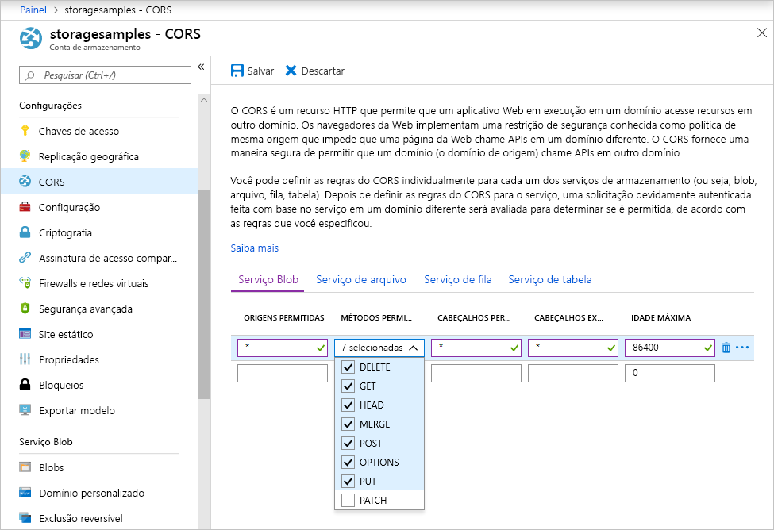

<!-- Customer intent: As a web application developer I want to interface with Azure Blob storage entirely on the client so that I can build a SPA application that is able to upload and delete files on blob storage. -->

# <a name="quickstart-upload-list-and-delete-blobs-using-azure-storage-v10-sdk-for-javascripthtml-in-the-browser"></a>Início Rápido: Carregar, listar e excluir blobs usando o SDK do Armazenamento do Azure v10 para JavaScript/HTML no navegador

Neste início rápido, você aprenderá a usar a biblioteca do [SDK do Armazenamento do Azure V10 para JavaScript – Blob](https://github.com/Azure/azure-sdk-for-js/tree/master/sdk/storage/storage-blob#readme) para gerenciar blobs do código JavaScript executado inteiramente no navegador. A abordagem usada aqui mostra como usar medidas de segurança necessárias para garantir o acesso protegido à sua conta de Armazenamento de blob.

## <a name="prerequisites"></a>Pré-requisitos

[!INCLUDE [storage-quickstart-prereq-include](../../../includes/storage-quickstart-prereq-include.md)]

As bibliotecas de clientes JavaScript do Armazenamento do Azure não funcionarão diretamente do sistema de arquivos e deverão ser fornecidas por um servidor Web. Este tópico usa o [Node.js](https://nodejs.org) para iniciar um servidor básico. Se preferir não instalar o Node.js, use algum outro meio de executar um servidor Web local.

Para seguir as etapas de depuração, você precisará do [Visual Studio Code](https://code.visualstudio.com) e da extensão do [Depurador para Chrome](vscode:extension/msjsdiag.debugger-for-chrome) ou do [Depurador para Microsoft Edge](vscode:extension/msjsdiag.debugger-for-edge).

## <a name="setting-up-storage-account-cors-rules"></a>Configurando regras de CORS para a conta de armazenamento

Antes de seu aplicativo Web poder acessar um armazenamento de blobs do cliente, a conta precisará ser configurada para habilitar o [Compartilhamento de recursos entre origens](https://docs.microsoft.com/rest/api/storageservices/cross-origin-resource-sharing--cors--support-for-the-azure-storage-services), ou CORS.

Retorne ao portal do Azure e selecione a conta de armazenamento. Para definir uma nova regra de CORS, navegue até a seção **Configurações** e clique no link **CORS**. Em seguida, clique no botão **Adicionar** para abrir a janela **Adicionar regra de CORS**. Para este início rápido, crie uma regra de CORS aberta:



A tabela a seguir descreve cada configuração de CORS e explica os valores usados para definir a regra.

|Configuração  |Valor  | DESCRIÇÃO |
|---------|---------|---------|
| Origens permitidas | * | Aceita uma lista de domínios definidos como origens aceitáveis delimitada por vírgulas. Definir o valor como `*` permite o acesso de todos os domínios à conta de armazenamento. |
| Verbos permitidos     | delete, get, head, merge, post, options e put | Lista os verbos HTTP que podem ser executados na conta de armazenamento. Para este início rápido, selecione todas as opções disponíveis. |
| Cabeçalhos permitidos | * | Define uma lista de cabeçalhos de solicitação (inclusive cabeçalhos prefixados) permitidos pela conta de armazenamento. Definir o valor como `*` permite o acesso de todos os cabeçalhos. |
| Cabeçalhos expostos | * | Lista os cabeçalhos de resposta permitidos pela conta. Definir o valor como `*` permite que a conta envie qualquer cabeçalho.  |
| Idade máxima (segundos) | 86.400 | A quantidade máxima de tempo que o navegador armazena em cache a solicitação OPTIONS de simulação. Um valor de *86.400* permite que o cache permaneça um dia inteiro. |

> [!IMPORTANT]
> Verifique se as configurações que você usa na produção expõem o mínimo de acesso à conta de armazenamento necessário para manter o acesso seguro. As configurações de CORS descritas aqui são mais adequadas para um início rápido, já que elas definem uma política de segurança branda. No entanto, essas configurações não são recomendadas para um contexto no mundo real.

Em seguida, use Azure Cloud Shell para criar um token de segurança.

[!INCLUDE [Open the Azure cloud shell](../../../includes/cloud-shell-try-it.md)]

## <a name="create-a-shared-access-signature"></a>Criar uma assinatura de acesso compartilhado

A assinatura de acesso compartilhado (SAS) é usada pelo código em execução no navegador para autorizar solicitações para o Armazenamento de Blobs. Ao usar a SAS, o cliente pode autorizar o acesso a recursos de armazenamento sem a cadeia de conexão ou chave de acesso da conta. Para saber mais, confira [Usando SAS (Assinaturas de Acesso Compartilhado)](../common/storage-dotnet-shared-access-signature-part-1.md).

Você pode criar uma SAS usando a CLI do Azure por meio do Azure Cloud Shell ou com o portal do Azure ou o Gerenciador de Armazenamento do Azure. A tabela a seguir descreve os parâmetros para os quais você precisa fornecer valores para gerar uma SAS com a CLI.

| Parâmetro      |DESCRIÇÃO  | Placeholder |
|----------------|-------------|-------------|
| *expiry*       | A data de validade do token de acesso no formato AAAA-MM-DD. Insira a data do dia seguinte ao usar este guia de início rápido. | *FUTURE_DATE* |
| *account-name* | O nome da conta de armazenamento. Use o nome separado em uma etapa anterior. | *YOUR_STORAGE_ACCOUNT_NAME* |
| *account-key*  | A chave da conta de armazenamento. Use a chave separada em uma etapa anterior. | *YOUR_STORAGE_ACCOUNT_KEY* |

Use o seguinte comando da CLI, com valores reais para cada espaço reservado, para gerar uma SAS que possa ser usada em seu código JavaScript.

```azurecli-interactive
az storage account generate-sas \
  --permissions racwdl \
  --resource-types sco \
  --services b \
  --expiry FUTURE_DATE \
  --account-name YOUR_STORAGE_ACCOUNT_NAME \
  --account-key YOUR_STORAGE_ACCOUNT_KEY
```

A série de valores depois de cada parâmetro pode parecer um pouco confusa. Esses valores de parâmetro são tirados da primeira letra de suas respectivas permissões. A tabela abaixo explica de onde vêm os valores:

| Parâmetro        | Valor   | DESCRIÇÃO  |
|------------------|---------|---------|
| *permissões*    | racwdl  | Essa SAS permite *ler*, *acrescentar*, *criar*, *gravar*, *excluir* e *listar* recursos. |
| *resource-types* | sco     | Os recursos afetados pela SAS são *serviço*, *contêiner* e *objeto*. |
| *services*       | b       | O serviço afetado pela SAS é o serviço *Blob*. |

Agora que a SAS foi gerada, copie o valor de retorno e salve-o em algum lugar para usar em uma etapa futura. Se você tiver gerado a SAS usando um método diferente da CLI do Azure, será necessário remover o `?` inicial, caso ele estiver presente. Esse caractere é um separador de URL que já é fornecido no modelo de URL mais adiante neste tópico no qual a SAS é usada.

> [!IMPORTANT]
> Na produção, sempre passe os tokens SAS usando SSL. Além disso, os tokens SAS devem ser gerados no servidor e enviados para a página HTML na ordem inversa de passagem para o Armazenamento de Blobs do Azure. Uma abordagem possível é usar uma função sem servidor para gerar tokens SAS. O Portal do Azure inclui modelos de função que possuem a capacidade de gerar uma SAS com uma função do JavaScript.

## <a name="implement-the-html-page"></a>Implementar a página HTML

Nesta seção, você criará uma página da Web básica e configurará o VS Code para iniciar e depurar a página. Porém, antes de iniciar, será necessário usar o Node.js para iniciar um servidor da Web local e veicular a página quando o navegador solicitar. Você adicionará código JavaScript para chamar várias APIs de armazenamento de blobs e exibir os resultados na página. Você também pode ver os resultados dessas chamadas no [portal do Azure](https://portal.azure.com), no [Gerenciador de Armazenamento do Azure](https://azure.microsoft.com/features/storage-explorer) e na [extensão do Armazenamento do Azure](vscode:extension/ms-azuretools.vscode-azurestorage) para o VS Code.

### <a name="set-up-the-web-application"></a>Configurar o aplicativo Web

Primeiro, crie uma nova pasta chamada *azure-blobs-javascript* e abra-a no VS Code. Crie um novo arquivo no VS Code, adicione o seguinte HTML e salve-o como *index.html* na pasta *azure-blobs-javascript*.

```html
<!DOCTYPE html>
<html>

<body>
    <button id="create-container-button">Create container</button>
    <button id="delete-container-button">Delete container</button>
    <button id="select-button">Select and upload files</button>
    <input type="file" id="file-input" multiple style="display: none;" />
    <button id="list-button">List files</button>
    <button id="delete-button">Delete selected files</button>
    <p><b>Status:</b></p>
    <p id="status" style="height:160px; width: 593px; overflow: scroll;" />
    <p><b>Files:</b></p>
    <select id="file-list" multiple style="height:222px; width: 593px; overflow: scroll;" />
</body>

<!-- You'll add code here later in this quickstart. -->

</html>
```

### <a name="configure-the-debugger"></a>Configurar o depurador

Para configurar a extensão do depurador no VS Code, escolha **Depurar > Adicionar configuração...**  e escolha **Chrome** ou **Edge**, dependendo da extensão instalada anteriormente na seção Pré-requisitos. Essa ação cria um arquivo *launch.jason* e abre-o no editor.

Modifique o arquivo *launch.json* para que o valor `url` inclua `/index.html` conforme mostrado:

```json
{
    // Use IntelliSense to learn about possible attributes.
    // Hover to view descriptions of existing attributes.
    // For more information, visit: https://go.microsoft.com/fwlink/?linkid=830387
    "version": "0.2.0",
    "configurations": [
        {
            "type": "chrome",
            "request": "launch",
            "name": "Launch Chrome against localhost",
            "url": "http://localhost:8080/index.html",
            "webRoot": "${workspaceFolder}"
        }
    ]
}
```

Essa configuração informa ao VS Code qual navegador iniciar e qual URL carregar.

### <a name="launch-the-web-server"></a>Iniciar o servidor Web

Para ativar o servidor da Web Node.js local, escolha **Visualizar> Terminal** para abrir uma janela do console dentro do VS Code e insira o seguinte comando.

```console
npx http-server
```

Esse comando instalará o pacote *http-server* e iniciará o servidor, disponibilizando a pasta atual por meio de URLs padrão, incluindo a indicada na etapa anterior.

### <a name="start-debugging"></a>Iniciar a depuração

Para iniciar *index.html* no navegador com o depurador do VS Code anexado, escolha **Depurar > Iniciar Depuração** ou pressione F5 no VS Code.

A interface do usuário exibida ainda não faz nada, mas você adicionará o código JavaScript na seção a seguir para implementar cada função exibida. Você pode definir os pontos de interrupção e interagir com o depurador quando ele estiver em pausa no seu código.

Quando você fizer alterações em *index.html*, certifique-se de recarregar a página para ver as alterações no navegador. No VS Code, também é possível escolher **Depurar > Reiniciar Depuração** ou pressionar Ctrl+Shift+F5.

### <a name="add-the-blob-storage-client-library"></a>Adicionar a biblioteca de cliente de armazenamento de blobs

Para habilitar chamadas para a API de armazenamento de blobs, primeiro [Faça o download do SDK do Armazenamento do Azure para JavaScript – biblioteca cliente Blob](https://aka.ms/downloadazurestoragejsblob), extraia o conteúdo do arquivo zip e coloque o arquivo *azure-storage.blob.js* na pasta *azure-blobs-javascript*.

Cole o seguinte HTML em *index.html* após a marcação de fechamento `</body>` substituindo o comentário do espaço reservado.

```html
<script src="azure-storage.blob.js" charset="utf-8"></script>

<script>
// You'll add code here in the following sections.
</script>
```

Esse código adiciona uma referência ao arquivo de script e fornece um local para seu próprio código JavaScript. Para este início rápido, estamos usando o arquivo de script *azure-storage.blob.js* para que você possa abri-lo no VS Code, ler seu conteúdo e definir pontos de interrupção. Na produção, você deve usar o arquivo *azure-storage.blob.min.js* mais compacto que também é fornecido no arquivo zip.

Leia mais sobre cada função de armazenamento de blobs na [documentação de referência](https://docs.microsoft.com/javascript/api/%40azure/storage-blob/index). Observe que algumas das funções no SDK só estão disponíveis no Node. js ou disponível apenas no navegador.

O código em *azure-storage.blob.js* exporta uma variável global chamada `azblob` que você usará em seu código JavaScript para acessar as APIs de armazenamento de blobs.

### <a name="add-the-initial-javascript-code"></a>Adicionar o código JavaScript inicial

Cole o seguinte código no elemento `<script>` mostrado no bloco de código anterior substituindo o comentário do espaço reservado.

```javascript
const createContainerButton = document.getElementById("create-container-button");
const deleteContainerButton = document.getElementById("delete-container-button");
const selectButton = document.getElementById("select-button");
const fileInput = document.getElementById("file-input");
const listButton = document.getElementById("list-button");
const deleteButton = document.getElementById("delete-button");
const status = document.getElementById("status");
const fileList = document.getElementById("file-list");

const reportStatus = message => {
    status.innerHTML += `${message}<br/>`;
    status.scrollTop = status.scrollHeight;
}
```

Esse código cria campos para cada elemento HTML que o código a seguir usará e implementa uma função `reportStatus` para exibir a saída.

Nas seções a seguir, adicione cada novo bloco de código JavaScript após o bloco anterior.

### <a name="add-your-storage-account-info"></a>Adicionar informações de sua conta de armazenamento

Adicione código para acessar sua conta de armazenamento substituindo os espaços reservados pelo nome de sua conta e pela SAS que você gerou em uma etapa anterior.

```javascript
const accountName = "<Add your storage account name>";
const sasString = "<Add the SAS you generated earlier>";
const containerName = "testcontainer";
const containerURL = new azblob.ContainerURL(
    `https://${accountName}.blob.core.windows.net/${containerName}?${sasString}`,
    azblob.StorageURL.newPipeline(new azblob.AnonymousCredential));
```

Esse código usa as informações de sua conta e a SAS para criar uma instância [ContainerURL](https://docs.microsoft.com/javascript/api/@azure/storage-blob/ContainerURL) que é útil para criar e manipular um contêiner de armazenamento.

### <a name="create-and-delete-a-storage-container"></a>Criar e excluir um contêiner de armazenamento

Adicione código para criar e excluir o contêiner de armazenamento quando pressionar o botão correspondente.

```javascript
const createContainer = async () => {
    try {
        reportStatus(`Creating container "${containerName}"...`);
        await containerURL.create(azblob.Aborter.none);
        reportStatus(`Done.`);
    } catch (error) {
        reportStatus(error.body.message);
    }
};

const deleteContainer = async () => {
    try {
        reportStatus(`Deleting container "${containerName}"...`);
        await containerURL.delete(azblob.Aborter.none);
        reportStatus(`Done.`);
    } catch (error) {
        reportStatus(error.body.message);
    }
};

createContainerButton.addEventListener("click", createContainer);
deleteContainerButton.addEventListener("click", deleteContainer);
```

Esse código chama as funções ContainerURL [create](https://docs.microsoft.com/javascript/api/@azure/storage-blob/ContainerURL#create-aborter--icontainercreateoptions-) e [delete](https://docs.microsoft.com/javascript/api/@azure/storage-blob/ContainerURL#delete-aborter--icontainerdeletemethodoptions-) sem usar uma instância [Aborter](https://docs.microsoft.com/javascript/api/@azure/storage-blob/aborter). Para manter as coisas simples nesse início rápido, esse código pressupõe que sua conta de armazenamento já tenha sido criada e está ativada. No código de produção, use uma instância Aborter para adicionar a funcionalidade de tempo limite.

### <a name="list-blobs"></a>Listar blobs

Adicione código para listar o conteúdo do contêiner de armazenamento quando o botão **Listar arquivos** for pressionado.

```javascript
const listFiles = async () => {
    fileList.size = 0;
    fileList.innerHTML = "";
    try {
        reportStatus("Retrieving file list...");
        let marker = undefined;
        do {
            const listBlobsResponse = await containerURL.listBlobFlatSegment(
                azblob.Aborter.none, marker);
            marker = listBlobsResponse.nextMarker;
            const items = listBlobsResponse.segment.blobItems;
            for (const blob of items) {
                fileList.size += 1;
                fileList.innerHTML += `<option>${blob.name}</option>`;
            }
        } while (marker);
        if (fileList.size > 0) {
            reportStatus("Done.");
        } else {
            reportStatus("The container does not contain any files.");
        }
    } catch (error) {
        reportStatus(error.body.message);
    }
};

listButton.addEventListener("click", listFiles);
```

Esse código chama a função [ContainerURL.listBlobFlatSegment](https://docs.microsoft.com/javascript/api/@azure/storage-blob/ContainerURL#listblobflatsegment-aborter--string--icontainerlistblobssegmentoptions-) em um loop para garantir que todos os segmentos sejam recuperados. Para cada segmento, ele percorre a lista de itens de blobs que ele contém e atualiza a lista **Arquivos**.

### <a name="upload-blobs"></a>Carregar blobs

Adicione código para carregar arquivos para o contêiner de armazenamento quando o botão **Escolher e carregar arquivos** for pressionado.

```javascript
const uploadFiles = async () => {
    try {
        reportStatus("Uploading files...");
        const promises = [];
        for (const file of fileInput.files) {
            const blockBlobURL = azblob.BlockBlobURL.fromContainerURL(containerURL, file.name);
            promises.push(azblob.uploadBrowserDataToBlockBlob(
                azblob.Aborter.none, file, blockBlobURL));
        }
        await Promise.all(promises);
        reportStatus("Done.");
        listFiles();
    } catch (error) {
        reportStatus(error.body.message);
    }
}

selectButton.addEventListener("click", () => fileInput.click());
fileInput.addEventListener("change", uploadFiles);
```

Este código conecta o botão **Escolher e carregar arquivos** ao elemento oculto `file-input`. Assim, o evento `click` do botão acionará o evento `click` da entrada do arquivo e exibirá o seletor de arquivos. Depois de escolher arquivos e fechar a caixa de diálogo, o evento `input` ocorrerá e a função `uploadFiles` será chamada. Essa função chama a função [uploadBrowserDataToBlockBlob](https://docs.microsoft.com/javascript/api/@azure/storage-blob/#uploadbrowserdatatoblockblob-aborter--blob---arraybuffer---arraybufferview--blockbloburl--iuploadtoblockbloboptions-) somente para navegador para cada arquivo escolhido. Cada chamada retornará uma Promessa que será adicionada a uma lista para que todos os arquivos possam ser esperados de uma só vez. Dessa forma, os arquivos serão carregados em paralelo.

### <a name="delete-blobs"></a>Excluir blobs

Adicione código para excluir arquivos do contêiner de armazenamento quando o botão **Excluir arquivos escolhidos** for pressionado.

```javascript
const deleteFiles = async () => {
    try {
        if (fileList.selectedOptions.length > 0) {
            reportStatus("Deleting files...");
            for (const option of fileList.selectedOptions) {
                const blobURL = azblob.BlobURL.fromContainerURL(containerURL, option.text);
                await blobURL.delete(azblob.Aborter.none);
            }
            reportStatus("Done.");
            listFiles();
        } else {
            reportStatus("No files selected.");
        }
    } catch (error) {
        reportStatus(error.body.message);
    }
};

deleteButton.addEventListener("click", deleteFiles);
```

Esse código chama a função [BlobURL.delete](https://docs.microsoft.com/javascript/api/@azure/storage-blob/BlobURL#delete-aborter--iblobdeleteoptions-) para remover cada arquivo escolhido na lista. Ele chama a função `listFiles` mostrada anteriormente para atualizar o conteúdo da lista **Arquivos**.

### <a name="run-and-test-the-web-application"></a>Executar e testar o aplicativo Web

Neste ponto, você pode iniciar a página e experimentá-la para ter uma ideia do funcionamento do armazenamento de blobs. Se ocorrer algum erro (por exemplo, quando você tentar listar arquivos antes de criar o contêiner), o painel **Status** exibirá a mensagem de erro recebida. Você também pode definir pontos de interrupção no código JavaScript para examinar os valores retornados pelas APIs de armazenamento.

## <a name="clean-up-resources"></a>Limpar recursos

Para limpar os recursos criados durante este início rápido, volte para o [portal do Azure](https://portal.azure.com) e exclua o grupo de recursos criado na seção de pré-requisitos.

## <a name="next-steps"></a>Próximas etapas

Neste início rápido, você criou um site simples que acessa o armazenamento de blobs do JavaScript baseado em navegador. Para saber como você pode hospedar um site no armazenamento de blobs, continue no tutorial a seguir:

> [!div class="nextstepaction"]
> [Hospedar um site estático no Armazenamento de Blobs](https://docs.microsoft.com/azure/storage/blobs/storage-blob-static-website-host)
