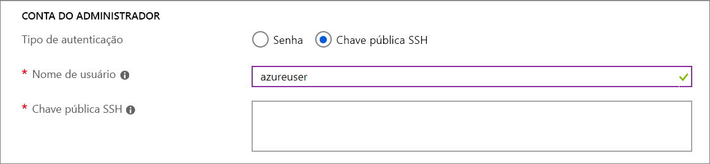

# Visualização: Implantar VMs em hosts dedicados usando o portal

Este artigo orienta você sobre como criar um [host dedicado](dedicated-hosts.md) do Azure para hospedar suas máquinas virtuais (VMS). 

[!INCLUDE [virtual-machines-common-dedicated-hosts-portal](../../../includes/virtual-machines-common-dedicated-hosts-portal.md)]

## Criar uma máquina virtual

1. Escolha **Criar um recurso** no canto superior esquerdo do portal do Azure.
1. Na caixa de pesquisa acima da lista de recursos do Azure Marketplace, procure e selecione **Ubuntu Server 16.04 LTS** por Canonical, escolha **Criar**.
1. Na guia **noções básicas** , em **detalhes do projeto**, verifique se a assinatura correta está selecionada e, em seguida, selecione *MyDedicatedHostsRG* como o **grupo de recursos**. 
1. Em **Detalhes da instância**, digite *myVM* para o **Nome da máquina virtual** e escolha *Leste dos EUA* para **Localização**.
1. Em **Opções de disponibilidade** selecionar **zona de disponibilidade**, selecione *1* na lista suspensa.
1. Para o tamanho, selecione **alterar tamanho**. Na lista de tamanhos disponíveis, escolha um da série Esv3, como **Standard E2 v3**. Talvez seja necessário limpar o filtro para ver todos os tamanhos disponíveis.
1. Em **Conta de administrador**, selecione **Chave pública SSH**, digite seu nome de usuário e, em seguida, cole sua chave pública na caixa de texto. Remova os espaços em branco à esquerda ou à direita em sua chave pública.

    

1. Em **regras** > de porta de entrada**portas públicas de entrada**, escolha **permitir portas selecionadas** e, em seguida, selecione **SSH (22)** na lista suspensa. 
1. Na parte superior da página, selecione a guia **avançado** e, na seção **host** , selecione *myhost* Group para o **grupo** de hosts e myhost para o **host**. 
    
1. Deixe os padrões restantes e, em seguida, selecione o botão **Examinar + criar** na parte inferior da página.
1. Quando você vir a mensagem a validação foi aprovada, selecione **criar**.

Levará alguns minutos para que sua VM seja implantada.

## Próximas etapas

- Para obter mais informações, consulte a visão geral dos [hosts dedicados](dedicated-hosts.md) .

- Há um modelo de exemplo, encontrado [aqui](https://github.com/Azure/azure-quickstart-templates/blob/master/201-vm-dedicated-hosts/README.md), que usa zonas e domínios de falha para obter máxima resiliência em uma região.

- Você também pode implantar um host dedicado usando o [CLI do Azure](dedicated-hosts-cli.md).

