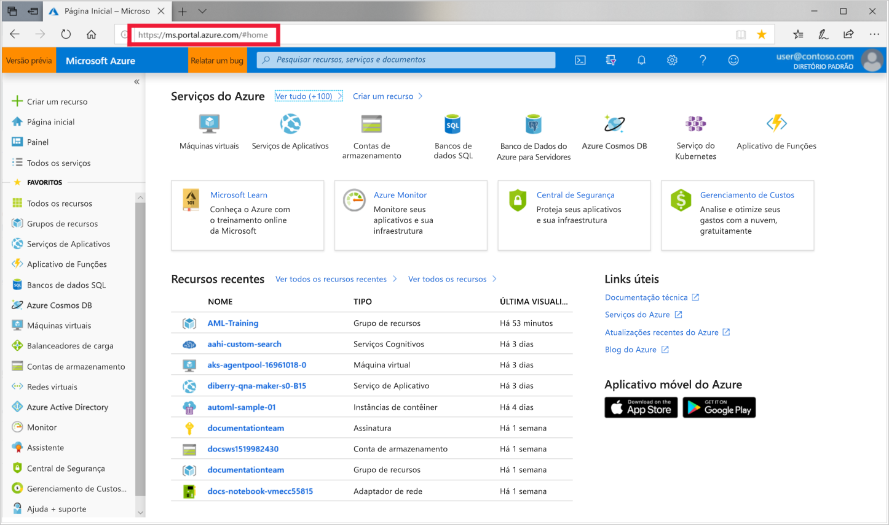

1. Entre no [portal do Microsoft Azure](https://portal.azure.com/) usando as credenciais de assinatura do Azure que você usará. 

   

1. No canto superior esquerdo do Portal, selecione **Criar um recurso**.

   

1. Use a barra de pesquisa para selecionar **Workspace de serviço do Machine Learning**.

   

1. No painel **Espaço de trabalho do serviço do Machine Learning**, escolha **Criar** para começar.

    

1. No painel **Espaço de trabalho de serviço ML**, configure seu espaço de trabalho.

    

   Campo|DESCRIÇÃO
   ---|---
   Nome do workspace |Insira um nome único que identifique seu workspace. Para este exemplo, usamos **docs-ws**. Os nomes devem ser únicos em todo o grupo de recursos. Use um nome que seja fácil de lembrar e diferenciar de espaços de trabalho criados por outras pessoas.  
   Assinatura |Selecione a assinatura do Azure que você deseja usar.
   Grupo de recursos | Use um grupo de recursos existente na sua assinatura ou insira um nome para criar um novo grupo de recursos. Um grupo de recursos mantém os recursos relacionados a uma solução do Azure. Para este exemplo, usamos **docs-aml**. 
   Local padrão | Selecione a localização mais próxima a seus usuários e recursos de dados. Este local é onde o local de trabalho é criado.

1. Examine a configuração do workspace e selecione **Criar**. Pode demorar um pouco para o workspace ser criado.

1. Quando o processo é finalizado, será exibida uma mensagem de êxito da implantação. Ele também está presente na seção notificações. Para exibir o novo espaço de trabalho, selecione **Ir para o recurso**.

   
