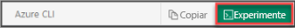

## Usar o Azure Cloud Shell

O Azure hospeda o Azure Cloud Shell, um ambiente de shell interativo que pode ser usado por meio do navegador. O Cloud Shell permite usar `bash` ou `PowerShell` para trabalhar com serviços do Azure. É possível usar os comandos pré-instalados do Cloud Shell para executar o código neste artigo sem precisar instalar nada no seu ambiente local.

Para iniciar o Azure Cloud Shell:

| Opção | Exemplo/Link |
|-----------------------------------------------|---|
| Selecione **Experimente** no canto superior direito de um bloco de código. Selecionar **Experimente** não copia automaticamente o código para o Cloud Shell. |  |
| Acesse [https://shell.azure.com](https://shell.azure.com) ou clique no botão **Iniciar o Cloud Shell** para abri-lo no navegador. |  |
| Clique no botão **Cloud Shell** na barra de menus no canto superior direito do [portal do Azure](https://portal.azure.com). |  |

Para executar o código neste artigo no Azure Cloud Shell:

1. Inicie o Cloud Shell.
1. Clique no botão **Copiar** no bloco de código para copiá-lo. 
1. Cole o código na sessão do Cloud Shell com **Ctrl**+**Shift**+**V** no Windows e no Linux ou **Cmd**+**Shift**+**V** no macOS. 
1. Pressione **Enter** para executar o código.

