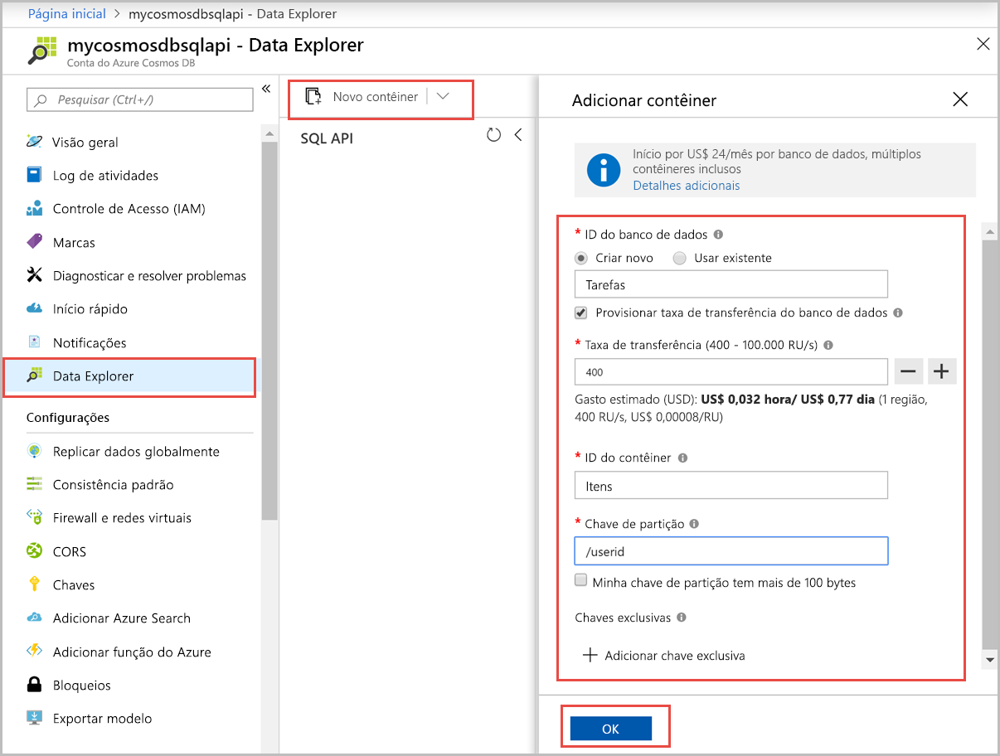

Agora, você pode usar a ferramenta Data Explorer no portal do Azure para criar um banco de dados e um contêiner. 

1. Selecione **Data Explorer** > **Novo Contêiner**. 
    
    A área **Adicionar Contêiner** é exibida à extrema direita; talvez seja necessário rolar a página para a direita para vê-la.

    

2. Na página **Adicionar contêiner**, insira as configurações do novo contêiner.

    |Configuração|Valor sugerido|DESCRIÇÃO
    |---|---|---|
    |**ID do banco de dados**|Tarefas|Insira *ToDoList* como o nome para o novo banco de dados. Os nomes dos banco de dados devem conter de 1 a 255 caracteres e não podem conter `/, \\, #, ?` nem um espaço à direita. Marque a opção **Provisionar a produtividade do banco de dados**; ela permite que você compartilhe a produtividade provisionada para o banco de dados em todos os contêineres no banco de dados. Essa opção também ajuda na economia de custo. |
    |**Taxa de transferência**|400|Deixe a taxa de transferência em 400 unidades de solicitação por segundo (RU/s). Se quiser reduzir a latência, você poderá escalar verticalmente a taxa de transferência mais tarde.| 
    |**ID do contêiner**|Itens|Insira *Itens* como o nome do novo contêiner. As IDs do contêiner têm os mesmos requisitos de caractere dos nomes de bancos de dados.|
    |**Chave de partição**| /category| O exemplo descrito neste artigo usa */category* como a chave de partição.|
    
    Além das configurações anteriores, opcionalmente, você pode adicionar **Chaves exclusivas** ao contêiner. Vamos deixar o campo vazio neste exemplo. As chaves exclusivas oferecem aos desenvolvedores a capacidade de adicionar uma camada de integridade dos dados ao seu banco de dados. Ao criar uma política de chave exclusiva durante a criação de um contêiner, você garante a exclusividade de um ou mais valores por chave de partição. Para obter mais informações, consulte o artigo [Chaves exclusivas no Azure Cosmos DB](../articles/cosmos-db/unique-keys.md).
    
    Selecione **OK**. O Data Explorer exibe o novo banco de dados e o contêiner.