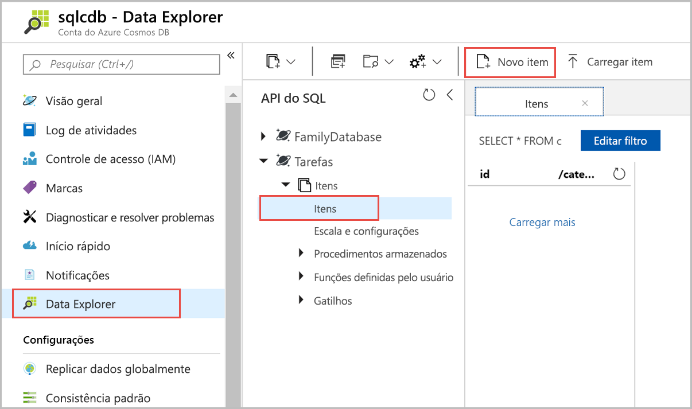
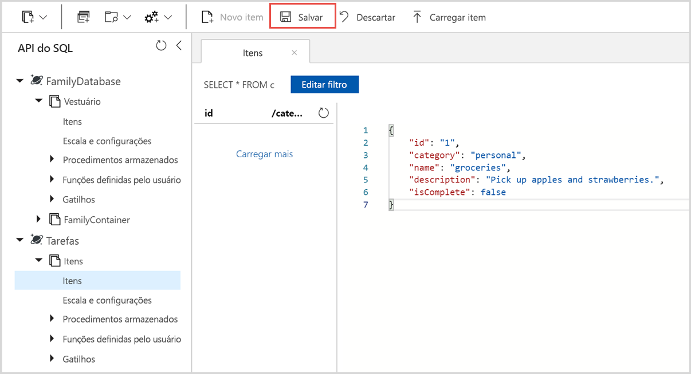

Agora você pode adicionar dados à sua nova coleção usando o Data Explorer.

1. No Data Explorer, o novo banco de dados aparece no painel Coleções. Expanda o banco de dados **Tarefas**, expanda a coleção **Itens**, clique em **Documentos** e clique em **Novos Documentos**. 

   
  
2. Agora, adicione um documento à coleção com a seguinte estrutura.

     ```json
     {
         "id": "1",
         "category": "personal",
         "name": "groceries",
         "description": "Pick up apples and strawberries.",
         "isComplete": false
     }
     ```

3. Depois de ter adicionado o json à guia **Documentos**, clique em **Salvar**.

    

4.  Crie e salve mais um documento onde você insere um valor exclusivo para a propriedade `id` e altere as outras propriedades quando achar adequado. Os novos documentos podem ter qualquer estrutura que você deseje, pois o Azure Cosmos DB não impõe nenhum esquema para seus dados.