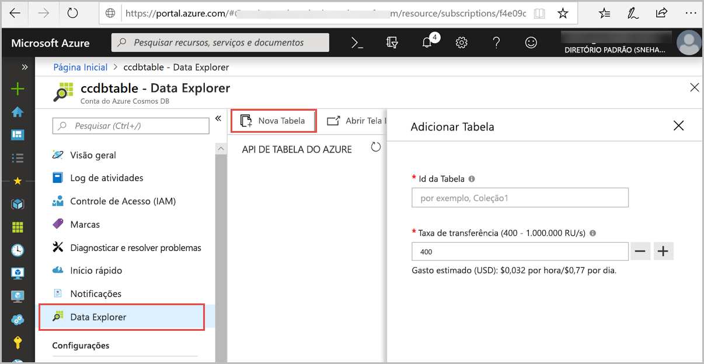

Agora, você pode usar a ferramenta Data Explorer no Portal do Azure para criar um banco de dados e uma tabela. 

1. Selecione **Data Explorer** > **Nova Tabela**. 
    
    A área **Adicionar Tabela** é exibida à direita, talvez seja necessário rolar para a direita para vê-la.

    

2. Na página **Adicionar Tabela**, insira as configurações da nova tabela.

    Configuração|Valor sugerido|DESCRIÇÃO
    ---|---|---
    Id da Tabela|tabela de exemplo|A ID da nova tabela. Os nomes de tabela possuem os mesmos requisitos de caractere que os ids de banco de dados. Os nomes de banco de dados devem ter entre um e 255 caracteres e não podem conter `/ \ # ?` nem espaços à direita.
    Produtividade|400 RUs|Altere a taxa de transferência para 400 unidades de solicitação por segundo (RU/s). Se quiser reduzir a latência, você poderá escalar verticalmente a taxa de transferência mais tarde.

3. Selecione **OK**.

4. O Data Explorer exibe o novo banco de dados e a tabela.

   