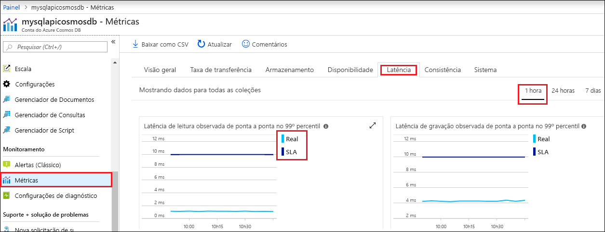

O portal do Azure monitora a taxa de transferência, armazenamento, disponibilidade, latência e consistência da conta do Cosmos DB. Gráficos de métricas associados a um [SLA (Contrato de Nível de Serviço) do Azure Cosmos DB](https://azure.microsoft.com/support/legal/sla/cosmos-db/) mostram o valor do SLA em comparação com o desempenho real. Esse conjunto de métricas torna o monitoramento dos SLAs transparente.

Para examinar as métricas e os SLAs: 

1. Selecione **Métricas** no menu de navegação da sua conta do Cosmos DB.
   
2. Selecione uma guia, tal como **Latência**, e selecione um período à direita. Comparar as linhas **Real** e **SLA** dos gráficos.
   
   
   
3. Examine as métricas nas outras guias. 

