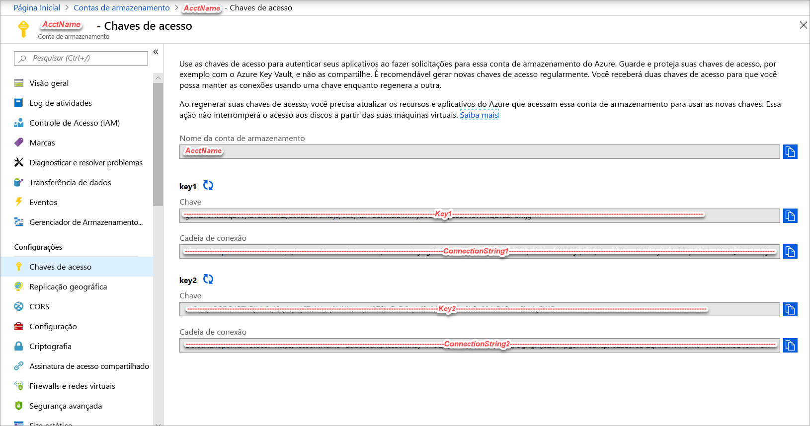
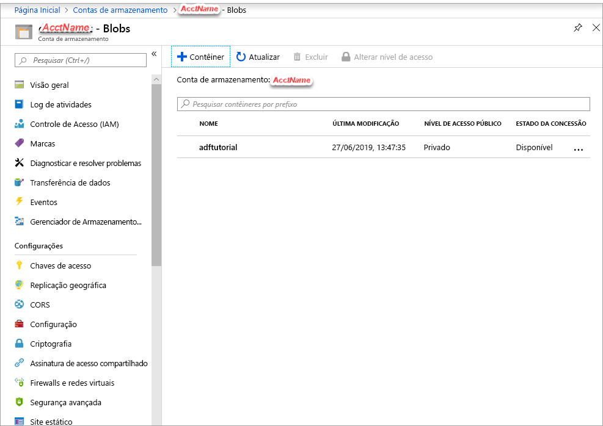
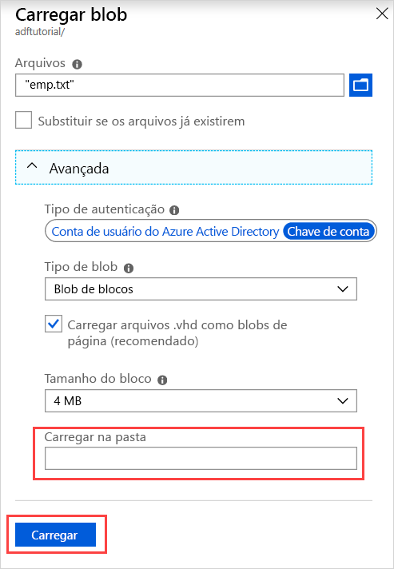

## <a name="prerequisites"></a>Pré-requisitos

### <a name="azure-subscription"></a>Assinatura do Azure
Se você não tiver uma assinatura do Azure, crie uma [conta gratuita](https://azure.microsoft.com/free/) antes de começar.

### <a name="azure-roles"></a>Funções do Azure
Para criar instâncias de Data Factory, a conta de usuário usada para entrar no Azure deve ser um membro das funções *colaborador* ou *proprietário*, ou um *administrador* da assinatura do Azure. Para exibir as permissões que você tem na assinatura, acesse o [portal do Azure](https://portal.azure.com), selecione seu nome de usuário no canto superior direito e selecione **Mais opções** (...) e, em seguida, selecione **Minhas permissões**. Se tiver acesso a várias assinaturas, selecione a que for adequada.

Para criar e gerenciar recursos filho para o Data Factory – incluindo conjuntos de dados, serviços vinculados, pipelines, gatilhos e tempos de execução de integração –, os requisitos a seguir são aplicáveis:

- Para criar e gerenciar recursos filho no portal do Azure, você precisa pertencer à função **Colaborador do Data Factory** no nível do grupo de recursos ou superior.
- Para criar e gerenciar recursos filho com o PowerShell ou o SDK, a função de **colaborador** no nível do recurso ou superior é suficiente.

Para obter instruções de exemplo sobre como adicionar um usuário a uma função, confira o artigo [Adicionar funções](../articles/billing/billing-add-change-azure-subscription-administrator.md).

Para obter mais informações, confira os seguintes artigos:

- [Função Colaborador do Data Factory](../articles/role-based-access-control/built-in-roles.md#data-factory-contributor)
- [Funções e permissões para o Azure Data Factory](../articles/data-factory/concepts-roles-permissions.md)

### <a name="azure-storage-account"></a>Conta de Armazenamento do Azure
Use uma Conta de Armazenamento do Azure de uso geral (especificamente o Armazenamento de Blobs) como armazenamento de dados de *origem* e *destino* neste guia de início rápido. Se você não tiver uma conta de fins gerais de armazenamento do Azure, consulte [Criar uma conta de armazenamento](../articles/storage/common/storage-quickstart-create-account.md) para criar uma. 

#### <a name="get-the-storage-account-name-and-account-key"></a>Obter o nome da conta de armazenamento e a chave da conta
Você precisará do nome e da chave de sua conta de armazenamento do Azure neste início rápido. O procedimento a seguir fornece as etapas para obter o nome e a chave da sua conta de armazenamento: 

1. Em um navegador da Web, vá para o [portal do Azure](https://portal.azure.com) e entre usando seu nome de usuário e senha do Azure.
2. Selecione **Todos os serviços** > **Armazenamento** > **Contas de armazenamento**.
3. Na página **Contas de armazenamento**, filtre pela sua conta de armazenamento (se necessário) e selecione a sua conta de armazenamento. 
4. Na barra lateral da página *\<Nome da conta>*  - **Conta de armazenamento**, vá para o rótulo **Configurações** e selecione **Chaves de acesso**. O *\<Nome da conta>*  - **Chaves de acesso** é exibido.

   
5. Copie os valores para as caixas **Nome da conta de armazenamento** e **chave1** para a área de transferência. Cole-os em um Bloco de notas ou qualquer outro editor e salve-os. Você pode usá-los mais tarde neste guia de início rápido.   

#### <a name="create-a-blob-container"></a>Criar um contêiner de blob
Nesta seção, você cria um contêiner de blobs chamado **adftutorial** no armazenamento de Blobs do Azure.

1. Na barra lateral da página *\<Nome da conta>*  - **Chaves de acesso**, selecione **Visão geral** > **Blobs**.
2. Na barra de ferramentas da página *\<Nome da conta>*  - **Blobs**, selecione **Contêiner**.
3. Na caixa de diálogo **Novo contêiner**, insira **adftutorial** como o nome e selecione **OK**. A página *\<Nome da conta>*  - **Blobs** é atualizada para incluir **adftutorial** na lista de contêineres.

   

#### <a name="add-an-input-folder-and-file-for-the-blob-container"></a>Adicionar uma pasta de entrada e um arquivo ao contêiner de blob
Nesta seção, você cria uma pasta chamada **entrada** no contêiner que acabou de criar e, em seguida, carrega um arquivo de exemplo na pasta de entrada. Antes de começar, abra um editor de texto como o **Bloco de Notas** e crie um arquivo chamado **emp.txt** com o seguinte conteúdo:

```emp.txt
John, Doe
Jane, Doe
```

Salve o arquivo na pasta **C:\ADFv2QuickStartPSH**. (Se a pasta ainda não existir, crie-a.) Então volte ao portal do Azure e siga estas etapas:

1. Na página *\<Nome da conta>*  - **Blobs** em que você parou, selecione **adftutorial** na lista atualizada de contêineres. (Se você tiver fechado a janela ou passado para outra página, entre no [portal do Azure](https://portal.azure.com) novamente, selecione **Todos os serviços** > **Armazenamento** > **Contas de armazenamento**, selecione sua conta de armazenamento e, em seguida, selecione **Blobs** > **adftutorial**.)
2. Na barra de ferramentas da página de contêiner do **adftutorial**, selecione **Carregar**.
3. Na página **Carregar blob**, selecione a caixa **Arquivos** e, em seguida, navegue até o arquivo **emp.txt** e selecione-o.
4. Expanda o título **Avançado**. A página agora será exibida como mostrado:

   
5. Na caixa **Carregar para a pasta**, insira **entrada**.
6. Selecione o botão **Carregar**. O arquivo **emp.txt** e o status do carregamento devem estar na lista.
7. Selecione o ícone **Fechar** (um **X**) para fechar a página **Carregar blob**.

Mantenha a página do contêiner **adftutorial** aberta. Você a usa para verificar a saída no final do guia de início rápido.