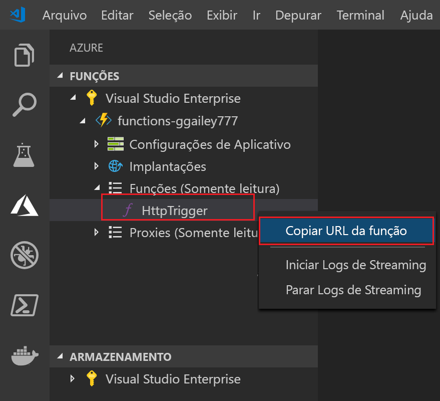

## Publicar o projeto no Azure

O Visual Studio Code permite que você publique seu projeto de funções diretamente no Azure. No processo, você criará um aplicativo de funções e recursos relacionados em sua assinatura do Azure. O aplicativo de funções fornece um contexto de execução para suas funções. O projeto é empacotado e implantado para o novo aplicativo de função em sua assinatura do Azure.

Este artigo pressupõe que você está criando um novo aplicativo de funções. 

> [!IMPORTANT]
> Publicar em um aplicativo de funções existente substitui o conteúdo desse aplicativo no Azure.

1. Na área **Azure: Functions**, escolha o ícone Implantar no aplicativo de funções.

    

1. Se você ainda não estiver conectado, será solicitado a **Entrar no Azure**. Você também pode **Criar uma conta gratuita do Azure**. Após entrar pelo navegador, volte ao Visual Studio Code. 

1. Se você tiver mais de uma assinatura, **Escolha uma assinatura** para o aplicativo de funções e, em seguida, escolha **+ Criar novo aplicativo de funções no Azure**.

1. Digite um nome globalmente exclusivo que identifica seu aplicativo de funções e pressione Enter. Caracteres válidos para um nome de aplicativo de funções são `a-z`, `0-9` e `-`.

1. Escolha **+ Criar novo grupo de recursos**, digite um nome de grupo de recursos, tal como `myResourceGroup`, e pressione enter. Também é possível usar um grupo de recursos existente.

1. Escolha **+ Criar nova conta de armazenamento**, digite um nome globalmente exclusivo da nova conta de armazenamento usada pelo aplicativo de funções e pressione Enter. Os nomes da conta de armazenamento devem ter entre 3 e 24 caracteres e podem conter apenas números e letras minúsculas. Você também pode usar uma conta existente.

1. Escolha um local em uma [região](https://azure.microsoft.com/regions/) perto de você ou perto de outros serviços acessados pelas suas funções.

    Quando você pressiona Enter, os seguintes recursos do Azure são criados em sua assinatura:

    * **[Grupo de recursos](../articles/azure-resource-manager/resource-group-overview.md)** : Contém todos os recursos criados do Azure. O nome é baseado no nome de seu aplicativo de funções.
    * **[Conta de armazenamento](../articles/storage/common/storage-quickstart-create-account.md)** : Uma conta de armazenamento padrão é criada com um nome exclusivo baseado no nome de seu aplicativo de funções.
    * **[Plano de hospedagem](../articles/azure-functions/functions-scale.md)** : Um plano de consumo é criado na região Oeste dos EUA para hospedar seu aplicativo de funções sem servidor.
    * **Aplicativo de funções**: Seu projeto é implantado e executado no novo aplicativo de funções.

    Uma notificação é exibida depois que seu aplicativo de funções é criado e o pacote de implantação é aplicado. Escolha **Exibir Saída** nessa notificação para exibir a criação e os resultados da implantação, incluindo os recursos do Azure que você criou.

1. De volta na área **Azure: Functions**, expanda o novo aplicativo de funções em sua assinatura. Expanda **Funções**, clique com botão direito do mouse em **HttpTrigger** e, em seguida, escolha **Copiar URL da função**.

    
