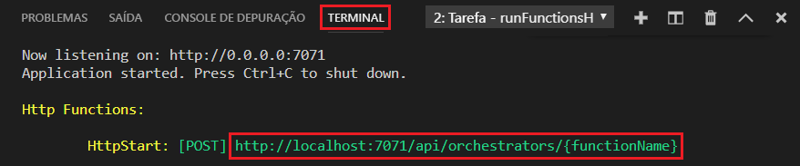

## Executar a função localmente

As Ferramentas Principais do Azure Functions permitem executar um projeto do Azure Functions no seu computador de desenvolvimento local.

1. Para testar sua função, defina um ponto de interrupção no código da função e pressione F5 para iniciar o projeto de aplicativo de funções. A saída do Core Tools é exibida no painel **Terminal**.

1. No painel **Terminal**, copie o ponto de extremidade de URL da sua função disparada por HTTP. Essa URL inclui a chave de função, que é passada para o parâmetro de consulta `code`.

    

1. Cole a URL para a solicitação HTTP na barra de endereços do navegador. Acrescente o valor de cadeia de consulta `?name=<yourname>` a essa URL e execute a solicitação. A execução é pausada quando o ponto de interrupção é atingido.

1. Quando você continua a execução, o exemplo a seguir mostra a resposta no navegador à solicitação GET:

    

1. Para interromper a depuração, pressione Shift + F5.