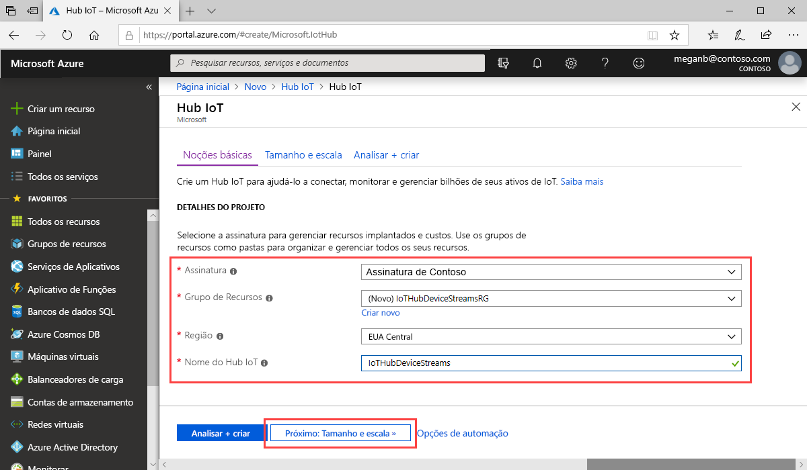

Esta seção descreve como criar um hub IoT usando o [portal do Azure](https://portal.azure.com).

1. Entre no [Portal do Azure](https://portal.azure.com).

1. Escolha **Criar um recurso** e, em seguida, insira *Hub IoT* no campo **Pesquisar** no Marketplace.

1. Selecione **Hub IoT** nos resultados da pesquisa e, em seguida, selecione **Criar**.

1. Na guia **Básico**, preencha os campos da seguinte maneira:

   - **Assinatura**: Selecione a assinatura a ser usada para o hub.

   - **Grupo de Recursos**: Selecione um grupo de recursos ou crie um novo. Para criar um novo, selecione **Criar novo** e preencha o nome que deseja usar. Para usar um grupo de recursos existente, selecione esse grupo de recursos. Para obter mais informações, veja [Gerenciar grupos de recursos do Azure Resource Manager](../articles/azure-resource-manager/manage-resource-groups-portal.md).

   - **Região**: escolha a região na qual deseja que o hub fique localizado. Selecione uma região que dê suporte à visualização de fluxos de dispositivos do Hub IoT, **EUA Central** ou **EUA Central EUAP**.

   - **Nome do Hub IoT**: Digite um nome para o seu hub. Esse nome deve ser globalmente exclusivo. Caso o nome inserido esteja disponível, uma marca de seleção verde será exibida.

   

   [!INCLUDE [iot-hub-pii-note-naming-hub](iot-hub-pii-note-naming-hub.md)]

1. Selecione **Avançar: Tamanho e escala** para continuar criando o hub IoT.

   

   Em **Tamanho e escala**, você pode aceitar as configurações padrão e selecionar **Examinar + criar** na parte inferior. Considere as seguintes opções:

   - **Tipo e escala de preço**: Seu nível selecionado. Selecione uma das camadas padrão (**S1**, **S2** ou **S3**) ou **F1: Camada gratuita**. Essa escolha também pode ser orientada pelo tamanho de sua frota e das cargas de trabalho não streaming esperadas no hub, por exemplo, mensagens de telemetria. Por exemplo, o tipo gratuito destina-se a testes e avaliação. Ela permite que 500 dispositivos sejam conectados ao Hub IoT e até 8.000 mensagens por dia. Cada assinatura do Azure pode criar um hub IoT na Camada gratuita. 

   - **Número de unidades do Hub IoT**: O número de mensagens permitidas por unidade ao dia depende do tipo de preço do seu hub. Essa escolha depende da carga de trabalho não streaming esperada no hub. Selecione 1 por enquanto.

   - **Configurações avançadas** > **Partições de dispositivo para nuvem**: Essa propriedade está relacionada a mensagens de dispositivo para nuvem para o número de leitores simultâneos das mensagens. A maioria dos hubs precisa apenas de quatro partições.

   Para obter mais informações sobre as opções de camadas, confira [Escolher a camada certa do hub IoT](../articles/iot-hub/iot-hub-scaling.md).

1. Para examinar suas escolhas, escolha **Examinar + criar**. Seus resultados serão semelhantes ao seguinte:

   

1. Para criar o hub IoT, selecione **Criar**. O processo leva alguns minutos.
